# Docker安装

## 卸载

- 如果之前安装过旧版本，使用下面命令卸载：

```shell
yum remove docker \
     docker-client \
     docker-client-latest \
     docker-common \
     docker-latest \
     docker-latest-logrotate \
     docker-logrotate \
     docker-selinux \
     docker-engine-selinux \
     docker-engine \
     docker-ce
```


## 安装

如果是虚拟机的话得联网，安装 yum 工具

```shell
yum install -y yum-utils \
	device-mapper-persistent-data \
	lvm --skip-broken
```

更新本地镜像源

```shell
# 设置docker镜像源
yum-config-manager \
	--add-repo \
	https://mirrors.aliyun.com/docker-ce/linux/centos/docker-ce.repo

sed -i 's/download.docker.com/mirrors.aliyun.com\/docker-ce/g' /etc/yum.repos.d/docker-ce.repo

yum makecache fast
```

安装

```shell
yum install -y docker-ce
```


## 启动Docker

如果是虚拟机，记得关闭防火墙，之后docker安装的引用得对应放开端口

```shell
# 关闭防火墙
systenmctl stop firewalld
# 静止开机自启
systemctl disable firewalld
```

如果是服务器请配置相关的安全组。

启动

```shell
systemctl start docker
```


## 配置镜像

我们设置国内阿里云镜像，登入如下网址配置

https://cr.console.aliyun.com/cn-hangzhou/instances/mirrors

### 镜像加速器

使用加速器可以提升获取Docker官方镜像的速度

加速器

| 加速器地址                           |
| ------------------------------------ |
| https://6fnkpwa3.mirror.aliyuncs.com |

### 安装／升级Docker客户端

推荐安装1.10.0以上版本的Docker客户端，参考文档[docker-ce](https://yq.aliyun.com/articles/110806)

### 配置镜像加速器

针对Docker客户端版本大于 1.10.0 的用户

您可以通过修改daemon配置文件/etc/docker/daemon.json来使用加速器

```
sudo mkdir -p /etc/docker
sudo tee /etc/docker/daemon.json <<-'EOF'
{
  "registry-mirrors": ["https://6fnkpwa3.mirror.aliyuncs.com"]
}
EOF
sudo systemctl daemon-reload
sudo systemctl restart docker
```


# Docker基本操作

镜像相关命令

- 镜像名称（规范）一般分为两部分组成：**`[repository]:[tag]`** 比如 **`mysql:5.7`**。如果忘记输入 tag，默认最新版本。


## 镜像操作

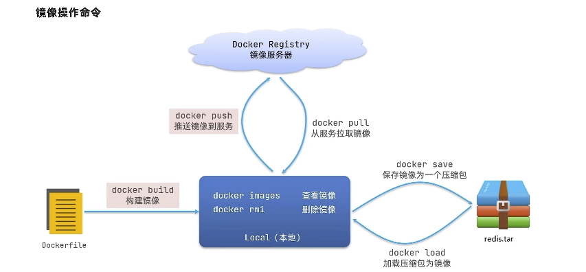


```shell
# 查看 docker 所有命令
docker --help

# 查看具体命令如何使用
docker [命令名称] --help
```


- **尝试从 DockerHub 中拉去一个 nginx 镜像并查看**

  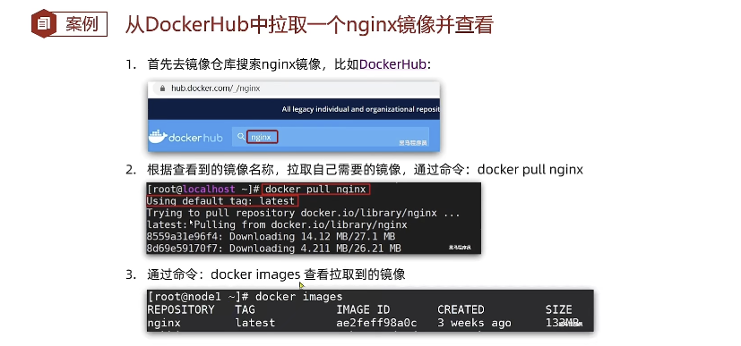


- **尝试导出镜像**

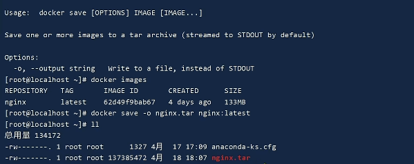

- **尝试导入镜像**

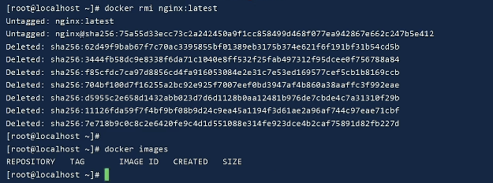

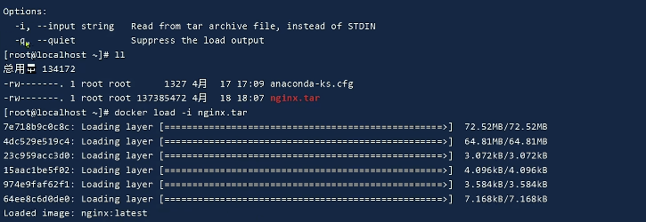


## 容器操作

 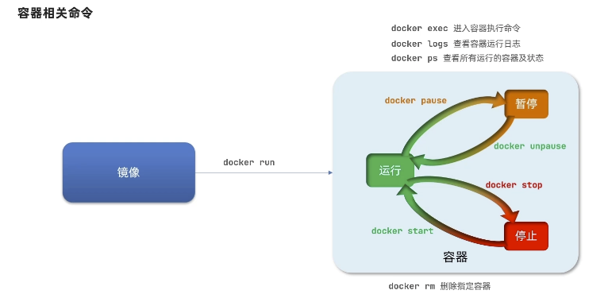


- **创建运行一个Nginx容器**
  - 去docker hub查看Nginx的容器运行命令

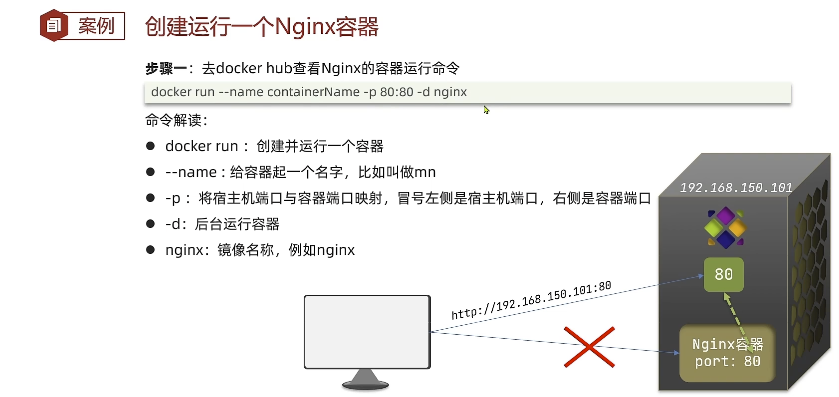

- **进入Nginx容器并尝试使用bash交互**

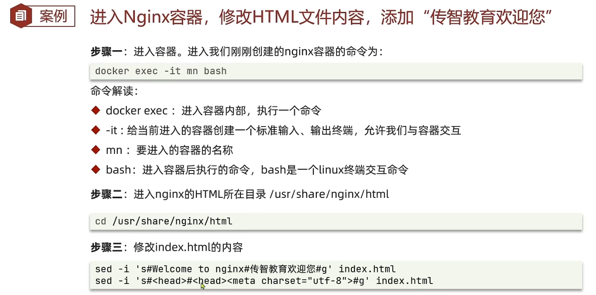


## 数据卷（容器数据管理）

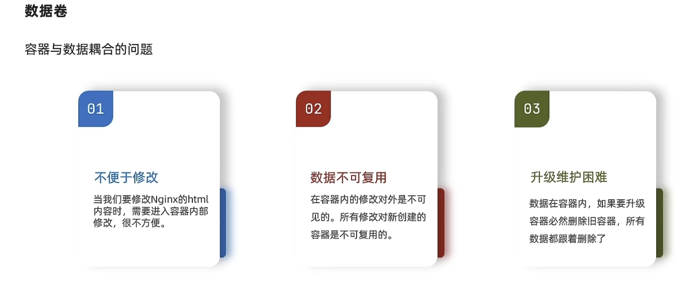

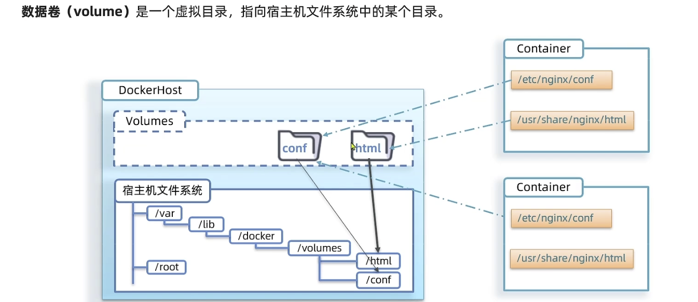


### 数据卷操作

- 看图操作，运维相关了解即可：

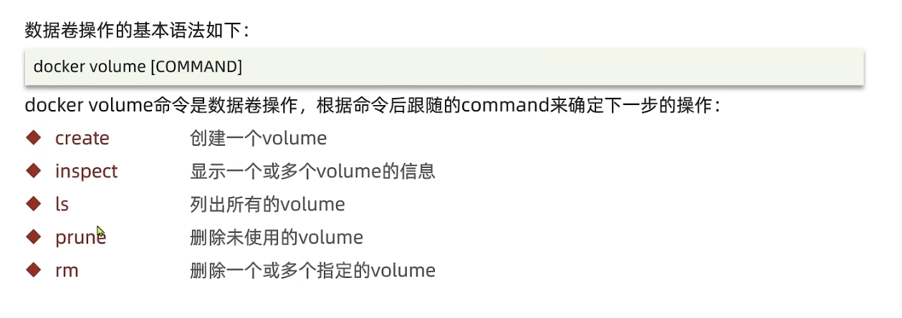

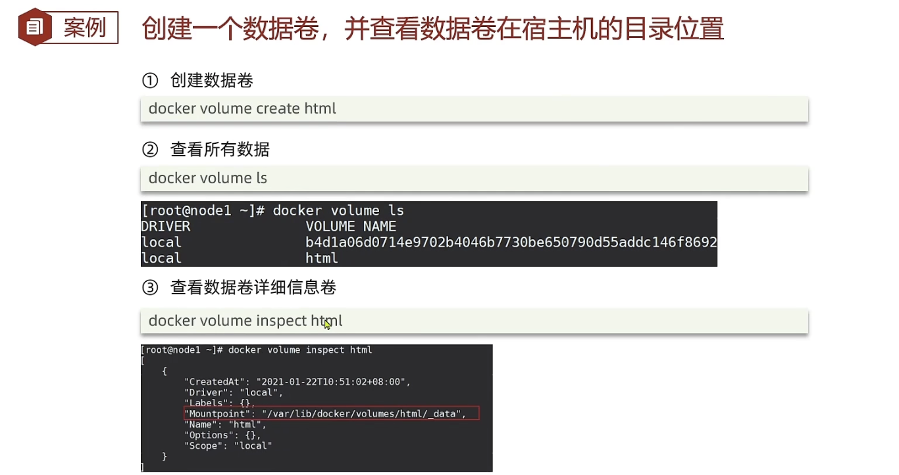


### 挂载数据卷

我们在创建容器的时候，可以通过 -v 参数来挂载一个数据卷的到某个容器目录。

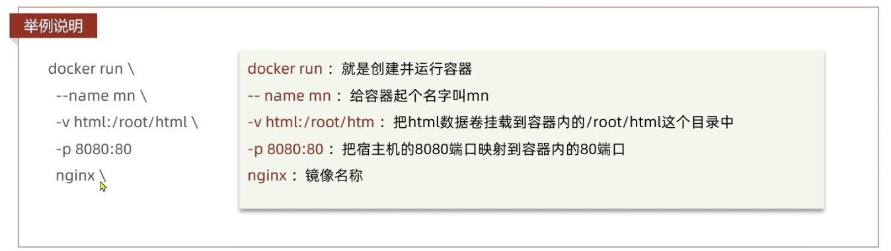

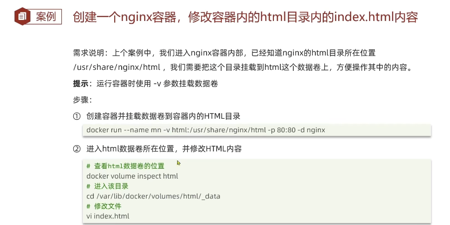

