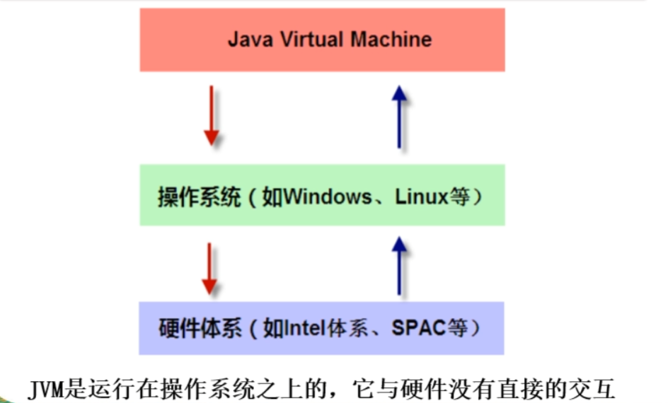
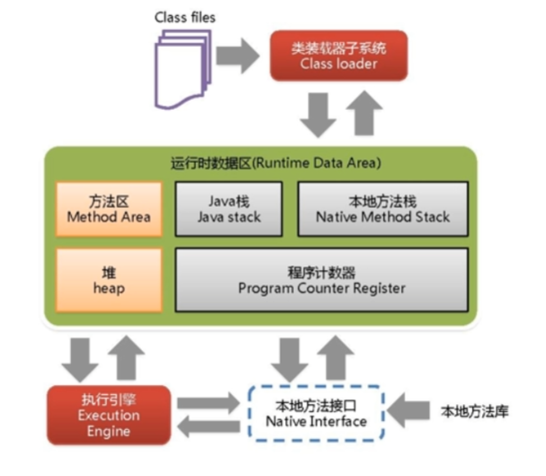
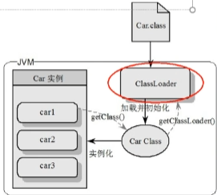

## 请谈谈你对JVM的理解？它在JAVA8中有什么更新？

## 什么是OOM？什么是StackOverFlowError？有什么办法分析？

## JVM的常用参数调优你知道哪些？

## 谈谈JVM中，对类加载器你的认识？


## 1. JVM的体系结构

JVM是运行在操作系统之上的，它与硬件没有任何直接的交互。



JVM的体系结构概览



### 1.1 类装载器ClassLoader

首先我们来明确两个 **`class`**：

- **`小 class`**：指的是 **`java`** 的 **`class`** 后缀的文件，为 **`java`** 程序提供独立于底层主机平台的二进制形式的服务。
- **`大 Class`**：指的是反射所用的封装小 class 的类，类的类型，位于 **`java.lang`** 包下

而我们的类加载器，就是负责加载 **`class`** 文件，**`class`** 文件开头有特定的文件标示，将 **`class`** 文件字节码内容加载到内存中，并将这些内容转换成**方法区**中的**运行时数据结构**并且 **`ClassLoader`** 只负责 **`class`** 文件的加载，至于它是否可以运行，则通过 **`Execution`** **`Engine`** 决定。

这么看下来，这个类加载器好像充当的只是一个快递员的角色，他只负责将 `**class**` 文件加载进 **`JVM`**，其它的事情他不做。



我们来描述一下上面这张图：首先，我们的类加载器，将 **`Car.java`** 文件编译成二进制的 **`Car.class`** 文件并且放在硬盘中，然后类加载器将 **`Car.class`** 文件加载进入 **`JVM`** 的方法区，生成运行时数据结构，也就是类模板（only one 同一份，举个例子）。

```java
/** new Car() 对应在堆内存中， Car 对应存在于方法区中 **/
...
Car    car1             =  new Car();
方法区  引用，线程私有栈      实例对象，堆
Car car2 = new Car();
Car car3 = new Car();
...
/** 三辆不同的车，都来自同一个运行时数据结构 Car，虽然是不同的车，但是模板相同 **/
```

所以我们了解了这个过程和存储位置之后，我们可以重回看 Java 的对象锁和类锁：

- **对象锁**：对应锁的是堆中的实例对象，也就是普通同步方法。
- **类锁**：对应锁的是方法区中的类模板。


