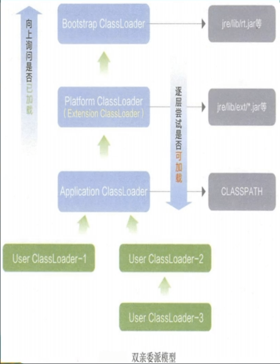

## 类装载器ClassLoader

首先我们来明确两个 **`class`**：

- **`小 class`**：指的是 **`java`** 的 **`class`** 后缀的文件，为 **`java`** 程序提供独立于底层主机平台的二进制形式的服务。
- **`大 Class`**：指的是反射所用的封装小 class 的类，类的类型，位于 **`java.lang`** 包下

而我们的类加载器，就是负责加载 **`class`** 文件，**`class`** 文件开头有特定的文件标示，将 **`class`** 文件字节码内容加载到内存中，并将这些内容转换成**方法区**中的**运行时数据结构**并且 **`ClassLoader`** 只负责 **`class`** 文件的加载，至于它是否可以运行，则通过 **`Execution`** **`Engine`** 决定。

这么看下来，这个类加载器好像充当的只是一个快递员的角色，他只负责将 **`class`** 文件加载进 **`JVM`**，其它的事情他不做。


我们来描述一下上面这张图：首先，我们的类加载器，将 **`Car.java`** 文件编译成二进制的 **`Car.class`** 文件并且放在硬盘中，然后类加载器将 **`Car.class`** 文件加载进入 **`JVM`** 的方法区，生成运行时数据结构，也就是类模板（only one 同一份，举个例子）。

```java
/** new Car() 对应在堆内存中， Car 对应存在于方法区中 **/
...
Car    car1             =  new Car();
方法区  引用，线程私有栈      实例对象，堆
Car car2 = new Car();
Car car3 = new Car();
...
/** 三辆不同的车，都来自同一个运行时数据结构 Car，虽然是不同的车，但是模板相同 **/
```

所以我们了解了这个过程和存储位置之后，我们可以重回看 Java 的对象锁和类锁：

- **对象锁**：对应锁的是堆中的实例对象，也就是普通同步方法。
- **类锁**：对应锁的是方法区中的类模板。


## 类加载器的加载顺序



### 虚拟机自带的加载器

- **启动类加载器（Bootstrap）C++**：金字塔塔尖的顶层类加载器。

- **扩展类加载器（Extension）Java**：第二层在 **`JDK9`** 版本中称为 **`Platform ClassLoader`** 即平台类加载器，**JDK8** 及之前的加载器是 **`Extension ClassLoader`**。
- **应用程序类加载器（AppClassLoader）**：**Java** 中也叫系统类加载器，加载当前应用的 **`classpath`** 的所有类。

### 用户自定义的加载器

Java.lang.ClassLoader 的子类，用户可以定制类的加载方式。

下面我们来看一个例子：

```java
package JVM;

/**
 * @author noblegasesgoo
 * @version 0.0.1
 * @date 2022/2/22 10:17
 * @description 测试类加载器
 */

public class JVMDemo01 {

    public static void main(String[] args) {

        Object o = new Object();
        System.out.println(o.getClass().getClassLoader());

        JVMDemo01 jvmDemo01 = new JVMDemo01();
        System.out.println(jvmDemo01.getClass().getClassLoader().getParent().getParent()); // 根加载器
        System.out.println(jvmDemo01.getClass().getClassLoader().getParent()); // 拓展类加载器
        System.out.println(jvmDemo01.getClass().getClassLoader()); // 应用程序加载器

    }
}
```

```shell
null // Object 类是祖宗类，在 rt.jar 中，而 rt.jar 是根加载器加载的
null // 根加载器是 c++ 写的，并不存在 jvm 体系中，所以输出为 null
sun.misc.Launcher$ExtClassLoader@1b6d3586 // 拓展类加载器
sun.misc.Launcher$AppClassLoader@18b4aac2 // 应用程序加载器

Process finished with exit code 0
```

**Java的基本盘就是由 rt.jar + ext 中的所有 jar 文件组成的。**

## 什么叫双亲委派机制？

 **jvm** 有三个自带的类加载器，他们是如何做到不冲突，并且保证大家用的类都是同一个呢？下面我们来讲讲双亲委派机制和沙箱安全机制

假设一个场景，我在自己的项目中，新建 **`java.lang.String`** 类，运行时就会出错，因为不是 **`rt.jar`** 中的，为什么能被 **`jvm`** 发现呢？

一句话，用来描述双亲委派机制：自顶向下，逐步求精，从上开始往下找，出了事，先往上送。


因为我们在一开始就加载了 **`rt.jar`** 下的文件，所以加载我们自定义的这个 **`String`**，他会向上询问是否已经被加载过，答案肯定是被加载过了，所以使用的就是 **`rt.jar`** 中的 **`String`**。

**双亲委派机制总结下来就是：**

- 当一个类收到了类加载请求，首先不会尝试自己去加载这个类，而是把这个请求委托给父类去完成，每一个层次类加载器都是如此，因此所有的加载请求都应该传送到启动类加载器中，只有当父类加载器反馈自己无法完成这个类加载请求的时候（也就是此时在它加载路径下没有找到所需要加载的 Class），子类加载器才会去尝试自己加载该类。
- 采用双亲委派机制的一个好处就是比如加载 Object 类，不管是哪个类加载器加载这个类，最终都是委托到根加载器进行加载，保证了使用不同的类加载器最终得到的都是同一个 rt.jar 包下的 Object 对象。
- 这种机制有效的防止了内存中出现多份同样的字节码。


