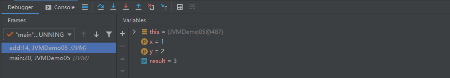
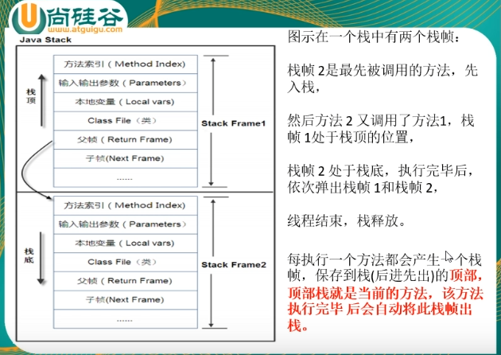
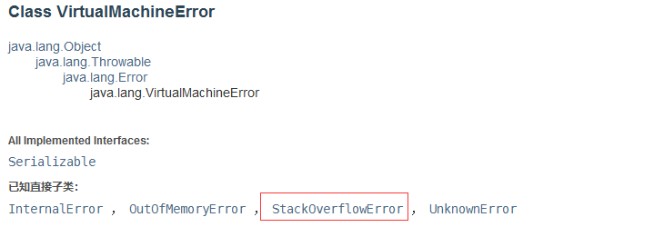

## JVM中的栈

**JVM**中的栈，又叫做栈内存，是主要来管理 **Java** 程序运行的 **JVM** 内存空间，是在线程创建时创建。

它的生命周期是和当前线程息息相关的，线程结束，那么当前线程的栈内存也就释放了。

对于栈来说不存在垃圾回收问题，因为线程一旦结束，那么该线程栈内存的就被释放。

**最重要的是，我们的八种基本类型变量，对象的引用变量，实例方法，都是在函数的栈内存中分配的！**

==栈管运行，堆管存储。==


## 栈存储什么？

- 本地变量（Local Variables）：输入参数和输出参数以及方法内的变量。
- 栈操作（Operand Stack）：记录出栈，入栈操作。
- 栈帧数据（Frame Data）：包括文件、方法等等。


## 栈运行的原理

栈中的数据都是以栈帧的格式存在的，栈帧是一个内存区块，是一个数据集，是一个有关方法和运行期数据的数据集。

当一个**方法 A** 被调用时就产生一个**栈帧 F1**，并且被压入栈，**A 方法**调用 **B 方法**产生**栈帧 F2** 也被压入栈，是这样的一个过程，用栈这种数据结构可以保证最外层的方法最后退出，不会出现最外层方法先退出的情况，如果出现外层方法率先退出，是出现异常了，所以要打印堆栈信息。

每个方法就是一个栈帧，main 方法位于底部，我们可以通过 IDEA 的 debug 查看到，我们来举一个例子：

```java
package JVM;

/**
 * @author noblegasesgoo
 * @version 0.0.1
 * @date 2022/2/25 14:16
 * @description 栈内存demo
 */
public class JVMDemo05 {

    public int add(int x, int y) {

        int result = x + y;
        return result;
    }

    public static void main(String[] args) {

        JVMDemo05 jvmDemo05 = new JVMDemo05();
        jvmDemo05.add(1, 2);
    }
}
```



上面的结果图，有俩个方法栈帧，add 方法栈帧中存储了 result 和 x、y 三个本地变量，对应下来就是这张图会更仔细一点：



栈的具体大小一般和具体的 **JVM** 的实现有关，通常大小是在 `256K~756K` 之间，约等于 `1M`，就像一个弹夹有他的容量，超过这个容f量就报错了，就出现了栈内存溢出，目前我只在递归中遇到过，通常会抛出 **`StackOverflowError`**，那么它到底是错误还是异常？



我们在 JDK8 的官方文档中找到了它属于虚拟机错误类型。

