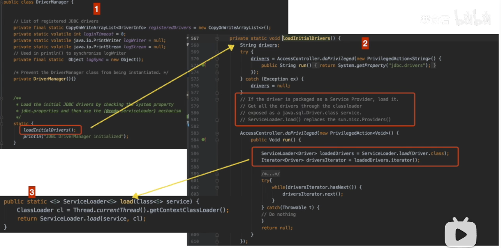
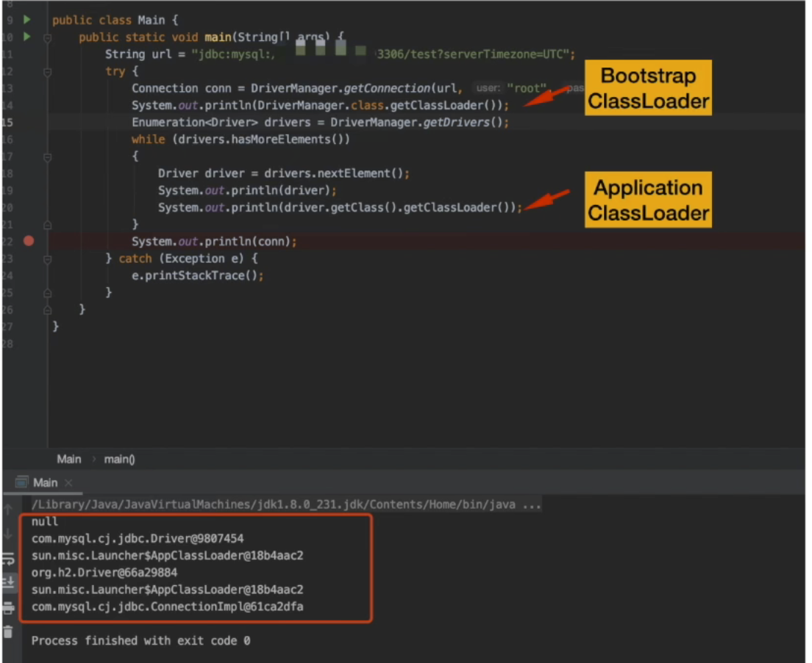

## 类加载顺序？

我们来做几个练习题吧。

### 第一题

- 说出下面代码的打印顺序：

```java
package JVM;

/**
 * @author noblegasesgoo
 * @version 0.0.1
 * @date 2022/2/25 12:04
 * @description 类加载顺序
 */
public class JVMDemo02 {

    public static void main(String[] args) {

        int x1 = 10;
        System.out.println("当前main方法中的变量x1 = " + x1);

        {
            int x2 = 11;
            System.out.println("当前普通代码块中的变量 x2 = " + x2);
        }

        {
            int y1 = 12;
            System.out.println("当前普通代码块中的变量 y1 = " + y1);
        }

        {
            int y2 = 13;
            System.out.println("当前普通代码块中的变量 y2 = " + y2);
        }

        int x2 = 14;
        System.out.println("当前main方法中的变量x2 = " + x2);

    }
}

```

- 请写出后四个打印代码段打印的最终结果：

```java
当前main方法中的变量x1 = 10
当前普通代码块中的变量 x2 = 11
当前普通代码块中的变量 y1 = 12
当前普通代码块中的变量 y2 = 13
当前main方法中的变量x2 = 14
```

- 分析结果：

普通代码块的加载顺序问题，jvm 是如何去加载的？对于普通代码块，它和一般的语句执行顺序一样，先出现先执行。


### 第二题

- 说出下面代码块的打印顺序：

```java
package JVM;

/**
 * @author noblegasesgoo
 * @version 0.0.1
 * @date 2022/2/25 12:20
 * @description 类加载顺序
 */

public class JVMDemo03 {

    {
        System.out.println("这里是不在main方法中的普通代码块1");
    }

    static {
        System.out.println("这里是不在main方法中的static代码块1");
    }

    public JVMDemo03() {
        System.out.println("这里是构造方法");
    }

    {
        System.out.println("这里是不在main方法中的普通代码块2");
    }

    public void test() {
        System.out.println("这里是类中方法1");
    }

    public static void main(String[] args) {

        JVMDemo03 jvm1 = new JVMDemo03();
        jvm1.test();

        {
            System.out.println("这里是main中的普通代码块1");
        }

        System.out.println("这里是主线程------------------");

        {
            System.out.println("这里是main中的普通代码块2");
        }

        JVMDemo03 jvm2 = new JVMDemo03();
        jvm2.test();
    }
}
```

- 请写出运行结果：

```java
这里是不在main方法中的static代码块1
这里是不在main方法中的普通代码块1
这里是不在main方法中的普通代码块2
这里是构造方法
这里是类中方法1
这里是main中的普通代码块1
这里是主线程------------------
这里是main中的普通代码块2
这里是不在main方法中的普通代码块1
这里是不在main方法中的普通代码块2
这里是构造方法
这里是类中方法1
```

- 分析结果：

我们通过上面两个例子，可以完全看出普通代码块的加载顺序，完全是按照自己的定义顺序执行，不会因为构造方法而改变顺序，所以普通代码块的运行顺序是按照顺序执行，并且执行级别只比 static 低。


### 归纳前两题

- 通过前两题的结果，我们可以得出 jvm 的类加载顺序优先级：
  - **`static代码块（包括一切 static 修饰的区域） > 普通代码块 > 构造函数 > 大于普通方法。`**
  - **而且 static 代码块只加载一次！**
  - 而我们直接在类中定义且没有 **`static`** 修饰的代码块我们叫做构造代码块，它会随着类的实例创建而被反复调用。


## 真题

有主次分明

```java
package JVM;

/**
 * @author noblegasesgoo
 * @version 0.0.1
 * @date 2022/2/25 13:02
 * @description 类加载顺序真题
 */

class Code1 {

    public Code1() {
        System.out.println("这里是 Code1 类的构造方法");
    }

    {
        System.out.println("这里是 Code1 类中的构造代码块1");
    }

    static {
        System.out.println("这里是 Code1 类中的静态代码块1");
    }

    {
        System.out.println("这里是 Code1 类中的构造代码块2");
    }

    static {
        System.out.println("这里是 Code1 类中的静态代码块2");
    }
}

public class JVMDemo04 {

    {
        System.out.println("这里是 JVMDemo04 类中的构造代码块1");
    }

    static {
        System.out.println("这里是 JVMDemo04 类中的静态代码块1");
    }

    public JVMDemo04() {
        System.out.println("这里是 JVMDemo04 类的构造方法");
    }

    {
        System.out.println("这里是 JVMDemo04 类中的构造代码块2");
    }

    static {
        System.out.println("这里是 JVMDemo04 类中的静态代码块2");
    }

    class Code2 {
        {
            System.out.println("这里是 Code2 类中的构造代码块1");
        }

        static {
            System.out.println("这里是 Code2 类中的静态代码块1");
        }

        public Code2() {
            System.out.println("这里是 Code2 类的构造方法");
        }

        {
            System.out.println("这里是 Code2 类中的构造代码块2");
        }

        static {
            System.out.println("这里是 Code2 类中的静态代码块2");
        }
    }

}

```

```java
public static void main(String[] args) {

    new Code();
    new JVMDemo04();
}

public static void main(String[] args) {
    
    new JVMDemo04();
    new Code();
}
```

- 写出在主类的main函数中的运行结果：

```java
这里是 JVMDemo04 类中的静态代码块1
这里是 JVMDemo04 类中的静态代码块2
这里是 Code1 类中的静态代码块1
这里是 Code1 类中的静态代码块2
这里是 Code1 类中的构造代码块1
这里是 Code1 类中的构造代码块2
这里是 Code1 类的构造方法
这里是 JVMDemo04 类中的构造代码块1
这里是 JVMDemo04 类中的构造代码块2
这里是 JVMDemo04 类的构造方法
```

```java
这里是 JVMDemo04 类中的静态代码块1
这里是 JVMDemo04 类中的静态代码块2
这里是 JVMDemo04 类中的构造代码块1
这里是 JVMDemo04 类中的构造代码块2
这里是 JVMDemo04 类的构造方法
这里是 Code1 类中的静态代码块1
这里是 Code1 类中的静态代码块2
这里是 Code1 类中的构造代码块1
这里是 Code1 类中的构造代码块2
这里是 Code1 类的构造方法
```

- 分析：

我们此时可以看出，不管如何，主**类的静态代码块一定会先执行，紧接着就是次类的静态代码块一定执行，静态代码块只加载一次**（==静态的东西，是全局共有的，是一定会最先被加载的！==），内部类用不到不加载，然后就按照前面给出的逻辑来加载。

先将 **JVMDemo04.class** 文件加载到方法区，然后所有内容才可以继续运行（包括 **main**）。


## 双亲委派机制可以被破坏吗？

**可以的，因为我们的双亲委派模型，其实是在 Java 代码层面的 classLoad 方法中实现的，一般情况，如果我们重写这个方法，就可以破坏**。

- **那么我们 java 为什么不像 defineClass 这个方法一样将 classLoad 方法变为 final 的强制推荐使用双亲委派模型呢？**
  - 可以这样做，但是，由于双亲委派模型是在**JDK1.2之后**才被引入的，而**类加载器和抽象类java.lang.ClassLoader则在JDK1.0时代就已经存在**，面对已经存在的用户自定义类加载器的实现代码，Java设计者引入双亲委派模型时不得不做出一些妥协。
  - 在此之前，用户去继承**java.lang.ClassLoader**的唯一目的就是为了重写**loadClass**方法，因为虚拟机在进行类加载的时候会调用加载器的私有方法**loadClassInternal**，而这个方法唯一逻辑就是去调用自己的**loadClass**。


历史上第二次破坏的例子就是，我们的 **SPI** 中的 **jdbc**，各大厂商实现的驱动加载，虽然说，**DriverManager** 是启动类加载器加载的，但是其实是委派给了当前线程的 **ContextClassLoader** 中去加载了，而这个是属于应用类加载器，所以没有去访问过启动类加载器，打破了双亲委派模型。主要是原生 **JDBC** 是在 **rt.jar** 包下，但是由于在**JDBC**中的**Driver**类中需要动态去加载不同数据库类型的**Driver**类，这样的话就不能同启动类加载器加载时一同加载，所以才引入线程上下文件类加载器(**ThreadContextClassLoader**)。有了这个东西之后，程序就可以把原本需要由启动类加载器进行加载的类，由应用程序类加载器去进行加载了。

就是说在加载各个厂商的jdbc驱动类时，**bootstrapclassload**没有尝试先去加载，而是调用了**applicationclassload**。

- 图片来源 B站 寒食君：






- **不同的类加载器，除了读取二进制流的范围和作用不一样，后续的加载逻辑是否一样捏？**
  - 是一样的，因为，不同的类加载器，它们的差别就在于 classLoad 这个方法，这个方法中可以定义他们的各自读取二进制流的逻辑，但是最终加载都是委托给 defineClass 这个 final 修饰的不可重写的方法来加载的。