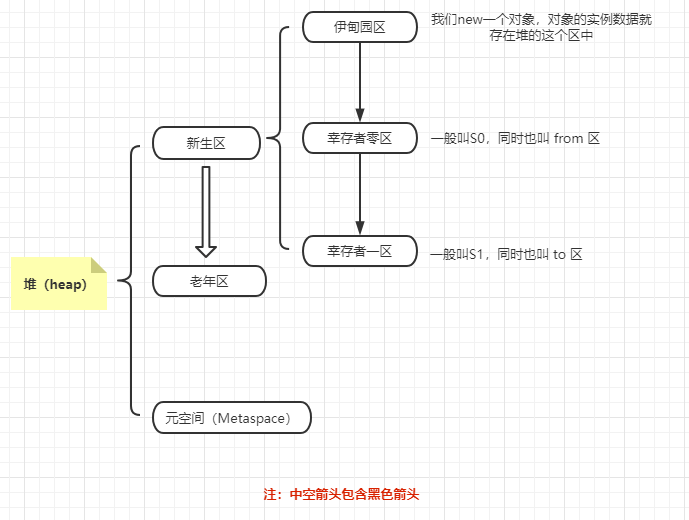
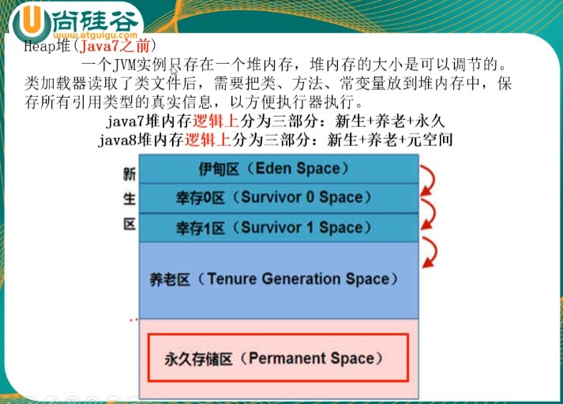
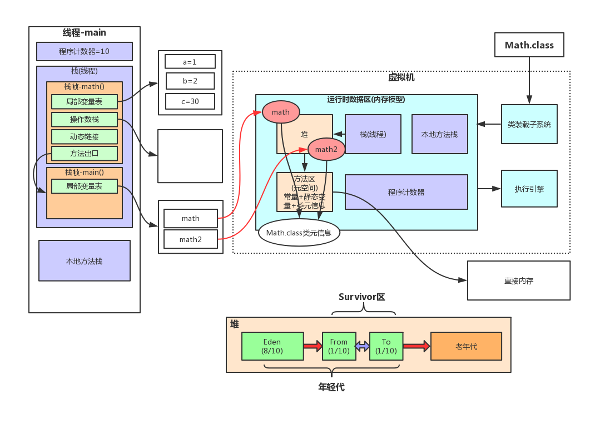

## JVM的堆内存体系结构

**堆（heap）**，主要的 **GC** 就发生在这个区中，而且通常对 **JVM** 的调优也是发生在堆内存。



1. **新生代**：
   - **伊甸园区**：一个对象的创建和消亡基本都在这个区。
   - **S0区**：
   - **S1区**：
2. **老年代**：
3. **元空间**：存放一些需要永久存在的内容，比如最初始的 rt.jar 包下的所有东西。

值得注意的是，元空间，它就是存放 rt.jar 包这种必要的工具空间，这里面基本不会出现垃圾回收，都是永久存在的。

我们跟着尚硅谷的课件来看看 **Java7** 之前堆空间的内存分配逻辑是啥样的：



这里注意这句话：**类加载器读取了类文件后，需要把类、方法、常变量放到堆内存中，保存所有引用类型的真实信息，以方便执行器执行。**


## 一个对象创建的过程？

我们以下面这段代码为例：

```java
User user = new User();
```

上面这段代码在 **jvm** 中是如何产生，如何消失的？
看到如何消失的字眼，我们立马就联想到一个东西，那就是 GC 垃圾回收机制，在 jvm 中==**`GC = 发生在新生代的轻量级GC（简称GC） + 发生在老年代的重量级GC（简称 FULL GC）`**==

在解释上面这个问题前，我们要有一个**JVM**对象生命周期概念，那就是：
==**新生代（伊甸园区 -> S0区 -> S1区）-> 老年代**==，括号内的先执行，并且，**==S0 和 S1 区的位置会发生交换，他们之间有一个交换的过程。==**




