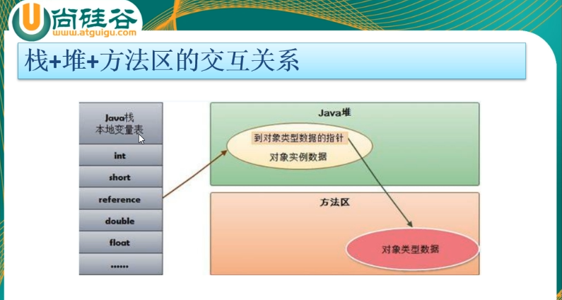

## 堆、栈、方法区的交互关系（重点）



我们跟着尚硅谷的课件来看一下这三个内存区域的交互关系到底是怎么样的？

**HotSpot** 是使用指针的方式来访问对象：**jvm 堆内存**中会存放访问**类的元数据**的地址，**reference** 存储的就是对象的内存地址。

- **HotSpot** 是啥？直译就是热点，**Oracle** 公司出版的 **JDK** 就是 **HotSpot**。
- **类的元数据**又是啥？也就是前面所说的大 Class。

我们看一段代码：

```java
User user = new User();
```

那么他们对应的这三个内存区块的关系是啥样的呢？我们一个一个来说：

- **`User`**：**类模板**，存放于共享方法区内存中。
- **`user`**：**实例对象引用**（**`reference`**），存放于当前线程私有栈内存中，真实数据指向堆内存中。
- **`new User()`**：共享堆内存中的真正**对象实例数据**。

