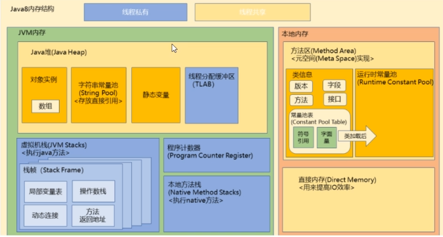
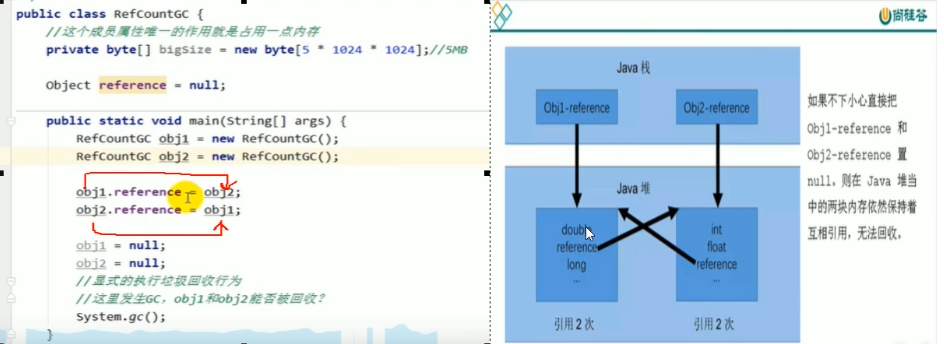
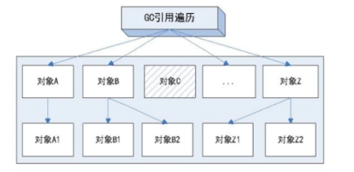
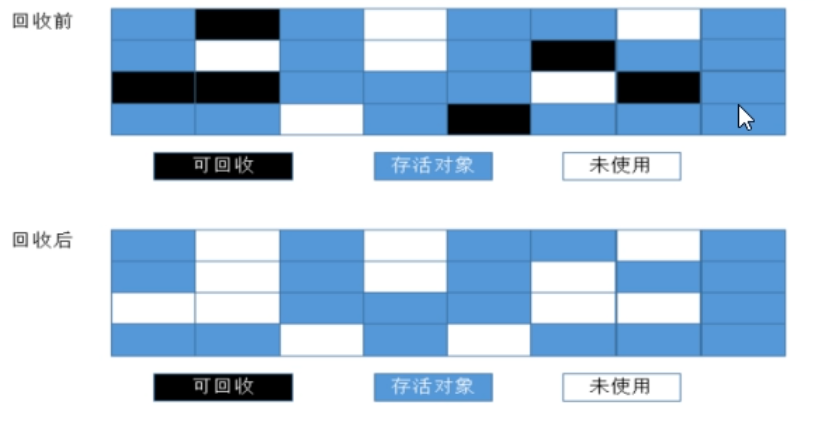

## 什么是GC？

再说之前我们重新通过尚硅谷的一张图来回顾一下 **Java8** 的内存结构：




**GC垃圾回收机制，遵守分代手机的算法思路：**

- **频繁收集新生代。**
- **很少手机老年代。**
- **基本不动元空间。**


JVM 在进行 GC 的时候，**并不是每次都是对新生代和老年代一起回收**，==大部分时候的回收，都是指我们的**新生代**==。因此 GC 按照回收的区域又分为了两种类型：

- 一种是普通 GC （minor GC）也就是轻GC。
- 一种是全局 GC （major GC or full GC） 也就是重量级GC。


**轻GC 和 重GC 的区别：**

- **轻GC**：只针对新生代的GC，因为新生代的 Java对象 大多数存活率都不高，所以轻 GC 相对来说十分频繁，一般回收速度也比较快。
- **重GC**：只发生在老年代的GC，**==重GC== 一般都会伴随着 ==轻GC== 出现**， 他的速度一般比 轻GC 慢十倍以上。


## JVM中，如何判断一个对象是垃圾？

**对象存活判断的方法有哪些？**

- **引用计数算法（有缺点，被淘汰）。**
- ==**GCRoots 根可达算法（现役）。**==


### 引用计数算法

- 所谓引用计数法，就是给每个对象一个标记，这个标记代表当前对象被引用的次数，如果为 0 就可以被回收。
- 客观来说，除了占用额外的空间计数，但是原理简单，效率也挺搞，大多数情况下都是不错的算法。
- 缺点就在于：
  - 每次对对象赋值时都要维护引用计数器，而且计数器本身肯定是有性能消耗的，**我们得保证计数器与被引用次数的最终一致性**。
  - ==**它较难处理循环引用**==，好比两个人拿着枪互相指着对方，都让对方放下枪。

我们来看看循环引用的情况：



所以无法计数所以 JVM 的实现一般不采用这种方式。


### GCRoots查找

为了解决引用计数算法的循环引用问题，Java 使用了可达性分析的方法。



只要对象在这个根的链路上，都是不可回收状态。

这里我们引出  **GC roots** 或者说 **tracing GC** 的根集合就是**==一组必须活跃的引用==**。

基本思路就是通过==一系列名为 **GC roots** 的**对象**作为起点==，从这个被称为 **GC Roots** 的对象开始向下搜索，如果一个对象没有道 **roots** 的引用链，则说明这个对象没人引用，可以回收。即给定一个集合的引用作为根触发，通过引用关系遍历对象图，能被遍历到的（可到达的）对象就被判定为存活，没有被遍历到就自然被判定为死亡。

#### Java中可以作为 GC Roots 的对象（重点）

1. 虚拟机栈（栈帧中的局部变量区，也叫做局部变量表）中引用的对象。

   ```java
   Book book = new Book();
   // book 在java栈中就是一个根，book 在java栈中指向堆中共享的 new Book() 的实例对象。
   ```

2. 方法区中的类静态属性引用的对象。

   ```java
   class Student {
       String name;
       static String className = "xxxxxxxx"; // 写死的静态属性
       
       ... main() {
           Student zlm = new Student();
           Student wl = new Student();
           
           // 上述俩对象的名称肯定不一样，但是静态属性百分百肯定是一样共用的。
       }
   }
   
   
   ```

3. 方法区中常量引用的对象。

   ```java
   class User {
       public static final String country = "China"; // 这个常量就可以作为 root
       Long id;
   }
   ```

4. 本地方法栈中 JNI （Native方法）引用的对象。

==总结下来：==

```java
// root 这样的栈中引用对象
GCRoots root = new GCRoots();
// 静态属性
private static GCRoots root = new GCRoots();
// 常量
private static final GCRoots root = new GCRoots();
```


## 三大算法

发生在新生代的复制算法，我们之前有讲过，这里就不详细说了，复制算法如何找到存活的对象，靠的就是遍历根。

### 标记清除算法（Mark-Sweep）

**老年代**一般是由**标记清除**或者是**标记清除与标记整理**的混合实现。

该算法分为两个阶段：

1. 标记

   先标记处要回收的对象。

2. 清除

   统一回收对象。



第一遍扫描先标记哪些对象可以被回收，第二遍查找可以被回收的对象然后回收。

#### 优点

- 明摆着的简单好用，不浪费太大的系统开销，只用同一块内存，所以==节约内存==。
-  **FULL GC** 的时候可能要停程序，会导致用户体验差。

#### 缺点

- 我们观察回收后，就可以发现，会有内存碎片，比如现在我有一个对象进入老年代，由于现在老年代再尽力过一次标记清楚算法之后，**==空的内存地址不连续==**，而且**我新进入的这个对象正好比这些所有空的不连续地址块大，那么怎么去容纳这个对象呢**？


### 标记清除压缩整理算法

 承接上一个算法，但是有整理碎片，消除碎片，每次标记清除之后，都有一个标记重排队，然后压缩。但是值得注意的是，**压缩整理是多次重GC之后才会进行一次，不然开销太大了，减少移动对象的成本。**

#### 优点

- 解决了标记清除算法的碎片问题。

#### 缺点

- 时间开销变大，多了两步。（标记-清除-压缩-整理）。


## 对于垃圾是不是马上就回收？

肯定不是，我们得看情况，有些时候伊甸园区没有到达回收临界值，即使这时有对象需要回收吗，也肯定不会立马就回收，不然轻GC本来就频繁了，这样会更频繁，然后重GC就更麻烦了。

## 如果要回收的话，怎么回收捏？

有三种垃圾回收算法，我们得分老年代和新生代来解释，具体解释看前几篇。

## 有哪些条件是回收前提？

根不可达，这个是最重要的。

**HotSpot** 可达性分析实现：

- 首先要找出所有**GC Roots**，我们必须知道当前虚拟机栈中的引用的对象，需要**遍历==方法区==找出所有的静态属性和常量**等。
  **HotSpot** 通过一种 **oopMap** 的数据结构在类加载的时候计算出对象内每个位置是什么数据类型来保存执行到当前指令时有那些 **GC Root**。
  通过获取 **oopMap** 中的数据，GC**可以快速枚举GC Roots， 再获取到GC Roots后，分析引用链，判断哪些对象不可达即可**。

使用 **oopMap** 的问题是

- 如上文所述，则必须每条指令处都需要一个 **oopMap** 数据结构（至少对**GC Roots**有影响的指令需要），那么此方法的空间成本非常高。
  解决办法：仅在特定的位置产生 **oopMap** 如方法调用，循环开始等。这样的话，当运行到有 **oopMap** 的指令时，**JVM** 就可以开始 **GC** 了。 这样的点称为**安全点**。

新的问题：多线程时，如果线程A到了安全点，而线程B没到安全点。线程B到安全点了，线程A却没到，如此反复，永远都不可能达到GC的条件。
解决办法：当需要GC时，设置一个GC标志， 当线程运行到安全点时，判断GC标志，如果为真，则挂起自身，等待GC完成

新的问题：如果某一个线程长时间内不执行，那么会长时间内都不可到达安全点。比如sleep，获取读取大文件阻塞了。
解决办法：如果在一段代码片段中，引用关系都不会发生变化，则在此代码片段期间GC是安全的，此区间称为安全区域
当线程执行到安全区域时，标识自己进入安全区域，当JVM需要进行GC时，就不用理睬这些线程。当这些线程要离开安全区域时，就需要检查GC是否完成

> 原文链接：https://blog.csdn.net/u014165359/article/details/84811181

