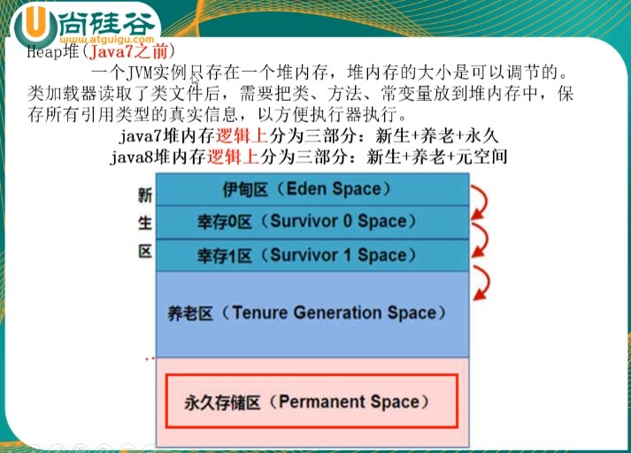
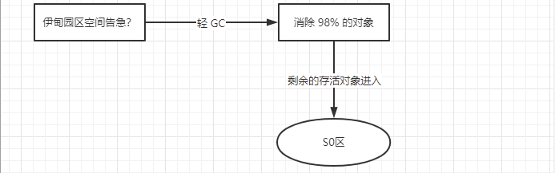
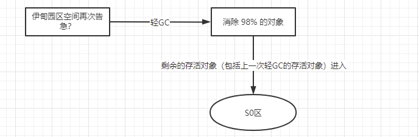

## 初识GC

**我们先简单的理解一下发生在堆内存中的 GC 的流程：**

在解释上面这个问题前，我们要有一个**JVM**对象生命周期概念，那就是：
==**新生代（伊甸园区 -> S0区 -> S1区）-> 老年代**==，括号内的先执行，并且，**==S0 和 S1 区的位置会发生交换，他们之间有一个交换的过程。==**

这上面这张图的几个箭头如何理解？如何理解 **轻GC（Minor GC）**？和 **FULL GC （Major GC）**？

首先，**新生代的伊甸园区**，==所有对象的创建和销毁基本都在这个区中==。但是**伊甸园区**也有它的最大容量，假设我们**有个死循环**在不断的创建新的对象，那么肯定某个阶段会将整个**伊甸园区**占满，实际**可能是在占用率到 70% 左右就会触发新生代的 轻GC**，这一次 **轻GC** 假设会销毁清理掉 **98%** 的对象，那么一百个对象中存活下来的就是 **2个对象（因为这个俩个对象在经历这次 轻GC 后还处于被引用的状态）**。那么存活下来的这 **2个对象** 就会进入 **S0区**。

大致就是这样：

至于**老年代**，**进入老年代的条件**就是**一个对象如果活过15次轻GC即可进入老年代**。
能进入**老年代**，这说明这个对象一直在被引用，很重要，但是也总有被抛弃的一天，被抛弃的这一天就是发生在老年代的 **FULL GC** 来清理的。

==FULL GC 一般发生在老年代内存空间不足一定程度的时候。==

为什么发生在**老年代**的 **GC** 要叫做 **FULL GC**？个人理解就是，到这里清理对象垃圾就是完全清理了，不可能遗漏了，**FULL** 也就是完全的意思，完全垃圾清理。

==但是有个问题，**如果有一天老年代触发 FULL GC 之后也腾不出更多空间了会发生什么事情**？==

- 出现**堆内存被撑爆**的情况，发生 ==**OOM（OutOfMemoryError）**==堆内存溢出。

