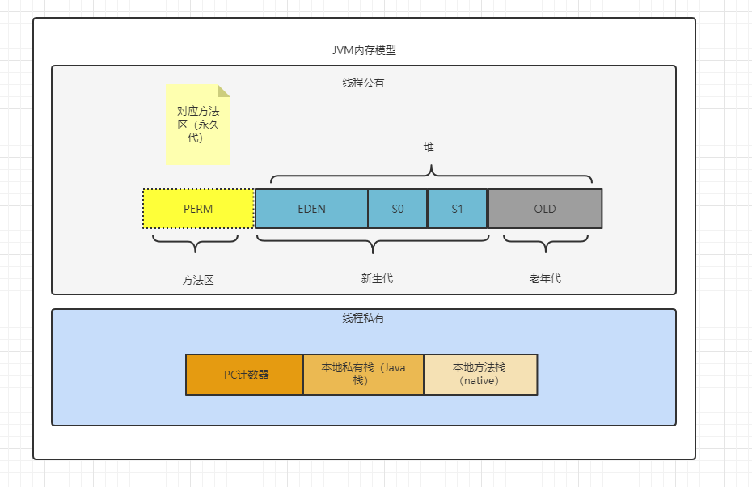
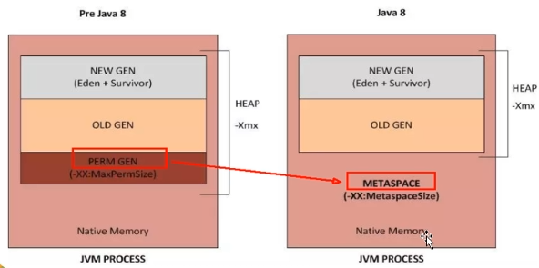

## 方法区概述

**方法区（Method Area）**它和堆一样，是各个线程共享的内存区域，它主要用于存储虚拟机加载的以下内容：

1. 类元信息
2. 普通常量
3. 字段
4. 方法
5. 静态常量
6. 编译器编译后的代码
5. ...

对于 HotSpot 虚拟机（**Oracle** 版本的 **JVM**），很多开发者希望称之为 “**永久代（Parmanent Gen）**”，但严格本质上说两者是不同的，或者说使用永久代来实现方法区而已，==永久代是方法区（相当于方法区是一个接口）的一个实现==。类比 **Java** 中的接口的实现类。

**虽然 JVM 规范将方法区描述为堆的一个逻辑部分，但是它有一个别名，叫做非堆（Non-Heap），目的就是要和堆分开。**

==也就是说逻辑上，它是和堆分开的，但是物理上上他就是堆的一部分。==

我们再来看看此时的 JVM 内存模型：

 

## 永久区Perm（Java7 之前）

永久存储区是一个内存区域，用于存放 JDK 自身所携带的 Class, Interface 的元数据，也就是说**它存储的是运行环境必须的类信息（rt.jar）**。被加载到该区域的数据，是**不会被 GC 的**。只有 JVM 关闭了，才会释放此区域所占用的内存空间。

## 元空间Metaspace（Java8）

Java 7之前的元空间被此取代，将元空间的内容放到本地内存中，而不是继续留在 JVM 中，**这样的好处就是：堆的空间在不物理增加的情况下变多了。**

- 在 **Java 8** 之前，三者共用一个空间，而永久代，它加载 **rt.jar** 包下的内容，如果它占用的内存多（比如 **Java** 不断迭代造成 **rt.jar** 包下的内容变多），那么其它俩块就占用的少，那么工作内存就相对变少了。
- 在 **Java 8** 之后，变成两者用同一个空间了，对比 **Java 8** 之前，同样的空间，从三人使用变成两人使用了，那么就可以说是相对的工作内存空间变得更加充足了。
- 原来的永久代变成了元空间，元空间直接是脱离堆内存的范围，然后存储在本地内存中。

