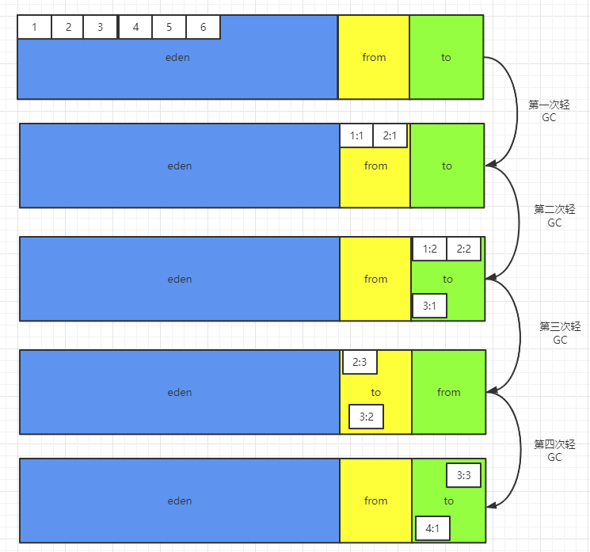

## 轻GC回收过程

首先我们讲发生在新生代的**GC**，也就是 **MinorGC** 我们用 **轻GC** 来代称。这里的 **GC** 用的是**复制算法**进行垃圾回收，经研究发现，**不同对象的生命周期不同，98%的对象是临时对象。**

### 复制算法

 从 **轻GC** 的角度来看对象的诞生、运行、回收及整个生命周期如下：

- ==**新生代：GC（复制算法） 之后清空，有交换，谁空谁是 to。**==
- **Minor GC：复制 -> 清空 -> 互换。**

Java 8 的 堆内存 ：

**新生代和老年代他们的堆空间占用比例为 1:2**

我们紧接着跟着上一篇笔记所说的 **GC 回收概览**的流程来走一遍 **复制算法** 的 **轻GC**：

现在的我们已经大致知道 **GC** 的全过程了，那么复制算法中每个对象都有一个标记，在每次 **轻GC** 后，都**==会将存活下来的对象的标记 + 1==**，累计十五次直接从 **S区（S0、S1）** 放到老年代中。

但是，重点来了！ **如何理解谁空谁是to ** 这句话呢？新生代他有三个小区，在进行完一次 **轻GC** 后，剩下的**两个幸存者区**中谁空谁就是 **to区（幸存者1区）**。 

     

上图这样来看：

- 第一次 **轻GC** 之后，只剩下了 **1、2** 两个对象存活，他们的标记 **+ 1**，然后放到**幸存者区中间的顺位空的那个（==顺位第一个就是from区==）**。所以第一次 **GC** 就这样了。
- 如何找到对象存活，那就是根可达遍历来查找了。
- 第二次 **轻GC** 才是重点。
  - **1、2** 活下来，标记 **+ 1**，这回又活了一个 **3**，**3** 的标记 **+ 1**，然后将活下来的三个对象（有的处于 **eden区** 有的处于 **from区**）复制一份放入空的那个**幸存者to区**（因为 是**第二次轻GC**，所以**顺位第二个也就是此前的 to区**），==删除 eden区 和此前**from区** 的对象==。
  - ==然后此时的 **to区** 就变为下次 **轻GC** 的 **from区** 了，而被清空的原来的 **from区** 就变为下次 **轻GC** 的 **to区** 了==。（谁空谁是to）。
- 第三次、第四次等就以此类推。
- 但是如果 **new** 了一个**==大对象==**，**eden区** 放不下，就出生的那一刻就**直接进入老年代**，后等待 **重GC**。

==永远保证有 10% 的地方是空的作为 **to 区**，并且每次清除，**Eden区一定为空**。==

### 优点

- 没有内存碎片。

### 缺点

- 我们总得留着一个空的幸存者区，造成空间利用率降低。
- 并且假设所有对象存活率都是 100% ，那么每次都得复制等量的对象，那么这性能开销可就大了。
- 所以复制算法想要使用，至少项目中存活率低的对象比较多的时候才适用。

## 新生代为什么需要幸存者区？

为啥不直接从新生代（这里指只有 **eden区** 的新生代）到老年代，而要在新生代里分那么多区？

我们来分析啊，首先反推，如果没有这俩个幸存者区做存活对象保存工作，那么某些对象存活后就直接进入到老年代。这其中不乏有些对象可能在后几次的 **轻GC** 就会被清除，在这之前直接移入老年代，明显就是不合适的举动。
由于没有幸存者区这层缓冲，对象进入到老年代的概率会大大增加，那么也就会导致老年代触发 **FULL GC** 的次数增加，而 **FULL GC** 是**重量级操作**，越少越好。所以新生代需要这样分区来防止频繁发生 **FULL GC**，随之而来的就是系统会变得更稳定。

==**FULL GC 可能会导致 JVM 暂停。**==好比疫情防控人员在上课期间突然对某间教室进行杀毒，那么课堂不可能不暂停，如果频繁的暂停课堂，是不是这节课就断断续续的，类比过来就是系统不稳定。

## 新生代为什么是两个幸存者区？为什么是 8:1:1 ？

回答这个问题之前，我们的知道一个事情，那就是，如果分区越多，越细，那么内存碎片产生的也就会越多。**而 Oracle 多次实践之后得到的最佳比例效果就是两个。**

我们来假设只有一个幸存者区会怎么样？假设那个幸存者区已经有了几个幸存对象，在一次 **轻GC** 后，又来了几个新对象，那么复制算法还能使用吗？显然是不能，因为没有空闲区域去存放这几个活过这次 **轻GC** 的对象，这就导致虽然我复制了，但是我还是放在了那个幸存者区，但是复制完成删除的时候，我无法确定到底谁是存活的了，不能直接全部删除这些要被杀掉的对象了。所以这样情况下，至少复制算法是不能用了，至少得用标记清除法，但是那是属于 **重GC** 范畴，而且最大的问题就是内存碎片，那么 **JVM 不稳定因素又增加了**。

如果是两个的幸存者区域的话，那么总有一个幸存者区是空的，另一个没碎片，因为都会被清空，所以起码得有两个幸存者区，主要就是解决内存碎片化的情况。如果分成更多块的话，也可以，但是每个幸存者区被占满的概率就大大提升了。
