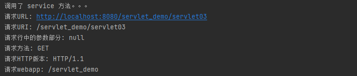
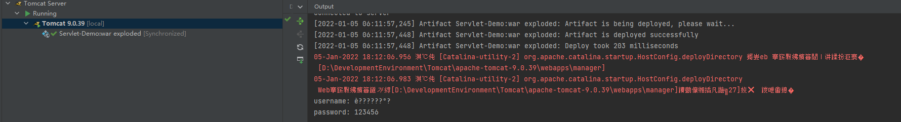
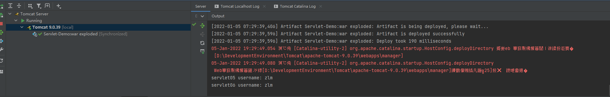
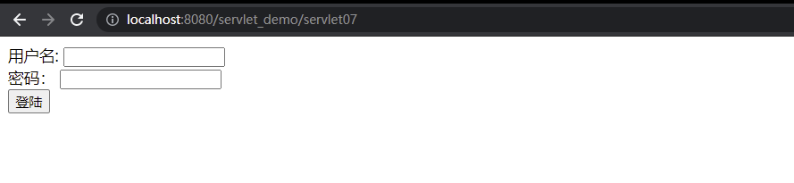
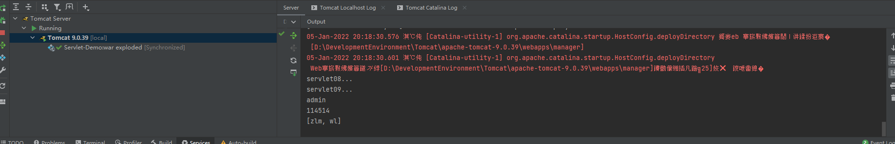

## 1. 介绍

**`HttpServletRequest`**对象，主要作用就是接收客户端发送过来的请求信息，就比如：请求的参数，发送的头信息等都属于客户端发来的信息，**`service`** 方法中形参接收的是 **`HttpServletRequest`** 接口的实例化对象，表示该对象主要应用在 **HTTP** 协议上，该对象是由 **Tomcat** 封装好传递过来的。

**`HttpServletRequest`**对象是 **`ServletRequest`** 的子类 （**`public interface HttpServletRequest extends ServletRequest`**）。

**`ServletRequest`** 类只有一个子类就是 **`HttpServletRequest`**，那为啥不合并为一个呢？因为为了拓展性，而且符合开闭原则，**`HttpServletRequest`** 字面来看是针对 Http 请求的，如果出现了 FTP 之类请求的，照样可以通过扩展。

在 **`HttpServletRequest`** 中，定义的方法特别多，但是都是围绕着接收客户端参数的，但是怎么拿到该对象呢？不需要，直接在 **service** 方法中由容器传入过来，而我们需要做的就是取出对象中的数据，进行分析，处理。


## 2. 接受请求

### 2.1 常用方法

|     方法名称     |                   说明                   |
| :--------------: | :--------------------------------------: |
| getRequestURL()  |      获取客户端发出请求时的完整 URL      |
| getRequestURI()  | 获取请求行中资源名称部分（项目名称开始） |
| getQueryString() |          获取请求行中的参数部分          |
|   getMethod()    |            获取客户端请求方式            |
|  getProtocol()   |             获取 HTTP 版本号             |
| getContextPath() |             获取 webapp 名字             |

### 2.2 示例

```java
    @Override
    protected void service(HttpServletRequest req, HttpServletResponse resp) throws ServletException, IOException {
        System.out.println("调用了 service 方法。。。");
        System.out.println("请求URL: "+ req.getRequestURL().toString());
        System.out.println("请求URI: "+ req.getRequestURI());
        System.out.println("请求行中的参数部分: "+ req.getQueryString());
        System.out.println("请求方法: "+ req.getMethod());
        System.out.println("请求HTTP版本: "+ req.getProtocol());
        System.out.println("请求webapp: "+ req.getContextPath());
    }
```




## 3. 请求乱码的问题

注意：自 Tomcat 8.0 之后，GET 请求都不会出现乱码。

下面一段代码：

```java
package com.zhao.servlet;

import javax.servlet.ServletException;
import javax.servlet.annotation.WebServlet;
import javax.servlet.http.HttpServlet;
import javax.servlet.http.HttpServletRequest;
import javax.servlet.http.HttpServletResponse;
import java.io.IOException;

/**
 * @author zhaolimin
 * @date 2022/1/5
 * @apiNote 请求乱码问题，目前是一个 get 请求，因为直接使用地址栏请求
 */

@WebServlet("/servlet04")
public class ServletDemo04 extends HttpServlet {
    @Override
    protected void service(HttpServletRequest req, HttpServletResponse resp) throws ServletException, IOException {
        // 获取客户端传递的参数
        String username = req.getParameter("username");
        String password = req.getParameter("password");
        System.out.println("username: " + username);
        System.out.println("password: " + password);
    }
}
```

```jsp
<%--
  Created by IntelliJ IDEA.
  User: noblegasesgoo
  Date: 2022/1/5
  Time: 18:08
  To change this template use File | Settings | File Templates.
--%>
<%@ page contentType="text/html;charset=UTF-8" language="java" %>
<html>
    <head>
        <title> 登陆，测试乱码 </title>
    </head>
    <body>
        <form method="post" action="servlet04">
            用户名: <input type="text" name="username"> <br>
            密码： <input type="text" name="password"> <br>
            <button>登陆</button>
        </form>
    </body>
</html>
```

post请求传参后收到的中文参数是乱码是怎么一回事呢？



由于现在的 **request** 属于接收客户端的参数，所以肯定会有默认的语言编码，主要是由于在解析过程中的编码方式为 **ISO-8859-1** 编码，该编码不支持中文，所以导致了乱码。想要解决这种乱码问题我们就得设置 **request** 的编码方式，以此来告诉服务器到底该用何种编码格式来接收数据，或者再接收到乱码数据之后再通过相应的编码格式还原数据。

### 3.1 解决方式一

该种方法只针对 POST 请求有效果！

```java
req.setCharacterEncoding("UTF-8");
```


### 3.2 解决方式二

这种方法就属于接收到数据之后再次解析，借助了 String 对象的方法，该种方法对任何请求都有效，是通用的！

```java
new String(req.getParameter(name).getBytes("ISO-8859-1"), "UTF-8");
```


## 4. 请求转发

所谓的请求转发，**是一种服务器的行为**，==当客户端请求达到后，此时会将请求对象进行保存，地址栏中的 URL 并不会改变，得到响应后，服务端再将响应发送给客户端==，从头到尾只有一个请求发出而非多个，用它来实现多个资源协同响应的效果。 

实现方式如下：

```java
// 只能跳一次，所以要想好
req.getRequestDispatcher(url).forward(req, resp);
```

**特点**：

1. 服务器行为
2. 地址栏不发生变化
3. 从头到尾只有一次请求
4. 数据可以共享


### 4.1 跳转 servlet 示例

- servlet05

```java
package com.zhao.servlet;

import javax.servlet.ServletException;
import javax.servlet.annotation.WebServlet;
import javax.servlet.http.HttpServlet;
import javax.servlet.http.HttpServletRequest;
import javax.servlet.http.HttpServletResponse;
import java.io.IOException;

/**
 * @author zhaolimin
 * @date 2022/1/5
 * @apiNote 请求转发，可以让请求从服务器跳转到客户端（或者跳转到指定的 servlet），是一个服务端的行为
 */

@WebServlet("/servlet05")
public class ServletDemo05 extends HttpServlet {

    @Override
    protected void service(HttpServletRequest req, HttpServletResponse resp) throws ServletException, IOException {
        // 接收客户端参数
        String username = req.getParameter("username");
        System.out.println("servlet05 username: " + username);

        // 请求转发，跳转到 servlet06
        // 将当前 servlet 中的 req，resp 连同数据一起传到 servlet06 中。
        req.getRequestDispatcher("servlet06").forward(req, resp);

    }
}

```


- servlet06（用来验证转发）

```java
package com.zhao.servlet;

import javax.servlet.ServletException;
import javax.servlet.annotation.WebServlet;
import javax.servlet.http.HttpServlet;
import javax.servlet.http.HttpServletRequest;
import javax.servlet.http.HttpServletResponse;
import java.io.IOException;

/**
 * @author zhaolimin
 * @date 2022/1/5
 * @apiNote 请求转发，可以让请求从服务器跳转到客户端（或者跳转到指定的 servlet），是一个服务端的行为
 */

@WebServlet("/servlet06")
public class ServletDemo06 extends HttpServlet {

    @Override
    protected void service(HttpServletRequest req, HttpServletResponse resp) throws ServletException, IOException {
        // 接收客户端参数
        String username = req.getParameter("username");
        System.out.println("servlet06 username: " + username);
    }
}
```


访问 **`http://localhost:8080/servlet_demo/servlet05?username=zlm`**

结果如下：



可见 **servlet05** 中的数据转发到了 **servlet06** 中。


### 4.2 跳转 JSP 页面示例

- servlet07

```java
package com.zhao.servlet;

import javax.servlet.ServletException;
import javax.servlet.annotation.WebServlet;
import javax.servlet.http.HttpServlet;
import javax.servlet.http.HttpServletRequest;
import javax.servlet.http.HttpServletResponse;
import java.io.IOException;

/**
 * @author zhaolimin
 * @date 2022/1/5
 * @apiNote 请求转发，可以让请求从服务器跳转到客户端（或者跳转到指定的 servlet），是一个服务端的行为，跳转 JSP 页面
 */

@WebServlet("/servlet07")
public class ServletDemo07 extends HttpServlet {

    @Override
    protected void service(HttpServletRequest req, HttpServletResponse resp) throws ServletException, IOException {
        // 接收客户端参数
        String username = req.getParameter("username");
        System.out.println("servlet05 username: " + username);

        // 请求转发，跳转到 login.jsp
        req.getRequestDispatcher("login.jsp").forward(req, resp);

    }
}
```

访问 **`http://localhost:8080/servlet_demo/servlet07`**

结果如下：



可见转发成功，所以可以进行页面跳转（html，jsp等）


## 5. 域对象

所谓的域对象，就是一个对象，只不过是放在了一个特殊的作用域里，所以我们称之为域对象。

为啥要有这个东西呢？因为，我们比如 **JAVA** 代码中定义的对象，变量，它是只能被 JAVA 程序访问到的，浏览器和客户端并不可能拿到，所以此时我们就得靠这种特殊的对象来进行数据的传递，这样的话，我们自己在 **JAVA** 中定义的对象，变量之类的数据就可以进行三者之间的数据交换了。

通过 **HttpServletRequest** 类的实例对象可以再一个请求中传递数据，作用范围**：在一次请求中有效**，即请求转发中也可以作用到。


### 5.1 介绍

```java
// 设置域对象的内容
req.setAttribute(String name, Object value);
// 获取域对象的内容
req.getAttribute(String name);
// 删除域对象的内容
req.removeAttribue(String name);
```

**request** 域对象中的数据只在当前的这一次请求中有用，即使经过转发，域对象中的数据依旧存在，所以在请求转发的过程中可以通过 **request** 来传输/共享数据。


### 5.2 示例一

- servlet08

```java
package com.zhao.servlet;

import javax.servlet.ServletException;
import javax.servlet.annotation.WebServlet;
import javax.servlet.http.HttpServlet;
import javax.servlet.http.HttpServletRequest;
import javax.servlet.http.HttpServletResponse;
import java.io.IOException;
import java.util.ArrayList;

/**
 * @author zhaolimin
 * @date 2022/1/5
 * @apiNote 域对象发送方
 */

@WebServlet("/servlet08")
public class ServletDemo08 extends HttpServlet {

    @Override
    protected void service(HttpServletRequest req, HttpServletResponse resp) throws ServletException, IOException {
        // 接收客户端参数
        System.out.println("servlet08... ");
        req.setAttribute("name", "admin");
        req.setAttribute("age", 114514);
        ArrayList<String> strings = new ArrayList<>();
        strings.add("zlm");
        strings.add("wl");
        req.setAttribute("list", strings);

        // 转发
        req.getRequestDispatcher("servlet09").forward(req, resp);
    }
}
```

- servlet09

```java
package com.zhao.servlet;

import javax.servlet.ServletException;
import javax.servlet.annotation.WebServlet;
import javax.servlet.http.HttpServlet;
import javax.servlet.http.HttpServletRequest;
import javax.servlet.http.HttpServletResponse;
import java.io.IOException;

/**
 * @author zhaolimin
 * @date 2022/1/5
 * @apiNote 域对象，接收方
 */

@WebServlet("/servlet09")
public class ServletDemo09 extends HttpServlet {

    @Override
    protected void service(HttpServletRequest req, HttpServletResponse resp) throws ServletException, IOException {
        // 接收客户端参数
        System.out.println("servlet09... ");
        System.out.println(req.getAttribute("name"));
        System.out.println(req.getAttribute("age"));
        System.out.println(req.getAttribute("list"));
    }
}
```

访问 **`http://localhost:8080/servlet_demo/servlet08`**

结果如下：



我们可以看到数据已经传输成功了。

