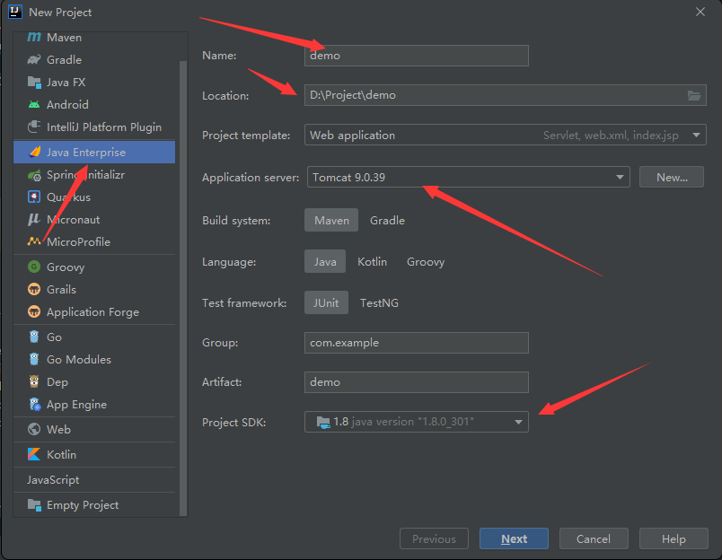
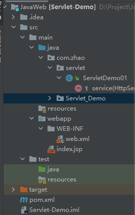
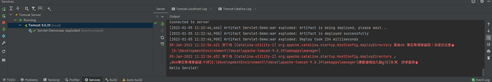
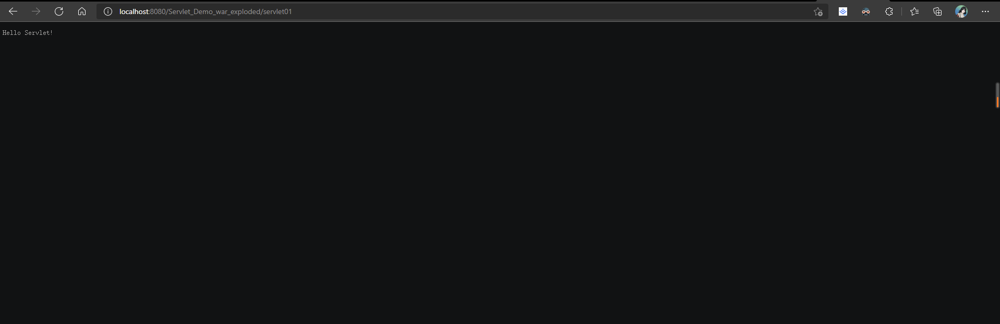
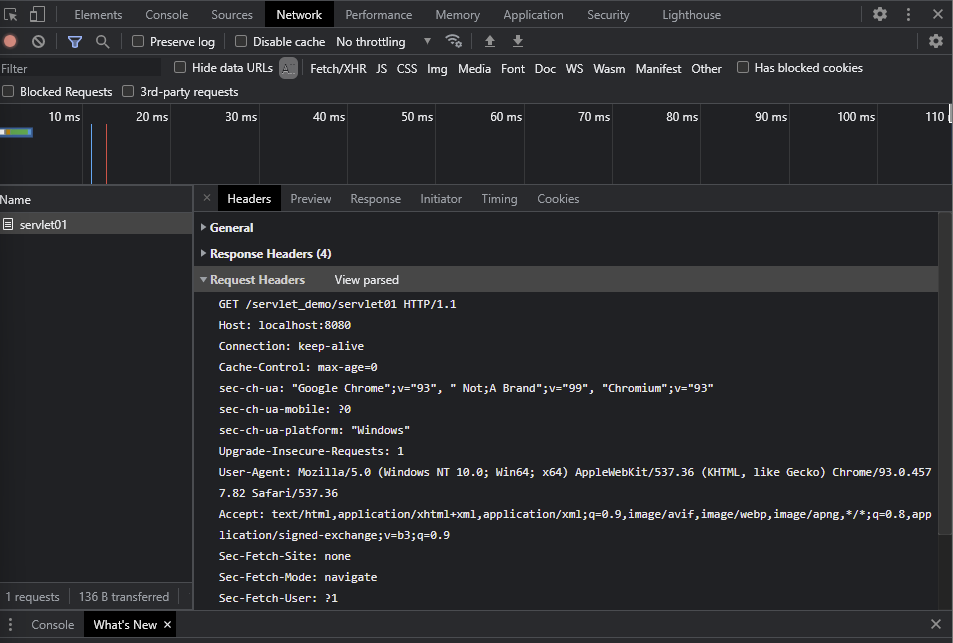

## 1. 创建一个简单的 Servlet 项目

### 1.1 第一步：创建javaee项目




### 1.2 第二步：新建包和类

我们新建一个包（我的叫 servlet）并在包下新建一个类（我的叫 ServeltDemo01）：




### 1.3 第三步：实现 HttpServlet 类

```java
package com.zhao.servlet;

import javax.servlet.http.HttpServlet;

/**
 * @author zhaolimin
 * @date 2022/1/5
 * @apiNote 实现servlet
 */
public class ServletDemo01 extends HttpServlet {

}

```


### 1.4 第四步：重写 service 方法

```java
package com.zhao.servlet;

import javax.servlet.ServletException;
import javax.servlet.http.HttpServlet;
import javax.servlet.http.HttpServletRequest;
import javax.servlet.http.HttpServletResponse;
import java.io.IOException;

/**
 * @author zhaolimin
 * @date 2022/1/5
 * @apiNote 实现servlet
 */
public class ServletDemo01 extends HttpServlet {

    // 重写 HttpServlet 中的 service 方法。
    // 这个 service 方法是专门用来做请求处理的操作的，业务代码写在这里面就好。
    @Override
    protected void service(HttpServletRequest req, HttpServletResponse resp)
            throws ServletException, IOException {
        // 打印到控制台
        System.out.println("Hello Servlet!");
        // 通过流输出数据到浏览器
        resp.getWriter().write("Hello Servlet!");
    }
}
```


### 1.5 第五步：添加 @WebServlet 注解映射地址

```java
package com.zhao.servlet;

import javax.servlet.ServletException;
import javax.servlet.annotation.WebServlet;
import javax.servlet.http.HttpServlet;
import javax.servlet.http.HttpServletRequest;
import javax.servlet.http.HttpServletResponse;
import java.io.IOException;

/**
 * @author zhaolimin
 * @date 2022/1/5
 * @apiNote 实现servlet
 */
@WebServlet("/servlet01")
public class ServletDemo01 extends HttpServlet {

    // 重写 HttpServlet 中的 service 方法。
    // 这个 service 方法是专门用来做请求处理的操作的，业务代码写在这里面就好。
    @Override
    protected void service(HttpServletRequest req, HttpServletResponse resp)
            throws ServletException, IOException {
        // 打印到控制台
        System.out.println("Hello Servlet!");
        // 通过流输出数据到浏览器
        resp.getWriter().write("Hello Servlet!");
    }
}
```


### 1.6 第六步：启动 tomcat 并访问路径，查看结果

- **控制台输出信息**



- **网页显示信息**




## 2. @WebServlet 注解

### 2.1 源码

```java
/*
 * DO NOT ALTER OR REMOVE COPYRIGHT NOTICES OR THIS HEADER.
 *
 * Copyright (c) 2017-2017 Oracle and/or its affiliates. All rights reserved.
 *
 * The contents of this file are subject to the terms of either the GNU
 * General Public License Version 2 only ("GPL") or the Common Development
 * and Distribution License("CDDL") (collectively, the "License").  You
 * may not use this file except in compliance with the License.  You can
 * obtain a copy of the License at
 * https://oss.oracle.com/licenses/CDDL+GPL-1.1
 * or LICENSE.txt.  See the License for the specific
 * language governing permissions and limitations under the License.
 *
 * When distributing the software, include this License Header Notice in each
 * file and include the License file at LICENSE.txt.
 *
 * GPL Classpath Exception:
 * Oracle designates this particular file as subject to the "Classpath"
 * exception as provided by Oracle in the GPL Version 2 section of the License
 * file that accompanied this code.
 *
 * Modifications:
 * If applicable, add the following below the License Header, with the fields
 * enclosed by brackets [] replaced by your own identifying information:
 * "Portions Copyright [year] [name of copyright owner]"
 *
 * Contributor(s):
 * If you wish your version of this file to be governed by only the CDDL or
 * only the GPL Version 2, indicate your decision by adding "[Contributor]
 * elects to include this software in this distribution under the [CDDL or GPL
 * Version 2] license."  If you don't indicate a single choice of license, a
 * recipient has the option to distribute your version of this file under
 * either the CDDL, the GPL Version 2 or to extend the choice of license to
 * its licensees as provided above.  However, if you add GPL Version 2 code
 * and therefore, elected the GPL Version 2 license, then the option applies
 * only if the new code is made subject to such option by the copyright
 * holder.
 */

package javax.servlet.annotation;

import java.lang.annotation.ElementType;
import java.lang.annotation.Target;
import java.lang.annotation.RetentionPolicy;
import java.lang.annotation.Retention;
import java.lang.annotation.Documented;

/**
 * Annotation used to declare a servlet.
 *
 * <p>This annotation is processed by the container at deployment time,
 * and the corresponding servlet made available at the specified URL
 * patterns.
 * 
 * @see javax.servlet.Servlet
 *
 * @since Servlet 3.0
 */
@Target({ElementType.TYPE})
@Retention(RetentionPolicy.RUNTIME)
@Documented
public @interface WebServlet {
    
    String name() default "";
    
    /**
     * The URL patterns of the servlet
     * 访问的 URL 路径，对应我们上面的那个
     * @WebServlet(value = "/servlet01")
     * 过滤器会拦截该路径
     * @return the URL patterns of the servlet
     */
    String[] value() default {};

    /**
     * The URL patterns of the servlet
     * 也是 URL 访问路径，
     * 但是过滤器不会拦截该路径
     * @return the URL patterns of the servlet
     */
    String[] urlPatterns() default {};
    
    /**
	 * 是否会自动启动
     */
    int loadOnStartup() default -1;
    
    /**
     * The init parameters of the servlet
     * WebInitParam的初始化参数
     * @return the init parameters of the servlet
     */
    WebInitParam [] initParams() default {};
    
    /**
     * Declares whether the servlet supports asynchronous operation mode.
     * 提供异步支持吗？
     * @return {@code true} if the servlet supports asynchronous operation mode
     * @see javax.servlet.ServletRequest#startAsync
     * @see javax.servlet.ServletRequest#startAsync(ServletRequest,
     * ServletResponse)
     */
    boolean asyncSupported() default false;
   
    String smallIcon() default "";

    String largeIcon() default "";

    String description() default "";

    String displayName() default "";
}

```


### 2.2 基本使用

```java
// name只是起到区分作用，区分这个注解对应的是哪个路径
@WebServlet(name = "name1", value = "/servlet01")   
@WebServlet(name = "name1", urlPartterns` = "/servlet01") 
```

我们看到了 **`value`** 和 **`urlPartterns`** 是 **`String[]`**  类型，所以可以有多个路径参数：

```java
// name只是起到区分作用，区分这个注解对应的是哪个路径
@WebServlet(name = "name1", value = {"/servlet01", "/servlet02", "/servlet03"})   
@WebServlet(name = "name1", urlPartterns` = {"/servlet01", "/servlet02", "/servlet03"})   
```


## 3. Servlet 的工作流程

我们先来理解一下这个路径:

```
http://localhost:8080/servlet_demo/servlet01?name=noblegasesgoo
```

解释下来的意思就是：在本地的 8080 端口下的 **tomcat** 服务器容器（**tomcat** 默认8080端口）中的名叫 **`servlet_demo`** 的服务中的 **`servlet01`** 资源，对应的 **`servlet01`** 资源的满足 **`name=noblegasesgoo`** 过滤条件的资源。

我们来分析 **`http://localhost:8080/servlet_demo/servlet01`** 这个 url：




1. 首先会根据**请求头**找到对应主机上的进程（图中请求头中的第一个键值对 **`host`**）。
2. 再通过**请求行**来获取你当前要访问的是哪一个应用（图中对应 **`servlet01`** 这个资源）以及具体的在 **h~ost** 这台主机上的 **`url`** 地址。
3. 找到这个资源之后，第一次访问的话，服务器就会创建一个对应的 **`servlet`**，如果是第二次访问的话，就是调用。
4. 然后开始调用 **`service`** 方法，此时 **`HttpRequest`** 和 **`HttpResponse`** 对象就会被生成。
5. 通过以上两个对象来处理请求。
6. 通过 **`Request`** 获取请求参数，通过 **`Response`** 输出你要响应的内容。


## 4. Servlet 其它的实现方式

### 4.1 继承 GenericServlet 类：

```java
package com.zhao.servlet;

import javax.servlet.GenericServlet;
import javax.servlet.ServletException;
import javax.servlet.ServletRequest;
import javax.servlet.ServletResponse;
import javax.servlet.annotation.WebServlet;
import java.io.IOException;

/**
 * @author zhaolimin
 * @date 2022/1/5
 * @apiNote servlet 的其它实现
 */

@WebServlet("/servlet02")
public class ServletDemo02 extends GenericServlet {

    @Override
    public void service(ServletRequest req, ServletResponse res) throws ServletException, IOException {
        System.out.println("extends generic servlet");
        res.getWriter().write("extends generic servlet");
    }
}
```


### 4.2 实现 Servlet 接口

```java
package com.zhao.servlet;

import javax.servlet.*;
import javax.servlet.annotation.WebServlet;
import java.io.IOException;

/**
 * @author zhaolimin
 * @date 2022/1/5
 * @apiNote servlet 的其它实现方式
 */

@WebServlet("/servlet03")
public class ServletDemo03 implements Servlet {
    @Override
    public void init(ServletConfig config) throws ServletException {

    }

    @Override
    public ServletConfig getServletConfig() {
        return null;
    }

    @Override
    public void service(ServletRequest req, ServletResponse res) throws ServletException, IOException {
        System.out.println("implements servlet interface");

        res.getWriter().write("implements servlet interface");
    }

    @Override
    public String getServletInfo() {
        return null;
    }

    @Override
    public void destroy() {

    }
}
```


### 4.3 重写 doGet / doPost 请求

具体请求内容就看你怎么定义了。
