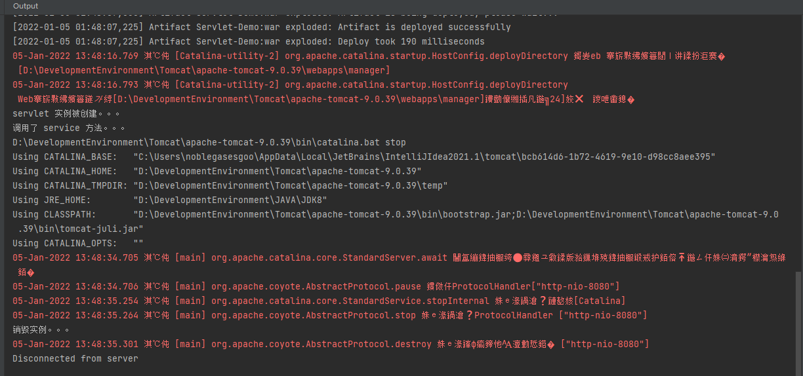

## 1. Servlet 的生命周期

**servlet** 没有 **`main()`** 方法，所以不能独立运行，它的运行时完全由 **servlet** 引擎来控制和调度的。

所谓的 **servlet** 的生命周期，就是 **servlet** 容器什么时候创建 **servlet** 实例？什么时候调用其方法处理请求？什么时候销毁这个实例的整个过程。

- 实例和初始化时机

  当请求到达容器之后，容器查找该 servlet 对象是否存在，不存在的话就会创建实例并且初始化。

- 就绪/调用/服务阶段

  有请求到达容器的时候，容器调用 **servlet** 对象的 **`service()`** 方法来处理请求，处理请求的方法在整个生命周期中可以被多次调用。

  **HttpServlet** 的 **`service()`** 方法会根据不同的请求方式来调用对应请求的 **`doGet()`** 或者 **`doPost()`** 方法，但是这俩方法默认情况下会抛出异常，所以需要子类去重写。

- 销毁

  当容器关闭时（也就是说应用程序停止的时候），会将程序中的 **Servlet** 实例进行销毁。

上面的这个生命周期过程可以通过 **Servlet** 中的生命周期方法来观察，**在** Servlet 中有三个生命周期有关的方法，**不由用户手动调用，而是在特定时机有容器自动调用**，观察这三个方法，就可以观察到 **Servlet** 的生命周期。

总结下来就是这么一个过程：**`servlet类加载 --> 实例化 --> 提供服务 --> 销毁`**

```java
package com.zhao.servlet;

import javax.servlet.*;
import javax.servlet.annotation.WebServlet;
import javax.servlet.http.HttpServlet;
import javax.servlet.http.HttpServletRequest;
import javax.servlet.http.HttpServletResponse;
import java.io.IOException;

/**
 * @author zhaolimin
 * @date 2022/1/5
 * @apiNote servlet 的其它实现方式
 */

@WebServlet("/servlet03")
public class ServletDemo03 extends HttpServlet {
    @Override
    public void init(ServletConfig config) throws ServletException {
        System.out.println("servlet 实例被创建。。。");
    }

    @Override
    protected void service(HttpServletRequest req, HttpServletResponse resp) throws ServletException, IOException {
        System.out.println("调用了 service 方法。。。");
    }

    @Override
    public void destroy() {
        System.out.println("销毁实例。。。");
    }
}
```

### 1.1 init 方法

在 **servlet** 实例创建之后执行（证明该 Servlet 创建了一个实例），只会被调用一次。

```java
@Override
public void init(ServletConfig config) throws ServletException {
    System.out.println("servlet 实例被创建。。。");
}
```


### 1.2 service 方法

每次有请求到达某个 **servlet** 方法时会执行该方法，用来处理请求（证明该 **servlet** 实例进行服务的提供了），可以重复调用。

```java
@Override
protected void service(HttpServletRequest req, HttpServletResponse resp) throws ServletException, IOException {
    System.out.println("调用了 service 方法。。。");
}
```


### 1.3 destory 方法

**servlet** 实例在销毁时执行（证明这个 servlet 实例被销毁），只会被调用一次。

```java
@Override
public void destroy() {
    System.out.println("销毁实例。。。");
}
```


### 1.4 证明



上图中我启动了 **tomcat** 容器访问了 **`http://localhost:8080/servlet_demo/servlet03`** 路径，我们可以看到 **`init`** 方法中的内容率先出现，然后调用了 **`service`** 方法， 在之后我关闭 **tomcat** 容器之后 **`destory`** 方法被调用。


## 2. Service 方法

### 2.1 Service 方法源码

```java
/**
 * Receives standard HTTP requests from the public
 * <code>service</code> method and dispatches
 * them to the <code>do</code><i>XXX</i> methods defined in 
 * this class. This method is an HTTP-specific version of the 
 * {@link javax.servlet.Servlet#service} method. There's no
 * need to override this method.
 * 接收来自公共服务方法的标准 HTTP 请求，并将它们分派给此类中定义的 doXXX 方法。
 * 此方法是 Servlet.service 方法的 HTTP 特定版本。
 * @param req   the {@link HttpServletRequest} object that
 *                  contains the request the client made of
 *                  the servlet
 * req – 包含客户端对 servlet 发出的请求的 HttpServletRequest 对象
 *
 * @param resp  the {@link HttpServletResponse} object that
 *                  contains the response the servlet returns
 *                  to the client                                
 * 包含 servlet 返回给客户端的响应的 HttpServletResponse
 * @throws IOException   if an input or output error occurs
 *                              while the servlet is handling the
 *                              HTTP request
 *
 * @throws ServletException  if the HTTP request
 *                                  cannot be handled
 * 
 * @see javax.servlet.Servlet#service
 */
protected void service(HttpServletRequest req, HttpServletResponse resp)
    throws ServletException, IOException
{
    // 先判断请求的方式？get？post？还是其它
    String method = req.getMethod();
    // 根据请求方式调用对应的请求处理方法 
    if (method.equals(METHOD_GET)) {
        long lastModified = getLastModified(req);
        if (lastModified == -1) {
            // servlet doesn't support if-modified-since, no reason
            // to go through further expensive logic
            /*
                如果getLastModified方法的返回值是一个负数的话，不管客户端的请求信息如何，
                service方法都会调用doGet方法生成响应信息返回给客户端。
            */
            doGet(req, resp);
        } else {
            long ifModifiedSince = req.getDateHeader(HEADER_IFMODSINCE);
            if (ifModifiedSince < lastModified) {
                // If the servlet mod time is later, call doGet()
                // Round down to the nearest second for a proper compare
                // A ifModifiedSince of -1 will always be less
                /*
                    如果getLastModified方法的返回值是一个正数，并且客户端的请求消息中没有包含If-Modified-Since头字段的
                    (这种情况是第一次访问该页面时)或者是请求消息中包含If-Modified-Since头字段，但是返回值比If-Modified-Since
                    头字段指定的时间新的话，则service方法调用doGet方法生成响应信息和Last-Modified消息头返回给客户端。
                */
                maybeSetLastModified(resp, lastModified);
                doGet(req, resp);
            } else {
                resp.setStatus(HttpServletResponse.SC_NOT_MODIFIED);
            }
        }

    } else if (method.equals(METHOD_HEAD)) {
        long lastModified = getLastModified(req);
        maybeSetLastModified(resp, lastModified);
        doHead(req, resp);

    } else if (method.equals(METHOD_POST)) {
        doPost(req, resp);
        
    } else if (method.equals(METHOD_PUT)) {
        doPut(req, resp);
        
    } else if (method.equals(METHOD_DELETE)) {
        doDelete(req, resp);
        
    } else if (method.equals(METHOD_OPTIONS)) {
        doOptions(req,resp);
        
    } else if (method.equals(METHOD_TRACE)) {
        doTrace(req,resp);
        
    } else {
        //
        // Note that this means NO servlet supports whatever
        // method was requested, anywhere on this server.
        //

        String errMsg = lStrings.getString("http.method_not_implemented");
        Object[] errArgs = new Object[1];
        errArgs[0] = method;
        errMsg = MessageFormat.format(errMsg, errArgs);
        
        resp.sendError(HttpServletResponse.SC_NOT_IMPLEMENTED, errMsg);
    }
}
```


### 2.2 getLastModified 方法说明

在 **http** 协议中，浏览器对访问过的页面缓存后，在之后再次访问该页面时，将会根据 **`LastModified`** 头字段指定的时间值生成 **`If-Modified-Since`** 头字段，**作为缓存页面的最新更新时间**。

如果网页的**最后修改时间**早于 **`If-Modified-Since`** 头字段指定的时间的话，**web**服务器就会请求的页面

如果从 **If-modified-Since** 指定的时间以来，网页内容没有被修改的话，服务器就会返回一个304响应头，一次告诉浏览器继续使用已缓存的页面。

由于**动态网页程序中，网页内容随时在变化**，因此**我们要保证在每次的访问请求中都要返回最新的内容**。好比电商网站卖商品，每卖出一件，返回给数据的网页当中显示产品的数量就要少一件，这时我们就需要返回最新的网页内容。

**注意：HttpServlet类中的getLastModified方法的返回值是一个负数。**

```java
protected long getLastModified(HttpServletRequest req) {
    return -1;
}
```


