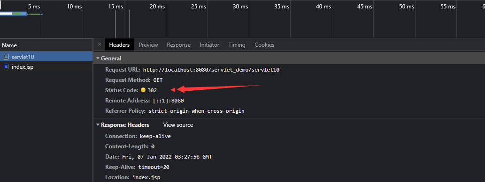

## 1. 介绍

**Web** 服务器收到客户端的 **http** 请求，会针对每一次请求，分别创建一个用于代表请求的 **request** 对象和代表响应的 **response** 对象。

**request** 对象是获取客户端的数据，**response** 是向客户端发送数据。

**HttpServletResponse** 的主要功能就是用于服务器对客户端的请求进行响应，将 **Web** 服务器处理后的结果返回给客户端。**`service`** 方法中形参接收的是 **HttpServletResponse** 接口的实例化对象，这个对象中封装了向客户端发送的数据、发送响应头、发送响应状态码的方法。

## 2. 响应数据

接收到客户端请求后，可以通过 **HttpServletResponse** 类的对象直接进行响应，响应时需要获取输出流。

```java
resp.getWriter(); // 获取字符流（只能响应回字符串）
resp.getOutputStream(); // 获取字节流（可以响应一切数据）
```

**注意以上两种响应数据的方法不能同时使用。**


### 2.1 示例一

```java
@WebServlet("/servlet10")
public class ServletDemo10 extends HttpServlet {
    @Override
    protected void service(HttpServletRequest req, HttpServletResponse resp) throws ServletException, IOException {

        // 获取字符流的形式
        resp.getWriter().write("Hello Response!");
    }
}
```


### 2.2 示例二

```java
@WebServlet("/servlet10")
public class ServletDemo10 extends HttpServlet {
    @Override
    protected void service(HttpServletRequest req, HttpServletResponse resp) throws ServletException, IOException {

        // 获取字节流的形式
        resp.getOutputStream().write("Hello Response!".getBytes(StandardCharsets.UTF_8));
    }
}
```


## 3. 响应乱码问题

在响应中，我们如果响应的内容中有中文，则有可能出现乱码，这是因为服务器响应的数据也会经过网络传输，服务器端和客户端的编码方式如果不同的话，就会出现乱码的情况。


### 3.1 getWriter 的字符乱码

对于 **`getWriter`** 方法获取到的字符流，**响应中文必定会出现乱码**，因为服务端在进行编码的时候会默认使用 **ISO-8859-1** 格式的编码，该编码方式并不支持中文。

要解决它的乱码问题，就得在服务器端告知服务器使用一种能够支持中文的编码格式。

```java
@WebServlet("/servlet10")
public class ServletDemo10 extends HttpServlet {
    @Override
    protected void service(HttpServletRequest req, HttpServletResponse resp) throws ServletException, IOException {
		
        // 同时设置客户端和服务端的编码格式（也行）
        // resp.setContentType("text/html;charset=UTF-8");
        // 首先解决响应数据的编码格式
        resp.setCharacterEncoding("UTF-8");
        // 再告知客户端用什么方式解码
        resp.setHeader("content-type", "text/html;charset=UTF-8");
        // 响应中文信息
        resp.getWriter().write("你好！王璐！");
    }
}
```


### 3.2 getOutputStream 的字符乱码

对于该方法获取到的字节流，响应中文时，由于本身就是传输的字节，所以此时可能出现乱码，也可能正确显示。当服务器端给的字节恰好和客户端使用的编码方式一样的时候，文本显示就会正确，否则会出现乱码，无论如何我们都应该准确的掌握两端的编码方式，来确保数据正确的传输。

```java
@WebServlet("/servlet10")
public class ServletDemo10 extends HttpServlet {
    @Override
    protected void service(HttpServletRequest req, HttpServletResponse resp) throws ServletException, IOException {

        // 获取字节流的形式
        // 同时设置两端
        resp.setContentType("text/html;charset=UTF-8");
        resp.getOutputStream().write("你好！王璐!".getBytes(StandardCharsets.UTF_8));
    }
}
```


## 4. 重定向

### 4.1 介绍

重定向是一种服务器指导，客户端的行为。客户端发出第一个请求，被服务器接收处理后，服务器会进行响应，与此同时服务器会给客户端一个新的地址（下次请求的地址 **`resp.sendRedirect(url)`**），当客户端接收到响应后会马上自动根据服务器给的新地址发起第二个请求，服务器接收请求并作出响应。

总结：两个请求，客户端行为。

```java
@WebServlet("/servlet10")
public class ServletDemo10 extends HttpServlet {
    @Override
    protected void service(HttpServletRequest req, HttpServletResponse resp) throws ServletException, IOException {
        
        resp.sendRedirect("index.jsp");
    }
}
```



通过观察浏览器我们发现第一次请求的状态码为 **302**，并且包含 **location** 头信息，外加地址栏变化，所以进行了重定向，重定向的目的就是 **location** 中的信息。


### 4.2 重定向和请求转发的区别


|          请求转发           |            重定向             |
| :-------------------------: | :---------------------------: |
|         服务端行为          |          客户端行为           |
| 一次请求，数据 request 共享 | 两次请求，数据 reuqest 不共享 |
|        地址栏不变化         |          地址栏变化           |
|    绝对地址定位到站点后     |   绝对地址写到 http:// 即可   |

