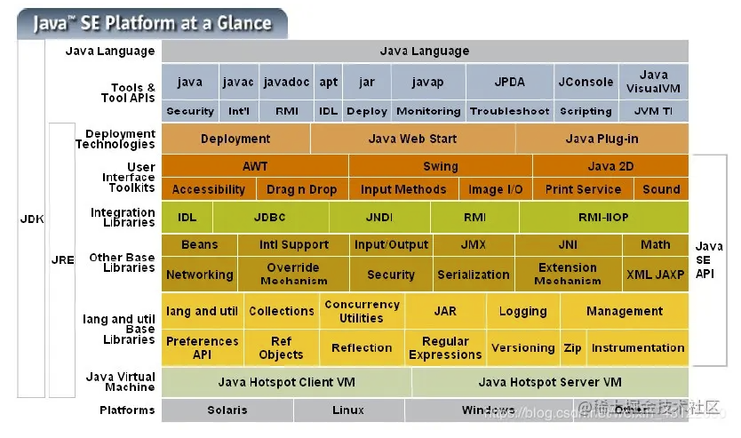

# JVM、JRE、JDK都是什么？

- JVM：java虚拟机，它是java跨平台运行的关键存在，不同的平台有不同的虚拟机。
- JRE：它是 java 的运行时环境，包括了 JVM 和 java 程序所需的核心类库等，核心类库主要是 java.lang包（包含了运行Java程序必不可少的系统类）。
- JDK：JRE + JVM + 开发工具包，比如编译工具（javac），打包工具（jar）等。

# java 的跨平台性是啥？原理又是啥？

- **跨平台性就是：**一次编译，多处运行。
- **原理就是：**不同的系统有不同的 JVM，java 程序是跑在 JVM 之上的，只要那个平台有 JVM ，java 程序就可以运行。

# 什么是java字节码？采用字节码的最大好处是什么

- **字节码：**Java源代码经过编译之后产生的后缀为 .class 的文件，它不面向任何特定的处理器，只面向 JVM。
- **好处：** Java语言通过字节码的方式一定程度上解决了传统解释型语言执行效率低的问题，同时又保留了解释型语言可移植的特点。而且字节码只针对 JVM 所以可以在有 JVM 的机器上运行。

# Java 和 cpp 的区别？

- 前者不能多重继承，后者可以。
- 前者不能直接使用内存指针（更安全），后者可以。
- 前者有完善的自动内存管理机制，后者没有。
- 前者一次编译到处运行（前提是有虚拟机），后者不行。
- 前者运算符不可以重载，后者可以。
- 前者运行速度没有后者快。
- 前者纯面向对象，后者带点面向过程（全局变量、全局函数）。

# Java有哪些数据类型？

Java语言是强类型语言，对于每一种数据都定义了明确的具体的数据类型，在内存中分配了不同大小的内存空间。

- 基本数据类型：
  - **boolean**：《Java[虚拟机](https://so.csdn.net/so/search?q=虚拟机&spm=1001.2101.3001.7020)规范》一书中的描述：“虽然定义了 boolean 这种数据类型，但是只对它提供了非常有限的支持。在 Java 虚拟机中没有任何供 boolean 值专用的字节码指令，Java 语言表达式所操作的 boolean 值，在编译之后都使用 Java 虚拟机中的 int 数据类型来代替，而 boolean 数组将会被编码成 Java虚拟机 的 byte数组，每个元素 boolean 元素占8位”。这样我们可以得出 boolean 类型占了单独使用是4个字节，在数组中又是1个字节。
  - **byte**：一个字节
  - **char**：两个字节
  - **short**：两个字节
  - **int**：四个字节
  - **long**：八个字节
  - **float**：四个字节
  - **double**：八个字节
- 引用数据类型：
  - 类
  - 接口
  - 数组

# switch中的条件是否能是 byte、long、String 呢？

- JAVA5 之前，switch条件只能是 byte、short、char、int。在 JAVA5 发布之后，JAVA 中引入了枚举类型，switch条件增加了对枚举类型的支持。
- JAVA7 开始，还支持 String 类型，但是 long 目前为止都不支持。

# Math.round(9.5) 等于多少？Math.round(-9.5)等于多少？

该函数的原理就是参数+0.5再向下取整，所以第一个 **`9+0.5 = 10 向下取整 = 10`**

第二个是 **`-9.5 + 0.5 = -9 向下取整 = -9`**

# float f = 3.3 是否是正确的？

肯定不正确 3.3 在没有任何标记的情况下是默认为双精度浮点型（double），在 JAVA 中你要使用 float 类型浮点数的话得在数字后加上 f或F，或者向下转型。

将双精度型（double）赋值给浮点型（float）属于下转型（down-casting，也称为窄化）会造成精度损失，因此需要强制类型转换 **`float f =(float)3.4；`**，或者 **`float f =3.4F；`**。

# short s1 = 1; s1 = s1 + 1;有错吗?short s1 = 1; s1 += 1;有错吗？

- 对于前者来说，**`s1 = s1 + 1`** 由于 1 是 int 类型，所以整个运算结果是 int 类型，我们得进行类型转换才可重新赋值：**`s1 = (short) s1 + 1;`**

- 对于后者来说，是正确的，因为这个 +=运算符 就为 **`s1 =(short) s1 + 1;`** 内含类型转换。

# 访问修饰符的区别？

- **private**：在同一类内可见，不能修饰类。
- **default**：在同一个包内可见，不适用任何修饰符，可修饰类。
- **protected**：在同一个包内的累和所有子类都可见（子类可能不在同一个包中）。
- **public**：对所有类可见。

|  修饰符   | 当前类 | 同包 | 子类（包含别的包下的子类） | 其它包 |
| :-------: | :----: | :--: | :------------------------: | :----: |
|  private  |   ✔    |  ❌   |             ❌              |   ❌    |
|  default  |   ✔    |  ✔   |             ❌              |   ❌    |
| protected |   ✔    |  ✔   |             ✔              |   ❌    |
|  public   |   ✔    |  ✔   |             ✔              |   ✔    |

# final 有什么用？

- 被 final 修饰的类不可以被继承。
- 被 final 修饰的方法不可以被重写。
- 被 final 修饰的基本数据类型变量不可以被改变。
- 被 final 修饰的引用变量不可变，但是引用地址中的内容可以变。

# final、finally、finalize他们三的区别？

- **final** 是一个关键字，可以修饰类、变量、方法，修饰类表示该类不能被继承、修饰方法表示该方法不能被重写、修饰变量表示该变量是一个常量不能被重新赋值。

- **finally** 一般作用在 try-catch 代码块中，在处理异常的时候，通常我们将一定要执行的代码方法 finally 代码块 中，表示不管是否出现异常，该代码块都会执行，一般用来存放一些关闭资源的代码。
- **finalize** 是一个方法，属于 Object 类的一个方法，而 Object 类是所有类的父类，该方法一般由垃圾回收器来调用，当我们调用System.gc() 方法的时候，由垃圾回收器调用finalize() 来回收垃圾，**通常该方法是对一个对象是否可回收的最后判断**。

# 介绍一下 static 关键字？

- 该关键字存在的主要意义是在于创建独立于具体对象的域变量或者方法。怎么来理解这句话呢，就是可以直接通过类来调用，而不需要创建具体对象。
- 通常静态代码块只在项目启动时初始化，这样可以优化程序的性能。
- 为什么说静态代码块块可以用来优化程序性能，是因为它的特性:只会在类加载的时候执行一次。因此，很多时候会将一些只需要进行一次的初始化操作都放在static代码块中进行。
- 它可以修饰成员方法：
  - 该方法被称为静态方法，不需要具体对象，可以直接通过类名调用。
  - 虽然在静态方法中不能访问非静态成员方法和非静态成员变量，但是在非静态成员方法中是可以访问静态成员方法/变量的。
- 修饰成员变量：
  - 静态变量，静态变量被所有对象共享，在内存中只有一个副本，它当且仅当在类初次加载时会被初始化，只能在静态方法中使用，静态变量存在方法区。
- 修饰代码块：
  - 静态代码块，static关键字还有一个比较重要的作用就是来形成以优化程序性能。因为类被加载的时候就加载一次。

# 静态变量和实例变量的区别？

- **静态变量**：它只被初始化一次，并且它不属于任何一个对象，它是属于类的，所以他只用被分配一次空间就行。
- **实例变量**：是属于实例对象的，每次创建对象，虚拟机都会分配空间来存储实例对象以及其实例变量。

# 说一下面向对象的三大特性吧！

继承、封装、多态、抽象。

## 继承

使用已经存在的类作为基础，建立新的类的过程，子类拥有父类所有非 private 的方法和属性，同时还可以有自己的属性和方法，也就是子类可以是父类的拓展，子类可以通过重写来以自己的方式实现父类的方法。

## 封装

把一个对象的属性私有化，提供一个对外接口，首先，这样做的好处就是，调用接口的人，不用去了解调用过程中的具体代码实现逻辑，只用调用对应类提供的接口，就可以使用，首先可以保证类的安全性，其次可以通过封装来解耦别的业务实现过程，get/set方法。

## 多态

父类或者接口定义的引用变量可以指向子类或者具体的实现类的实例对象，通常只有两种方式可以实现多态，那就是继承重写，或者实现接口。同一个行为具有多个不同表现形式或形态的能力。

# 那么什么是多态呢？Java又是怎么实现多态的呢？

## 所谓多态

就是指程序中定义的引用变量所指向的具体类型和通过该变量发出的方法调用在编程时并不确定，而是在我们程序运行时才决定。因为程序在运行的时候才会确定具体的类，这样，不用修改源程序代码就可以让我们的引用变量绑定到我们的不同实现上，从而导致该引用调用的具体方法随之改变。

也即不修改程序代码就可以改变程序运行时所绑定的具体代码，同一个行为具有多个不同表现形式或形态的能力。

## 多态的实现

分为运行时多态和编译时多态。

- 编译时多态多指我们的方法重载，编译时能够确定执行重载方法中的哪一个。
- 运行时多态多指我们的方法重写，运行时决定。

多态实现的条件一般有三个：

1. 继承：在多态中必须存在继承关系。
2. 重写：子类必须对父类中的某些方法重新定义。
3. 向上转型：在多态时需要将子类的引用赋值给父类的对象。

# 抽象类和接口有什么不同？

|    参数    |                            抽象类                            |                             接口                             |
| :--------: | :----------------------------------------------------------: | :----------------------------------------------------------: |
| 声明关键字 |                           abstract                           |                          interface                           |
|    实现    | 子类通过 extends 继承来继承抽象类。而且如果子类不是抽象类的话，需要重写抽象类中的所有抽象方法。 | 子类通过 implements 关键字来实现接口，并且需要实现接口中的所有方法（JDK8之前）。 |
| 访问修饰符 |                   全部类型的修饰符都可以用                   |                        只能为 public                         |
|  多重继承  |                     一个类只能继承一个类                     |                    一个类可以实现多个接口                    |
|  变量定义  |           可以定义变量，而且是任何修饰符修饰的变量           |      不可以定义变量，但是可以定义静态常量 static final       |
|  构造函数  |                        可以有构造函数                        |                         没有构造函数                         |

- JDK8之后，接口支持定义默认方法（也就是说，如果子类不重写就默认按照它的逻辑来执行该方法）。
- 并且这俩玩意都不能实例化。

我们在选取上一般行为模型都用接口来定义，因为一个类只能继承一个类，但是可以实现多个接口，在模板方法模式中我们的抽象类使用得较多。

# 抽象类能被 final 修饰吗？

不能，final 修饰的类不能被继承，这样的话抽象类就没有存在的意义了。

# 匿名内部类和局部内部类访问局部变量时为什么该变量要加上 final 关键字？

因为**他们的生命周期不一样**。

局部变量存储在栈中，当方法执行结束后，我们的局部变量就被抛弃，但是如果此时我们的内部类还没被抛弃并且还在有着这个局部变量的引用，那么程序就会出错。

所以我们加上 final，就可以确保内部类使用的变量与外部使用的变量分开。

# 两个对象的 hashCode() 相同，则 equals() 也一定为 true，对吗？

肯定是不对的，因为哈希值只是通过特定的方法不断的生成相对随机的不重复的值，如果真的有一种哈希算法能够达到百分百不重复，那么这个世界上就不存在哈希冲突了，所以正是因为没有这种哈希随机算法，所以会出现哈希冲突的问题，所以 equals() 对象在发生哈希冲突的情况下不一定为 true。

# 你重写过 hashcode 和 equals 么，为什么重写equals时必须重写hashCode方法？

就拿我们最经常用的 **hashmap** 来举例子吧，我们的一个键值对如何存入 **hashmap**，主要就是靠它的键值对，键一般都是各种对象的哈希值，那么如果此时我重写了一个 **equals** 方法而没重写 **hashcode**方法，会发生什么问题呢？可能在插入阶段，我可能执行两次 **`map.put("1","1");`**,此时重写了 **equals** 方法我们的值是相同的没问题，但是，我们由于没有重写 **hashcode** 方法，就可能两次的 **key** 的哈希值不同，但是我执行的 put 指令是相同的，会导致在 **hashmap** 中存在两个键值完全一样的数据，这不符合哈希的标准，所以必须两个绑定重写。

