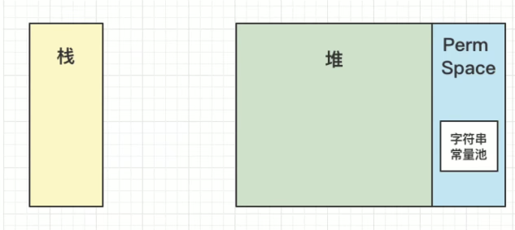
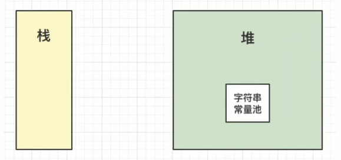
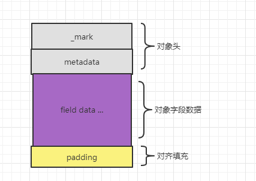
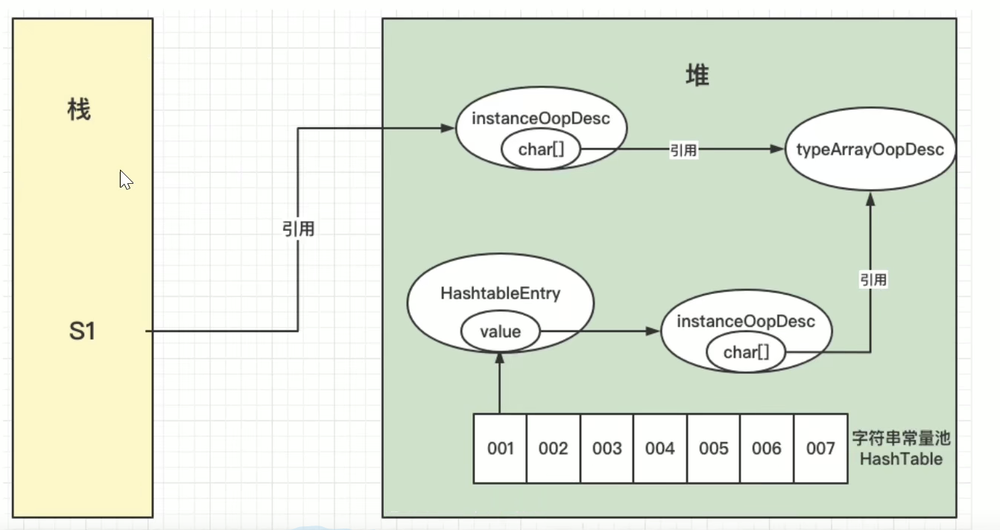
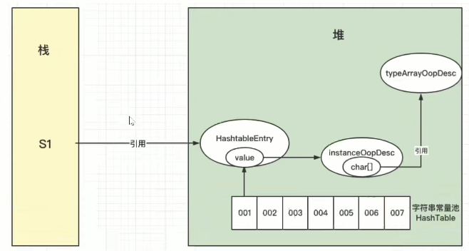
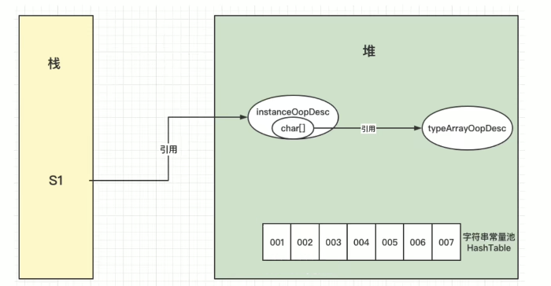
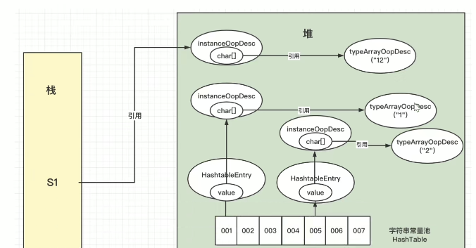
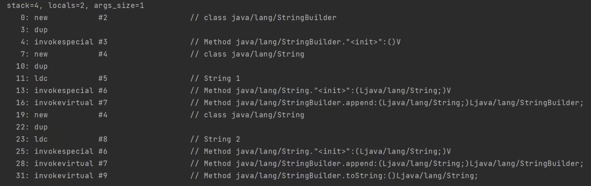
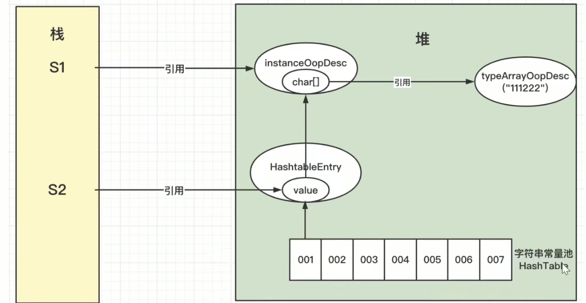
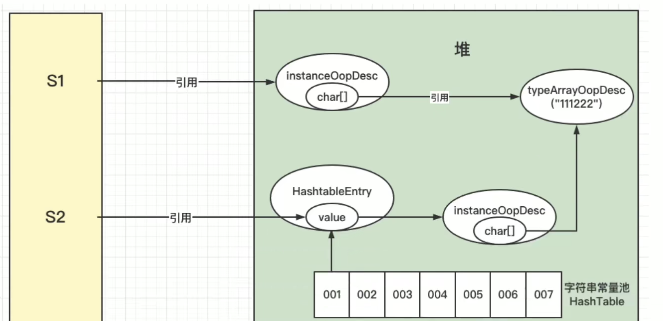

# 字符串常量和字符型常量的区别都有啥？

- 形式上：字符常量是单引号，字符串常量是双引号。
- 含义上：字符常量相当于一个整形（ASCII值），可以参与基本运算符运算，字符串常量不行，他相当于一个地址引用。
- 占用内存大小：字符常量只占1个字节，字符串至少占一个字节结束标志。

# 什么是字符串以及字符串常量池？

字符串常量池位于我们的堆内存中，专门用来存储字符串常量，可以提高内存的使用率，避免开辟多块空间存储相同的字符串，在创建字符串的时候 JVM 首先会去检查常量池，如果该字符串已经存在，那么返回它的引用，不存在就实例化一个字符串放入池中并返回引用。

我们经常去用 String，所以 JVM 对其进行了一个优化，在内存里面开辟了一个空间专门堆放字符串常量，这个空间就叫做字符串常量池。

JDK 1.6 的时候，字符串常量池是放在永久代里面的：



JDK 1.6 之后，字符串常量池被移入到了堆内存中：



# 为什么要将字符串常量池移入堆内存？

主要是为了方便 GC，永久代发生GC的频率不高，而且空间不够大，如果我们用户经常去创建字符串常量，会导致永久代的内存空间不足，并且触发 FULL GC，这是很消耗性能的，并且堆空间一般比永久代的内存大。

所以综合考虑，为了方便 GC 管理，为了减少系统内存的浪费，故将其移入堆内存。

# 介绍一下 OOP 和 KClass？

我们目前最常用的 HotSpot JVM 其实就是我们的 **oop-kclass 对象模型**。

- **KClass**：简单的来说，就是 java类 在 HotSpot 中的一个在 C++ 中的映射。用来描述 java 类，一般我们 JVM 在加载 class 文件的时候，会在方法区创建 instanceKClass，表示一个 java类 的元数据，包括常量池，字段方法等。
- **OOP**（Ordinary Object Pointer）：普通对象指针，它用来表示对象的实例信息，它是在 new 对象的时候创建的。

KClass 是我们的底片，OOP 是我们投影出来的对象，也就是 KClass 和 OOP 是一对多的关系。

# OOP 的组成？

 

- **对象头**
  - Mark Word 被称为对象头，主要存储对象运行时的记录信息，比如我们的锁升级的锁状态标志，线程ID，还有时间戳啦，GC分代年龄啦，hashcode 之类的。

- **对象字段数据**
  - 对象字段数据存储着我们 java 源代码中定义的各种类型字段的内容，具体包括了父类继承以及子类定义的对象字段。
- **对齐填充部分**
  - 这个不是必须的，只是为了起到占位符作用，因为 HotSpot 虚拟机要求对象大小必须是 8字节整数倍，如果一个 OOP 不足 8字节，那么就用这个东西来填充对齐。

# new String 在 JVM 中如何分配的？

我们要记住一个点，如果一个字符串存在于字符串常量池中，那么它一定有一个对应的 HashtableEntry，并且这个 entry 的 value 就是它在字符串常量池中的地址。

我们拿 **`String str = new String("1");`** 来说明，借用 IT老哥 的图：

```java
String str = new String("1");
```



**typeArrayOopDesc**：存储我们字符串对应的 char 数组的真实对象。

**instanceOopDesc**：存储引用指针，指向内存地。

 那么 **`String str = "1";`**又是啥样的捏？继续借用 IT老哥 的图：

```java
String str = "1";
```



**`String str = new String(new byte[1]);`** 这个又是啥样捏？

```java
String str = new String(new byte[1]);
```



```java
String str = new String("1") + new String("2");
```





我们可以看到字节码文件来对应图：

```shell
0行 -- 先创建一个 StringBuilder 用于字符串拼接
7行 -- new 第一个字符串
11行 -- ldc 去查看字符串常量池有没有对应的字符串，有就不变，没有就创建
16行 -- StringBuilder 拼接字符串
19行 -- new 第二个字符串
23行 -- ldc 去查看字符串常量池有没有对应的字符串，有就不变，没有就创建
28行 -- StringBuilder 拼接字符串
31行 -- StringBuilder.toString()

31行以后没有出现 ldc 指令，这代表着这个 StringBuilder.toString() 的 “12” 字符串没有进入字符串常量池，而是在堆内存中开辟的空间。
```


# String 常见难题解析？

```java
String s1 = new String("111") + new String("222");
str.intern();
String s2 = "111222";
System.out.print(s1 == s2);
```



详细分析一下上面代码的每一行，第一行代码，不用多说，从 **intern** 方法开始，这个 **intern** 方法他会先去看当前调用的该方法的字符串对象所指的值是否存在于字符串常量池中，如果存在就新建一个 HashtableEntry 对象，并且当前这个 key 的 value 就为 s1 的引用（char[]）的地址。

此时 char[] 引用这个 "111222" 但是不存在字符串常量池中，但是我们调用了 intern 方法之后，字符串常量池中就会存入 "111222" 字符串常量，那么，当我们执行第三行代码的时候，它首先会去判断 s2 所声明的值有没有在字符串常量池中，我们可以看出来，它是存在常量池中的，所以直接返回这个常量池中 "111222" 的对应的 HashtableEntry 的 value，而这个 value 又存的是 char[] 的地址。

也就是说，我们的 S1 和 S2 同时的指向了这个 HashtableEntry，所以最后的输出结果应该是 true。

```java
String s1 = new String("111") + new String("222");
String s2 = "111222";
str.intern();
System.out.print(s1 == s2);
```



# Intern 方法的作用？

经过上面几题的案例，我们可以总结出，一个对象调用这个方法，他会先去字符串常量池里寻找有没有匹配的字符串；

- 没有的话他就会创建一个对象，并且返回这个对象的地址。
- 如果存在，它就直接返回这个对象的地址。

- **jdk1.8**：当一个字符串调用 intern() 方法时，如果 String Pool 中，存在一个字符串和该字符串值相等（使用 equals() 方法进行确定），就会返回 String Pool 中字符串的引用（需要变量接收）不存在，会把对象的**引用地址**复制一份放入串池，并返回串池中的引用地址，前提是堆内存有该对象。**因为 Pool 在堆中，为了节省内存不再创建新对象**。
-  **jdk1.6**：将这个字符串对象尝试放入串池，如果有就不放入，返回已有的串池中的对象的地址；如果没有会把此对象复制一份，放入串池，把串池中的对象返回

# String 和 StringBuilder、StringBuffer 的区别？

- **我们先说 String 与其它两个类的区别：**

String 存储数据的属性是 final 类型的，也就是说每次声明都是不可变的对象，所以每次尝试常规声明的时候，都会在常量池中创建一个字符串常量。

而其它俩个类，首先存储数据的属性不是 final 的所以就代表其是可变的，如果经常需要改变字符串，那么使用后两者可能会好一点。

- **StringBuilder 和 StringBuffer：**

前者是线程安全的，后者是线程不安全的。线程不安全性能更高，所以在开发中，优先采用StringBuilder。

# String 不可变带来了什么好处？

首先，不可变带来的就是线程安全，因为不可变，所以线程安全，不会出现对其并发写的情况，这个是第一个好处；

第二个好处，拿我们的 HashMap 来说，一般都是用 String 类型作为 Key，原因就是其不可变性，不可变就带来了稳定的 HashCode 的值，所以 String 的 HashCode 会有缓存，hash值不可变，只需要计算一次，提高计算效率，查询起来会更快一点，并且利于描述 Key 的意思。

而且不可变带来的常量池，一旦字符串被创建，下次创建相同的字符串就可以从常量池拿取，提高速度，某种意义上节省空间。

字符串经常作为参数，String 不可变性可以保证参数不可变。例如我们在网络连接参数的情况下如果 String 是可变的，那么在网络连接的过程中 String 改变了，我们无法确认是哪一方对其进行了修改。


