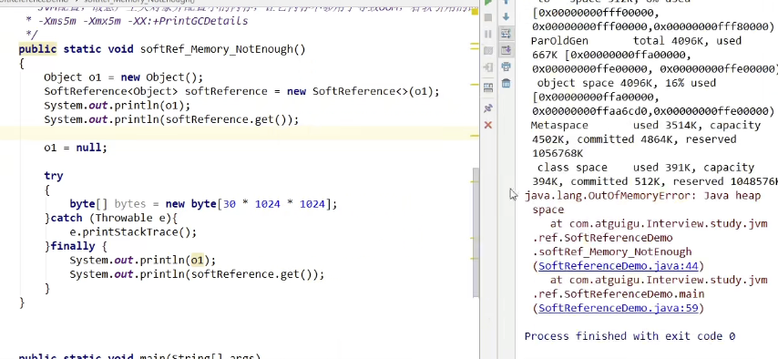

## 组织架构图


## 强引用（默认 95% 的情况下都用这个，Reference）

- 当前内存不足的时候，JVM开始垃圾回收，**对于强引用的对象，就算是出现了 OOM 也不会对该对象回收，也就是说，死都不回收。**
- 强引用是我们最常见的引用对象。
-  为什么死都不回收呢？
  - 因为一个对象被强引用变量引用时，它是处于根可达状态的，他是不能被回收的，**即使该对象以后永远不会被用到，也不会被 JVM 回收。**
- **所以我们的强引用一般就是造成我们系统OOM的原因之一。**

```java
Book a = new Book(); //  强引用
```

但是对于一个普通的对象，如果其没有其它的引用关系，只要超过了我们引用的作用域或者被显示的将相应的强引用赋值为 **null**。一般就可以被认为可以回收了。我们在集合源码中看到过许多类似的操作，将某个方法内的强引用设置为 **null**，并且旁边还有注释 `// help gc`。


### 例子

```java
public static void main(String[] args) {
    Object o1 = new Object(); // 强引用
    Object o2 = o1; // o2 引用赋值
    // o1 和 o2 他俩的引用地址都指向了同一个对象
    o1 = null; // 置空
    System.gc();
    // gc 后 o2 不会被回收，因为是强引用，没有出作用域以及显示赋值为null
    System.out.println(o2);
}
```


## 软引用（SoftReference）

- 内存足够的前提下我可以不回收你，内存不够的情况下我可以收你，尽力去保证系统不 OOM。

- 可以让对象豁免一些垃圾收集。
- 根据软引用的特性，**它一般用于对内存敏感的程序中，比如高速缓存就有用到，内存够用就保留，不够就回收。**


### 例子

- **内存足够的时候，我们可以证明软引用不会被回收：**


- **内存不够用的时候，软引用会被回收：**
  - 故意产生大对象并配置小内存，让其 OOM，查看软引用回收情况。
  - **`-Xms5m -Xmx5m --XX:+PrintGCDetails`**




## 弱引用（WeakReference）

==**不管内存是否够用，只要GC启动垃圾回收，一定会被回收。**==


### 例子

- **动了 o1，没动弱引用，照样被回收：**


## 软引用和弱引用的使用场景

### **假如说我们缓存系统要读取大量的图片？**

- 如果图片每次都要去磁盘读取，那么会很废系统性能。
- 一次性全部加载进内存，又容易 OOM。

我们此时就可以用软引用或弱引用解决这个问题。

我们可以有这样的设计思路：

- 用一个 **HashMap** 来保存图片的路径和相应图片对象关联的软引用之间的关系，内存不足时，JVM 会自动回收这些缓存图片对象所占用的空间，从而有效避免 OOM。

```java
Map<String, SoftReference<Bitmap>> imageCache = new HashMap<String, SoftReference<Bitmap>>();
```


### **知道弱引用的话，能谈谈 WeakHashMap 吗？**

先来看一个例子：


欸我明明给 key 置空了，为什么 HashMap 还是有没被回收啊，是因为，**HashMap 中的 key 与 Integer key 没关系，和 new Integer(1) 才有关**，例如我们在强引用中举的例子。


我们发现gc之后直接将该 map 给干了，回收了。