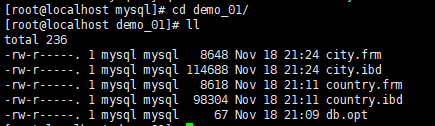
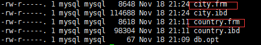

# 系统文件划分


## 系统文件

**系统文件层**：主要负责表中数据和日志存储，并完成与存储引擎的交互，是文件的物理存储层。


## 日志文件

MySQL在日志中记录了数据库操作信息和错误信息。


### 错误日志

记录了运行过程中遇到的所有严重的错误信息，以及MySQL每次启动和关闭的详细信息。

默认是开启的，而且从**MySQL5.5.7**以后无法关闭错误日志。

默认错误日志的名称：**hostname.err**

错误日志记录的信息可以通过 **log-error** 和 **log-warnings** 来定义

- **log-error：**

  - 可以直接定义文件的存储位置，也可以直接定义是否启用错误日志。
  - 例子：`log-error=/var/log/mysqlid.log`

- **log-warnings：**

  - 用于表示警告信息是否一并记录到错误日志中。
  - 例子：`log-warnings=1`
  - **= 0**：表示不记录警告信息，错误日志**只**包含错误信息。
  - **= 1**：表示记录警告信息，错误日志包含错误信息。
  - **= 2**：表示记录警告信息，访问失败的连接和访问被拒绝的连接错误信息也会被记录到错误日志当中。
  - **MySQL5.7.2**之前默认为1，之后默认为2。

  

### 二进制日志

用来记录**MySQL**有更新的内容的记录，**对数据库的查询select不会被binlog日志记录**。主要用于**数据库恢复**和**主从复制**。**MySQL** 的 **binlog日志 必须打开 log-bin 功能**才会生成 **binlog日志**，没有**错误日志**那么重要。

```sql
# 默认是关闭的
log-bin=OFF

# 需要通过以下配置进行开启
log-bin=mysql-bin
```


### 通用查询日志

通用查询日志**会记录用户的所有操作**，其中还**包含增删改等信息**，在==**并发操作大的环境下会产生大量的信息从而导致不必要的磁盘IO，会影响MySQL的性能。**==所以我们在不是以调试数据库目的的情况下，建议不要去开启。

```sql
# 启动开关
general_log=[ON|OFF]

# 日志文件名，如果general_log_file如果没有指定，默认名就是host_name.log
general_log_file=/PATH/TO/FILE

# 记录类型，设置为TABLE会记录到表mysql.general_log中：
log_output=[TABLE|FILE|NONE]
```


### 慢查询日志

用于收集查询时间比较长的**SQL语句**。

```sql
# 默认是关闭的，需要通过以下设置开启
slow_query_log=ON

# 慢查询日志
# 默认名为host_name-slow.log,host_name是主机名

# 慢查询的阈值，单位：秒
long_query_time = 10
```


## 数据文件

```sql
# cd /var/lib/mysql/指定数据库名字
# 即可查看到指定数据库下的数据文件
```

| **** |
| :----------------------------------------------------------: |
|                           **图示**                           |


### InnoDB数据文件

**.ibd 独立表空间**：

- 每一个表都将会生成**以独立的文件方式来存储**
- **每一个表都有一个 .frm表描 述文件，还有一个 .ibd文件**。
- 某一个数据库所有的表数据，索引文件全部放在一个文件夹中，默**认这个共享表空间的文件路径在 data目录 下**。


### MyIsam数据文件

**.MYD、.MYI、.frm** 都是该存储引擎的数据文件。


## 表结构文件

**MySQL**数据库的存储是基于表的，每个表都有一个对应的表结构文件。

| **** |
| :----------------------------------------------------------: |
|                           **图示**                           |


# 磁盘

## 内部结构

## 向磁盘中写数据

## 从磁盘中读取数据

## 读取数据响应时间

## 操作系统对磁盘的读取

