# MySQL中的索引


## 什么是MySQL索引

- **索引是帮助MySQL高效获取数据的==数据结构（有序的）==**，可以理解为排好序的快速查找数据结构。
- 在数据之外，数据库系统还维护着**满足特定查找算法的数据结构**，**这些数据结构以某种方式引用（指向）数据**，这样就可以在这些数据结构上**实现高级查找算法**，**这种数据结构就是索引**。
- 我们平常说的==MySQL中的索引，没有特别指明的话，都是指**BTree**（多路搜索树，并不一定是二叉的）结构组织的索引==。其中**聚集索引，次要索引，覆盖索引，复合索引，前缀索引，唯一索引**默认都是使用**B+Tree**（**BTree**的一种），统称索引。除了B+Tree这种类型的索引外，还有哈希索引等。
- 一般来说，索引本身也挺大，不可能全部存储在内存中，因此，索引往往是以索引文件的形式存储在磁盘上的（.idx）

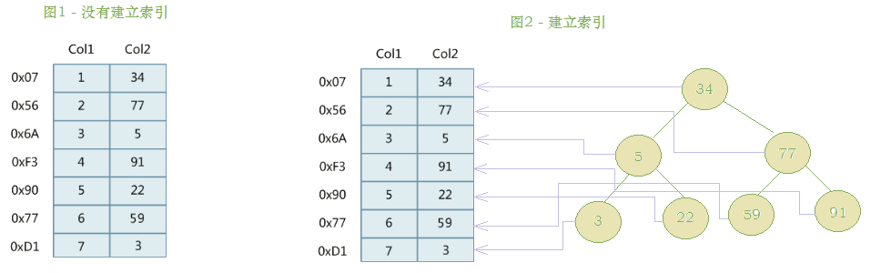

- **分析上图**：

左边是数据表，一共有两列七条数据，最左边的十六进制数字代表他们的物理地址（逻辑上相邻，可是磁盘上并不一定相邻）。为了加快Col2的查找，可以维护一个右边所示的二叉查找树来加快数据的访问速度。


## 索引的优势和劣势

### 优势

1. 类似于书籍的目录索引，**提高了数据的检索效率**，数据的检索，每一次遍历都得从磁盘读取到内存，而索引减少了遍历次数，所以索引**降低了数据库的IO成本（影响WHERE)**。

2. **通过索引列对数据进行排序**，**降低数据排序的成本**，**降低CPU的消耗（影响ORDER BY）**。

   

### 劣势

1. ==索引实质上也是一张表==，该表保存了主键于索引字段，并指向实体类的记录，所以索引列也是要占用空间的，==所以我们一般都放在磁盘而不是内存中==。
2. 索引**大大提高了查询效率**，同时也**降低了更新表的速度**，**比如我们增删改，都会影响索引表中的对应关系。**


## 索引的结构

索引他是在**MySQL**的**存储引擎层**中实现的，不是在**服务器层**实现的。所以==每种存储引擎的索引都不一定完全相同，同时不是所有的存储引擎都能支持所有的索引类型==。

- ==**BTREE索引**==：最常见的索引类型，大部分的存储引擎都支持，在**MySQL**的**InnoDB引擎**中是**BTREE**结构下的 **B+Tree** 索引结构。
- **HASH索引**：使用场景简单。
- **R-tree索引（空间索引）**：空间索引是**MylSAM**引擎的一个特殊索引类型，主要用于地理空间数据类型，通常使用较少。
- **Full-text（全文索引）**：全文索引也是**MyISAM**的一个特殊所以类型，主要用于全文索引，**InnoDB**引擎从**MySQL5.6**版本开始支持。


### MySQL提供的四种索引

|  **索引结构**  | **InnoDB引擎（主要）** | **MyISAM引擎** | **Memory引擎** |
| :------------: | :--------------------: | :------------: | :------------: |
| **BTREE索引**  |        ==支持==        |    ==支持==    |    ==支持==    |
|  **HASH索引**  |        ==支持==        |     不支持     |    ==支持==    |
| **R-tree索引** |         不支持         |    ==支持==    |     不支持     |
| **Full-text**  |   ==5.6版本后支持==    |    ==支持==    |     不支持     |

所以我们常说的索引，没有特别指明的话，**基本都是指B+树（多路索引树，并不一定是二叉结构）结构组织的索引**。其中，**聚集索引**、**复合索引**、**前缀索引**、**唯一索引默认都是使用B+tree索引，统称为索引**。


#### BTREE结构（重点）

BTree又叫做多路**平衡**搜索树，一棵**m叉**的BTree特性如下：

- 树中每个节点**最多包含m个孩子**。
- **除根节点与叶子节点外，每个结点至少含有**==`ceil(m/2)`==个孩子。
- 若**根节点不是叶子节点**，**则至少有两个孩子**。
- **所有叶子节点都在同一层**。
- 每个**非叶子节点**由 **n个key** 与 **n+1个指针** 组成，其中==`ceil(m/2) - 1 <= n <=m-1`==，**所谓的指针域，就在下面的例子中的每一路的第二行空行。**
- **指针代表要走哪条路**。


以**5叉的BTree**为例，**key的数量**：公式推导 **ceil(m/2) - 1 <=  n  <= m-1**。所以 **2 <= n <= 4**。**当 n > 4 时，中间结点分裂到父节点**，**两边结点分裂**。

用插入 ` C N G A H E K Q M F W L T Z D P R X Y S` 数据为例来说明：

演变的过程如下：

1). 插入前4个字母 `C N G A` ，按**ASSIC**码大小排序，**2 <= n <= 4**

 

2). 插入`H`，**n > 4**，**触发分裂阈值**，中间元素**G**字母**向上分裂**到新的节点

 

3). 插入`E K Q`不需要分裂，因为都在 **n 的范围内**

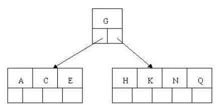 

4). 插入`M`，中间**元素M字母向上分裂到父节点G**，在这里我们就可以看出为什么每一路指针要有 **n + 1** 个的原因了

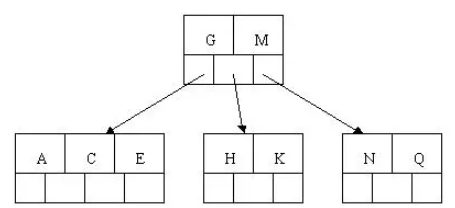 

5). 插入`F W L T`不需要分裂

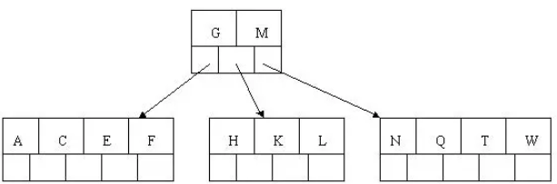 

6). 插入`Z`，**中间元素T向上分裂到父节点中** 

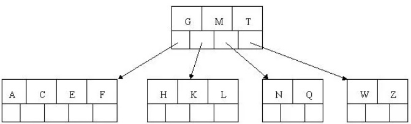 

7). 插入`D`，**中间元素D向上分裂到父节点中**。然后插入P，R，X，Y不需要分裂，==注意每插一个就要进行一次是否分裂的判断==

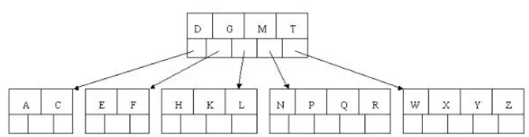 

8). 最后插入`S`，**N P Q R 这一路节点** **n  > 5**，**中间节点Q向上分裂**，但**分裂后父节点** **D G M T** 的 **n > 5**，**中间节点M向上分裂**

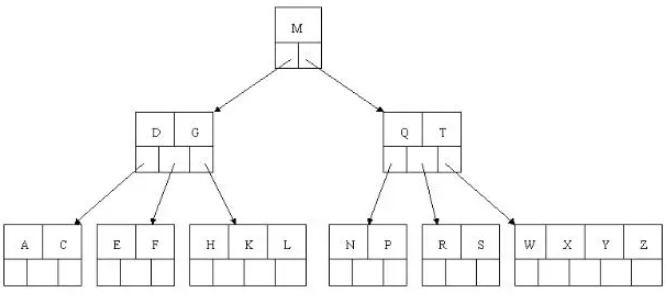 

到此，该BTREE树就已经构建完成了， 我们可以看出，由于层数的原因，**BTREE**树 和 **二叉树** 相比， **查询数据的效率更高**， **因为对于相同的数据量来说**，**BTREE的层级结构比二叉树小**，因此搜索速度快。


#### B+TREE

**B+Tree**为**BTree**的变种，**B+Tree**与**BTree**的区别：

- **m叉** 的 **B+Tree** 最多含有 **m个key**， 而 **BTree** 最多含有 **m-1个key**。
- **B+Tree** 的**叶子节点**保存**所有的 key 信息**，按**key大小顺序排列**。
- 所有的**非叶子节点都可以看作是key的索引部分**。

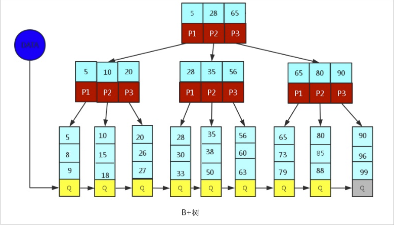 

由于**B+Tree**只有**叶子节点保存key信息**，==查询任何key都要从root走到叶子==。所以B+Tree的所以==**查询效率更加稳定**==。


#### MySQL中的B+Tree

**MySQL**中的**索引数据结构**对经典的**B+Tree**进行了优化。在原来的基础上，**增加了一个指向相邻叶子节点的链表指针**，形成了带有顺序的 **B+Tree** ，==这么做的好处就是提高了区间访问的新能==。

**MySQL**中的 **B+Tree** 索引结构示意图:：

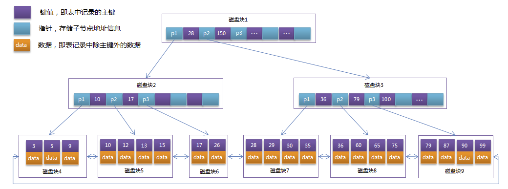  

怎么个提高法，我们可以拿想要**查找17**，由于有指针的存在，我们可以快速定位区间，直接从 **15结点** 开始查找就行了，极大的减少了定位的时间复杂度。


## 索引的分类（重要）

1. **单值索引**：一个**索引只包含单个列**，一个**表可以有多个单列索引**，中规中矩的建议一张表**最多五个单值索引**，**索引值可多次出现**。
2. **唯一索引**：**索引列的值必须唯一**，**但允许为空**。
3. **复合索引**：一个索引包含多个列。


## 索引的语法（重要）

索引可以与表同时创建，也可以随时增加，==在MySQL中主键字段，会自动创建主键索引==。

索引一共有**四种创建方式**：唯一索引，主键索引，单值索引，全文索引四种。

### 准备环境

```sql
CREATE TABLE `city` (
  `city_id` int(11) NOT NULL AUTO_INCREMENT,
  `city_name` varchar(50) NOT NULL,
  `country_id` int(11) NOT NULL,
  PRIMARY KEY (`city_id`)
) ENGINE=InnoDB DEFAULT CHARSET=utf8;

CREATE TABLE `country` (
  `country_id` int(11) NOT NULL AUTO_INCREMENT,
  `country_name` varchar(100) NOT NULL,
  PRIMARY KEY (`country_id`)
) ENGINE=InnoDB DEFAULT CHARSET=utf8;

insert into `city` (`city_id`, `city_name`, `country_id`) values(1,'西安',1);
insert into `city` (`city_id`, `city_name`, `country_id`) values(2,'纽约',2);
insert into `city` (`city_id`, `city_name`, `country_id`) values(3,'北京',1);
insert into `city` (`city_id`, `city_name`, `country_id`) values(4,'上海',1);
insert into `city` (`city_id`, `city_name`, `country_id`) values(5,'伦敦',4);
insert into `city` (`city_id`, `city_name`, `country_id`) values(6,'东京',3);
insert into `city` (`city_id`, `city_name`, `country_id`) values(7,'大阪',3);
insert into `city` (`city_id`, `city_name`, `country_id`) values(8,'华盛顿',2);

insert into `country` (`country_id`, `country_name`) values(1,'中国');
insert into `country` (`country_id`, `country_name`) values(2,'美国');
insert into `country` (`country_id`, `country_name`) values(3,'日本');
insert into `country` (`country_id`, `country_name`) values(4,'英国');
```


### 创建索引

语法：

```sql
CREATE [UNIQUE|FULLTEXT|SPATIAL] INDEX index_name 
[USING index_type] -- 选择索引分类，不指定默认使用 B+Tree 类型
ON tbl_name(index_col_name, ...) -- 哪一张表的哪个字段，两个以上就是符合索引

index_col_name : column_name[(length)][ASC | DESC]
```

 在 **city** 表中用 **city_name** 创建一个**普通索引**：

```sql
CREATE INDEX `index_city_name `
ON city(city_name);
```


### 查看索引

语法：

```sql
SHOW INDEX FROM tbl_name;
```

查看 **city** 表所持有的索引：

这里会打印出我们**刚刚创建的索引**以及**主键索引**共两个索引。

```sql
SHOW INDEX FROM `city`;
```


### 删除索引

语法：

```sql
DROP INDEX index_name ON tbl_name;
```

我们删除创建的 **index_city_name** 索引：

```sql
DROP INDEX `index_city_name` ON `city`;
```


### ALTER命令

用 **ALTER** 来创建或修改索引。

语法：

```sql
-- 添加一个主键，这意味着索引的值必须唯一，并且不能为空
ALTER TABLE tbl_name ADD PRIMARY KEY(column_list);
-- 创建索引的值必须是唯一的（比如国家的名称就不可能重复），可以为空
ALTER TABLE tbl_name ADD UNIQUE index_name(column_list);
-- 创建普通索引，值可以出现多次
ALTER TABLE tbl_name ADD INDEX index_name(column_list);
-- 创建全文索引
ALTER TABLE tbl_name ADD FULLTEXT index_name(column_list);
```


## 索引的设计原则（重要）

- **索引字段的选择**，最佳候选列应该是 **where子句** 中**常用的条件**，如果 **where子句 中的条件组合比较多**，==应该挑选最常用并且过滤效果相对最好的组合==。
- 使用唯一索引，区分度越高，使用索引的效率越高。
- 索引数量不是越多越好，索引越多，维护的代价越高：
  - 对于**增删改等DML ** **操作频繁**的表来说，索引过多**会提升维护成本**，从而**降低增删改等DML操作的效率**。
  - 对于**MySQL**来说，也不是越多越好，索引多了就得选择，选择的过程也会消耗时间。
- 使用**短索引**，索引建立之后是**使用硬盘来存储**的：
  - 提升索引访问**I/O操作**效率，也可以**提升总体的访问效率**。
  - ==如果**构成索引的字段总长度比较短**的话，在**给定大小的存储块内可以存储更多的索引**，就可以提升MySQL访问索引的 I/O 操作的效率。==
- 利用**最左前缀**，**N个列组合而成的组合索引**，**那么相当于是创建了N个索引**，如果查询时 **where子句** 中使用了**组成该索引的前几个字段**，那么这条**查询SQL可以利用组合索引来提升查询效率**。
- 例如：

```sql
CREATE INDEX index_person_name_tel_email 
ON person(person_name, person_tel, person_email);
-- 相当于对 person_name 创建了索引
-- 同时也对 person_name, person_tel 创建了索引
-- 说白了就是对 person_name, person_tel, person_email 的笛卡尔积中的所有元素都做了索引
```


### 什么情况建议建立索引

- 主键自动建立唯一索引。
- 对**查询频率较高，并且数据量较大**的表**建立索引**。
- 查询中与其它表的**关联字段**，**外键关系建立索引**。
- **WHERE条件**里**用不到的字段不创建索引**。
- 单值索引/组合索引的选择问题：
  - **高并发下，建议选择组合索引**。
- **最常查询，最常进行排序的字段**：
  - 查询中排序的字段，排序字段若通过索引去访问将大大提高排序速度。
  - 查询中，统计或者分组字段，分组前提是排序。


### 什么情况不建议建立索引

- 表记录的数据很少的时候。
  - **MySQL三百万数据之后不建索引检索效率会下降。**
- **频繁更新的字段**不适合创建索引，**提高查询速度**，**降低更新速度**。
- **数据重复，且分布平均的表字段，重复内容过多，索引效果越低**。

# JOIN查询

## 常见的查询

针对上方第四个原因来系统了解一下join查询。

重温**DQL**的语法：

```sql
# 人工
SELECT DISTINCT
	<select_list>
FROM
	<left_table> <join_type>
JOIN <right_table> ON <join_condition>
WHERE
	<where_condition>
GROUP BY
	<group_by_list>
HAVING
	<having_condition>
ORDER BY
	<order_by_condition>
LIMIT <limit_number>
```

```sql
# 机读
FROM <left_table>
ON <join_condition>
<join_type> JOIN <right_table>
WHERE <where_condition>
GROUP BY <group_by_list>
HAVING <having_condition>
SELECT
DISTINCT <select_list>
ORDER BY <order_by_condition>
LIMIT <limit_number>
```

| 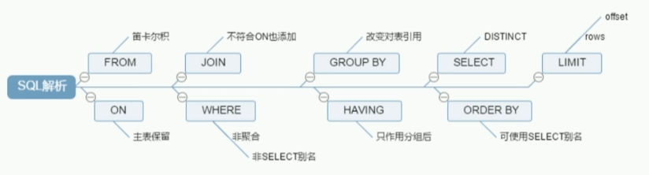 |
| :----------------------------------------------------------: |
|                         **机读顺序**                         |


## 七大JOIN查询

| 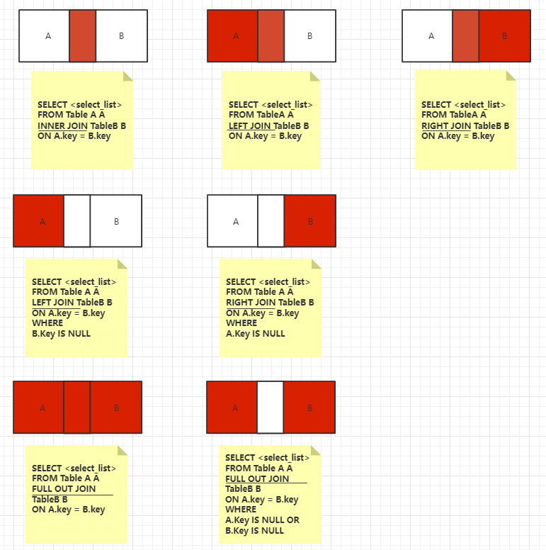 |
| :----------------------------------------------------------: |
|                   **七大JOIN查询(Oracle)**                   |


## 测试案例

```sql
CREATE TABLE t_dept(
	id INT(11) NOT NULL AUTO_INCREMENT,
	deptName VARCHAR(30) DEFAULT NULL,
	locAdd VARCHAR(40) DEFAULT NULL,
	PRIMARY KEY(id)
)ENGINE=INNODB AUTO_INCREMENT=1 DEFAULT CHARSET=utf8;

CREATE TABLE t_emp (
	id INT(11) NOT NULL AUTO_INCREMENT,
	NAME VARCHAR(20) DEFAULT NULL,
	deptId INT(11) DEFAULT NULL,
	PRIMARY KEY (id),
	KEY fk_dept_Id (deptId)
	#CONSTRAINT 'fk_dept_Id' foreign key ('deptId') references 'tbl_dept'('Id')
)ENGINE=INNODB AUTO_INCREMENT=1 DEFAULT CHARSET=utf8;

INSERT INTO t_dept(deptName,locAdd) VALUES('RD',11);
INSERT INTO t_dept(deptName,locAdd) VALUES('HR',12);
INSERT INTO t_dept(deptName,locAdd) VALUES('MK',13);
INSERT INTO t_dept(deptName,locAdd) VALUES('MIS',14);
INSERT INTO t_dept(deptName,locAdd) VALUES('FD',15);

INSERT INTO t_emp(NAME,deptId) VALUES('z3',1);
INSERT INTO t_emp(NAME,deptId) VALUES('z4',1);
INSERT INTO t_emp(NAME,deptId) VALUES('z5',1);
INSERT INTO t_emp(NAME,deptId) VALUES('w5',2);
INSERT INTO t_emp(NAME,deptId) VALUES('w6',2);
INSERT INTO l_emp(NAME,deptId) VALUES('s7',3);
INSERT INTO t_emp(NAME,deptId) VALUES('s8',4);
INSERT INTO t_emp(NAME,deptId) VALUES('s9',51);
```

```sql
+----+----------+--------+
| id | deptName | locAdd |
+----+----------+--------+
|  1 | RD       | 11     |
|  2 | HR       | 12     |
|  3 | MK       | 13     |
|  4 | MIS      | 14     |
|  5 | FD       | 15     |
+----+----------+--------+
5 rows in set (0.00 sec)

+----+------+--------+
| id | NAME | deptId |
+----+------+--------+
|  1 | z3   |      1 |
|  2 | z4   |      1 |
|  3 | z5   |      1 |
|  4 | w5   |      2 |
|  5 | w6   |      2 |
|  6 | s8   |      4 |
|  7 | s9   |     51 |
+----+------+--------+
7 rows in set (0.00 sec)
```

- **join类型一**：

| 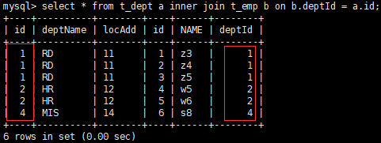 |  |
| :----------------------------------------------------------: | :----------------------------------------------------------: |
| **SELECT * FROM t_dept a INNER JOIN t_emp b ON a.id = b.deptId** |                       **对应的JOIN图**                       |

- **join类型二**：
  - 查询结果中有**左表的所有条目**，**包含两表交叉部分**。
  - **左表独有部分**，在右表中有就显示，没有就补**null**。

| 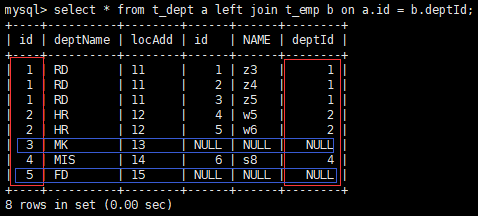 |  |
| :----------------------------------------------------------: | :----------------------------------------------------------: |
| **SELECT * FROM t_dept a LEFT JOIN t_emp b ON a.id = b.deptId** |                       **对应的JOIN图**                       |

- **join类型三**：
  - 查询结果中有**右表的所有条目**，**包含量表交叉部分**。
  - **右表独有部分**，在左表中有就显示，没有就**null**。

| 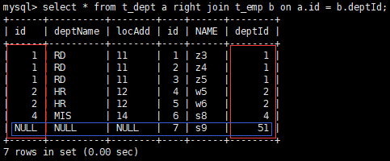 |  |
| :----------------------------------------------------------: | :----------------------------------------------------------: |
| **SELECT * FROM t_dept a RIGHT JOIN t_emp b ON a.id = b.deptId** |                       **对应的JOIN图**                       |

- **join类型四**：
  - 查询结果有**左表独有的内容**，**右表同行为空**。

| 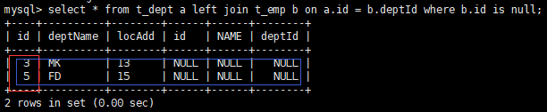 |  |
| :----------------------------------------------------------: | :----------------------------------------------------------: |
| **SELECT * FROM t_dept a LEFT JOIN t_emp b ON a.id = b.deptId WHERE b.id IS NULL** |                       **对应的JOIN图**                       |

- **join类型五**：
  - 查询结果有**右表独有的内容**，**左表同行为空**。

| 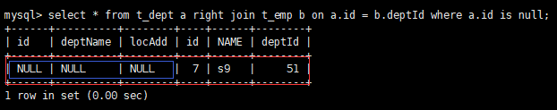 |  |
| :----------------------------------------------------------: | :----------------------------------------------------------: |
| **SELECT * FROM t_dept a RIGHT JOIN t_emp b ON a.id = b.deptId WHERE a.id IS NULL** |                       **对应的JOIN图**                       |

- **join类型六**：
  - 查询结果是全方位，**左右表公有、私有部分都有**。
  - 图中语法，**MySQL** 的 **SQL** 并不支持，只能用 **UNION** 来联合实现。

| 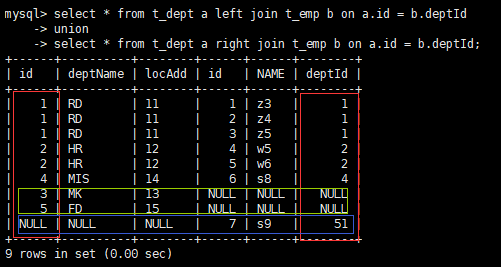 |  |
| :----------------------------------------------------------: | :----------------------------------------------------------: |
| **SELECT * FROM t_dept a LEFT JOIN t_emp b ON a.id = b.deptId  UNION SELECT * FROM t_dept a RIGHT JOIN t_emp b ON a.id = b.deptId** |                       **对应的JOIN图**                       |

- **join类型七**：
  - **左表右表私有部分**。

| 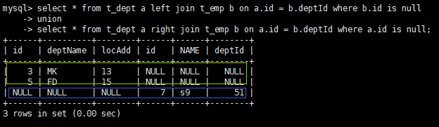 |  |
| :----------------------------------------------------------: | :----------------------------------------------------------: |
| **SELECT * FROM t_dept a LEFT JOIN t_emp b ON a.id = b.deptId WHERE b.id IS NULL UNION SELECT * FROM t_dept a RIGHT JOIN t_emp b ON a.id = b.deptId WEHERE a.id IS NULL** |                       **对应的JOIN图**                       |


