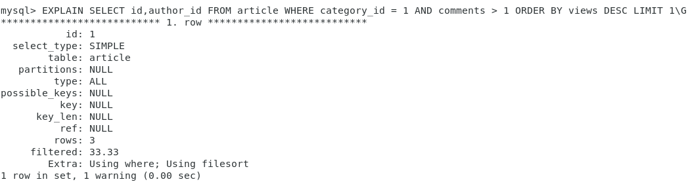
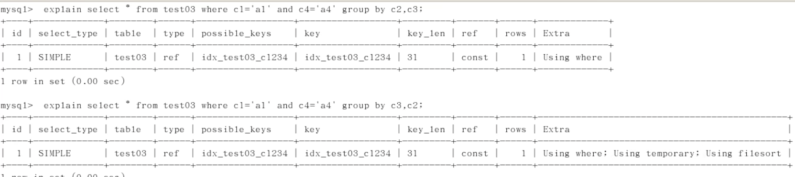
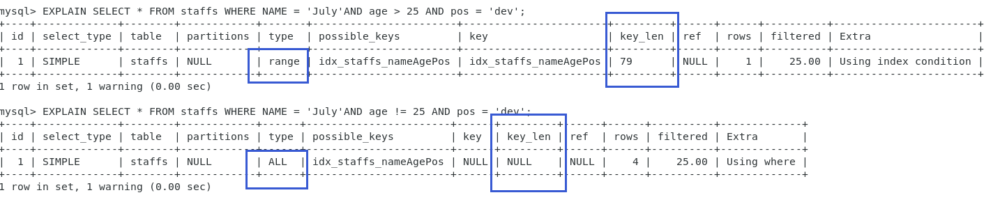

# 性能分析

## MySQL Query Optimizer

**Mysql**中由专门**负责优化SELECT语句的优化器**，主要功能就是**通过计算分析系统中收集到的统计信息，为客户端请求的Query提供他认为最优的执行计划**（他认为最优的，但**==不一定是DBA觉得最优的，这部分最耗时间==**）。

当客户端向**MySQL**请求一条**Query**的时候，**命令解析器模块完成请求分类**，区别出是SELECT并转发给**MySQL Query Optimizer**时，MQO会对整条Query进行优化，**处理掉一些常量表达式的预算**，**将其换算成常量值并对**，**Query中的查询条件进行简化和转换**，如**去掉一些无用或显而易见的条件、结构调整**等，然后分析**Query**中的**Hint**信息（如果有的话），看显示**Hint**信息**是否可以完全确定该Query的执行计划**。如果**没有Hint或Hint信息还不足以完全确定执行计划**，则会**读取所涉及对象的统计信息**，根据Query进行相应的计算分析，让后再得出最后的执行计划。

## MySQL常见瓶颈

CPU

- CPU在包和的时候**一般发生在数据装入内存或从磁盘上读取数据**的时候

IO

- 磁盘I/O瓶颈发生在**装入数据远大于内存容量的时候**。

服务器硬件

- 硬件的性能瓶颈：top，free，iostat和vmstat来查看系统的性能状态。


## Explain（重点）

### 是什么

使用**EXPLAIN关键字**可以==模拟**优化器**执行SQL查询语句==，从知道**MySQL是如何处理你的SQL语句的，分析你查询语句或者是表结构的性能瓶颈**。

==在 `MySQL 5.7` 中，会对衍生表进行合并优化，如果要直观的查看 `select_type` 的值，需要临时关闭该功能（默认是打开的）==

```sql
-- 关闭衍生表的合并优化
set global optimizer_switch='derived_merge=off';

-- 关闭衍生表的合并优化（只对该会话有效）
set session optimizer_switch='derived_merge=off'; 

-- 打开衍生表的合并优化（只对该会话有效）
set session optimizer_switch='derived_merge=on';
```


### 能干嘛

1. 表的读取顺序
2. 哪些索引可以使用
3. 数据读取操作的操作类型
4. 哪些索引被实际使用
5. 表之间的引用
6. 每张表有多少行被优化器查询


### 怎么玩

Explain + SQL语句即可。


### 各字段分析

测试案例的sql

```sql
 CREATE TABLE t1(id INT(10) AUTO_INCREMENT,content  VARCHAR(100) NULL ,  PRIMARY KEY (id));
 CREATE TABLE t2(id INT(10) AUTO_INCREMENT,content  VARCHAR(100) NULL ,  PRIMARY KEY (id));
 CREATE TABLE t3(id INT(10) AUTO_INCREMENT,content  VARCHAR(100) NULL ,  PRIMARY KEY (id));
 CREATE TABLE t4(id INT(10) AUTO_INCREMENT,content  VARCHAR(100) NULL ,  PRIMARY KEY (id));
 INSERT INTO t1(content) VALUES(CONCAT('t1_',FLOOR(1+RAND()*1000)));
  INSERT INTO t2(content) VALUES(CONCAT('t2_',FLOOR(1+RAND()*1000)));
  INSERT INTO t3(content) VALUES(CONCAT('t3_',FLOOR(1+RAND()*1000)));
  INSERT INTO t4(content) VALUES(CONCAT('t4_',FLOOR(1+RAND()*1000)));
```


#### id字段

**select**查询的序列号，包含一组数字，表示**查询中执行select子句或操作表的顺序。**


##### 情况一：id相同

id相同，执行顺序由上至下

```sql
EXPLAIN SELECT * 
FROM t1, t2, t3
WHERE 
    t1.id = t2.id 
    AND t2.id = t3.id;
```


此例中，执行了 **where** 后的第一条语句 **t1.id = t2.id** 通过 **t1.id 关联 t2.id**，而 **t2.id** 的结果是**建立在 t2.id = t3.id 的基础上**。

也可能会出现执行顺序为 **t1 -> t3 -> t2** 的情况。


##### 情况二：id不同

```sql
EXPLAIN SELECT t2.* 
FROM t2 
WHERE id = (SELECT t1.id            
            FROM t1            
            WHERE id = (
                SELECT t3.id                        
                FROM t3));
```


由结果我们可以看出，如果是**子查询**，**id的序号会递增，id值越大，优先级越高，越先被执行。**

可以理解为，**括号的优先级**。

==id递增 -> id值越大 -> 优先级越高 -> 越先被执行==


##### 情况三：id相同不同，同时存在

```sql
EXPLAIN SELECT t2.* 
FROM (SELECT t3.id
      FROM t3) AS s1, t2
WHERE s1.id = t2.id;
```


**id如果相同，可以认为是一组**，**组内从上往下执行**，所以在所有组中，id值越大优先级越高，优先级越高的那一组，越先执行。

结果一度让我震惊，**因为没有出现衍生表**。我去查了一下，出现派生表并不是一个好的查询方案，**派生表本质也就是临时表**，如果过大也许不得不在磁盘上创建而非内存中，这样创建和访问都是要消耗IO资源的，==**可能在MySQL5.7中的优化器，会自动帮忙优化派生表，将派生表合并到外层查询中。**==

比如：

```sql
-- 优化前
SELECT * FROM (SELECT * FROM t1) AS s1;

-- 优化后
SELECT * FROM t1;
```


#### select_type

查询的类型，主要用于**区别普通查询，联合查询，子查询等的复杂查询。**

##### 有哪些

总和就这么多：


下面我们来逐个的看一下。

- <u>**SIMPLE**</u> 

简单的**SELECT**查询，查询中不包含子查询或者**UNION**


- <u>**PRIMARY**</u>

  查询中若包含任何**复杂的子部分**，最外层查询则被标记为**PRIMARY**，最后执行的那个。


​		5.7版本的优化器直接优化了，这里用别人的图。


- <u>**DERIVER**</u>

在FROM列表中包含的子查询被标记为DERIVERD（派生）MySQL会递归执行这些子查询，把结果放在临时表中。


- <u>**SUBQUERY**</u>

在**SELECT**或**WHERE**列表中包**含了子查询**。


- <u>**DEPENDENT SUBQUERY**（**5.7中没有**）</u>

在**SELECT**或**WHERE**列表中包含了子查询，子查询基于最外层


DEPENDENT SUBQUERY 与 SUBQUERY 的区别

依赖子查询：子查询结果为多值 | 子查询：查询结果为单值。


- <u>**UNCACHEABLE SUBQUREY（5.7中没有）**</u>

无法被缓存的子查询，估计就是临时表太大了。


- <u>**UNION**</u>

若第二个SELECT出现在UNION之后，则被标记为UNION；

若UNION包含在FROM子句的子查询中，外层的SELECT将会被标记为DERIVED


- <u>**UNION  RESULT**</u>

使用 `union` 关键词后会生成一个临时表，对于这个临时表的 `select` 。


#### table

对应行查询的表。

- 当 `from` 子句中如果有子查询的话，table 列为是 deriverN 的格式，表示这一行执行的是 id = N 行的查询。
- 当有 `union` 时，`table` 的数据为 `<union M,N>` 的格式， M 和 N 表示参与 `union` 的 `select` 行 id。


#### type（非常重要）

type表示这行查询的关联类型（访问类型，或查询类型），通过该值可以了解该行查询数据记录的大概范围。

**他的值与我们是否优化过SQL息息相关。**

==常见的值依次从最优到最差分别为：`system > const > eq_fef > ref > range > index > all`；==

一般情况下，我们要**保证效率的话**，要优化我们的语句至少使其达到 `range` 级别，如果可能的话最好优化到 `ref`； **`range` 级别一般用于范围查找**，所以换句话说，除了范围查找，我们**其它查询语句最好是优化到 `ref` 级别。**


##### 有哪些

常见的就只有这些：


下面我们就来逐一看一下总共会出现多少种情况：


- <u>**NULL**</u>

  - 表示MySQL能够在优化阶段分解查询语句，在执行阶段不用访问表和索引。

  

- <u>**system / const**</u>

  - **MySQL能对某个查询部分进行优化并将其转化成一个常量**（可以通过 `show warnings` 查看优化的结果），主要是查询主键（`primary key`）或唯一索引（`Unique Key`）对应的记录，因为不存在重复，所以最多只能查询出一条记录，所以速度比较快。**system 是 const的特例**，当**临时表只有一条记录时为system**。

  

  

  

- <u>**eq_ref**</u>

  - **唯一性索引扫描**，对于每个索引键，**表中只有一条记录与之匹配，==常见于主键或唯一索引扫描==。**

  

  

  

- <u>**ref**</u>

  - **非唯一性索引扫描**，返回匹配某个**单独值的所有行**，本质上也是一种索引访问，它返回所有匹配某个单独值的行，然而，它可能会找到多个符合条件的行，所以他应该属于查找和扫描的混合体。

  

  

  

  

- **<u>range</u>**

  - 只检索给定范围的行，使用一个索引来选择行，`key`列显示使用了哪个索引**一般就是在你的`where`语句中出现了 `between、<>、in`等查询范围**。
  - 这种**范围扫描要比全表扫描好**，因为它只**需要开始于索引的某一点，而结束于索引的另一点，不用扫描全部索引**。

  

  

  

  

- <u>**index**</u>

  - `Full Index Scan`，`index`与`ALL`区别为`index`类型只遍历索引树。这通常比`ALL`快，因为索引文件通常比数据文件小。
  - 也就是说虽然`all`和`index`都是读全表，但是`index`是从索引中读取，`all`是从硬盘中读取的。

  

  

  

- <u>**all**</u> 

  - `Full Table Scan`，将遍历全表以找到匹配的行。

  

  

- **<u>index_merge</u>**

  - 在查询过程中需要多个索引组合使用，通常出现在有 `or` 关键字的 `sql` 中。

  

  

  

- <u>**ref_or_null**</u>

  - 对于某个字段既需要关联条件，也需要`null`值的情况下，查询优化器会选择用`ref_or_null`连接查询。
  - 对比上面，主键id一般不能为null所以不是ref_or_null。

  

  

  

- <u>**index_subquery**</u>

  - 利用索引来关联子查询，不再扫描全表。

  

  

  

  

  

- <u>**unique_subquery**</u>

  - 该连接类型类似于`index_subquery`。子查询中唯一索引。

  


#### possible_keys

- 显示可能应用在这张表中的索引，一个或多个。
- **查询涉及到的字段上若存在索引**，则该索引将被列出，**但不一定被查询实际使用。**


#### key

- 实际使用的索引。如果为**null**，则没有使用索引
- 查询中若使用了覆盖索引，则该索引和查询的**select**字段重叠。
  - **也就是说，当查询某一字段时，且那个字段有对应索引时，key的值会显示为索引，而不是null**。


#### key_len

- 表示索引中使用的字节数，通过**该列计算查询中使用的索引的长度**，在**不损失精度的情况下，通常越少越好**。
- 它显示的是最大可能长度，而**并非一定就是实际使用长度**。
- 即它是根据表定义计算得到而不是通过表内检索而得到的。
- **key_len字段能够帮你检查是否充分的利用上了索引。**


#### ref

- 显示索引的哪一列被使用了，如果可能的话，是一个常数。
- 哪些列或常量被用于查找索引上的值。


#### rows

- rows列显示MySQL认为它执行查询时必须检查的行数。


#### Extra（重要）

包含**不适合在其他列中显示**但是**十分重要的额外信息**。

1. <u>**Using filesort**</u>

   - 说明**MySQL**会对数据使用一个**外部的索引排序**，而不是按照表内的索引顺序进行读取的。
   - **MySQL**中**无法利用索引完成的排序操作称为“文件内排序”**。
   - ==出现这种情况等于说是九死一生了。==
   - **比如说复合索引，只用到了复合索引的一个字段，那么它是没法排序的，就会出现。**

   

   

   

   

2. <u>**Using temporary**</u>

   - 使用了临时表保存中间结果，`MySQL`在对查询结果排序时使用临时表。
   - 常见于排序 `order by` 和分组查询 `group by`。
   - 要在**分组中使用索引，你也得遵循索引的定义顺序，不能空中楼阁**，否则就容易引起这个Extra，顺带再带一个上面的Extra

   

   

   

   

3. <u>**Using index**</u>

   - 表示相应的**select**操作中使用了**覆盖索引(Covering Index)**，避免了表的数据行，效率不错！
   - 如果同时出现**using where**，表明**索引只是用来读取数据**而**非利用索引执行查找**。

   - **覆盖索引**
     - 简单来说就是我**==建立的复合索引的字段，恰好是我要查找的所有字段，并且顺序一致，实际是索引扫描INDEX==**。
     - **索引是高效找那==行==的一个方法**，但是**一般数据库也能使用索引找到一个==列==的数据**，因此它不必读取整个行，毕竟索引叶子节点存储了他们索引的数据，当能通过读取索引就可以得到想要的数据，那就不需要读行了。
     - ①**一个索引**②包含了或覆盖了 **select子句与查询条件 where子句中**③**所有需要的字段就叫做覆盖索引**。
     - `SELECT id , name FROM t_xxx WHERE age = 18;`
     - 有一个组合索引 `idx_id_name_age_xxx` 包含了 `id,name,age` 三个字段。查询时直接将建立了索引的列取出来了，而不用再去查找所在行的其他数据，效率变高了。
     - 感觉可以用在数据量较大，并且固定字段查询情况多的适合可以使用这种索引。
     - ==注意==：如果要**使用覆盖索引**，一定要注意`select列表`中只取出需要的列，并且列涵括在覆盖索引中。**不可以**`select  *`，**如果将所有字段一起做索引会导致索引文件过大，查询性能下降。**

   

   

   

   

4. <u>**Using where**</u>

   - 表明**使用了where过滤**。

   

5. <u>**using join buffer**</u>

   - 表明**使用了连接缓存**。
   - 

   - 出现在两个表连接时，
     - 驱动表（join前的单纯是哪边，哪边就是驱动表，inner join的话就是数据少的那个表）没有索引的情况下，给驱动表建立索引可解决此问题，并且 type 将变成 ref。
   - **join多了**，配置文件中的**join buffer**可以调大一点。

   

6. <u>**impossible where**</u>

   - 表明**where子句的值总是false，不能用来获取任何元组。**

     

7. **<u>select tables optimized away</u>**

   - 在没有 `GROUP BY` 子句的情况下，基于索引优化MIN/MAX操作或者对于MyISAM存储引擎优化 COUNT(*) 操作，不必等到执行阶段在进行计算，查询执行计划生成的阶段即完成优化。


### 例题


运行顺序？

- `t2 -> t1 -> t3 -> <derived3> -> <union1, 4> `


# ==索引优化==

## 优化分析

性能下降SQL慢，执行时间长，等待时间长的原因一般有如下几点：

- **查询语句写的烂**
  - 没用上索引，子查询太多。
- **索引失效**
  - 建立了索引但是没用上，或者没有建索引。
- 关联查询太多的**join**
  - 可能是由于数据库的设计缺陷造成，或者不得已的需求。
  - 经常造成**执行时间长**。
- 服务器调优及各个参数设置
  - 缓冲、线程数等。
  - 经常造成达到最大并发数得**等待的时间长**。


## 单表优化

### 建表SQL

```sql
CREATE TABLE IF NOT EXISTS `article` (
`id` INT(10) UNSIGNED NOT NULL PRIMARY KEY AUTO_INCREMENT,
`author_id` INT(10) UNSIGNED NOT NULL,
`category_id` INT(10) UNSIGNED NOT NULL,
`views` INT(10) UNSIGNED NOT NULL,
`comments` INT(10) UNSIGNED NOT NULL,
`title` VARBINARY(255) NOT NULL,
`content` TEXT NOT NULL
);

INSERT INTO `article`(`author_id`, `category_id`, `views`, `comments`, `title`, `content`) VALUES
(1, 1, 1, 1, '1', '1'),
(2, 2, 2, 2, '2', '2'),
(1, 1, 3, 3, '3', '3');

SELECT * FROM article;
```


### 案例实现SQL

```sql
-- 查询 category_id 为 1 且 comments 大于 1 的情况下，views 最多的 article_id
SELECT id,author_id FROM article WHERE category_id = 1 AND comments > 1 ORDER BY views DESC LIMIT 1;
```


### 优化开始

```sql
EXPLAIN SELECT `id`,`author_id` FROM `article` WHERE `category_id` = 1 AND `comments` > 1 ORDER BY `views` DESC LIMIT 1;
```



1. 我们可以看到，此时我们**type**是**ALL**(全表扫描)，并且是简单单表查询，但是**Using filesort**了，综合下来，这已经是最坏的情况了。

2. 我们可以通过建立索引来将查询类型往 range 方向靠；

   ```sql
   -- 建立复合索引
   ALTER TABLE `article` ADD `index` idx_article_ccv(`category_id`,`comments`,`views`);
   ```

3. 我们可以看到还是没有消除 **Using filesort** 但是 **range** 已经属于可以接受的范围了。

   

4. 为什么我们都已经建了索引了，可是还是文件排序，没有用到索引排序呢？

   - 因为按照 **BTree** 索引的工作原理，先排序 **category_id** 再排序 **comments**，**==如果遇到相同的 comments 则再排序 view==**，
   - 此时我们的SQL语句中 **comments** 字段在**复合索引的==中间位置==**，
   - ==此时 **comments  > 1** 条件是一个**范围**==（所以是 **range**），
   - 所以 **MySQL** 无法利用索引再对后面的 **views** 部分进行检索，即 ==**range** 类型查询字段后面的索引无效。==

   

5. 分析完之后我们来尝试越过需要范围查询的字段建立复合索引。

   ```sql
   -- 删除第一次建的索引
   DROP INDEX idx_article_ccv ON article;
   
   -- 建立新索引
   CREATE INDEX idx_article_cv ON article(`category_id`,`views`);
   ```

6. 最后一次分析：

   

   可以看出这就是我们最想要的结果，**type = ref**，**ref = const**，**Extra** 中的 **Using filesort** 也消失了。


## 关联查询优化

### 建表SQL

```sql
CREATE TABLE IF NOT EXISTS `class` (
`id` INT(10) UNSIGNED NOT NULL AUTO_INCREMENT,
`card` INT(10) UNSIGNED NOT NULL,
PRIMARY KEY (`id`)
);

CREATE TABLE IF NOT EXISTS `book` (
`bookid` INT(10) UNSIGNED NOT NULL AUTO_INCREMENT,
`card` INT(10) UNSIGNED NOT NULL,
PRIMARY KEY (`bookid`)
);

CREATE TABLE IF NOT EXISTS `phone` (
`phoneid` INT(10) UNSIGNED NOT NULL AUTO_INCREMENT,
`card` INT(10) UNSIGNED NOT NULL,
PRIMARY KEY (`phoneid`)
);

INSERT INTO class(card) VALUES(FLOOR(1 + (RAND() * 20)));
INSERT INTO class(card) VALUES(FLOOR(1 + (RAND() * 20)));
INSERT INTO class(card) VALUES(FLOOR(1 + (RAND() * 20)));
INSERT INTO class(card) VALUES(FLOOR(1 + (RAND() * 20)));
INSERT INTO class(card) VALUES(FLOOR(1 + (RAND() * 20)));
INSERT INTO class(card) VALUES(FLOOR(1 + (RAND() * 20)));
INSERT INTO class(card) VALUES(FLOOR(1 + (RAND() * 20)));
INSERT INTO class(card) VALUES(FLOOR(1 + (RAND() * 20)));
INSERT INTO class(card) VALUES(FLOOR(1 + (RAND() * 20)));
INSERT INTO class(card) VALUES(FLOOR(1 + (RAND() * 20)));
INSERT INTO class(card) VALUES(FLOOR(1 + (RAND() * 20)));
INSERT INTO class(card) VALUES(FLOOR(1 + (RAND() * 20)));
INSERT INTO class(card) VALUES(FLOOR(1 + (RAND() * 20)));
INSERT INTO class(card) VALUES(FLOOR(1 + (RAND() * 20)));
INSERT INTO class(card) VALUES(FLOOR(1 + (RAND() * 20)));
INSERT INTO class(card) VALUES(FLOOR(1 + (RAND() * 20)));
INSERT INTO class(card) VALUES(FLOOR(1 + (RAND() * 20)));
INSERT INTO class(card) VALUES(FLOOR(1 + (RAND() * 20)));
INSERT INTO class(card) VALUES(FLOOR(1 + (RAND() * 20)));
INSERT INTO class(card) VALUES(FLOOR(1 + (RAND() * 20)));
INSERT INTO book(card) VALUES(FLOOR(1 + (RAND() * 20)));
INSERT INTO book(card) VALUES(FLOOR(1 + (RAND() * 20)));
INSERT INTO book(card) VALUES(FLOOR(1 + (RAND() * 20)));
INSERT INTO book(card) VALUES(FLOOR(1 + (RAND() * 20)));
INSERT INTO book(card) VALUES(FLOOR(1 + (RAND() * 20)));
INSERT INTO book(card) VALUES(FLOOR(1 + (RAND() * 20)));
INSERT INTO book(card) VALUES(FLOOR(1 + (RAND() * 20)));
INSERT INTO book(card) VALUES(FLOOR(1 + (RAND() * 20)));
INSERT INTO book(card) VALUES(FLOOR(1 + (RAND() * 20)));
INSERT INTO book(card) VALUES(FLOOR(1 + (RAND() * 20)));
INSERT INTO book(card) VALUES(FLOOR(1 + (RAND() * 20)));
INSERT INTO book(card) VALUES(FLOOR(1 + (RAND() * 20)));
INSERT INTO book(card) VALUES(FLOOR(1 + (RAND() * 20)));
INSERT INTO book(card) VALUES(FLOOR(1 + (RAND() * 20)));
INSERT INTO book(card) VALUES(FLOOR(1 + (RAND() * 20)));
INSERT INTO book(card) VALUES(FLOOR(1 + (RAND() * 20)));
INSERT INTO book(card) VALUES(FLOOR(1 + (RAND() * 20)));
INSERT INTO book(card) VALUES(FLOOR(1 + (RAND() * 20)));
INSERT INTO book(card) VALUES(FLOOR(1 + (RAND() * 20)));
INSERT INTO book(card) VALUES(FLOOR(1 + (RAND() * 20)));
INSERT INTO phone(card) VALUES(FLOOR(1 + (RAND() * 20)));
INSERT INTO phone(card) VALUES(FLOOR(1 + (RAND() * 20)));
INSERT INTO phone(card) VALUES(FLOOR(1 + (RAND() * 20)));
INSERT INTO phone(card) VALUES(FLOOR(1 + (RAND() * 20)));
INSERT INTO phone(card) VALUES(FLOOR(1 + (RAND() * 20)));
INSERT INTO phone(card) VALUES(FLOOR(1 + (RAND() * 20)));
INSERT INTO phone(card) VALUES(FLOOR(1 + (RAND() * 20)));
INSERT INTO phone(card) VALUES(FLOOR(1 + (RAND() * 20)));
INSERT INTO phone(card) VALUES(FLOOR(1 + (RAND() * 20)));
INSERT INTO phone(card) VALUES(FLOOR(1 + (RAND() * 20)));
INSERT INTO phone(card) VALUES(FLOOR(1 + (RAND() * 20)));
INSERT INTO phone(card) VALUES(FLOOR(1 + (RAND() * 20)));
INSERT INTO phone(card) VALUES(FLOOR(1 + (RAND() * 20)));
INSERT INTO phone(card) VALUES(FLOOR(1 + (RAND() * 20)));
INSERT INTO phone(card) VALUES(FLOOR(1 + (RAND() * 20)));
INSERT INTO phone(card) VALUES(FLOOR(1 + (RAND() * 20)));
INSERT INTO phone(card) VALUES(FLOOR(1 + (RAND() * 20)));
INSERT INTO phone(card) VALUES(FLOOR(1 + (RAND() * 20)));
INSERT INTO phone(card) VALUES(FLOOR(1 + (RAND() * 20)));
INSERT INTO phone(card) VALUES(FLOOR(1 + (RAND() * 20)));
```


### 案例一：双表

#### 案例实现SQL

```sql
-- 双表
SELECT * FROM class LEFT JOIN book ON class.card = book.card;
```


#### 优化开始

```sql
-- 分析下列语句
EXPLAIN SELECT * FROM class LEFT JOIN book ON class.card = book.card;
```


1. 直接出现了 **ALL** 和 **Using join buffer**，这都是我们不希望的，我们朝着 **ref | range** 以及 **const** 去优化。

2. 尝试添加索引来消除 **ALL**。

   ```sql
   ALTER TABLE `book` ADD INDEX idx_c(`card`); 
   ```

   

3. 我们可以看到此时第二行已经是 **ref** 和 **消除了**  **Using join buffer** 了，但是第一行还是 **ALL**。这是由**左连接特性决定的**。**LEFT JOIN** 条件用于==确定如何从右表搜索行，左边一定都有==，所以右边是我们的关键点，一定需要建立索引。

4. 我们看看有没有办法除第一行的 ALL，尝试在左表的 **card** 字段创建索引。

   ```sql
   ALTER TABLE `class` ADD INDEX idx_c(`card`); 
   ```

5. 效果拔群，成功优化第一行的 **ALL** 为 **index** ，能接受。

   

   但是一般我们**只用优化到第三步那种就可以了**，多的索引可能还会占空间，尽量避免多的消耗空间资源，因为 rows 指标都一样，我们不如多省点空间。


### 案例二：三表

#### 案例实现SQL

```sql
-- 先删除多余索引
DROP INDEX idx_c ON class;
DROP INDEX idx_c ON book;

-- 本案例要分析的SQL
SELECT * FROM class LEFT JOIN book ON class.card = book.card LEFT JOIN phone ON book.card = phone.card;
```


#### 优化开始

1. 先分析这条语句

   ```sql
   EXPLAIN SELECT * FROM class LEFT JOIN book ON class.card = book.card LEFT JOIN phone ON book.card = phone.card;
   ```

   

2. 可以看出，这就是正常的没有优化过的语句，可以像双表那样，按照那套规则去优化。

3. 我们给两个分别参与对应左连接的右表开始加入索引

   ```sql
   -- 添加新索引
   ALTER TABLE `book` ADD INDEX B (`card`);
   ALTER TABLE `phone` ADD INDEX P (`card`);
   ```

4. 优化到了能接受地步。

   


## ==MySQL的FILESORT排序（重点）==

### 单路排序

#### 是什么？

从**==磁盘==读取查询所需要的所有列**，按照**ORDER BY列**在 **buffer** 对他们进行排序，然后扫描排序后的列表进行输出，它的**效率快一些**，**避免了第二次读取数据**。并且**把随机IO变成了顺序IO**，但是他**会使用更多的空间**，因为它**把每一行都保存在内存中**了。


### 双路排序

#### 是什么？

**MySQL 4.1 之前是使用的双路排序**，字面意思就是**两次扫描磁盘**，最终得到数据。读取**行指针**和 **ORDER BY列**，对他们进行排序，然后扫描已经排好序的列表，按照列表中的值重新从列表中读取对应的数据输出。

**从磁盘取排序字段**，在**buffer**进行排序，**再从磁盘取其他字段**。


### 比较

- 多路排序，需要借助磁盘来进行排序，所以取数据、排好了取数据，**是两次IO操作，会比较慢**。
- 单路排序，将排好的数据存在内存中，省去了一次IO操作，所以会比较快，但是**需要你的电脑内存空间足够**。


### 结论与问题

单路排序是后出的，所以总的来说性能是要优于双路排序的。

但是在 **sort_buffer** 中，**方法B** 比 **方法A** 要多占用很多空间，因为**方法B**是**把所有字段都取出**,，所以**==有可能取出的数据的总大小超出了sort_buffer的容量==**，导致每次只能取**sort_buffer容量大小的数据**，**进行排序（创建tmp文件，多路合并）**，**排完再取取sort_buffer容量大小**，再排……**从而多次I/O**。

本来想省一次I/O操作，反而导致了大量的I/O操作，反而得不偿失。

所以我们此时就需要运维和DBA出现**根据业务来调整MySQL数据库配置文件中的 sort_buffer 的大小**。


## ==ORDER BY 优化==

**MySQL**支持两种方式的排序，**FileSort**和**Index**，**Index效率高**，**它指MySQL扫描索引本身完成排序**。**FileSort方式效率较低**。

|  |  |
| :----------------------------------------------------------: | :----------------------------------------------------------: |
|                             图一                             |                             图二                             |

我们在开始优化order by子句之前，我们得了解我们要向着什么阶段去优化，**==对于 ORDER BY 排序，尽量优化到 INDEX 方式排序就最好了，避免 FILESORT==**。


### 案例分析

#### 建表SQL

```sql
CREATE TABLE tblA(
  id int primary key not null auto_increment,
  age INT,
  birth TIMESTAMP NOT NULL,
  name varchar(200)
);

INSERT INTO tblA(age,birth,name) VALUES(22,NOW(),'abc');
INSERT INTO tblA(age,birth,name) VALUES(23,NOW(),'bcd');
INSERT INTO tblA(age,birth,name) VALUES(24,NOW(),'def');

CREATE INDEX idx_A_ageBirth ON tblA(age,birth,name);

SELECT * FROM tblA; 
```

#### 情况一


第一条语句：带头大哥在，但是**排序按照小弟在前，大哥在后**，顺序打乱了，出现 **filesort**。

第二条语句：带头大哥在，并且将大哥和第二个小弟。

第三条语句：带头大哥在，并且使用已经索引出来的大哥排序。

第四条语句：带头大哥在，但是使用小弟排序，不在 **where** 子句中出现的索引字段在 **order by** 子句中出现会导致索引失效，出现 **filesort**。


#### 情况二


第一条语句：索引排序失效，因为不是大哥开头。

第二条语句：索引排序失效，因为不是大哥开头。

第三条语句：索引排序成功，因为 WHERE 子句按索引字段顺序来并且范围之后才会失效，所以没有全表扫描，并且，ORDER BY 子句是以大哥开头。

第四条语句：索引排序失效，因为索引默认排好序了，然后你强行反转顺序，会导致索引失效。


#### 案例总结

- **==对于 ORDER BY 排序，尽量优化到 INDEX 方式排序就最好了，避免 FILESORT==**。
- **尽可能在索引列上完成排序操作**，**遵照索引的最佳左前缀法则**。
- 如果**==不在索引列==**上，**filesort**有两种算法：**mysql**就要启动**双路排序**和**单路排序**。
- ==ORDER BY 满足两种情况，会使用INDEX方式排序==：
  - **ORDER BY** 语句**使用索引最左列**。
  - 使用 **WHERE 子句和 ORDER BY 子句**==条件列组合满足**索引最左前缀法则**==。
  - **WHERE**子句中如果出现索引的范围查询（即**explain**中出现**range**会导致）**order by 索引失效**。


## GROUP BY 优化

先来看一个例子，==**GROUP BY** 分组，**分组之前必排序**，会有临时表的产生==




## 预防索引失效

案例SQL

```sql
CREATE TABLE staffs (
  id INT PRIMARY KEY AUTO_INCREMENT,
  NAME VARCHAR (24)  NULL DEFAULT '' COMMENT '姓名',
  age INT NOT NULL DEFAULT 0 COMMENT '年龄',
  pos VARCHAR (20) NOT NULL DEFAULT '' COMMENT '职位',
  add_time TIMESTAMP NOT NULL DEFAULT CURRENT_TIMESTAMP COMMENT '入职时间'
) CHARSET utf8 COMMENT '员工记录表' ;

INSERT INTO staffs(NAME,age,pos,add_time) VALUES('z3',22,'manager',NOW());
INSERT INTO staffs(NAME,age,pos,add_time) VALUES('July',23,'dev',NOW());
INSERT INTO staffs(NAME,age,pos,add_time) VALUES('2000',23,'dev',NOW());
INSERT INTO staffs(NAME,age,pos,add_time) VALUES(null,23,'dev',NOW());

ALTER TABLE staffs ADD INDEX idx_staffs_nameAgePos(name, age, pos);
```


### 最左前缀法则（重点）

如果索引了多个列，要遵守最左前缀法则。**最左前缀法则**指的是**==查询从索引的最左前列开始并且不跳过索引中的列。==**

从最左边的第一个条件开始，如果用到索引了，那么就得从用到的这个索引的最左的字段开始，不能丢失，不能省略，就好比楼房，不能没有一楼和二楼直接盖三楼。

中间兄弟不能断，不可能盖完一楼直接盖三楼。

索引 idx_staffs_nameAgePos 建立索引时，以 name，age ，pos 的顺序建立的。全值匹配表示 按顺序匹配的查询。

所以**按最左前缀法则，会使得索引失效的概率变低。**

```sql
EXPLAIN SELECT * FROM staffs WHERE NAME = 'July';

EXPLAIN SELECT * FROM staffs WHERE NAME = 'July' AND age = 25;

-- 全值匹配我最爱
EXPLAIN SELECT * FROM staffs WHERE NAME = 'July'AND age = 25 AND pos = 'dev';
```


### 不在索引列上做操作

**不在索引列上做任何操作**，比如**计算**、**函数**、**自动|手动类型转换**，因为**这样做会使索引失效进而导致转向全表扫描**。

```sql
-- 错误操作运用left函数操作索引字段
EXPLAIN SELECT * FROM staffs WHERE left(NAME,4) = 'July';
```


### 存储引擎问题

存储引擎不能使用索引中范围条件右边的列


两张图对比下来，我们发现，第二种只用到了两个索引字段，第三个字段的索引失效，**范围条件字段之后全失效**，所以我们得尽可能的优化这种范围查询。


### 尽量使用索引覆盖

减少使用 `SELECT *`，如题。


### MySQL使用不等于（重要）

**MySQL**使用**不等于（!= | <>）的适合也会无法使用索引**，导致全表扫描，注意是被拿来**!=操作**的索引字段无法使用，==索引全部失效==。




### is not null 和 is null

前者不能用索引，后者可以用索引。


### 少用 like 关键字（重点）

**like以通配符开头（‘%xxxx’）**这样的条件，**MySQL索引会失效变成全表扫描**。

`like ‘abc%’` **type** 类型为 **range** ，**算是范围，可以使用索引**。


**但是出现那种不可避免得使用 %xxx% 的场景怎么办？**

- 我们可以用==索引覆盖==来解决。

```sql
CREATE TABLE `tbl_user` (
 `id` INT(11) NOT NULL AUTO_INCREMENT,
 `NAME` VARCHAR(20) DEFAULT NULL,
 `age` INT(11) DEFAULT NULL,
 email VARCHAR(20) DEFAULT NULL,
 PRIMARY KEY (`id`)
) ENGINE=INNODB AUTO_INCREMENT=1 DEFAULT CHARSET=utf8;

INSERT INTO tbl_user(NAME,age,email) VALUES('1aa1',21,'b@163.com');
INSERT INTO tbl_user(NAME,age,email) VALUES('2aa2',222,'a@163.com');
INSERT INTO tbl_user(NAME,age,email) VALUES('3aa3',265,'c@163.com');
INSERT INTO tbl_user(NAME,age,email) VALUES('4aa4',21,'d@163.com');
INSERT INTO tbl_user(NAME,age,email) VALUES('aa',121,'e@163.com');
```

```sql
-- before index
-- 没有建立索引，所以以下语句怎么来都无所谓
EXPLAIN SELECT NAME,age FROM tbl_user WHERE NAME LIKE '%aa%';
EXPLAIN SELECT id FROM tbl_user WHERE NAME LIKE '%aa%';
EXPLAIN SELECT NAME FROM tbl_user WHERE NAME LIKE '%aa%';
EXPLAIN SELECT age FROM tbl_user WHERE NAME LIKE '%aa%';
EXPLAIN SELECT id,NAME FROM tbl_user WHERE NAME LIKE '%aa%';
EXPLAIN SELECT id,NAME,age FROM tbl_user WHERE NAME LIKE '%aa%';
EXPLAIN SELECT NAME,age FROM tbl_user WHERE NAME LIKE '%aa%';
EXPLAIN SELECT * FROM tbl_user WHERE NAME LIKE '%aa%';
EXPLAIN SELECT id,NAME,age,email  FROM tbl_user WHERE NAME LIKE '%aa%';

-- create index 创建复合索引了
CREATE INDEX idx_user_nameAge ON tbl_user(NAME,age);

-- DROP INDEX idx_user_nameAge ON tbl_user

-- after index
EXPLAIN SELECT * FROM tbl_user WHERE NAME =800 AND age = 33;
```

总结下来要想解决这个问题，我们得建立复合索引，然后在索引字段范围内做查询，比如复合索引了 `a，b，c` 三个字段，你除了用到 d 字段，或者 `a，b，c，d`四个字段（多了一个字段出来）以外索引都不会失效。


### 类型转换

类型转化会导致索引失效，比如**字符串类型**==不加**单引号**==会**自动类型**转换为别的类型。


### 少用 or 关键字

**or** 也得少用，用 **or** 关键字来连接时也会使索引失效。


## 总结

### 优化总结图（重要）


### 例子总结图


### 一般性建议

- 对于单键索引，尽量选择针对当前 **query** 过滤性更好的索引。
- 在选择**组合索引**的时候，当前 **query** 中过滤性最好的字段在索引字段顺序中，位置越靠前越好。
- 在选择组合索引的时候，尽量选择可以能够包含当前 **query** 中的 **where** 字句更多字段的索引。
- 尽可能的通过分析统计信息和调整query的写法来达到选择合适索引的目的。


### 关联查询优化总结

- 保证被驱动表的 **join** 字段已经被索引（被驱动表：**join** 后的表为被驱动表 (需要被查询)）。
- **MySQL自动选择小表作为驱动表**。因为驱动表无论如何都会被全表扫描，所以扫描次数越少越好
- **left join** 时，选择小表作为驱动表，大表作为被驱动表，**right join** 反之（但是 **left join** 时一定是左边是驱动表，右边是被驱动表，**right join** 反之）。

- **inner join** 时，**mysql会自己帮你把小结果集的表选为驱动表**。
- ==**子查询尽量不要放在被驱动表，有可能使用不到索引**==。
- ==尽可能减少 **join** 的次数==。
- 永远记得用==小表驱动大表==。
- ==优先优化嵌套循环中的语句==。
- **无法保证被驱动表的join条件字段被索**引且**内存资源充足的前提下**，**不要太吝啬==JoinBuffer==的设置**。


### EXISTS与IN子查询优化总结

- 有索引的情况下：

  -  用 **inner join** 是最好的 其次是 **in** ，**exists** 最糟糕 。
  - **inner join > in > exists**。


- 无索引的情况

  - 小表驱动大表
    -  因为 **join** 方式需要 **distinct** ，**没有索引distinct消耗性能较大** 所以 **exists > in > join**。
  - 大表驱动小表
    - in 和 exists 的性能应该是接近的都比较糟糕 **exists** 稍微好一点 超不过5% ，但是 **inner join 优于使用了 join buffer 所以快很多**。
    - **inner join > exists > in**
  - 如果是 **left join** 则最慢。

  

  

  

  