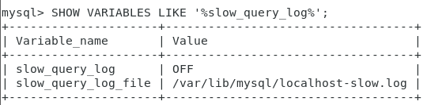
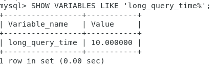

# 查询截取分析

## 慢查询日志

### 是什么？

**MySQL**的慢查询日志是**MySQL提供的一种 日志记录**，它用来记录在**MySQL**中响应时间超过阈值的语句，具体指运行时间超过**long_query_tim**值的**SQL**，会被记录到慢查询日志中。

由该日志查看哪些SQL**超出了我们的最大忍耐时间**，找出来超时的，用 **explain** 分析为什么慢。


### 怎么玩？

**默认情况下，MySQL数据库没有开启慢查询日志**，需要我们手动来设置这个参数。

当然如果不是调优需要的话，**==一般不会启动这个参数==**。因为开启慢查询日志或多或少会有一些性能上的影响，慢查询日志支持将日志记录写入文件。

```sql
-- 默认情况下slow_query_log的值为OFF，表示慢查询日志是禁用的
-- 可以通过设置slow_query_log的值来开启
SHOW VARIABLES LIKE '%slow_query_log%';

-- 使用这个语句开启了慢查询日志只对 当前数据库（不是整个MySQL的数据库） 生效，重启数据库后会失效
-- 对当前会话无效，只对设置之后创建的会话有效
SET GLOBAL slow_query_log=1;
-- 对当前会话立即起效
SET SESSION slow_query_log=1; 

-- 想永久生效的话还是修改 my.cnf 文件，其它变量也如此
```




运行时间**大于 long_query_time 的值**的语句将会被记录下来，但是==等于的不会。==

```sql
-- 查看当前多少秒算慢
SHOW VARIABLES LIKE 'long_query_time%';

-- 查看当前系统中有多少慢查询语句
SHOW GLOBAL status LIKE '%Slow_queries%';
```



my.cnf 文件中添加如下配置，之后重启，就是在配置文件中配置了：

```sql
[mysqld]下配置：
slow_query_log=1;
slow_query_log_file=/var/lib/mysql/xxxx-slow.log
long_query_time=3;
log_output=FILE
```


## 批量数据脚本（比较关键）

### 建表SQL

```sql
-- 新建库
create database bigData;
use bigData;

-- 建表dept
CREATE TABLE dept(  
    id INT UNSIGNED PRIMARY KEY AUTO_INCREMENT,  
    deptno MEDIUMINT UNSIGNED NOT NULL DEFAULT 0,   
    dname VARCHAR(20) NOT NULL DEFAULT "",  
    loc VARCHAR(13) NOT NULL DEFAULT ""  
) ENGINE=INNODB DEFAULT CHARSET=UTF8 ;  

-- 建表emp
CREATE TABLE emp  (  
    id INT UNSIGNED PRIMARY KEY AUTO_INCREMENT,  
    empno MEDIUMINT UNSIGNED NOT NULL DEFAULT 0, /*编号*/  
    ename VARCHAR(20) NOT NULL DEFAULT "", /*名字*/  
    job VARCHAR(9) NOT NULL DEFAULT "",/*工作*/  
    mgr MEDIUMINT UNSIGNED NOT NULL DEFAULT 0,/*上级编号*/  
    hiredate DATE NOT NULL,/*入职时间*/  
    sal DECIMAL(7,2) NOT NULL,/*薪水*/  
    comm DECIMAL(7,2) NOT NULL,/*红利*/  
    deptno MEDIUMINT UNSIGNED NOT NULL DEFAULT 0 /*部门编号*/  
)ENGINE=INNODB DEFAULT CHARSET=UTF8 ; 
```


### 设置参数log_bin_trust_function_creators

```sql
-- 查看 log_bin_trust_function_creators
show variables like 'log_bin_trust_function_creators';
-- 开启为 on
set global log_bin_trust_function_creators=1;
```


### 创建函数保证每条数据都不同

```sql
-- 产生随机字符串
DELIMITER $$
CREATE FUNCTION rand_string(n INT) RETURNS VARCHAR(255)
BEGIN -- 方法开始 
	-- 声明一个 字符窜长度为 100 的变量 chars_str ，默认值 
 	DECLARE chars_str VARCHAR(100) DEFAULT   'abcdefghijklmnopqrstuvwxyzABCDEFJHIJKLMNOPQRSTUVWXYZ'; 
 	DECLARE return_str VARCHAR(255) DEFAULT '';
 	DECLARE i INT DEFAULT 0;
 	-- 循环开始
 	WHILE i < n DO
 	SET return_str = CONCAT(return_str,SUBSTRING(chars_str,FLOOR(1+RAND()*52),1));
	-- concat 连接函数，substring(a,index,length) 从index处开始截取
 	SET i = i + 1;
	END WHILE;
 	RETURN return_str;
END $$
-- 假如要删除
-- drop function rand_string;

-- 用于随机产生部门编号
DELIMITER $$
CREATE FUNCTION rand_num( ) RETURNS INT(5)  
BEGIN   
 	DECLARE i INT DEFAULT 0;  
 	SET i = FLOOR(100+RAND()*10);  
	RETURN i;  
END $$
-- 假如要删除
-- drop function rand_num;
```


### 创建存储过程

```sql
-- 创建往emp表中插入数据的存储过程
DELIMITER $$
CREATE PROCEDURE insert_emp(IN START INT(10),IN max_num INT(10))  
BEGIN  
DECLARE i INT DEFAULT 0;   
	-- set autocommit = 0 把 autocommit 设置成 0，不自动提交事务，提高执行效率
     SET autocommit = 0;    
     -- 重复
     REPEAT  
         SET i = i + 1;  
         INSERT INTO emp (empno, ename, job, mgr, hiredate, sal, comm, deptno) 
         VALUES ((START+i) ,rand_string(6),'SALESMAN',0001,CURDATE(),FLOOR(1+RAND()*20000),FLOOR(1+RAND()*1000),rand_num());  
     UNTIL i = max_num   -- 直到 i到达最大值 上面也是一个循环
     
     END REPEAT;  -- 满足条件后结束循环
     COMMIT;   -- 执行完成后一起提交
 END $$
 
-- 删除
-- DELIMITER ;
-- drop PROCEDURE insert_emp;

-- 创建往dept表中插入数据的存储过程
-- 执行存储过程，往dept表添加随机数据
DELIMITER $$
CREATE PROCEDURE insert_dept(IN START INT(10),IN max_num INT(10))  
BEGIN  
DECLARE i INT DEFAULT 0;   
	SET autocommit = 0;    
    REPEAT  
        SET i = i + 1;  
        INSERT INTO dept (deptno ,dname,loc ) VALUES (START +i ,rand_string(10),rand_string(8));  
    UNTIL i = max_num  
    END REPEAT;  
    
    COMMIT; 
END $$ 

-- 删除
-- DELIMITER ;
-- drop PROCEDURE insert_dept;
```


### 调用存储过程

```sql
DELIMITER ;
CALL insert_dept(100,10); 

-- 执行存储过程，往emp表添加50万条数据
DELIMITER ;    -- 将结束标志换回 ;
CALL insert_emp(100001,480000); 
```


### 测试题

```sql
-- 查询 部门编号为101的，且员工编号小于100100的用户，按用户名称排序
SELECT sql_no_cache * FROM emp WHERE deptno = 101 AND empno < 100100 ORDER BY ename;

-- 分析语句结果
EXPLAIN SELECT sql_no_cache * FROM emp WHERE deptno = 101 AND empno < 100100 ORDER BY ename;

*************************** 1. row ***************************
           id: 1
  select_type: SIMPLE
        table: emp
   partitions: NULL
         type: ALL -- ALL 最坏情况
possible_keys: NULL
          key: NULL
      key_len: NULL
          ref: NULL
         rows: 498316
     filtered: 3.33
        Extra: Using where; Using filesort -- 出现 filesort
1 row in set, 2 warnings (0.00 sec)

-- 优化开始
-- 建立索引
-- 我们得尽量给 where 的过滤条件以及 order by 排序用上索引
-- 但是此时我们两个字段 deptno，empno是过滤条件，ename是排序条件

-- 第一次优化的索引及测试
CREATE INDEX ind_dno_eno_ena ON emp(deptno,empno,ename);
EXPLAIN SELECT sql_no_cache * FROM emp WHERE deptno = 101 AND empno < 100100 ORDER BY ename;
-- 0.27s
-- 我们发现并没用上索引，没有 filesort 解决问题，删除索引

-- 第二次优化的索引及测试
CREATE INDEX ind_dno_ena ON emp(deptno,ename);
EXPLAIN SELECT sql_no_cache * FROM emp WHERE deptno = 101 AND empno < 100100 ORDER BY ename;
-- 0.09s
-- 确实使用了索引，而且速度提高了3倍

-- 第三次优化的索引及测试
CREATE INDEX ind_dno_eno ON emp(deptno,empno);
EXPLAIN SELECT sql_no_cache * FROM emp WHERE deptno = 101 AND empno < 100100 ORDER BY ename;
-- 0.01s
-- 出现 filesort ，但是查询时间比上一次的高了 10 倍，怎么回事？


```

**出现 filesort 但是查询时间比上一次的高了 10 倍，怎么回事？**

- 原因是：**==所有的排序都是在条件过滤之后才执行的==**，所以**如果条件过滤了大部分数据**的话，**几百几千条数据进行排序其实并不是很消耗性能**，所以在这种情况下，**即使索引优化了排序但实际提升性能很有限**。相对的 **empno**。
- 结论： 当范围条件和 **group by** 或者 **order by**  的字段出现二选一时 ，**优先观察条件字段的过滤数量**，**如果过滤的数据足够多**，而**需要排序的数据并不多时，优先把索引放在范围字段上**。==反之，亦然==。


## Show Profile（估计之后再补）

这个配合Explain来说，效果拔群。

```sql
-- 查看结果
show profiles;

-- 诊断SQL，(n为上一步前面的问题SQL数字号码)
show profile cpu,block io for query n;  
```


## 全局查询日志

永远不要在生产环境下开启这个功能。