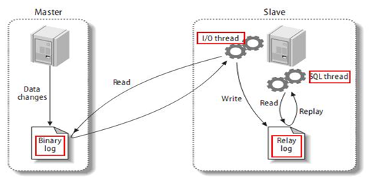

# 复制的基本原理

slave（从主机）会从 master（主主机）读取 binlog 来进行数据同步。

## 三步骤 + 原理图

MySQL的复制是异步且串行化的。

- 第一步：
  - master 将改变记录到它的 binlog 中，这些记录过程叫做二进制日志时间，binary log events
- 第二步：
  - slave 将 master 的binary log events 通过 I/O线程 拷贝到它的中继日志（relay log）。
- 第三步：
  - slave 中重做中继日志中的事件，将改变应用到自己的数据库中。

# 复制的基本原则

- 每个 slave 只能有一个 master。
- 每个 slave 只能有唯一的服务器 ID。
- 每个 master 可以有多个 slave。

# 复制的最大问题

**==延时==**

# 主从复制

## 一主一从常见配置

MySQL版本必须一致，并且都保证在后台以服务运行中。

主从都配置在 **mysqlid**节点下，都是小写。

### 主机修改 my.in 配置文件

1. 主服务器唯一ID（必须）
   - `server-id = xxx(不唯一)`
2. 启用二进制文件日志（必须）
   - `log-bin = [自己的本地路径]/data/mysqlbin`
   - `log-bin = X:/XXX/MySQLServerX.X/data/mysqlbin`
3. 启用错误日志（可选）
   - `log-err = [自己的本地路径]/data/mysqlerr`
   - `log-err = X:/XXX/MySQLServerX.X/data/mysqlerr`
4. 根目录（可选）
   - `basedir = [自己的本地路径]`
   - `basedir = "X:/XXX/MySQLServerX.X"`
5. 临时目录（可选）
   - `tmpdir= [自己的本地路径]`
   - `tmpdir= "X:/XXX/MySQLServerX.X"`
6. 数据目录（可选）
   - `datadir= [自己的本地路径]`
   - `datadir= "X:/XXX/MySQLServerX.X"`
7. read-only = 0
   - 设置主机，读写都可以。
8. 设置不需要复制的数据库（可选）
   - `binlog-ignore-db = [不需要复制的数据库名]`
9. 设置需要复制的数据库（可选）
   - `binlog-do-db = [需要复制的数据库名]`

### 从机修改 my.in 配置文件

1. 从服务器唯一 ID
2. 启用二进制文件（可选）

### 主从机都关闭防火墙

**windows** 手动关闭。

关闭虚拟机 **linux** 防火墙 `service iptables stop`。

### 在 Windows 主机上建立账户并授权

- `GRANT REPLICATION SLAVE ON *.* TO 'zhangsan'@'从机器数据库IP' IDENTIFIED BY 'xxxxxxx';`

- **subtopic**。

- **flush privileges**。

- 查询 **master** 的状态
  - `show master status`
  - 
  - ==记录下 **file** 和 **posistion** 的值。==

- 执行完此操作后为了防止主服务器状态值发生变化，所以不要再操作主服务器 MySQL。

### 在 Linux 从机上配置需要复制的主机

- `CHANGE MASTER TO MASTER_HOST='主机IP',MASTER_USER='主机用户名',MASTER_PASSWORD='主机用户密码',MASTER_LOG_FILE='File名字',MASTER_LOG_POS=Position数字;`
- 启动从服务器复制功能
  - start slave；
- show slave status
  - 如果下列两个参数都是 yes 就说明主从配置成功。
  - 