#### 数据库的超键、候选键、主键、外键分别是什么？

- **超键**：在关系模式中，能唯一标识元组的**属性集**称为超键。
- **候选键**：是最小的超键，没有冗余元素的超键。
- **主键**：数据库表中对存储数据对象予以唯一和完整标识的数据列或属性的组合。一个数据列只能有一个主键，且主键的值不能为空。
- **外键**：也就是一个表中存在的另一个表的主键。

#### 数据库三大范式？

- **第一范式**：表中所有列都不可拆分。

- **第二范式**：在第一范式的基础上，表中的列不能依赖主键的一部分，属性完全依赖主键，也就是说一张表完成一件事情。

- **第三范式**：属性不依赖与其它非主属性，属性直接依赖于主键

三大范式只是一般设计数据库的基本理念，可以建立冗余较小、结构合理的数据库。如果有特殊情况，当然要特殊对待，数据库设计最重要的是看需求跟性能，**需求>性能>表结构**。所以不能一味的去追求范式建立数据库。

#### 一条 SQL 是怎么执行的？

这就是考察我们对于 MySQL 数据库架构的知识：

首先客户端先请求连接，数据库连接池建立连接，查询权限，是否合法，然后查询缓存（8.0 版本之前），是否命中，命中就返回，否则进行解析器阶段，解析器阶段主要进行词法分析，分析 SQL 所用到的所有词，再由语法分析器完成 SQL 解析树，然后预处理器去进一步检查解析树是否合法，生成新的解析树，然后进入到查询优化器，或得最优执行计划，之后交给执行器执行查调用存储引擎的接口到磁盘文件中查找并返回数据。

#### 日常中你是怎么优化 SQL 的？

利用索引啦，避免返回不必要的数据行啦，适当的分批量进行，优化 SQL 结构，分库分表啦

#### SQL 优化的一般步骤是啥？

- **`show status`**：用它来了解各种 sql 的执行效率。
- 慢查询日志：用它来找到超出系统时间限制的问题 SQL。
- **`explain`**：用它来查看这个问题 SQL 的执行计划，然后优化它。
- 查看是否涉及多表和子查询，优化 SQL 结构，例如去除冗余字段，是否可以拆表等。

#### 你提到了索引，那么介绍一下MySQL 的索引？

索引是帮助 MySQL 高效获取数据的有序的数据结构，排好序的快速查找数据结构。

在数据之外，数据库系统还维护着满足特定查找算法的数据结构，这些**数据结构以某种方式引用指向数据**，这样就**可以在这些数据结构上实现高级查找算法，这种数据结构就是索引**。

#### MySQL 索引为什么选择 B+ 树？

因为从从没有索引开始，得全表遍历，但是数据越来越多，那么时间开销就会越来越大，这种情况下，我们就得建立一种数据结构，一种能够快速有效的通过映射来查询数据的数据结构，这就是 **MySQL** 中的索引。

首先我们想到**普通二叉树**，但是由于特殊情况，普通二叉树会变成一个链表，那和全表遍历效率没啥区别，那么使用**哈希表**呢？哈希表虽然查询速度优秀，但是它不能支持范围查询啊。所以我们开始使用一些**特殊树结构**，用**红黑树**，它的查找范围和查找速度都十分优秀，但是，如果数据特别大，那么这棵红黑树的结构也会特别大，深度不可控，所以，我们此时的重点就在找到一个==可控深度的，支持范围查询的，查询时间稳定的数据结构==，但是这样的数据结构，往往还是有一定的**缺点，比如每次更新树结构的代价都很大**。

**`B-tree`** 就来了，它是一棵绝对平衡的多路树，深度可控，但是，查询效率可能还是不太稳定，如果数据量大的话，**I/O次数**不稳定带来的也许是未知的风险。

所以，我们就又得找在 **`B-tree`** 的基础上，**I/O次数更加稳定**的一种数据结构，所以就改造出来了 **`B+tree`**，这种树呢所有的子节点都不存放数据，所有数据都存在叶子节点上，那么 I/O 次数，相对于 **`B-tree`** 更稳定了，相邻叶子节点间还用了双向链表连接，所以范围查询更加简便，效率更高，而且，如果非叶子节点不存储数据的话就意味着可以存储更多的键值，树就会更矮更胖，所以 MySQL 选择使用 B+ 树作为索引

每个结点都作为一个磁盘页

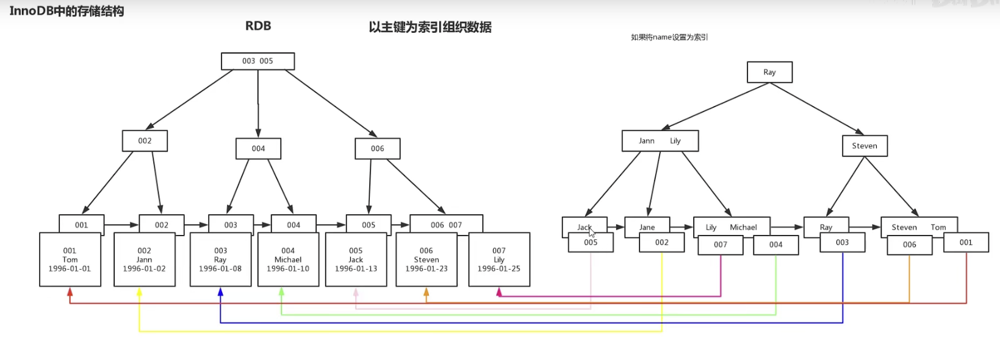

#### B 树和B+ 树 的区别能说一下吗？

上面那题回答得很清楚了：

- 前者查询次数不稳定，后者更加稳定。
- 前者范围查询没有后者范围查询高效。
- 前者每个结点都有数据，后者只有叶子节点存放数据。

#### 聚簇索引与非聚簇索引的区别说一下呗？

- 一个表中只能拥有一个聚集索引，非聚集索引可以存在许多个。
- 聚簇索引，索引中的键值的逻辑顺序决定了表中相应行的物理顺序；非聚簇索引，索引中索引的逻辑顺序与磁盘上行的物理存储数据不同。
- 索引是通过二叉树的数据结构来描述的，我们可以这么理解聚簇索引：索引的叶节点就是数据结点；而非聚簇索引的叶节点仍然是索引结点，只不过有一个指针指向对应的数据块。
- 聚簇索引就是物理存储按照索引排序，非聚簇索引就是物理存储不按照索引排序。

#### 使用索引的注意事项？

- 尽量满足最左前缀法则。
- 小表驱动大表。
- 如果是字符串，记得打单引号，避免类型转换带来的失效。
- 查询条件包含 **`or`** 可能会失效。
- **`like`** 通配符百分号在前的都会失效，但是有解决办法，就是 **`like`** 的字段有复合索引，并且**`like`** 出的数据范围在复合索引字段中。
- 避免对索引字段运算。
- 建议不要使用不等于，大于小于 **`not in`** 之类的。
- **`join`** 操作建议小表驱动大表，两表编码格式一样。
- 避免对所有字段使用函数。
- 索引字段上使用 **`is null， is not null，`**可能导致索引失效。

#### 索引的优缺点？

- 优点：

  - 唯一索引可以保证数据库表中每一行数据的唯一性。
  - 索引可以加快查询速度。

- 缺点：

  - 创建和维护索引耗费时间。
  - 索引需要占用物理空间，除了数据表会占用物理空间之外，每个数据表中字段对应的索引也会占用物理空间。
  - 表中数据增删改会导致索引重建，耗时的动态维护。

  

#### 啥时候不适合使用索引呢？

表的数据很少的时候，毕竟 MySQL 还是挺厉害的，还有就是例如性别的那种字段，因为辨识度不高，还有频繁得进行增删改的表，因为重建索引很好性能。

#### limit 1000000 加载很慢的话，你是怎么解决的呢？

如果 id 是连续的，我们可以返回上次查询的最大记录（偏移量），然后再往下 limit；

如果业务允许限制页数：那么就讨论业务，有没有必要这么分页，因为很多用户都不会去翻太多页的。

**`order by`** + 索引（id为索引）。

#### innodb和myisam这俩引擎的区别？

- 前者支持事务，后者不支持；
- 前者支持行级锁，后者不支持；
- 文件结构也不同，前者**`.idb`** 后者 **`.frm、.MYD、.MTI`**；
- 前者必须有主键，后者可以没有；
- 前者需要更多的内存存储，后者可被压缩，存储空间较少；
- 前者支持 **`MVCC`** ，后者不支持。
- 前者 **`select count(*) from table`** 全表扫描，速度慢，后者一个变量保存整个表的行数，可以直接读取效率快；
- 前者可以进行数据库持久化，因为有 redo log，后者没有；

#### 隔离级别都有啥呢？对应都有啥情况出现？

- 读未提交：出现脏读，不可重复读，幻读。
- 读已提交：出现不可重复读，幻读。
- 可重复读：出现幻读。
- 串行化：解决一切，并发环境中并行发生只会效率大大降低。

#### 那么这几种出现的错误你来介绍一下吧？

**脏读**：一个事务读到了别的事务未提交的数据。

**不可重复读**：一个事务范围内，两个相同的查询返回不同的结果。

**幻读**：一个事务查询范围结果集。另一个并发事务往这个范围中插入/删除了数据，并且提交，造成了前一个事务在提交之前再次查询这个范围读到的结果集不一样。

#### 好，那么高并发情况下，如何做到安全的修改同一行数据呢？

我们从同一行数据切入，要保证安全修改，那肯定同一时刻只能有一个线程修改它，别的线程只能等待。

那么这样的话，我们一般有两种概念锁可以解决，悲观锁和乐观锁。

- **悲观锁**：
  - 当前线程要尽量修改数据的时候，别的线程都得被拒之门外，例如：**`select * from User where name=‘jay’ for update`**，**`for update`** 它会锁定 **`User`** 表中所有满足 **`name = ‘jay’`** 的记录，在本次事务提交之前，别的线程无法修改这些记录。

- **乐观锁**：
  - 顾名思义它很乐观，有线程过来，先放过去修改，如果看到别的线程没修改过，就可以修改成功，如果别的线程修改过，就修改失败或者重试。实现方式：乐观锁一般会使用版本号机制或 **`CAS`** 算法实现。

#### 提到 MVCC 啦？来回答一下吧

MVCC （multi-version-concurrent-control）多版本并发控制，是一种并发控制的方法。

主要靠，事务版本号，表的隐藏字段（**`db_row_id, db_trx_id, db_roll_ptr, delete_bit`**）

undo log 和 read view 来实现，通过这些东西的组合来解决读写冲突并且不加锁的问题。

在并发读写数据库时，可以做到在读操作时不用阻塞写操作，写操作也不用阻塞读操作，提高了数据库并发读写的性能 同时还可以解决脏读，幻读，不可重复读等事务隔离问题，但不能解决更新丢失问题。

#### 你是如何理解 MySQL 的四大性质的？

- **原子性（atomicity）**：事务作为一个整体来执行，要么全部被执行，要么全部不被执行。
- **一致性（consistency）**：比如 A 给 B 转10块钱，不管发生了什么，他俩的总金额不能变，其它三性质保证了事务的一致性。
- **隔离性（isolation）**：多个事务在并发环境下出现并行访问，事务之间是相互隔离的，事务之间不会影响运行效果。
- **持久性（durability）**：事务一旦完成对数据库所作的操作更改，那么将持久的保存在数据库中。

#### 他们在 MySQL 中是如何实现的？

- **原子性（atomicity）**：是使用 **`undo log`** 日志来实现的，具体是啥就不说了，事务执行过程中如果出错或者用户手动 **`rollback`**，系统就会调用 **`undo log`** 日志将数据库恢复到事务执行前的状态。
- **持久性（durability）**：通过 **innoDB**引擎 的 **`redo log`** 来实现，只要 **`redo log`** 日志持久化了，当系统崩溃，即可通过 **`redo log`** 把数据恢复。
- **隔离性（isolation）**：通过 乐观锁 和MVCC 多版本并发控制来实现。
- **一致性（consistency）**：通过实现原子性，持久性，隔离性从而实现的一致性。

#### 数据库主键自增可能会出现什么问题？

如果对数据库进行分库分表，很可能会出现主键重复的情况，但是理论上我们不允许主键重复，并且主键自增会产生表锁，引发主键用完的问题，简单点可以考虑使用 **`UUID`**。

#### 主从复制的步骤？

1. 主库的 DML 事件，都被写到 **`binlog`** 中。
2. 从库请求与主库建立连接，连接建立。
3. 主库此时创建一个 **`binlog dump thread`**，把 **`binlog`** 的内容发送到从库。
4. 从库启动之后，创建一个 I/O 线程，读取从主库传过来的 **`binlog`** 内容并写入到 **`relay log`** 中。
5. 从库还会创建一个 SQL 线程，从 **`relay log`** 里面读取内容，从 **`Exc_Master_Log_Pos`** 位置开始执行读取到的更新事件，将更新内容写入到 **`slave（从库）`** 的 **`db（数据库）`**中。

#### 主从复制出现同步延迟的原因来说一下吧？

emmm，也就是说一个服务器开放了 N 个连接给客户端来连接，这样的话会有高并发的更新操作，但是从服务器的里面读取 **`binlog`** 的线程只有一个，所以当某个 SQL 在从服务器上执行的时间稍长或者由于某个 SQL 要进行表锁（例如主键自增）就会导致，主服务器的 SQL 大量积压，未被同步到从服务器，这就导致了主从延迟。

也就是说，从服务器可能会有慢 SQL 上表锁，导致其它要同步的 SQL 延迟运行。

#### 那么有没有什么办法能够解决主从同步延迟呢？

- 最暴力的就是给从数据库换更好的硬件。
- 其次暴力的就是增加从数据库数量，这样的话就可以降低负载。
- 把一台从服务器当作备份使用，也就是说该从服务器不提供查询，那么这样就专注于与主库保持同步，因为没有什么业务会通过它来进行，所以负载也下来了，执行 **`relay log`** 中的 SQL 的效率自然就高了。
- 主服务器要负责更新操作，对安全性的要求比从服务器要高，所以有些设置参数可以修改，比如**`sync_binlog = 1，innodb_flush_log_at_trx_commit = 1`** 之类的设置等。

#### 说一说innodb日志吧？

两种：**`undo log`** 和 **`redo log`**。

#### 这俩日志的存放形式？

- **redo log ：**
  - 在页修改的时候，先写到 **`redo log buffer`** 中，然后写到 **`redo log`** 的文件系统缓存里（**`fwrite`**），然后再同步到磁盘文件（**`fsync`**），两次系统调用。
- **undo log ：**
  - 在 MySQL 5.5 之前，**`undo log`** 日志只能存放在 **`ibdata`** 文件中，5.6 之后，可以通过设置 **`innodb_undo_tablespaces`** 把参数存放到 **`ibdata`** 文件之外。

#### 事务是如何通过日志来实现的？

首先啊，事务在修改页的时候，要先将本次修改的 **`undo log`** 记录到 **`redo log`** 中，然后再把修改页修改之后的 **`redo log`** 记录下来，并且 **`redo log`** （**此时包括了 `undo log` 和 修改后的 `redo log`**）要比数据修改后的结果先持久化到磁盘。

其次事务需要回滚的时候，因为有 **`redo log`** 中的 **`undo log`** ，所以可以把数据页回滚到原来的状态，崩溃恢复的话，如果 **`redo log`** 中事务没有对应的 commit 记录，那么就需要用崩溃时 **redo log 中记录的 undo log 来进行回滚**。

如果有 **commit** 记录，就用 **`redo log`** 来恢复。 

#### 啥是存储过程啊？说一下呗

**存储过程**：他就是一个预编译好的 SQL 语句或 SQL 语句块，这些 SQL 语句代码像 JAVA 中的方法一样会去实现一些功能（比如说对单表或者多表的增删改查），然后给这些代码块去一个名字，在用到的时候调用即可。

#### 存储过程的优点有哪些呢？

- 显而易见，预编译的SQL语句块，那么它的执行效率肯定比较高。
- 其次存储过程在服务器端运行，减少了客户端的压力。
- 允许 SQL 语句模块化的设计，只需要创建一个过程，在后续业务中就可以随意调用，类似于方法复用，一个存储过程代替了大量的 SQL 语句，可以降低网络通信量，提高通信速率。比如要传一堆 SQL ，有了存过程，将这些 SQL 对应的存储过程调用指令传过去就可以减少网络通信负载。
- 可以一定程度上的确保数据安全，我传存储过程的调用指令，不传具体 SQL ，那么就不容易暴露数据库的某些信息。
- 

#### 存储过程的缺点又有哪些呢？

- 调试 SQL 会很麻烦。
- 可移植性不高，不够灵活。
- 重新编译问题。

#### 说了这么多，你来说一下mysql的事务呗？

我认为，事务在计算机中的比较泛化的意思就是，一组操作，要么全部成功，要么失败。具体到 mysql 中，就是**一组sql组成的操作逻辑单元，要么全部执行成功，要么全部失败，不可分割**。也就是说，事务在执行过程中一旦出错，那么就会回滚到事务开始前的状态，这个过程是由 **undo log 日志**加持的。

因为事务基本都是一组 sql 操作，所以，我们可以知道，事务主要是来处理那些操作量大，并且复杂度高的数据。

#### 说一下事务的四大特性？

- 原子性（atmicity）就是一次执行要么全部成功要么全部失败。
- 隔离性（isolation）同一时间，只允许同一个事务请求同一个数据，不同的事务之间彼此没有任何干扰。
- 持久性（durability）事务一旦完成，那么就会永久改变数据库，不能回滚。
- 一致性（consistency）原子性、持久性、隔离性保证了一致性。一致性指事务必须使数据库从一个一致性状态转换为另一个一致性状态，也就是说一个事务执行之前和执行之后都必须处于一致性状态，拿转账来说，假设用户A和用户B两者的钱加起来一共是5000，那么不管A和B之间如何转账，转几次账，事务结束后两个用户的钱相加起来应该还得是5000，这就是事务的一致性。

#### 说一下事务的并发处理会带来的问题？

这个问题，通常是与我们数据库的隔离性有关，由于隔离性带来的各种并发写问题。

- 更新丢失
  - 什么是更新丢失呢，比如在纯无锁情况下，两个或者多个事务并发对一行数据然后基于最初选定的值进行更新该行，每个事务此时都不知道其它事务的存在，于是最后一个更新完毕的事务覆盖了其它事务作的更新。
- 脏读
  - 一个事务正在对一条记录修改，在这个事务完成并提交前，有另一个事务开始对这个为提交但是修改了的数据进行处理，产生一些未提交的数据依赖关系，不符合一致性要求。
  - 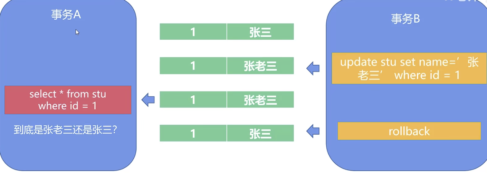
- 不可重复读
  - 事务A的流程中得多次对某个数据进行读取，在这个事务A进行期间，另一个事务B进入，对这个值进行修改并提交，此时事务A在执行流程中再次读取一遍这个数据，发现和第一次读取的值不一样。一个事务范围内两个相同的查询却返回了不同数据。
  - 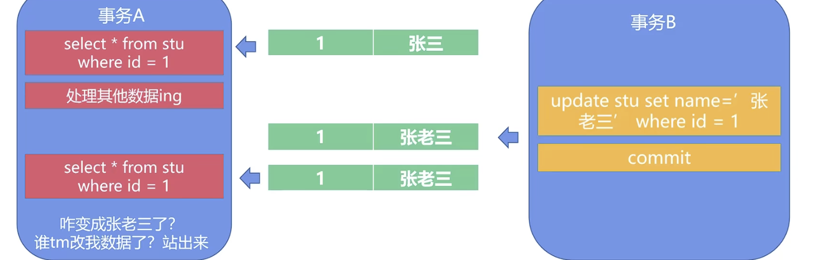
- 幻读
  - 事务A读取到了事务B提交的新增数据，不符合隔离性。
  - 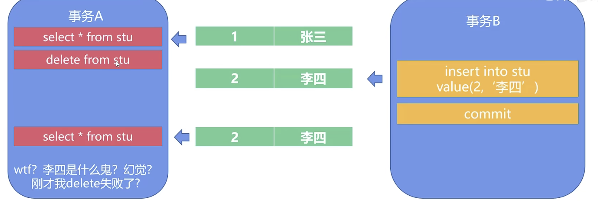

#### 那么mysql又设置了什么样的隔离级别呢？

- 读未提交：会出现所有并发问题，但是效率高。
- 读已提交：解决了脏读问题，其它未解决。
- 可重复读：解决了脏读、不可重复读，在 innodb 引擎下还解决了幻读问题。
- 串行化：都给我排好队！

mysql 默认的隔离级别是可重复读，并且从 mysql5.1 开始 innodb 数据引擎就是默认的引擎了，所以 mysql 在可重复读隔离级别下可以解决幻读问题。

#### 那么innodb引擎怎么解决的幻读？

间隙锁（行锁），这种锁开销很大，它锁的不是一个表，而是一个表中记录的某个范围行。

#### 什么是MVCC呢？

我们 mysql 在 innodb 存储引擎下，RC、RR隔离级别都是基于 MVCC（多版本并发控制）进行并发事务的控制。

++++++++++++++++++++++

**MVCC是基于数据版本**的并发控制，和我们的写时复制思想有异曲同工之妙。

我们b站IT老齐的例子来看一看：

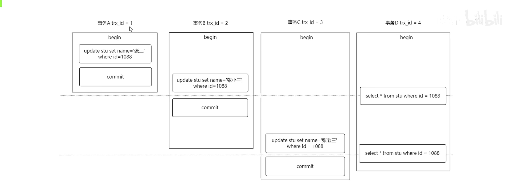

**事务四**的执行时间很微妙，第一次查询是在**事务一**提交之后，**事务二**提交之前；第二次查询是在**事务二**提交之后，**事务三**提交之前。

所以**事务四**的两次查询操作的结果如下：

- **RC级别**：第一次查询是张三，第二次查询是张小三，因为只读取提交过的事务变化。
- **RR级别**：两次都是张三，因为离**事务四**的**第一次查询最近的事务提交是在事务一提交之后**，所以第一次查询奠定了所能查到的数据版本，解决不可重复读的问题。

+++++++++++++++++++++++

我们再来看看**UNDO LOG**版本链：

这个版本链**保存了不同事务在不同时间对同一主键行所修改的内容以及执行事务提交的先后顺序**，MVCC机制正是靠这个链来进行事务的并发控制的。

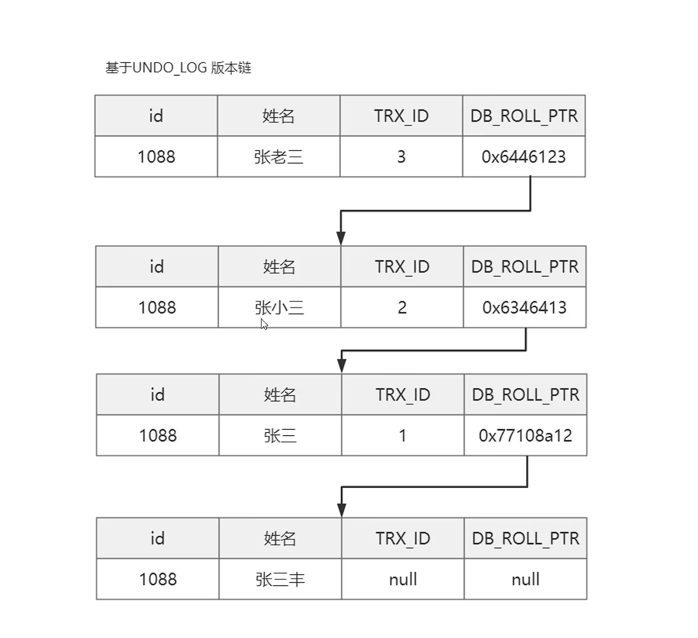

**但是 UNDO_LOG 不是会在事务回滚或提交后被删除吗？那么如果被删除了，版本链中间可能就会断了，怎么办呢？**

- 不用担心， **UNDO_LOG** 版本链不是立马删除的。
- **MySQL** 会确保版本链数据不再被引用后再进行删除。

+++++++++++++++++++

**那么版本链是起什么作用的呢？**

我们引入 **ReadView（读视图）**，这个玩意是**快照读SQL**执行的时候**MVCC提取数据的依据**。

- **快照读**：我们普通的select查询语句就是快照读。
- **当前读**：有写操作的读就被称为当前读。

++++++++++++++++++++

**RC 隔离级别下，每次快照读都会产生一个新的读视图，继续借用 IT老齐 的图片**：

- 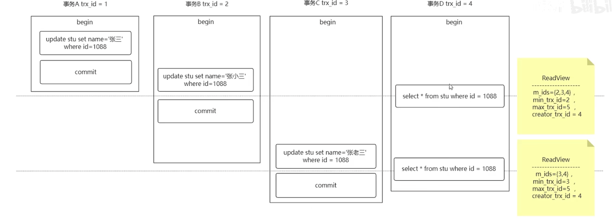

- 这个图对应的版本链：
- 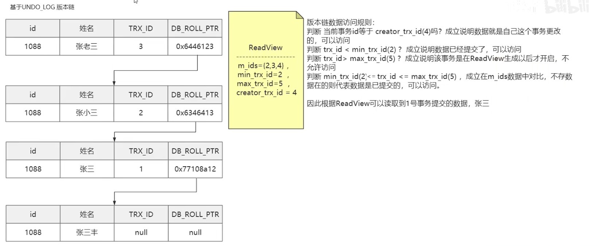
- 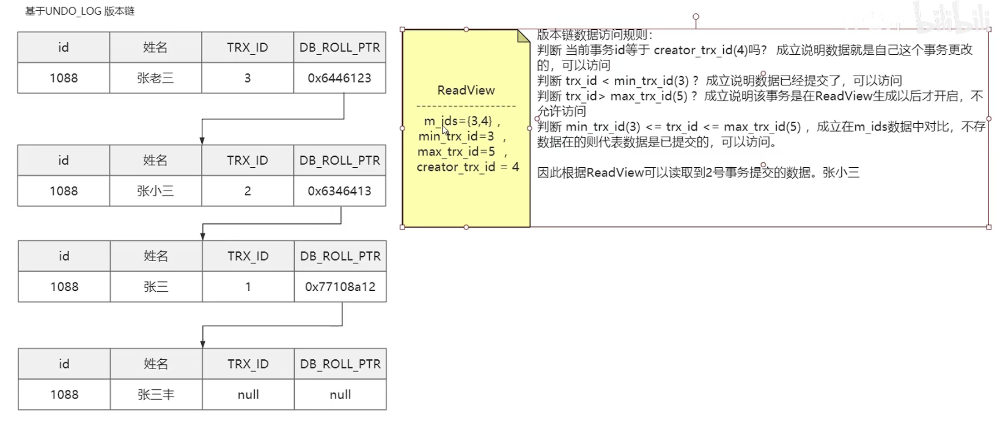

- 我们根据右侧的这个判断逻辑在版本链中不断查找属于该 ReadView 的结果，在执行完一系列判断之后，事务四的两次查询，返回的结果都与我们的推断是一样的。

**RR隔离级别下，读视图仅在第一次执行快照读的时候生成，同一个事务范围内后续快照读操作都使用同一个读视图。**但是会有例外，咱继续用 IT老齐 的图片：

- 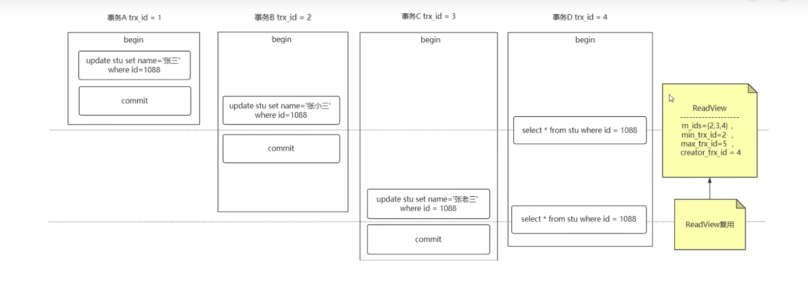

++++++++++++++++++++

**MySQL的RR级别下我们使用MVCC能避免幻读发生吗？**

肯定不能完全避免，因为 MVCC 再怎么也不是通过上锁来对事务和数据进行完全隔离，而是用版本链的形式，来变相实现了解决幻读的功能。

在连续多次快照读，也就是一个事务在 RR 级别下，有两条执行间隔很短的快照读语句，ReadView 在这样的情况下会复用，没有出现幻读问题。

但是当两次快照读之间存在当前读操作，ReadView 会重新生成，所以可能会产生幻读。

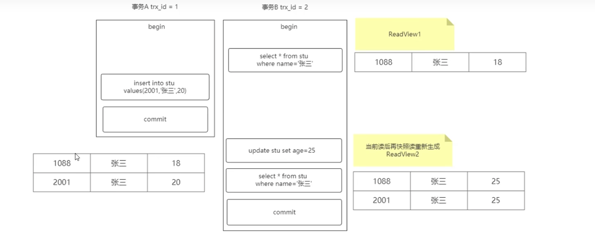

