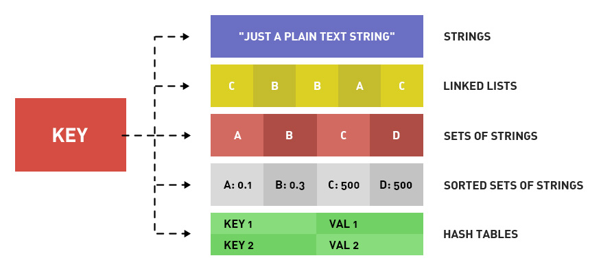
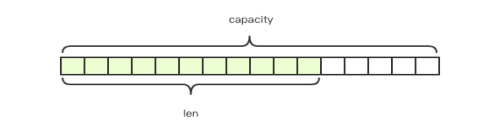
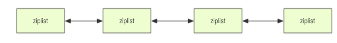
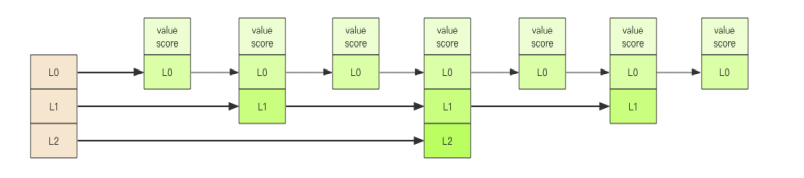

# Redis的5种基本数据类型

对于 redis 来说，所有的 ==**键（key）**== 都是字符串。

我们平常说的 Redis的基础数据结构，讨论的都是存储值的数据类型。

Redis中的五种常见的数据类型分别是：String、List、Set、Zset、Hash。




|   结构类型   |                 结构存储的值                 |                        结构的读写能力                        |
| :----------: | :------------------------------------------: | :----------------------------------------------------------: |
| String字符串 |          可以是字符串、浮点数、整数          | 对整个字符串或字符串的一部分进行操作；对整数或浮点数进行自增或者自减操作 |
|   List列表   | 一个链表，链表上的每一个结点都包含一个字符串 | 对链表的两端进行push和pop操作，读取单个或多个元素，按照值查找或删除元素 |
|   Set集合    |           包含字符串的**无序**集合           | 字符串的集合，包含基础的方法：有看是否存在添加、获取、删除；还包含计算交集、并集、差集的功能 |
|  Hash散列表  |          包含键值对的**无序**散列表          |              包含方法有添加、获取、删除单个元素              |
| Zset有序集合 |    和散列表一样，**有序**，用于存储键值对    | 字符串成员与浮点数分数之间的有序映射；元素的排列顺序由分数的大小来决定；包含添加、获取、删除单个元素以及根据分值范围或成员来获取元素 |


## String 字符串

Redis 中的 String 类型，是**二进制安全**的。

它可以**包含任何数据，如数字，字符串，图片或者序列化的对象**。

字符串是由多个字节组成，每个字节又是由 8 个 bit 组成，如此便==可以将一个字符串看成**很多 bit 的组合**，这便是 **bitmap「位图」**数据结构==。

Redis 中的 String 类型是动态的字符串，是可以修改的，内部结构是现实上是类似于 **java** 的 **arraylist**，采用预分配冗余空间的方式来减少内存呢的频繁分配，就像下面这张图这样：

- 当字符串长度**小于 1M** 的时候，扩容都是加倍现有的空间
- 如果**超过 1M** 的话，扩容一次只会多扩 1M 的空间。

**==注意：字符串最大长度为 512M。==**



字符串的结构使用十分的广泛，最常见的用途就是缓存用户信息。我们将用户信息的结构体使用 JSON 序列化成字符串，然后将序列化后的字符串塞进 Redis 来缓存。同样，在取信息的时候会对数据进行一次反序列化。


### 使用

- **基本命令**

|          命令          |           简述           |
| :--------------------: | :----------------------: |
|      GET key_name      |    获取指定键对应的值    |
|      SET key_name      |    设置指定键对应的值    |
|      DEL key_name      |    删除指定键对应的值    |
|     INCR key_name      |    将指定键存储的值+1    |
|     DECR key_name      |    将指定键存储的值-1    |
| INCRBY key_name amount | 将指定键存储的值加上整数 |
| DECRBY key_name amount | 将指定键存储的值减去整数 |


- **键值对**

```shell
> set name codehole 
OK 
> get name 
"codehole"
> exists name 
(integer) 1 
> del name 
(integer) 1 
> get name 
(nil) 
```


- **批量键值对**

可以批量对多个字符串进行读写，节省网络耗时开销。

```shell
> set name1 codehole 
OK 
> set name2 holycoder 
OK 
> mget name1 name2 name3 # 返回一个列表
1) "codehole" 
2) "holycoder" 
3) (nil) 
> mset name1 boy name2 girl name3 unknown 
> mget name1 name2 name3 
1) "boy" 
2) "girl" 
3) "unknown"
```


- **计数**

如果我们的 **value** 此时是一个**整数**，还可以对它进行自增自减操作，但是是有范围的，范围是 signed long 的最大值最小值，超过了这个值的话，**redis** 会报错。

```shell
> set age 30 
OK 
> incr age 
(integer) 31 
> incrby age 5 
(integer) 36 
> incrby age -5 
(integer) 31 
> set codehole 9223372036854775807 # Long.Max 
OK 
> incr codehole
(error) ERR increment or decrement would overflow # 报错内存溢出
```

还有一些set命令扩展，可以对 key 设置过期时间，到点自动删除啦，在这里就不去做了，太麻烦了。


### 实战场景

> 著作权归https://pdai.tech所有。 链接：https://www.pdai.tech/md/db/nosql-redis/db-redis-data-types.html

- **缓存**：
  -  经典使用场景，把常用信息，字符串，图片或者视频等信息放到redis中，redis作为缓存层，mysql做持久化层，降低mysql的读写压力。
- **计数器**：
  - redis是单线程模型，一个命令执行完才会执行下一个，同时数据可以一步落地到其他的数据源。
- **session**：
  - 常见方案spring session + redis实现session共享。


## List 列表

**Redis** 中的 **List** 是一个**双向链表**，相当于 **java** 中的 **linkedlist**。

当 List 弹出了最后一个元素之后，该数据结构自动被删除，内存被回收。i 

Redis 的列表结构常用来做异步队列使用。

将需要延后处理的任务结构体序列化成字符 串塞进 **Redis** 的 **List**，另一个线程从这个列表中**轮询数据**进行处理。

使用 **List** 结构，我们可以相对轻松地实现**最新消息排队功能**（比如新浪微博的TimeLine）。所以 **List** 的**另一个应用就是消息队列**，可以利用 **List** 的 **push** 操作，将任务存放在 **List** 中，然后工作线程再用 **pop** 操作将任务取出进行执行。


### 使用

- **基本命令**

|       命令       |                             简述                             |
| :--------------: | :----------------------------------------------------------: |
| LPUSH key value  |               将给定值添加到链表的头部（左端）               |
| RPUSH key value  |               将给定值添加到链表的尾部（右端）               |
|     LPOP key     |           从链表的左端弹出一个值，并返回被弹出的值           |
|     RPOP key     |           从链表的右端弹出一个值，并返回被弹出的值           |
|  LRANGE key 0-x  |                 获取列表在给定范围上的所有值                 |
| LINDEX key index | 通过索引获取列表中的元素。你也可以使用负数下标，以 -1 表示列表的最后一个元素， -2 表示列表的倒数第二个元素，以此类推 |


- **右边进左边出：队列** 

```shell
> rpush books python java golang 
(integer) 3 
> llen books 
(integer) 3 
> lpop books 
"python" 
> lpop books 
"java" 
> lpop books 
"golang" 
> lpop books 
(nil)
```


- **右边进右边出：栈**

```shell
> rpush books python java golang 
(integer) 3 
> rpop books 
"golang" 
> rpop books 
"java" 
> rpop books 
"python" 
> rpop books
(nil)
```


- **快速列表** 

查阅资料发现这个 **Redis** 底层存储的不是一个简单的链表，而是称之为 快速链表 `quicklist`。

在列表元素较少的时候，理论上会使用一块连续的内存来存储，这个结构在 **Redis** 中”被压缩“成了一个 **ziplist**结构，也可以字面翻译为压缩列表。它将所有元素紧挨着一起存储，分配的是一块连续的内存。当数据量比较多的时候才会改成 **quicklist** 的一个结构。

因为普通的链表需要的**附加指针空间太大**，会比较浪费空间，而且 **会加重内存的碎片化**。比如这个列表里存的只是 **int** 类型的数据，结构上还需要两个额外的指针 **prev** 和 **next** 。所以 **Redis** 将==**链表**和 **ziplist** **结合起来组成了** **quicklist**==。**也就是将多个 ziplist 使用双向指针串起来使用**。

这样既**满足了快速的插入删除性能**，又不会出现太大的**空间冗余**。





### 实战场景

>著作权归https://pdai.tech所有。 链接：https://www.pdai.tech/md/db/nosql-redis/db-redis-data-types.html

- 微博 TimeLine：
  - 有人发布微博，用 lpush加入时间轴，展示新的列表消息。
- 消息队列


## Set 集合

**Redis** 中的集合是通过哈希表实现的，相当于 **java** 中的 **hashset**，所以添加，删除，查找等操作时间复杂度都是 O(1)。

它内部实现相当于就是一个特殊的字典，**字典中所有的 value 都是一个值 NULL**。

当集合中最后一个元素移除之后，数据结构自动删除，内存被回收。 

因为集合有去重功能，所以 **set** 结构可以设想用来存储抽奖活动中中奖的用户的ID，可以保证唯一性，这样就不会出现一个人中奖两次的情况了。


### 使用

- **基本命令**

|         命令         |                 简述                  |
| :------------------: | :-----------------------------------: |
|    SADD key value    |       向集合添加一个或多个成员        |
|      SCARD key       |           获取集合的成员数            |
|  SMEMBER key member  |         返回集合中的所有成员          |
| SISMEMBER key member | 判断 member 元素是否是集合 key 的成员 |

- **基本使用**

```shell
> sadd books python 
(integer) 1 
> sadd bookspython # 重复
(integer) 0 
> sadd books java golang 
(integer) 2 
> smembers books # 注意顺序，和插入的并不一致，因为 set 是无序的
1) "java" 
2) "python" 
3) "golang" 
> sismember books java # 查询某个 value 是否存在，相当于 contains(o)
(integer) 1 
> sismember books rust 
(integer) 0 
> scard books # 获取长度相当于 count()
(integer) 3 
> spop books # 弹出一个
"java" 
```


### 实战场景

>  著作权归https://pdai.tech所有。 链接：https://www.pdai.tech/md/db/nosql-redis/db-redis-data-types.html

- **标签**（tag）,给用户添加标签，或者用户给消息添加标签，这样有同一标签或者类似标签的可以给推荐关注的事或者关注的人。
- **点赞，或点踩，收藏等**，可以放到set中实现。


## Hash 散列（字典）

**Redis** 的字典相当于 **Java** 语言里面的 **HashMap**，它是无序字典。

内部实现结构上同 **Java** 的 **HashMap** 也是一致的，同样的数组 + 链表二维结构。第一维 **hash** 的数组位置碰撞时，就会将碰撞的元素使用链表串接起来。

**Redis** 的字典的值只能是字符串，另外它们 **rehash** 的方式不一样，因为 **java** 中的 **hashmap** 在字典很大时，**rehash** 是个耗时的操作，需要一次性全部 rehash。Redis  为了高性能，不能堵塞服务，所以采用了==渐进式 rehash 策略==。

当 hash 移除了最后一个元素之后，该数据结构自动被删除，内存被回收。 

hash 结构也可以用来存储用户信息，不同于字符串一次性需要全部序列化整个对象， hash 可以对用户结构中的每个字段单独存储。这样当我们需要获取用户信息时可以进行**部分获取**。如果是以**整个字符串的形式**去**保存用户信息**的话就**只能一次性全部读取**，这样就会比较浪**费网络流量**。

hash 也有缺点，hash 结构的存储消耗要高于单个字符串，到底该使用 hash 还是字符串，需要具体情况具体分析。


### 使用

- **基本命令**

|             命令              |                   简述                   |
| :---------------------------: | :--------------------------------------: |
| HSET hash-key sub-key1 value1 |                添加键值对                |
|      HGET hash-key key1       |            获取指定散列键的值            |
|       HGETALL hash-key        |        获取散列中包含的所有键值对        |
|    HDEL hash-key sub-key1     | 如果给定键存在于散列中，那么就移除这个键 |

- **基本使用**

```shell
> hset books java "this is java" # 命令行的字符串如果包含空格，要用引号括起来
(integer) 1 
> hset books golang "this is go" 
(integer) 1 
> hset books python "this is python" 
(integer) 1 
> hgetall books # entries()，key 和 value 间隔出现
1) "java" 
2) "this is java" 
3) "golang" 
4) "this is go" 
5) "python" 
6) "this is python" 
> hlen books 
(integer) 3 
> hget books java 
"this is java" 
> hset books golang "learning go programming" # 因为是更新操作，所以返回 0
(integer) 0 
> hget books golang "learning go programming" 
> hmset books java "effective java" python "learning python" golang "modern golang programming" # 批量 set 
OK 
```

- **计数**

hash 结构中的单个 key 也可以进行计数。

```shell
> hincrby user age 1 
(integer) 30 
```


### 实战场景

> 著作权归https://pdai.tech所有。 链接：https://www.pdai.tech/md/db/nosql-redis/db-redis-data-types.html

- **缓存**： 能直观，相比 **string** 更节省空间，的维护缓存信息，如用户信息，视频信息等。


## Zset 有序集合

**Zset** 可能是 **Redis** 提供的**最为特色的数据结构**，Set 的基础上有序。

它类似于 **Java** 的 **SortedSet** 和 **HashMap** 的结合体，一方面==它是一个 **set**，**保证了内部 value 的唯一性**，另一方面它可以**给每个 value 赋予一个 score**，代表这个 value 的**排序权重**==。

它的内部实现用的是一种叫着==「**跳跃列表**」==的数据结构。 



**zset** 中最后一个 **value** 被移除后，数据结构自动删除，内存被回收。 


### 使用

- **基本命令**

|              命令              |                           简述                           |
| :----------------------------: | :------------------------------------------------------: |
|    ZADD zset-key xxx member    |       将一个带有给定score的成员添加到有序集合里面        |
| ZRANGE zset-key 0-x withccores | 根据元素在有序集合中所处的位置，从有序集合中获取多个元素 |
|      ZREM zset-key member      |   如果给定元素成员存在于有序集合中，那么就移除这个元素   |

- 基本使用

```shell
> zadd books 9.0 "this is java-3" 
(integer) 1 
> zadd books 8.9 "this is java-2" 
(integer) 1 
> zadd books 8.6 "this is java-1" 
(integer) 1 
> zrange books 0 -1 # 按 score 排序列出，参数区间为排名范围
1) "this is java-1" 
2) "this is java-2" 
3) "this is java-3" 
> zrevrange books 0 -1 # 按 score 逆序列出，参数区间为排名范围
1) "this is java-3" 
2) "this is java-2" 
3) "this is java-1" 
> zcard books # 相当于 count()
(integer) 3 
> zscore books "this is java-2" # 获取指定 value 的 score
"8.9000000000000004" # 内部 score 使用 double 类型进行存储，所以存在小数点精度问题
> zrank books "this is java-2" # 排名
(integer) 1 
> zrangebyscore books 0 8.91 # 根据分值区间遍历 zset
1) "this is java-1" 
2) "this is java-2" 
> zrangebyscore books -inf 8.91 withscores # 根据分值区间 (-∞, 8.91] 遍历 zset，同时返回分值。inf 代表 infinite，无穷大的意思。
1) "this is java-1" 
2) "8.5999999999999996" 
3) "this is java-2" 
4) "8.9000000000000004" 
> zrem books "this is java-2" # 删除 value
(integer) 1 
> zrange books 0 -1 
1) "this is java-1" 
2) "this is java-3"
```


### 实战场景

>著作权归https://pdai.tech所有。 链接：https://www.pdai.tech/md/db/nosql-redis/db-redis-data-types.html
>
>《Redis 深度历险：  核心原理和应用实践》--- 钱文品

-  **粉丝列表**：value 值是粉丝的用户 ID，score 是关注时间。我们可以对粉丝列表按关注时间 进行排序。 
- **成绩**：value 值是学生的 ID，score 是他的考试成绩。我们 可以对成绩按分数进行排序就可以得到他的名次。
- **排行榜**：有序集合经典使用场景。例如小说视频等网站需要对用户上传的小说视频做排行榜，榜单可以按照用户关注数，更新时间，字数等打分，做排行。


# Redis的3中特殊类型


## HyperLogLogs（基数统计）


### 是什么？

它允许容错，可以接受一定的误差

`IF A = {1,2,3,4,5} B = {3,5,6,7,8} SO 基数（不重复的元素）= {1,2,4,6,7,8}`


### 可以用来解决什么问题？

他可以在十分节省内存的情况下，去统计各种计数，比如注册 IP 数、每日访问 IP 数、页面实时UV、在线用户数、共同好友数等。


### 优势在哪？

一个大型的网站，每天 IP 比如有 100 万，粗算一个 IP 消耗 15 字节，那么 100 万个 IP 就是 15M。而 **HyperLogLog** 在 **Redis** 中**每个键占用的内容都是 12K**，理论存储近似接近 **2^64** 个值，不管存储的内容是什么，它一个基于基数估算的算法，只能比较准确的估算出基数，可以使用少量固定的内存去存储并识别集合中的唯一元素。而且这个估算的基数并不一定准确，是一个==带有 **0.81%** 标准错误的近似值==（对于可以接受一定容错的业务场景，比如IP数统计，UV等，是可以忽略不计的) 。

> 著作权归https://pdai.tech所有。 链接：https://www.pdai.tech/md/db/nosql-redis/db-redis-data-type-special.html?


### 基本命令使用

```shell
127.0.0.1:6379> pfadd key1 a b c d e f g h i	# 创建第一组元素
(integer) 1
127.0.0.1:6379> pfcount key1	# 统计元素的基数数量
(integer) 9
127.0.0.1:6379> pfadd key2 a b c d e f g h	# 创建第二组元素
(integer) 1
127.0.0.1:6379> pfcount key2
(integer) 8
127.0.0.1:6379> pfmerge key3 key1 key2	# 合并两组：key1 key2 -> key3 并集
OK
127.0.0.1:6379> pfcount key3 # 统计元素的并集基数数量
(integer) 8
```


## Bitmap（位图）

我们平时开发过程中，会有一些布尔型数据需要存取，比如出勤签到记录， 签了是 1，没签是 0，要记录 365 天。如果使用普通的 key/value，每个用户要记录 365  个，当用户上亿的时候，需要的存储空间是惊人的。 为了解决这个问题，Redis 提供了位图数据结构，这样每天的签到记录只占据一个位， 365 天就是 365 个位，46 个字节 的脸空间占用也就是说一个稍长一点的字符串就可以完全容纳下，这就**大大节约了存储空间**。

他不是特殊的数据结构，他的内容就是普通的字符串，挺像 java 中的 string，是 byte 数组。


### 基本操作

Redis 的位数组是自动扩展的，如果超出范围会自动将位图数组进行零扩充。

```shell
127.0.0.1:6379> setbit sign 0 1 
(integer) 0
127.0.0.1:6379> setbit sign 1 1
(integer) 0
127.0.0.1:6379> setbit sign 2 0
(integer) 0
127.0.0.1:6379> setbit sign 3 1
(integer) 0
127.0.0.1:6379> setbit sign 4 0
(integer) 0
127.0.0.1:6379> setbit sign 5 0 # 到这为整周打卡情况。
(integer) 0
127.0.0.1:6379> getbit sign 3 # 查看指定天数是否打卡！
(integer) 1
127.0.0.1:6379> getbit sign 5
(integer) 0
127.0.0.1:6379> bitcount sign # 统计这周的打卡记录，就可以看到是否有全勤！
(integer) 3
```

```shell
127.0.0.1:6379> set w hello
OK
127.0.0.1:6379> bitfield w get u4 0 # 从第一个位开始取 4 个位，结果是无符号数 (u)
(integer) 6
127.0.0.1:6379> bitfield w get u3 2 # 从第三个位开始取 3 个位，结果是无符号数 (u)
(integer) 5
127.0.0.1:6379> bitfield w get i4 0 # 从第一个位开始取 4 个位，结果是有符号数 (i)
1) (integer) 6
127.0.0.1:6379> bitfield w get i3 2 # 从第三个位开始取 3 个位，结果是有符号数 (i)
1) (integer) -3
```


