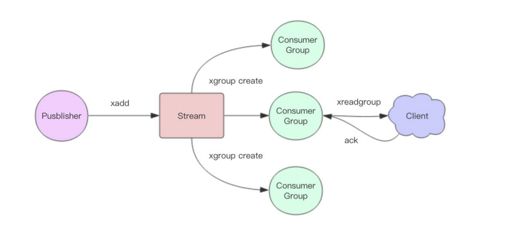
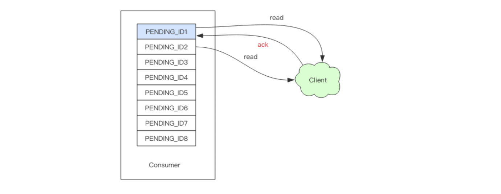
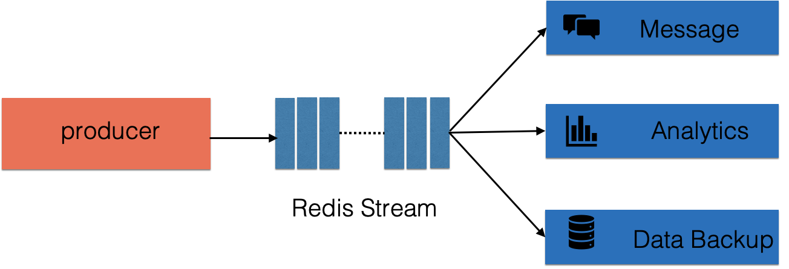
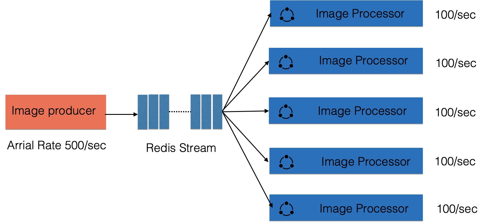

# 为什么设计Stream

基于Reids的消息队列实现有很多种，例如：

- **PUB/SUB（订阅/发布模式）**
  - 但是发布订阅模式是无法持久化的，如果出现网络断开、Redis 宕机等，消息就会被丢弃。
- 基于 **List LPUSH+BRPOP** 或者基于 **Sorted-Set** 的实现
  - 支持了持久化，但是不支持多播，分组消费等。

Redis5.0 中还增加了一个数据结构 **Stream**，从字面上看是流类型，但其实从功能上看，应该是Redis对消息队列（MQ，Message Queue）的完善实现。

==他弥补了 Redis Pub/Sub 不能支持持久化消息的缺陷。==

他是一个新的数据结构，他是一个可以支持多播持久化的消息队列。


从上图看，它将所有加入的消息形成了一个消息链表，每个小小都有一个唯一的ID以及其对应内容，而且消息是持久化的，所以代表了 **Redis** 重启之后，内容不会消失。

每个 **Stream** 都有**唯一的名称**，就是 **Redis** 的 **Key**，我们在**首次使用 `xadd` 指令**追加消息的时候会自动创建。

每个 **Stream** 都可以挂多个消费组，每个消费组会有个游标 **last_delivered_id** 在 **Stream**  数组之上往前移动，表示当前消费组已经消费到哪条消息了。

- **消费组**：

每个消费组都有一个 **Stream**  内唯一的名称，消费组不会自动创建，它需要单独的指令 `xgroup create` 进行创建，需要指定 从 **Stream** 的某个消息 ID 开始消费，这个 ID 用来初始化 **last_delivered_id** 变量。

每个消费组不会互相影响，状态独立，换句话说就是 **Stream** 内部消息会被每个消费组都消费到。

- **消费者**：

然后同一个消费组中有多个消费者，每个消费者有一个组内唯一ID，消费者之间是竞争关系，任意一个消费者读取了消息之后，**last_delivered_id** 都会往后移动。

消费者内部有个状态变量 **pending_ids** ，它记录了当前已经被客户端读取的消息但是没有确认（ack）。如果此时客户端没有 确认（ack），那么在这个变量里的消息 ID 会越来越多，一旦某个消息被确认，他才开始减少。

这个 pending_ids 变量官方称之为 PEL（Pending Entries List），一个很核心的数据结构，确保客户端至少消费了一次消息，而不会在网络传输中把没处理过的消息丢失。


# 消息ID

消息 ID 的形式它是 **timestampInMillis-sequence**，比如 123132132-21，他表示当前的消息在毫秒时间戳 123132132 产生，并且是该毫秒内的第 21 条消息。

它可以是由服务器自动生成也可是客户端自己指定，但是必须是单调递增。


# 消息内容

消息内容就是键值对，如 hash 结构的键值对。


# 基本操作

|   操作    |                      说明                      |
| :-------: | :--------------------------------------------: |
|   xadd    |                    追加消息                    |
|   xdel    | 删除消息，这里删除时逻辑删除，不影响消息总长度 |
|  xrange   |     获取消息列表，会自动过滤已经删除的消息     |
|   xlen    |                    消息长度                    |
|    del    |                   删除Stream                   |
| xrevrange |          反向获取消息列表，ID从大到小          |
|   xread   |         以阻塞或非阻塞方式获取消息列表         |

```shell
# * 号表示服务器自动生成 ID，后面顺序跟着一堆 key/value
# 名字叫 laoqian，年龄 30 岁
127.0.0.1:6379> xadd codehole * name laoqian age 30 
1527849609889-0 # 生成的消息 ID
127.0.0.1:6379> xadd codehole * name xiaoyu age 29
1527849629172-0
127.0.0.1:6379> xadd codehole * name xiaoqian age 1
1527849637634-0
127.0.0.1:6379> xlen codehole
(integer) 3
# - 表示最小值 , + 表示最大值
127.0.0.1:6379> xrange codehole - +
127.0.0.1:6379> xrange codehole - +
1) 1) 1527849609889-0
   2) 1) "name"
      2) "laoqian"
      3) "age"
      4) "30"
2) 1) 1527849629172-0
   2) 1) "name"
      2) "xiaoyu"
      3) "age"
      4) "29"
3) 1) 1527849637634-0
   2) 1) "name"
      2) "xiaoqian"
      3) "age"
      4) "1"
# 指定最大消息 ID 的列表
127.0.0.1:6379> xrange codehole - 1527849629172-0
1) 1) 1527849609889-0
   2) 1) "name"
      2) "laoqian"
      3) "age"
      4) "30"
2) 1) 1527849629172-0
   2) 1) "name"
      2) "xiaoyu"
      3) "age"
      4) "29"
127.0.0.1:6379> xdel codehole 1527849609889-0
(integer) 1
# 长度不受影响
127.0.0.1:6379> xlen codehole
(integer) 3
# 被删除的消息没了
127.0.0.1:6379> xrange codehole - +
1) 1) 1527849629172-0
   2) 1) "name"
      2) "xiaoyu"
      3) "age"
      4) "29"
2) 1) 1527849637634-0
   2) 1) "name"
      2) "xiaoqian"
      3) "age"
      4) "1"
# 删除整个 Stream
127.0.0.1:6379> del codehole
(integer) 1
```

> 《Redis深度历险：核心原理和应用实践》--- 钱文品


# 独立消费

 Redis允许在不定义消费组的情况下进行 Stream 消息的独立消费，当 Stream 没有新的消息的时候，甚至可以阻塞等待。

`xread` 指令是一个可供独立消费的指令，可以将 **Stream** 当成普通的消息队 列(list) 来使用。

使用 `xread ` 时，我们可以忽略消费组的存在。

```shell
# 从Stream头部读取两条消息
127.0.0.1:6379> xread count 2 streams codehole 0-0
1) 1) "codehole"
   2) 1) 1) 1527851486781-0
         2) 1) "name"
            2) "laoqian"
            3) "age"
            4) "30"
      2) 1) 1527851493405-0
         2) 1) "name"
            2) "yurui"
            3) "age"
            4) "29"
# 从Stream尾部读取一条消息，毫无疑问，这里不会返回任何消息
127.0.0.1:6379> xread count 1 streams codehole $
(nil)
# 从尾部阻塞等待新消息到来，下面的指令会堵住，直到新消息到来
127.0.0.1:6379> xread block 0 count 1 streams codehole $
# 我们从新打开一个窗口，在这个窗口往Stream里塞消息
127.0.0.1:6379> xadd codehole * name youming age 60
1527852774092-0
# 再切换到前面的窗口，我们可以看到阻塞解除了，返回了新的消息内容
# 而且还显示了一个等待时间，这里我们等待了93s
127.0.0.1:6379> xread block 0 count 1 streams codehole $
1) 1) "codehole"
   2) 1) 1) 1527852774092-0
         2) 1) "name"
            2) "youming"
            3) "age"
            4) "60"
(93.11s)
```

客户端如果想要使用 xread 进行顺序消费，一定要记住当前消费到哪里了，也就是返回的消息ID。下次继续调用 xread 时，将上次返回的最后一个 消息ID 作为参数传递进去，就可以继续消费后续的消息。

`block 0`表示**永远阻塞**，直到消息到来，`block 1000`表示**阻塞1s**，如果1s内没有任何消息到来，就返回 **nil**。


# 消费组消费

## 创建消费组

- 基本命令

|        命令        |                解释                |
| :----------------: | :--------------------------------: |
|   xgroup create    |            创建消费者组            |
|  xreadgroup group  |        读取消费者组中的消息        |
|        xack        |         确认消息（已处理）         |
|    xgroup setid    | 为消费者组设置新的最后递送的消息ID |
| xgroup delconsumer |             删除消费者             |
|   xgroup destory   |             删除消费组             |
|      xpending      |      显示待处理消息的相关信息      |
|       xclaim       |          转移消息的归属权          |
|    xinfo groups    |         打印消费者组的信息         |
|    xinfo stream    |             打印流信息             |



**Stream**通过的 `xgroup create` 指令来创建消费组（consumer group），需要传递其实消息ID参数用来初始化 **last_delivered_id** 变量。

```shell
# 表示从头开始消费
127.0.0.1:6379> xgroup create codehole cg1 0-0 
OK
# $表示从尾部开始消费，只接受新消息，当前Stream消息会全部忽略
127.0.0.1:6379> xgroup create codehole cg2 $
OK
127.0.0.1:6379> xinfo stream codehole  # 获取Stream信息
 1) length
 2) (integer) 3  # 共3个消息
 3) radix-tree-keys
 4) (integer) 1
 5) radix-tree-nodes
 6) (integer) 2
 7) groups
 8) (integer) 2  # 两个消费组
 9) first-entry  # 第一个消息
10) 1) 1527851486781-0
    2) 1) "name"
       2) "laoqian"
       3) "age"
       4) "30"
11) last-entry  # 最后一个消息
12) 1) 1527851498956-0
    2) 1) "name"
       2) "xiaoqian"
       3) "age"
       4) "1"
127.0.0.1:6379> xinfo groups codehole  # 获取Stream的消费组信息
1) 1) name
   2) "cg1"
   3) consumers
   4) (integer) 0  # 该消费组还没有消费者
   5) pending
   6) (integer) 0  # 该消费组没有正在处理的消息
2) 1) name
   2) "cg2"
   3) consumers  # 该消费组还没有消费者
   4) (integer) 0
   5) pending
   6) (integer) 0  # 该消费组没有正在处理的消息

```


## 消费组消费

**Stream** 提供了 **xreadgroup** 指令来进行消费组的组内消费，需要提供消费组名称，消费者名称和起始消息ID。它同 **xread** 一样，也可以阻等待新的消息，读到新消息后，对应的消息ID就会进入**消费者的PEL**（正在处理的消息）结构里，客户端处理完毕后使用 xack 指令通知服务器，本条消息已经处理完毕，该消息ID 就会从PEL中移除。

```shell
# > 号表示从当前消费组的last_delivered_id后面开始读
# 每当消费者读取一条消息，last_delivered_id变量就会前进
127.0.0.1:6379> xreadgroup GROUP cg1 c1 count 1 streams codehole >
1) 1) "codehole"
   2) 1) 1) 1527851486781-0
         2) 1) "name"
            2) "laoqian"
            3) "age"
            4) "30"
127.0.0.1:6379> xreadgroup GROUP cg1 c1 count 1 streams codehole >
1) 1) "codehole"
   2) 1) 1) 1527851493405-0
         2) 1) "name"
            2) "yurui"
            3) "age"
            4) "29"
127.0.0.1:6379> xreadgroup GROUP cg1 c1 count 2 streams codehole >
1) 1) "codehole"
   2) 1) 1) 1527851498956-0
         2) 1) "name"
            2) "xiaoqian"
            3) "age"
            4) "1"
      2) 1) 1527852774092-0
         2) 1) "name"
            2) "youming"
            3) "age"
            4) "60"
# 再继续读取，就没有新消息了
127.0.0.1:6379> xreadgroup GROUP cg1 c1 count 1 streams codehole >
(nil)
# 那就阻塞等待吧
127.0.0.1:6379> xreadgroup GROUP cg1 c1 block 0 count 1 streams codehole >
# 开启另一个窗口，往里塞消息
127.0.0.1:6379> xadd codehole * name lanying age 61
1527854062442-0
# 回到前一个窗口，发现阻塞解除，收到新消息了
127.0.0.1:6379> xreadgroup GROUP cg1 c1 block 0 count 1 streams codehole >
1) 1) "codehole"
   2) 1) 1) 1527854062442-0
         2) 1) "name"
            2) "lanying"
            3) "age"
            4) "61"
(36.54s)
127.0.0.1:6379> xinfo groups codehole  # 观察消费组信息
1) 1) name
   2) "cg1"
   3) consumers
   4) (integer) 1  # 一个消费者
   5) pending
   6) (integer) 5  # 共5条正在处理的信息还有没有ack
2) 1) name
   2) "cg2"
   3) consumers
   4) (integer) 0  # 消费组cg2没有任何变化，因为前面我们一直在操纵cg1
   5) pending
   6) (integer) 0
# 如果同一个消费组有多个消费者，我们可以通过xinfo consumers指令观察每个消费者的状态
127.0.0.1:6379> xinfo consumers codehole cg1  # 目前还有1个消费者
1) 1) name
   2) "c1"
   3) pending
   4) (integer) 5  # 共5条待处理消息
   5) idle
   6) (integer) 418715  # 空闲了多长时间ms没有读取消息了
# 接下来我们ack一条消息
127.0.0.1:6379> xack codehole cg1 1527851486781-0
(integer) 1
127.0.0.1:6379> xinfo consumers codehole cg1
1) 1) name
   2) "c1"
   3) pending
   4) (integer) 4  # 变成了5条
   5) idle
   6) (integer) 668504
# 下面ack所有消息
127.0.0.1:6379> xack codehole cg1 1527851493405-0 1527851498956-0 1527852774092-0 1527854062442-0
(integer) 4
127.0.0.1:6379> xinfo consumers codehole cg1
1) 1) name
   2) "c1"
   3) pending
   4) (integer) 0  # pel空了
   5) idle
   6) (integer) 745505

```


# Stream 消息太多了怎么办？

要是消息积累太多，Stream 的链表岂不是很长，内容会不会爆掉? ==**xdel** 指令又不会删除消息==，它只是给消息做了个标志位。

Redis 自然考虑到了这一点，所以它提供了一个定长 Stream 功能。==在 xadd 的指令提供 一个**定长长度 maxlen**，就可以将老的消息干掉，确保最多不超过指定长度，==覆盖处理。

```shell
127.0.0.1:6379> xlen codehole
(integer) 5
127.0.0.1:6379> xadd codehole maxlen 3 * name xiaorui age 1 # 限制长度
1527855160273-0
127.0.0.1:6379> xlen codehole
(integer) 3
```


# 消息如果忘记 ACK 会怎样?

Stream 在每个消费者结构中保存了正在处理中的消息 ID 列表表 OEL，如果消费者收到了消息处理完了但是没有回复 ack，就会导致 PEL 列表不断的增长，如果有很多消费组的话，那么这个 PEL 就会占用很大的内存。




# PEL 如何避免消息丢失？

客户端消费者读取 Stream 消息的时候，Redis 服务器将消息回复给客户端的过程中，客户端突然断开了连接，消息就丢失了。

`> 号表示从当前消费组的last_delivered_id后面开始读`

但是 PEL 里已经保存了发出去的消息 ID。**待客户端重新连上之后**，可以再次收到 PEL 中的消息 ID 列表。不过此时 xreadgroup 的起始消息 ID 不能为参数 >，而必须是任意有效的消息 ID，一般将参数设为 0-0，表示读取所有的 PEL 消息以及自 last_delivered_id 之后的新消息。

每个**Pending**的消息有4个属性：

- 消息ID
- 所属消费者
- IDLE，已读取时长
- delivery counter，消息被读取次数

有了这样一个**Pending**机制，就意味着在某个消费者读取消息但未处理后，消息是不会丢失的。等待消费者再次上线后，可以读取该**Pending**列表，就可以继续处理该消息了，保证消息的有序和不丢失。

# Stream 的高可用

Stream的高可用是建立在主从复制的基础上的，它和其它数据结构的复制机制没有区别，也就是说在 Sentinel 和 Cluster 集群环境下，Stream是支持高可用的，不过鉴于 Redis 的指令复制是异步的，在 failover 发生之前， Redis 可能会丢失极小部分数据，这点 Redis 的其它数据结构也是一样的。


# Stream 一般用在什么场景？

可用作大数据分析，异地数据备份等，客户端可以平滑扩展，提高处理能力。





