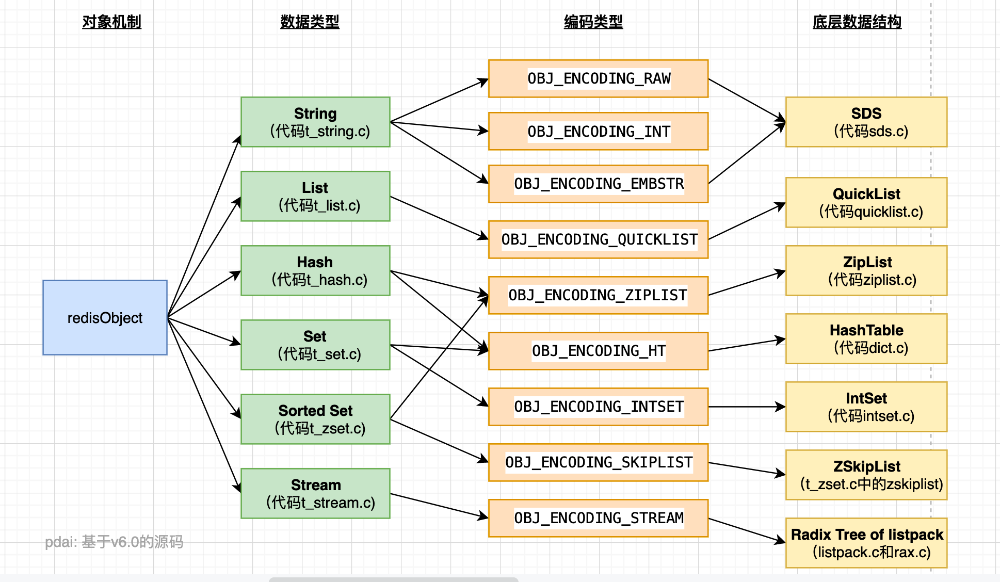
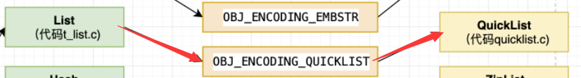
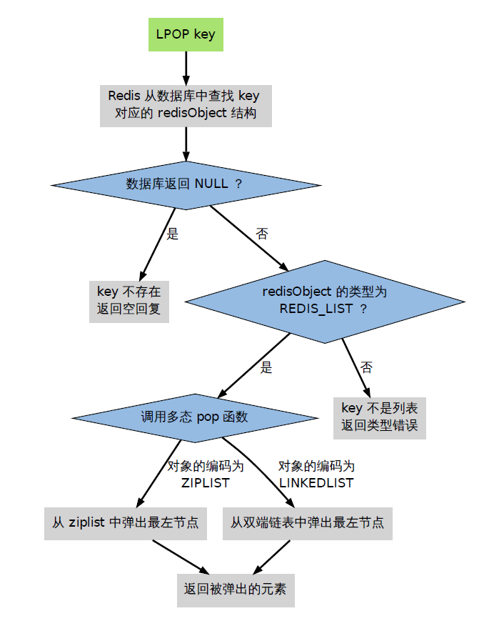
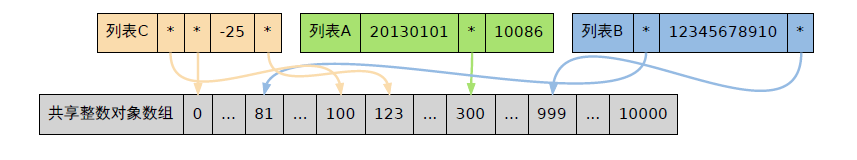

# Redis的对象机制

带着Redis的基本数据类型以及Stream是怎么实现的这个疑问，我们来理解一下底层是怎么做的：	

首先这个图反应了**Redis**的每种对象其实都是由**对象结构（redisObject）与对应编码的数据结构组合而成。**每种对象类型对应若干编码的方式，不同的编码方式所对应的底层数据结构是不同的。

我们从以下两个角度来着手理解：

- 对象设计机制：对象结构（redisObject）
- 编码类型和底层数据结构：对应编码的数据结构


# 为什么Redis要设计redisObject对象呢？

首先，Redis中对于键进行处理的命令占了很大的一部分，而对于所保存的的键是什么类型，键能执行的命令又各不相同。

比如：不同的数据类型对应不同的键，不同的键执行增删查的方法不同。

所以可以说明，**Redis 必须让每个键都带有类型的信息，使程序可以检查键的类型，并且选择对于他相对合适的处理方式。**

比如说， **集合类型**就可以由**字典**和**整数集合**两种不同的数据结构实现， 但是， 当用户执行 ZADD 命令时， 他/她应该不必关心集合使用的是什么编码， 只要 Redis 能按照 ZADD 命令的指示， 将新元素添加到集合就可以了。

所以，**Redis 操作数据类型的命令除了要对键的类型进行检查之外，还需要根据数据类型的不同编码进行多态处理。**

那么现在总共面临两个问题：

- 程序得检查类型
- 多态：一个方法不同实现

Redis 为了解决这俩问题，构建了自己的类型系统，这个系统的主要功能包括：

- redisObject 对象
- 基于 redisObject 对象的类型检查
- 基于 redisObject 对象的显式多态函数
- 对 redisObject 进行分配、共享和销毁的机制


# reidsObject 数据结构

**redisObject** 是 **Redis** 类型系统的核心，数据库中的每个键、值，以及 Redis 本身处理的参数，都表示这种数据类型。

```c
/*
 * Redis 对象
 */
typedef struct redisObject {

    // 类型
    unsigned type:4;

    // 编码方式
    unsigned encoding:4;

    // LRU - 24位, 记录最末一次访问时间（相对于lru_clock）; 或者 LFU（最少使用的数据：8位频率，16位访问时间）
    unsigned lru:LRU_BITS; // LRU_BITS: 24

    // 引用计数
    int refcount;

    // 指向底层数据结构实例
    void *ptr;

} robj;
```


**type**、**encoding**、**ptr**是最**重要的三个属性**。


## type 属性

- **type 记录了对象所保存的值的类型**，它的值是下列常量中的任意一个：

  ```c
  /*
  * 对象类型
  */
  #define OBJ_STRING 0 // 字符串
  #define OBJ_LIST 1 // 列表
  #define OBJ_SET 2 // 集合
  #define OBJ_ZSET 3 // 有序集
  #define OBJ_HASH 4 // 哈希表
  ```


## encodin 属性

- encoding 记录了对象所保存的值的编码，它的值是下列常量中的一个：

  ```c
  /*
  * 对象编码
  */
  #define OBJ_ENCODING_RAW 0     /* Raw representation */
  #define OBJ_ENCODING_INT 1     /* Encoded as integer */
  #define OBJ_ENCODING_HT 2      /* Encoded as hash table */
  #define OBJ_ENCODING_ZIPMAP 3  /* 注意：版本2.6后不再使用. */
  #define OBJ_ENCODING_LINKEDLIST 4 /* 注意：不再使用了，旧版本2.x中String的底层之一. */
  #define OBJ_ENCODING_ZIPLIST 5 /* Encoded as ziplist */
  #define OBJ_ENCODING_INTSET 6  /* Encoded as intset */
  #define OBJ_ENCODING_SKIPLIST 7  /* Encoded as skiplist */
  #define OBJ_ENCODING_EMBSTR 8  /* Embedded sds string encoding */
  #define OBJ_ENCODING_QUICKLIST 9 /* Encoded as linked list of ziplists */
  #define OBJ_ENCODING_STREAM 10 /* Encoded as a radix tree of listpacks */
  ```


## ptr 属性

- **ptr是一个指针，指向实际保存值的数据结构**，==这个数据结构由 **type** 和 **encoding** 属性决定。==
  - 举个例子， 如果一个 **redisObject** 的 **type** 属性为`OBJ_LIST` ， **encoding** 属性为`OBJ_ENCODING_QUICKLIST` ，那么这个对象就是一个 Redis 列表（List)，它的值保存在一个 **QuickList** 的数据结构内，而 **ptr** 指针就指向 **quicklist** 的对象；




## lru 属性

- **lur属性：记录了对象最后一次被命令程序访问的时间**
  - **空转时长** **= 当前时间 - 键的值对象的lru时间**
  - `Object idletime` 命令可以打印出给定键的空转时长

如果服务器打开了 **maxmemory** 选项，并且服务器用于回收内存的算法为 **volatile-lru** 或者 **allkeys-lru**，那么当`服务器内存的占用数 > maxmemory`，空转时长较高的那部分键会优先被服务器释放，从而回收内存。


# 命令的类型检查和多态

> 当执行一个处理数据类型的命令，Redis是怎么来执行的呢？

步骤：

1. 根据给定的key，在数据库字典中查找和他相对应的 redisObject，如果没找到，就返回 null
2. 检查 redisObject 的 type 属性和执行命令所需的类型是否相符
   - 相符：继续
   - 不相符：返回类型错误
3. 根据 redisObject 的 encoding 属性指定的编码，选择合适的操作函数来处理底层的数据结构
4. 返回数据结构的操作结果作为命令的返回值

拿 LPOP 指令来看：




# 对象共享

在 Redis 中，常见的值一般都会被放到一个共享对象中，这样可以避免重复分配的麻烦。

redis 预分配的值对象如下：

- 各种目录的返回值，**OK**，**ERROR**，**QUEUE**等
- 包括 0 在内的，小于 **REDIS_SHARED_INTEGERS** 的所有整数，Redis 中 **REDIS_SHARED_INTEGERS** 的默认值为 10000。



==注==：

- **共享对象**只能被**字典和双向链表这类能带有指针的数据结构使用**
- 整数集合和压缩列表这些只能保存字符串、整数等内存数据结构


## 为什么 Redis 只共享字符串对象？

- 列表对象、哈希对象、集合对象、有序集合对象等本身可以包含字符串对象，复杂度较高
- 如果共享对象是保存字符串对象，那么验证操作的复杂度为 **O(1)**
- 如果共享对象是保存字符串值的字符串对象，那么验证操作的复杂度为 **O(n)**
- 如果共享对象是包含多个值的对象，并且其中有一些值本身又是字符串对象，也就是说其它对象中嵌套了字符串对象，比如列表对象、哈希对象，那么我们验证操作的复杂度为 **O(n^2)**


所以，如果**给复杂度较高的对象创建共享对象的话，需要消耗很多CPU资源，用这种消耗去换取内存空间，是不合适的**。


# redisObject 引用计数以及对象的销毁

每个 **redisObject** 结构都带有一个 **==refcount==** 属性，这个属性是用来记录该对象被引用的次数。

- 当创建一个新的对象的时候，它的 refcount 属性被设置为1；
- 当一个对象进行共享时，redis 将这个对象的 `refcount = refcount + 1`；
- 当使用完一个对象后，或者消除对一个对象的引用之后，程序将对象的 `refcount = refcount - 1`；
- 当对象的 `refcount = 0` 时，这个 redisObject 结构以及它引用的数据结构的内存都会被释放。

