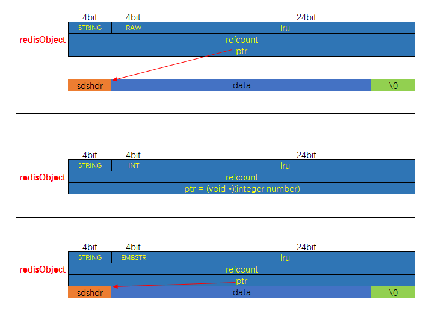

# 1. 字符串对象

==字符串类型==是 **redis** 最基本的数据类型，不仅所有 **key** 都是**字符串类型**，其它几种数据类型，其它几种数据类型构成的元素也是字符串，但是要注意字符串长度不能超过 **512M**。


## 1.1 编码

- **int 编码**：保存的是可以用 long 类型表示的**整数值**。
- **embstr 编码**：保存 `长度 < 44字节` 的字符串（redis3.2 版本之前是 39字节，之后是 44字节）。
- **raw 编码**：保存 `长度 > 44字节` 的字符串（redis3.2 版本之前是 39字节，之后是 44字节）。

由上可以看出，int编码是用来保存整数值，然后embstr编码是用来保存短字符串，raw编码是用来保存长字符串的。


## 1.2 内存布局




### 1.3 raw 和 embstr 的区别

**raw** 和 **embstr** 都是使用 **redisObject** 和 **sds** 保存数据的，他们的区别如下：

- embstr的使用只分配一次内存空间（这是导致 **redisObject与sds内存上是相邻且连续**的原因），raw 需要分配两次（分别分配给 redisObject 和 sds）。

所以与 raw 相比，embstr 的好处就是创建时少分配一次空间，删除时少释放一次空间，以及对象的所有数据都是连续空间，方便查询。而 embstr 也有坏处，就是如果超出大小，就要重新分配内存空间。

所以为了避免出现重新分配内存这种情况，==**redis** 中的 **embstr** 实现为**只读**==。

==注==：Redis 中对于浮点数类型也是作为字符串保存的，在需要的时候再转换回来。


### 1.4 编码的转换

==当 **int 编码**保存的值**不再是整数**，或**大小超过了long的范围**时，**自动转化为raw**。==

对于 embstr 编码，因为在 redis 中它是只读的，==在对 embstr对象 进行修改时，都会先转化为raw再进行修改==，因此，**只要是修改embstr对象，修改后的对象一定是raw的，无论是否达到了44个字节**。


# 2. 列表对象

list 列表，它是简单的字符串列表，按照插入顺序排序，由于底层实际上是一个链表，所以你可以头插尾插。


## 2.1 编码

列表对象的编码是 quicklist（快速链表）。

>  之前版本中有 linked 和 ziplist 这两种编码。进一步的，目前 Redis 定义的10个对象编码方式宏命名中，有两个完全闲置了 `OBJ_ENCODING_ZIPMAP` 与 `OBJ_ENCODING_LINKEDLIST`。从Redis的演进历史上来看, 前者是后续可能会得到支持的编码值（代码还在）, 后者则应该是被彻底淘汰了。


## 2.2 内存布局


# 3. Hash 对象

哈希对象的**键是一个字符串类型，值是一个键值对集合**。


## 3.1 编码

哈希对象的编码可以实 **ziplist** 或者 **hashtable**。

对应的底层实现有两种，一种是 **ziplist** 一种是 **dict**。


## 3.2 内存布局


注意上图中不严谨的地方：

1. ziplist 中每个 entry，除了键与值本身的二进制数据，还包括其它字段，但是图中没有画出来
2. dict 底层可能持有两个 dictht 实例
3. 没有画出 dict 的哈希冲突

需要注意的是：当采用 HT 编码，即**使用 dict 作为哈兮对象的底层数据结构时，键与值均是以 sds 的形式存储的**。


## 3.3 举例说明

>著作权归https://pdai.tech所有。 链接：https://www.pdai.tech/md/db/nosql-redis/db-redis-data-type-enc.html

当使用 **ziplist**，也就是压缩列表作为底层实现的时候，新增的键值对是保存到压缩列表的末尾，比如执行以下命令：

```shel
hset profile name "Tom"
hset profile age 25
hset profile career "Programmer"
```

如果使用 **ziplist，profile** 存储如下：


当使用 hashtable 编码时，上面命令存储如下：


**hashtable** 编码的哈希表对象底层使用字典数据结构，哈希对象中的每个键值对都使用一个字典键值对。

在前面介绍压缩列表时，我们介绍过压缩列表是**Redis**为了节省内存而开发的，是由一系列特殊编码的连续内存块组成的顺序型数据结构，相对于字典数据结构，压缩列表用于元素个数少、元素长度小的场景。其优势在于集中存储，节省空间。


## 3.4 编码转换

和上列表对象使用 ziplist 编码一样，当同时满足下面两个条件时，使用 ziplist 编码：

1. `列表保存的元素的总个数 < 512个`，该条件可以通过配置文件中的 `set-max-intset-entries` 进行更改
2. `每个元素长度 < 64字节`

如果这两个条件没有满足的时候就使用 hashtable 编码。


# 4. Set 对象

集合对象 set 是 string 类型（整数也会装换成 string 类型进行存储）的无序集合。

注意集合和列表的区别：

- 集合中的元素是无序的，因此不能通过索引来操作元素
- 集合中的元素不能重复


## 4.1 编码

集合对象的编码可以是 intset 或者 hashtable；

底层实现有两种：

- intset：==集中存储的只能是**数值数据**，并且**必须是整数**==。
- dict：将==**数据全部存储于 dict 的键中**，值字段闲置不用==。


## 4.2 举例说明

```she
SADD numbers 1 3 5
```


```shell
SADD Dfruits "apple" "banana" "cherry"
```


## 4.3 编码转换

当集合同时满足以下两个条件时，使用 intset 编码：

1. 集合对象中所有元素都是整数
2. 集合对象所有元素不超过 512个（可以通过配置文件的 `set-max-intset-entries` 进行配置）

不能满足这两个条件的就使用 **hashtable** 编码。


# 5. Zset 对象

和上面的 **set** 对象相比，**zset**对象是有序的，与列表使用索引下标作为排序依据不同，**zset** 为每个元素设置了一个 **score** 作为排序依据。


## 5.1 编码

zset 对象底层实现依旧有是有两种：

- **第一种**：ziplist 作为底层实现，对应编码值宏为 ZIPLIST
  - 使用 ziplist 来实现有序集合的话，只需要在 ziplist 这个数据结构的基础上做好排序与去重就好了。
- **第二种**：dict 与 skiplist 一同作为底层实现，对应编码值宏为 SKIPLIST
  - 使用 skiplist 实现有序集合的话，我们下面详细说一下。


首先编码为 ZIPLIST 的时候，zset 的内存布局如下：


编码为 skiplist 的时候，zset 的内存布局如下：


其实有序集合单独使用字典或跳跃表其中一种数据结构都可以实现，但是这俩数据结构互相结合，效果就可以叠加。

因为假如我们单独使用 **dict** ，虽然能以 `O(1)` 的时间复杂度来查找成员的分值，但是因为字典是以无序的方式来保存元素，所以每次进行范围查找，都得排序；

假如我们单独使用 **skiplist** 来实现，可以执行范围查找操作，但是查找操作就从 `O(1) -> O(logN)`。

**所以 Redis 将他俩结合起来使用实现 zset。**


## 5.2 举例说明

> 著作权归https://pdai.tech所有。 链接：https://www.pdai.tech/md/db/nosql-redis/db-redis-data-type-enc.html

```shell
ZADD price 8.5 apple 5.0 banana 6.0 cherry
```


## 5.3 编码转换

当有序集合同时满足以下两个条件时，对象使用 ziplist 编码：

1. `保存元素的数量 < 128`
2. `保存的所有元素的长度 < 64字节`

不能满足上面两个条件的话就使用 skiplist 和 dict 组合的数据结构。

同样，以上两个条件也可以在配置文件里做修改，对应字段分别是 `zset-max-ziplist-entries` 和 `zset-max-ziplist-value`。