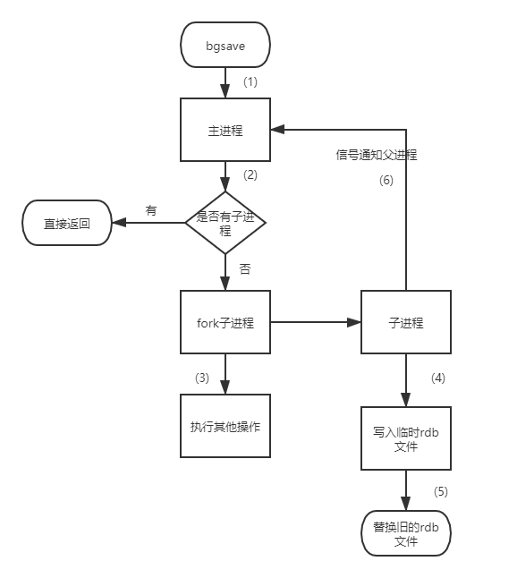
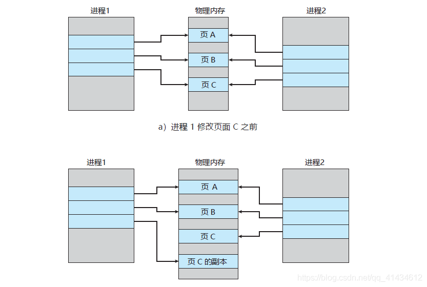

# 1. Redis持久化简介

我们主要从两个方面来介绍


## 1.1 为什么需要持久化？

通过之前的学习，我们知道，**Redis 它是一个基于内存存储的数据库**，这也是他为什么处理那么快的原因，但是==一旦服务器宕机，那么内存中的所有数据就会丢失==。

通常，我们解决方案是从后端数据库去恢复这些数据，但是后端数据库也会有性能瓶颈，如果涉及到要恢复的数据量特别大，那么：

1. 会给后端数据库带来极大的压力
2. 数据库的数据处理性能没有基于内存的 Redis 的高，导致程序响应变慢

所以，避免宕机之后从后端数据库恢复 Redis 中的数据是不可避免的，那么我们就需要 Redis 也可以数据持久化。


## 1.2 持久化方式有哪些？为什么重点是 RDB 和 AOP？

从严格意义上来说，**Redis** 所提供的**持久化存储解决方案**一共有四种：

1. ==**RDB**==

2. ==**AOP**==

3. **VM（虚拟内存）**：

   从 2.4版 本起，官方就不建议使用，3.2版本 后就没有VM的任何配置和范例，说明官方也放弃了它

4. **DISKSTORE**

   从 2.8版本 开始被提出，但是到现在为止，官方也没有明确推荐使用，同样 3.2版本 中也找不到对于这种方式的明确支持


1. 

# 2. RDB 持久化存储方式

**RDB （Redis DataBase）**，中文名为 快照/内存快照。

RDB 持久化是把当前进程数据生成快照保存到磁盘上的过程，由于是某一时刻，那么它一定具有滞后性。


## 2.1 触发方式

1. 手动触发
2. 自动触发


### 2.1.1 手动触发

> 手动触发分别对应 **save** 和 **bgsave** 命令。


1. **save 命令：**

   阻塞当前 **Redis** 服务器，知道 RDB 过程完成为止，对于==内存比较大的实例会造成**长时间的阻塞**==，**线上环境不建议使用此命令**。

   

2. **bgsave 命令：**

   Redis 进程执行 fork 操作创建子进程，RDB 持久化过程由此 fork 操作 fork 出来的子进程进行操作，完成后自动结束。

   在 **bgsave命令** 中，阻塞只出现在 fork 子线程的阶段。

   

- 最后一步：通知父进程rdb持久化完成，主进程更新相关统计信息（info persitence 下的 rdb _* 相关选项）。
- 

### 2.1.2 自动触发

> 四种自动触发的情况

1. **redis.conf** 中配置 `save <seconds> <changes>`，表示，==在seconds秒内有changes次修改时，自动触发bgsave生成rdb文件==
2. 主从复制时，==从节点要从主节点进行全量复制时==，也会触发 **bgsave 操作**，主节点生成当时的快照发送到从节点
3. 执行 `debug reload 命令`重新加载 redis 时也会触发 **bgsave**操作
4. 默认情况下执行 `shutdown` 命令时，如果没有开启 **AOF持久化**，那么也会触发 **bgsave操作**


## 2.2 redis.conf 中配置 RDB

**快照周期**：内存快照虽然可以通过技术人员手动执行 `save | bgsave 命令`来进行，但是生产环境下多数情况都会设置其周期性执行条件。

- **Redis中新设置默认周期**

```shell
# 周期性执行条件的设置格式为
save <seconds> <changes>

# 设置参考
save 60 2
save 120 10
save 1000 10000
...

# 以下设置方式为关闭RDB快照功能
save ""
```

- **其它相关配置**

```shell
# 快照文件名称
dbfilename dump.rdb

# 快照文件保存路径
dir /home/work/app/redis/data/

# 如果持久化出错，主进程是否停止写入
stop-writes-on-bgsave-error yes

# 快照是否压缩，官方建议使保持 yes，它会将字符串类型的数据启用LZF压缩算法压缩
rdbcompression yes

# 快照导入时是否检查
rdbchecksum yes
```

`stop-writes-on-bgsave-error`：

在**快照操作正常进行的情况**下，Redis的主进程照样可以接收任意客户端的**写操作**的特性；但是如果**快照操作出现异常**，比如操作系统当前使用用户权限不够、磁盘空间不够等等情况时，Redis就会禁止写操作。

主要目的就是为了使运维人员第一时间就发现 Redis 的运行错误并且快速着手解决。

`rdbchecksum`：

从 **RDB** 快照功能的 **version5** 版本开始，一个 64位的 CRC冗余码校验编码会被放在 RDB 文件的末尾，以便于对整个 RDB 文件的完整性进行校验。

虽然这个功能会损失大概 10% 左右的性能，但是获得了数据的高可靠性。


## 2.3 RDB 深入理解

> 下面是别人实战中遇到过的例子

- **问题一：生产环境中，我们都会为 Redis 开辟比较大的内存空间（例如6GB），那么将内存中的数据同步到硬盘的过程可能就会持续比较长的时间，而实际情况是这段时间 Redis 服务一般都会收到数据写操作请求，那么==在此情况下如何保证数据一致性呢？==**

  RDB中的核心思路就是用 **copy-on-write（熟悉的写时复制）**来保证在进行快照操作的时间内，需要压缩写入磁盘上的数据在内存中不会发生变化。

  在一般正常进行的快照操作中，一方面 Redis 主进程会 fork 一个新的快照子进程来专门做这个事情，这样保证了 Redis 服务不会停止对客户端包括写请求在内的任何响应。另一方面这段时间发生的数据变化会以副本的方式存放在另一个新的内存区域，待快照操作结束后才会同步到原来的内存区域，也就和我们平时想的不太一样，它是把==快照读进行中的写操作的结果放在另一个新的内存区域，而不是原来的内存区域。==

  **举个例子就是：**

  主线程对这些数据也都是读操作，那么书现场和 bgsave 子进程相互不影响，但是如果主线程要修改一块数据（例如图中的键值对 C），那么，这块数据就会被复制一份，生成该数据副本，然后，bgsave 子进程会把这个副本数据写入 **RDB文件** 中，而在这个过程中，主线程仍然可以直接修改原来的数据。


- **问题二：在进行快照操作的这段时间内，如果发生服务崩溃怎么办？**

  解决方法就是，==在**没有将数据全部写入磁盘前**，这次快照操作都不算成功，类似事务==。如果出现了服务崩溃的情况，将上一次完整的 RDB快照文件 作为恢复内存数据的参考。

  换句话来说就是，**==快照操作的过程中，不能影响上一次的备份数据==**。

  Redis 服务会在磁盘上创建一个临时文件进行数据操作，待操作成功后才会用这个临时文件替换掉上一次的备份。

  所以说，**快照操作中的文件是一个临时文件，并不是对上一次快照操作完成后的RDB文件直接进行修改替换**。


- **问题三：可以每秒做一次快照吗？**

  对于快照来说，所谓“连拍”就是指连续地做快照。这样一来，快照的间隔时间变得很短，即使某一时刻发生宕机了，因为上一时刻快照刚执行，丢失的数据也不会太多。但是，这其中的快照间隔时间就很关键了。

  如下图所示，我们先在 T0 时刻做了一次快照，然后又在 T0+t 时刻做了一次快照，在这期间，数据块 5 和 9 被修改了。如果在 t 这段时间内，机器宕机了，那么，只能按照 T0 时刻的快照进行恢复。此时，数据块 5 和 9 的修改值因为没有快照记录，就无法恢复了。 　


- 所以，要想尽可能恢复数据，t 值就要尽可能小，t 越小，就越像“连拍”。那么，t 值可以小到什么程度呢，比如说是不是可以每秒做一次快照？毕竟，每次快照都是由 bgsave 子进程在后台执行，也不会阻塞主线程。

  这种想法其实是错误的。虽然 bgsave 执行时不阻塞主线程，但是，**如果频繁地执行全量快照，也会带来两方面的开销**：

  - 一方面，频繁将全量数据写入磁盘，会给磁盘带来很大压力，多个快照竞争有限的磁盘带宽，前一个快照还没有做完，后一个又开始做了，容易造成恶性循环。
  - 另一方面，bgsave 子进程需要通过 fork 操作从主线程创建出来。虽然，子进程在创建后不会再阻塞主线程，但是，fork 这个创建过程本身会阻塞主线程，而且主线程的内存越大，阻塞时间越长。如果频繁 fork 出 bgsave 子进程，这就会频繁**阻塞主线程**了。

  那么，有什么其他好方法吗？此时，我们可以做**增量快照**，就是==指做了**一次全量快照**后，**后续的快照只对修改的数据进行快照记录**，这样可以避免每次全量快照的开销==。这个比较好理解。

  但是它需要我们使用额外的元数据信息去记录哪些数据被修改了，这会带来额外的**空间开销问题**。那么，还有什么方法既能利用 RDB 的快速恢复，又能以较小的开销做到尽量少丢数据呢？我们在后面会给出答案。


## 2.4 RDB 的优缺点

1. **优点：**
   - **RDB** 文件时某个时间节点的快照，默认使用 **LZF** 算法进行压缩，压缩后的文件体积远远小于内存中的大小，适用于备份和全量复制等场景下。
   - **Redis** 加载 **RDB** 文件 恢复数据的效率要远远快于 **AOF** 方式。
2. **缺点：**
   - **RBD** 方式实时性不够，**无法做到秒级持久化**，也就存在信息滞后性。
   - 每次调用 `bgsave` 指令都需要 `fork` 子进程，`fork` 子进程属于是重量级偏高的操作，频繁执行的话成本比较高。
   - **RDB** 文件是以二进制形式存在的，没有可读性，**AOF** 文件在了解其结构的情况下可以手动修改或者补全，具有可读性。
   - 版本兼容 **RDB** 文件问题。


# 3. AOF 持久化存储方式

针对==RDB不适合实时持久化的问题，Redis提供了**AOF**持久化方式来解决==。

Redis 是“写后”日志（AppendOnly File），Redis 先执行命令，把数据写入内存，然后才记录日志。日志里记录的是Redis 收到的每一条命令，这些命令是以文本形式保存。PS: 大多数的数据库采用的是写前日志（WAL），例如MySQL，通过写前日志和两阶段提交，实现数据和逻辑的一致性。

AOF 日志采用写后日志，**先写内存，后写日志**。


## 3.1 为什么采用写后日志？

Redis 要求高性能，采用写后日志带来了两方面的好处：

1. **避免额外的检查开销**

   Redis 在向 AOF 里面记录日志的时候，**并不会先去对这些命令进行语法检查**。所以，==如果先记录日志再执行命令的话，日志中就有可能记录了错误的命令，Redis 再使用日志恢复数据时，就可能会出错==。

2. **不会阻塞当前的写操作**

但是，采用写后日志，也有**潜在的风险**：

1. **如果命令执行完成，写日志之前宕机了，会造成数据的丢失**
2. **主线程写磁盘压力大，会导致写盘比较慢，阻塞后续操作**


## 3.2 Redis 如何实现 AOF

==AOF 日志记录 Redis 的每个写命令==，步骤分别为：`命令追加（append）、文件写入（write）、文件同步（sync）。`

- **命令追加：**
  - 当 AOF 持久化功能打开之后，服务器在**执行完一个写命令之后**，会以**协议格式**将被执行的写命令追加到服务器的 `aof_buf` 缓冲区。
- **文件写入和同步：**
  - 关于何时将 aof_buf 缓冲区的内容写入 AOF 文件中，Redis 提供了三种写回策略：


1. `Always`，**同步写回**，每个命令执行完，立马将日志同步回磁盘。
2. `Everysec`，**每秒写回**，每个写命令执行完，只是先把日志文件写到 AOF 文件的内存缓冲区，每隔一秒将缓冲区中的内容写入磁盘。
3. `No`，**操作系统控制的写回**，每个命令执行完，只是先把日志写到 AOF 文件的内存缓冲区，由操作系统决定何时将缓冲区内容写回磁盘。


- **三种写回策略的优缺点**

上面的三种写回策略体现了一个重要原则：**trade-off**，取舍，指在性能和可靠性保证之间做取舍，没有任何方法可以是完美的，只能具体情况具体分析。

关于**AOF的同步策略是涉及到操作系统的 write 函数和 fsync 函数**的，在《Redis设计与实现》中是这样说明的：

>为了提高文件写入效率，在现代操作系统中，当用户调用write函数，将一些数据写入文件时，操作系统通常会将数据暂存到一个内存缓冲区里，当缓冲区的空间被填满或超过了指定时限后，才真正将缓冲区的数据写入到磁盘里。


## 3.3 redis.conf 中配置 AOF

默认情况下，Redis 是没有开启 AOF 的，可以通过配置 `redis.conf` 文件来开启 AOF 持久化，关于AOF的配置如下：

```shell
# appendonly参数开启AOF持久化
appendonly no

# AOF持久化的文件名，默认是appendonly.aof
appendfilename "appendonly.aof"

# AOF文件的保存位置和RDB文件的位置相同，都是通过dir参数设置的
dir ./

# 同步策略
# appendfsync always
appendfsync everysec
# appendfsync no

# aof重写期间是否同步
no-appendfsync-on-rewrite no

# 重写触发配置
auto-aof-rewrite-percentage 100
auto-aof-rewrite-min-size 64mb

# 加载aof出错如何处理
aof-load-truncated yes

# 文件重写策略
aof-rewrite-incremental-fsync yes
```

- `appendfsync 参数`：
  - 很重要的参数，可以**指定真正执行”操作命令向AOF文件中同步的策略**。
  - 什么叫==真正执行==呢？Linux操作系统为了**保证操作系统中 I/O 队列的操作效率**，应用程序提交 **I/O** 操作请求一般是被放置在 `linux page cache` 中的，然后再由 Linux操作系统 中的策略**自行决定**写到磁盘上的时机。
  - **Redis** 中有个 **fsync() 函数**，可以将 `page cache` 中待写入的数据真实的写入到物理设备（磁盘）上，缺点是频繁调用这个 `fsync()` 函数干预操作系统的既定策略，可能导致 I/O 卡顿的现象频繁发生。
- `no-appendfsync-on-rewrite 参数`：
  - `always` 和 `everysec` 的设置会使得**真正的 I/O 操作变得频繁**，甚至会**出现长时间卡顿现象**，这个问题出在**操作系统层面**，所以靠工作在操作系统之上的进程是无法解决的，只能去尽可能的避免。
  - 为了缓解这个情况，**Redis** 提供了这个选项，以保证在完成 `fsync()` 函数调用时，不会将这段时间内发生的命令操作放入操作系统的 `page cache`（同一时间段内 **Redis** 还在接收着客户端的各种写操作命令）。
- `auto-aof-rewrite-percentage 参数`：
  - 下文会提到，在生产环境下，我们不可能随时随地的去使用 `bgrewriteaof` 命令去重写 AOF 文件。
  - 所以更多时候，我们得依靠 Redis 中对 AOF文件的自动重写策略。
  - 这个参数表示当前 AOF 文件如果大小如果超过了上次重写后 AOF 文件的百分之多少后，就再次开始重写 AOF 文件。
  - 例如我设置为 100，意味着如果 AOF 文件大小超过上次 AOF 文件重写后的 1 倍，就启动重写操作。
- `auto-aof-rewrite-min-size 参数`：
  - 它和上面 `auto-aof-rewrite-percentage 参数`出现的原因一样。
  - 该参数表示启动 AOF 文件 重写操作的 AOF 文件的最小大小。

`auto-aof-rewrite-percentage 和 auto-aof-rewrite-min-size`这俩参数设计思路，可以好似看作 JDK8 中 HashMap 的红黑树转换条件，虽然完成的工作不同，但是思路异曲同工。

==值得注意的的是，如果是我们手动调用 `bgrewriteaof` 命令，那么重写操作将不受这俩参数的限制。==


## 3.4 深入理解 AOF 的重写

- 旧的日志文件：**主线程**使用的日志文件

- 新的日志文件：**bgrewriteaof进程**使用的日志文件


AOF 会记录每个写命令到 AOF 文件，**随着时间的推移，AOF 文件会变得越来越大**。不加以控制的话，会对 Redis 服务器，甚至对操作系统造成影响，而且 ==AOF 文件越大那就代表着数据恢复时间会变长==。

为了解决 AOF 文件体积膨胀的问题，Redis 提供了 **AOF 重写机制**。


### 3.4.1 图例解释 AOF 重写

Redis 通过创建新的 AOF 文件来对当前的 AOF 文件来进行替换。值得注意的是，**新旧两个 AOF 文件保存的数据相同，但是新的 AOF 文件没有了 冗余命令。**


### 3.4.2 AOF 重写会阻塞吗？

AOF 重写的过程是由后台进程 `bgrewriteaof` 来完成的，主线程 `fork` 出后台的 **bgrewriteaof 子进程**，`fork` 会将主线程的内存拷贝一份给 **bgrewriteaof子进程**，这里面包含了 Redis 数据库的最新数据。然后，**bgrewriteaof子进程** 就可以在不影响主线程的情况下，逐一把拷贝的数据写成操作，记入重写日志。

所以 AOF 重写，只会在 fork 子进程的时候阻塞。


### 3.4.3 什么时候重写 AOF 日志

自动触发 AOF 重写，上文中提到过在 redis.conf 中的两个参数：

`auto-aof-rewrite-min-size`：表示重写 AOF 日志时文件的最小大小，默认为 64MB。

`auto-aof-rewrite-percentage`：这个值的计算方式是，当前 AOF 文件大小和上一次重写后 AOF 文件大小的差值，再除以上一次重写后 AOF 文件大小。也就是说 `（当前AOF文件大小 - 上一次重写AOF文件大小）/ 上一次重写AOF文件大小`。


### 3.4.4 重写时有新的写操作怎么办？

AOF 重写的过程可以总结为：**“一个拷贝，两处日志”，写时复制，但是会有信息滞后性。**

在 `fork` 出子进程时的拷贝，以及在重写时，如果有新数据写入，主线程就会将命令记录到两个AOF 日志内存缓冲区中。

AOF 有三个写回策略：

`Always`：则直接将命令写回到旧的日志文件中，并且保存一份命令至 AOF 日志重写缓冲区，这些操作对新的日志文件是不存在影响的。

但是其它俩策略，就**不是直接写回旧 AOF 日志文件**了。

在 **bgrewriteaof子进程** 完成**日志文件的重写操作**后，会提示主线程已经完成重写操作，主线程会将 **AOF 重写缓冲**中的命令追加到新的日志文件后面。

这时候==在高并发的情况下，AOF重写缓冲区积累可能会很大，这样就会造成阻塞==，**Redis后来通过Linux管道技术让 AOF 重写期间就能同时进行回放**，这样 AOF 重写结束后只需回放少量剩余的数据即可。

最后通过修改文件名的方式，保证文件切换的原子性。

在 ==AOF 重写日志期间发生宕机==的话，因为**日志文件还没切换，所以恢复数据时，用的还是==旧的日志文件==**。


### 3.4.5 总结操作

- ==**主线程**== `fork` 出 ==bgrewriteaof **子进程**==重写 AOF 日志
- 子进程重写日志完成之后，主线程追加 AOF 日志缓冲
- 替换 AOF 日志文件


**==注意==**：

这里的**进程**和**线程**的概念有点混乱。因为后台的 bgreweiteaof进程 就只有一个线程在操作，没有别的子线程，所以可以认为它就是一个进程，且只有一个线程在执行它。

而主线程是Redis的操作进程，也是单独一个线程。这里想表达的是Redis主进程在 `fork` 出一个后台进程之后，后台进程的操作和主进程是没有任何关联的，也不会阻塞主线程。


- **主线程 fork 出子进程是如何复制内存数据的？**

`fork` 采用操作系统提供的**写时复制机制**，就是为了避免一次性拷贝大量数据给子进程造成阻塞。

`fork` 子进程时，子进程会拷贝父进程的**页表**，即==虚实映射关系（虚拟内存和物理内存的映射索引表）==，而不是拷贝**物理内存**。这个**拷贝会消耗大量的CPU资源，并且在拷贝完成之前会阻塞主线程，阻塞时间取决于内存中的数据量**。拷贝完成之后，父子进程使用相同的内存地址空间。

但==主进程在 fork 拷贝的同时是**允许有数据写入**的==，这时候就会拷贝物理内存中的数据。




上图所示，在主进程有数据写入时，而这个数据刚好在页c中，操作系统会创建这个页面的副本（页c的副本），即拷贝当前页的物理数据，将其映射到主进程中，而子进程还是使用原来的的页c。


- **在重写日志整个过程时，主线程有哪些地方会被阻塞？**

1. fork 子进程时，需要拷贝虚拟页表，会对主线程阻塞
2. 主进程有 `bigkey` 写入时，操作系统会创建页面副本，并拷贝原有的数据，会对主线程阻塞
3. 子进程重写日志完成之后，主进程追加 AOF 重写缓冲区时可能会对主线程阻塞


- **为什么 AOF 重写不复用原 AOF 日志？**

1. 父子进程如果写同一个文件的话，会产生竞争问题，影响父进程的性能
2. 如果 AOF 重写过程失败的话，那就相当于原 AOF 收到了污染，无法作为数据恢复使用


# 4. RDB 和 AOF 混合方式

4.0版本之后提出了一个混合使用 **AOF日志和内存快照** 的方法。

这样的话，快照就不用很频繁的执行，这就避免了频繁 `fork` 对主线程的影响，而且，AOF 日志也只用记录两次快照间的操作，也就是说，不需要记录所有操作了，因此，就不会出现文件过大的情况，可以避免重写开销大的问题。

如下图所示，**T1** 和 **T2** 时刻的修改，用 AOF 日志记录，等到第二次做全量快照时，就可以清空 AOF 日志，因为此时的修改都已经记录到快照中了，恢复时就不再用日志了。


这样的好处我们就可以看出来了，==**RDB** 文件快速恢复数据，**AOF** 日志只记录快照发生之外的命令，减少AOF 文件的大小，只记录操作命令==。


# 5. 持久化中恢复数据

有了数据的持久化备份，我们是不是也得考虑一下如何恢复数据？

如果服务器上既有 **RDB 文件，又有 AOF 文件**，那么该怎么加载他们来恢复数据呢？

**Redis** 重新启动会去自动依靠这些文件去数据恢复，所以只需要重启 **Redis** 即可。那么，Redis 重启时的数据恢复过程是怎么用的呢？


1. Redis 重启时判断是否开启了 AOF，如果开启了 AOF ，那么就优先加载 AOF 文件
2. 如果 AOF 文件存在，那么就去加载 AOF 文件，加载成功的话，Redis 重启成功，如果加载失败，那么会打印日志表示启动失败，此时我们可以去修复 AOF 文件后重新尝试启动
3. 若 AOF 文件不存在，那么 Redis 就会去加载 RDB 文件，如果 RDB 文件不存在，Redis 直接启动成功
4. 如果 RDB 文件存在的话，就会去加载 RDB 文件恢复数据，如加载失败则打印日志提示启动失败，如加载成功，那么redis重启成功，且使用rdb文件恢复数据

从上面步骤可以看出 **Redis 重启优先判断 AOF 再判断 RDB**。


- **那么为什么会优先加载 AOF 文件呢？**

因为 AOF 文件保存的数据更加完整，通过上面对 AOF 的三种策略模式的分析，可以得出结论，AOF 基本上最多就损失 1s 的数据。


# 6. 性能与实践

通过以上的分析，我们可以得知，RDB 和 AOF 的快照保存和重写日志都得 `fork` ，这是一个重量级操作，`fork ` 的过程会**阻塞 Redis 主进程**，因此为了**不影响 Redis 主进程的响应，我们需要尽力去降低阻塞。**

1. 降低 `fork` 的频率，比如可以我们手动来触发 RDB 快照生成以及 AOF 的日志重写
2. 控制 Redis 的最大使用内存，防止 `fork` 的时间过长
3. 使用更高档的硬件配置
4. 合理配置 Linux 的内存分配策略，避免因为物理内存不足导致 `fork` 失败

- **在线上的状态下该怎么做？这里借用别人的经验：**

1. 如果 Redis 中的数据并不是特别敏感或者可以通过其它方式去重写生成数据的话，那么可以关闭持久化，如果数据丢失可以通过其它途径恢复或者干脆不要了
2. 自己指定策略定期检查 Redis 的情况，如何可以手动触发备份，重写数据
3. 单机如果部署多个实例的话，要防止多个及其同时运行持久化、重写操作，**防止出现 CPU、I/O、内存等资源的竞争从而导致持久化串行**
4. **可以主从复制，利用一台从机器进行备份，其它机器正常接收响应**
5. **RDB 持久化和 AOF 持久化可以同时存在**，他俩通常配合使用

# 参考文章

https://www.pdai.tech/md/db/nosql-redis/db-redis-x-rdb-aof.html


