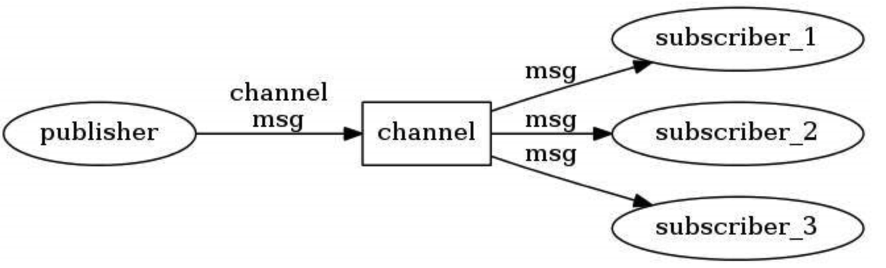
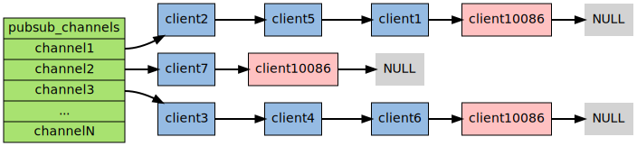
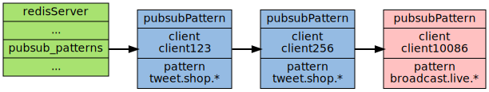

# 1. Redis 发布订阅简介

> Redis 发布订阅（pub/sub）是一种消息通信模式：

- **发送者（pub）**：发送消息
- **订阅者（sub）**：接收消息


Redis的 `subscribe `命令可以让客户端订阅任意数量的频道，每当有新的信息发送到被订阅的频道的时候，信息就会被发送给所有订阅指定频道的客户端。

例如，频道 channel1 被三个客户端订阅：


当有新的消息被 `publish` 命令送到此频道上，这个消息就会被发布给这三个订阅了该频道的客户端。


# 2. Redis 发布/订阅使用

**Redis** 有两种发布/订阅模式：

- **基于频道**（channel）的发布/订阅
- **基于模式**（pattern）的发布/订阅


## 2.1 基于频道（channel）的发布/订阅

“发布/订阅” 模式包含两种角色，发布者、订阅者，就像定杂志的客户和杂志。

发布者可以向指定的频道发送消息，**订阅者可以订阅一个或者多个频道，所有订阅此频道的订阅者都能收到发布者发布在这个频道上的消息**。

类比于我们定杂志和获取杂志内容的全过程，杂志是消息，我们是订阅者，发布者将内容发布在杂志上，我们可以订阅不同的杂志。




- **发布者发布消息**

发布者发布消息的命令是 `publish` ，用法是 `publish channle message：xx`，例如向 channel:1 说一声 hello：

```shell
127.0.0.1:6379> publish channel:1 hello
(integer) 1
```

这样消息就发送出去了，**返回值代表了收到这条消息的订阅者的数量**。注意，==发出去的消息**不会被持久化**==。也就是有客户端订阅了 channel:1 后只能接收到后续发布到该频道的消息，之前的消息就收不到了。


- **订阅者订阅频道**

订阅频道的命令是 `subscribe`，可以同时订阅多个频道，用法是 `subscribe channelname ...` ，例如新开一个客户端订阅上面的例子的频道：

```shell
127.0.0.1:6379> subscribe channel:1
Reading messages... (press Ctrl-C to quit)
1) "subscribe" // 消息类型
2) "channel:1" // 频道
3) "hello" // 消息内容
```

执行上面的命令客户端会进入订阅状态，**处于此状态的客户端不能使用除了** `subscribe、unsubscribe、psubscribe、punsubscribe` 四个属于 “发布/订阅” 模式之外的命令，否则会报错。

进入订阅状态之后的客户端可能会收到 **3种类型** 的回复。每种类型的回复都包含3个值：

- 第一个值：消息类型，根据这个值，第二第三个值会不同。

**消息类型的取值可能是以下3个**：

- **subscribe**：表示订阅成功的反馈信息，第二个值是订阅成功的频道信息，第三个值是当前客户端订阅的频道数量。
- **message**：表示收到的消息，第二个值此时是表示生产消息的频道名称，第三个值此时是消息的内容。
- **unsubscribe**：表示成功取消订阅某个频道，此时第二个值是对应取消的频道名称，==第三个值是当前客户端订阅的频道数量，**当此时值为 0 时的客户端会退出订阅状态**，之后就可以执行其它非 “发布/订阅” 模式的命令了==。


## 2.2 基于模式（partten）的发布/订阅

如果有某个或者某i写模式和这个频道匹配的话，那么所有订阅这个或者这些频道的客户端同样也会收到频道的消息。

下图展示了一个带有频道和模式的例子， 其中 `tweet.shop.*` 模式匹配了 `tweet.shop.kindle` 频道和 `tweet.shop.ipad` 频道， 并且有不同的客户端分别订阅它们三个：


**client123、client256** 订阅了 twee.shop.* 这个模式，那么当这个模式下的任何一个频道有消息，都会通知给这俩客户端：


### 2.2.1 基于模式的例子

通配符中 **？**表示 1个占位符，***** 表示任意个占位符（包括0），**？*** 表示1个以上的占位符。

- **publish 发布**

```java
127.0.0.1:6379> publish c m1
(integer) 0
127.0.0.1:6379> publish c1 m1
(integer) 1
127.0.0.1:6379> publish c11 m1
(integer) 0
127.0.0.1:6379> publish b m1
(integer) 1
127.0.0.1:6379> publish b1 m1
(integer) 1
127.0.0.1:6379> publish b11 m1
(integer) 1
127.0.0.1:6379> publish d m1
(integer) 0
127.0.0.1:6379> publish d1 m1
(integer) 1
127.0.0.1:6379> publish d11 m1
(integer) 1
```

- **psubscribe 订阅**

```java
127.0.0.1:6379> psubscribe c? b* d?*
Reading messages... (press Ctrl-C to quit)
1) "psubscribe"
2) "c?"
3) (integer) 1
1) "psubscribe"
2) "b*"
3) (integer) 2
1) "psubscribe"
2) "d?*"
3) (integer) 3
1) "pmessage"
2) "c?"
3) "c1"
4) "m1"
1) "pmessage"
2) "b*"
3) "b"
4) "m1"
1) "pmessage"
2) "b*"
3) "b1"
4) "m1"
1) "pmessage"
2) "b*"
3) "b11"
4) "m1"
1) "pmessage"
2) "d?*"
3) "d1"
4) "m1"
1) "pmessage"
2) "d?*"
3) "d11"
4) "m1"
```

- 注意点

1. 使用 `psubscribe` 命令可以重复订阅同一个频道，如客户端执行了 `psubscribe c? c*`，那么这里如果向 c1 发布消息，那么客户端可以收到两条消一样的消息，`publish` 命令返回的值是2（虽然是一个客户端）。同样的，如果有另一个客户端执行了`subscribe c1` 和`psubscribe c?*`的话，向c1发送一条消息该客户端也会手到两条消息(但是是两种类型: **message** 和 **pmessage**)，同时 `publish`命令也返回 2（虽然还是同一个客户端），感觉就是造成一种假象。
2. `punsubscribe` 命令可以退订的规则，用法：`punsubscribe [partter[partten]]`，可以套娃，如果**没有参数则会退订所有规则**。
3. 通过 `punsubscribe` 才能退订通过 `psubscribe`命令订阅的规则，不影响直接通过 `subscribe` 命令订阅的频道，命令都是一一对应；另外==需要注意的是 `punsubscribe` 命令退订某个规则时不会将其中的通配符展开，而是**要进行严格的字符串匹配**==，所以 `psubscribe *` 无法退订 `c*` 的模式 ，而是必须使用 `punsubscribe c*` 才可以退订。


# 3. 深入理解基于频道（channel）的发布/订阅如何实现？

底层是啥？我们来看一张图：


# 3.1 数据结构


我们可以看到**底层是通过字典 （图中的 pubsub_channels）实现的**，这个字典就是用于保存订阅频道的信息：

- **键**：正在被订阅的频道
- **值**：一个链表，保存所有订阅这个频道的客户端


## 3.2 订阅

当客户端调用了 `subscribe` 命令时，程序就会将客户端和对应要订阅的频道在 pubsub_channels 字典中关联起来。

例子：比如客户端 **client10086** 执行命令 `subscribe channel1 channel2 channel3`，对应字典应该变成如下这样：




## 3.3 发布

当调用 `publish channel message` 命令，程序首先根据 channel 定位到字典的键，然后将信息发送欸字典值链表中的所有客户端。

举个例子：3.1中的图，如果向 **channel2** 频道发送消息，那么这个频道所对应的链表中的客户端都可以收到消息。


## 3.4 退订

使用 `unsubscribe` 命令可以退订指定的频道，这个命令执行的是订阅的反操作：它从 pubsub_channel 字典的给定键中，**删除键中链表中对应的客户端的结点信息**，这样被退订的频道的信息就不会再发送给这个客户端。


# 4. 深入理解基于模式(Pattern)的发布/订阅如何实现的？

底层是 **pubsubPattern** 结点的链表。


## 4.1 数据结构

**redisServer.pubsub_patterns** 属性是一个链表，链表中保存着所有和模式相关的信息：

```c
struct redisServer {
    // ...
    list *pubsub_patterns;
    // ...
};
```

链表中的每个结点都包含一个 **redis.h/pubsubPattern** 结构：

```c
typedef struct pubsubPattern {
    redisClient *client; // 保存着订阅模式的客户端
    robj *pattern; // 保存着订阅的模式
} pubsubPattern;
```

每当调用 `psubscribe` 命令订阅一个模式的时候，程序就创建一个包含客户端信息和被订阅模式的 **pubsubPattern** 结构，并将该结构添加到 **redisServer.pubsub_patterns** 链表中。


## 4.2 订阅

就继续拿 **client10086** 来说吧，它执行 `psubscribe broadcast.list.*` 指令之后，**pubsub_patterns** 链表将被更新为：



通过遍历整个 pubsub_pattern 链表，程序就可以检查现在所有正在被订阅的模式，以及订阅这些模式客户端信息。


## 4.3 发布

发送信息到模式的工作也是由 `publish` 命令进行的，显然就是匹配模式获得 channels，然后再把消息发送给客户端。


## 4.4 退订

使用 `punsubscribe` 命令可以退订指定的模式，必须精确说明模式名称，不能用通配符去匹配。程序会根据这个命令去删除 **redisServer.pubsub_pattern** 链表中所有与被退订的模式相关联的 **pubsubPattern** 结构，这样==客户端就不会收到**被退订的模式所匹配的频道**发来的消息==。


# 5. SpringBoot 结合 Redis发布/订阅实例

这个的话，CSDN去一找就可以找到相关的内容。