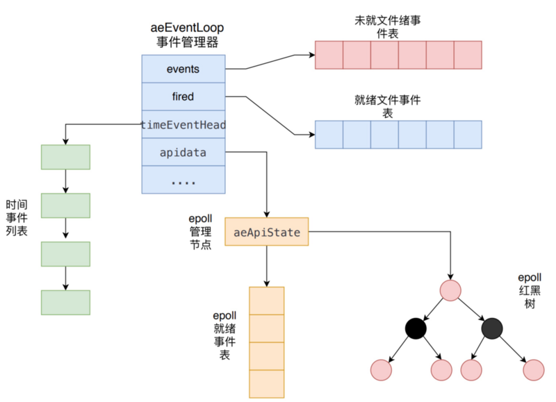
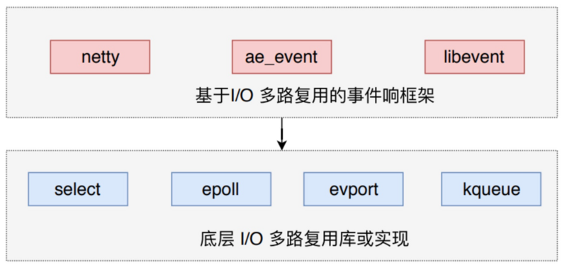
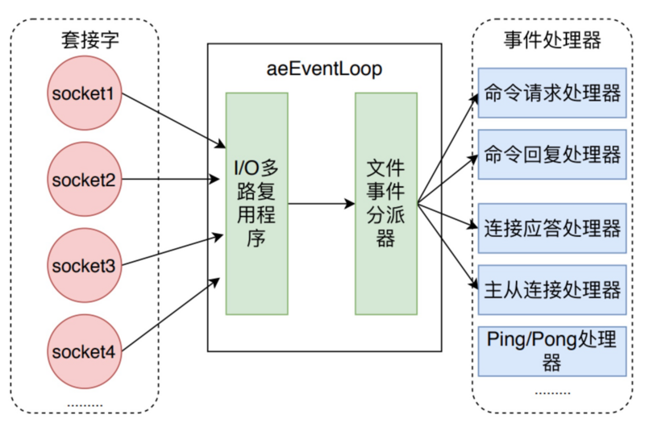
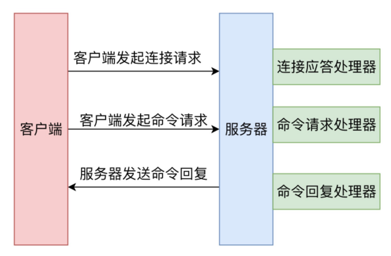
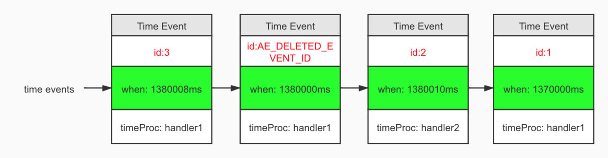

# 1. 事件机制

Redis 中的事件驱动库，它只会去关注**网络 I/O事件**，以及**定时器事件**。

所以，Redis 的事件库处理下面两类事件：

1. **文件事件（file event）**：用于处理 **Redis 服务器和客户端之间的网络I/O事件**
2. **时间事件（time event）**：用于处理 Redis 服务器中的一些**需要在给定时间点执行的操作**（比如 `serverCron函数`）

Redis 中的事件驱动库的代码主要在 `src/ae.c` 中实现的：



- aeEventLoop：整个事件驱动库的核心，它管理着**文件事件表**和**时间事件表**，==不断的循环处理**就绪的文件事件**和**到期的时间事件**==。


# 2. 文件事件

Redis 基于 **Reactor模式** 开发了自己的网络I/O事件处理器，也就是文件事件处理器，文件事件处理器使用 **I/O 多路复用技术**（参考 Java IO多路复用）：==同时监听多个套接字（socket），并为套接字关联不同的事件处理函数。当套接字的可读或者可写事件触发，就会调用相应的事件处理函数。==


## 2.1 为什么单线程的 Redis 能那么快？

Redis 的性能瓶颈不在 CPU 而是在 I/O，所以为了节省开发量，在 6.0 版本前的 Redis 是单线程模型；其次，**Redis 的单线程主要是指 Redis 的网络I/O 和键值对的读写都是由一个线程来完成的**，这也是 Redis 对外提供键值对存储服务的主要流程。

但是，Redis 的其它功能，比如说是 持久化、异步删除、集群数据同步等都是由额外的线程完成的。

Redis 采用**多路复用机制**使其在**网络 I/O 操作事件**中能**并发**处理大量的客户端请求，**实现高吞吐率。**


## 2.2 Redis 事件响应框架 ae_event 及文件事件处理器

> Redis 并没有使用 **libevent** 或者 **libev** 这样成熟的开源方案，而是自己实现了一个非常简洁的事件驱动库 **ae_event**。----- pdai

Redis 使用的I/O事件多路复用技术主要有：`select、epoll、evport、kqueue`等。

每个 **IO 多路复用函数库在 Redis 源码中都对应着一个单独**的 **.c** 文件。==Redis 会根据不同的操作系统，按照不同的优先级来选取不同的多路复用技术==，而一般的**事件响应框架**都会采取类似的架构，比如 **netty** 和 **libevent**。



如下图所示，文件事件处理器有四个组成部分，它们分别是`套接字、I/O多路复用程序、文件事件分派器、事件处理器`：



文件事件是对套接字操作的抽象，每当一个**套接字**准备好执行的时候 `accpet、read、write、close`等操作时，就会产生一个文件事件，==因为 Redis 通常会将多个套接字连接在一起，所以多个文件事件有可能会并发的出现==。

上图中，**I/O 多路复用程序负责监听多个套接字**，并向**文件事件派发器**传递那**些产生了事件的套接字**。

尽管多个文件事件可能会并发地出现，但**I/O多路复用程序**总是会将所有产生的套接字都放到同一个队列，`这个队列就是 aeEventLoop 中 fired 就绪事件列表`，然后文件**事件处理器**会以`有序、同步、单个套接字`的方式**处理该队列中的套接字**，也就是**处理就绪的文件事件**。

所以一次 Redis 客户端与服务器进行连接并且发送命令的过程就是下面这张图：



**我们来说明一下这张图：**

1. 客户端向 Redis 服务的发起**建立 socket 套接字连接的请求**，那么监听套接字将产生 `ae_readable` 事件，触发**连接应答处理器**处理客户端的连接请求。
2. 服务端进行应答，然后创建客户端套接字，客户端状态，并**将客户端套接字的 `ae_readable` 事件与命令请求处理器相关联**。
3. 然后客户端向服务端**发送命令**，那么客户端套接字将产生 `ae_readable` 事件，服务端接收到命令之后找到上一步中该客户端关联的命令请求处理器去处理。
4. **执行命令获得相应的命令回复**，为了将命令回复传递给客户端，服务器将客户端套接字的 `ae_readable` 事件与命令回复处理器关联。当**客户端试图读取命令回复时**，**客户端套接字**产生 `ae_readable` 事件，触发命令回复处理器将命令回复全部写入到套接字中。


## 2.3 Redis I/O 多路复用模型

在 Redis 只允许当线程的情况下，**该机制允许内核中，同时存在多个监听套接字和已连接套接字**。

内核会一直监听这些套接字上的连接请求或数据请求。一旦有请求到达，就会交给 Redis 线程处理，这就**实现了==一个 Redis 线程==处理多个 I/O 流的效果。**


- FD：上面说的多个套接字，Redis 网络框架调用 epoll 机制，让内核监听多个套接字。

此时 ==Redis 线程不会阻塞在**某一个特定的监听套接字或已连接套接字上**，换句话来说就是**不会阻塞在某一个客户端的请求的处理上**==。正是因为如此，所以 Redis 可以同时和多个客户端建立连接并且处理请求，**提升并发率性**。

因为 **Redis 一直在对事件队列进行处理，所以能及时响应客户端请求，提升 Redis 的响应性能**，因为请求分发，都交给 **Linux** 内核去做了。

比如，**连接请求**和**读数据请求**，这是两个不同的请求，他们分别对应 **Accept 事件和 Read 事件**，需要不同的事件处理器，Redis 分别对这两个事件注册 **accept** 和 **get** 回调函数。Linux 内核监听到有连接请求或者读数据请求，就会触发 Accept 事件和 Read 事件，此时，内核就会回调 Redis 相应的 accept 和 get 函数进行处理。

`Liunx内核接到请求 ----> 触发请求对应的事件 ----> 调用相应的回调函数 ----> Redis 接收，处理`

拿生活中的例子来说，就像医院，医院就相当于内核，Redis线程就相当于一个医生，病人在实际见到医生之前，会经历分诊，找到对应的科，然后再到医生，这样即使一个医生，那么也不用让这个医生来进行病人的分诊而是专注于做一件事，就是看病，这样效率就提高了。


# 3. 时间事件

Redis 中的事件事件分为以下两类：

1. **定期事件**：程序在指定的时间段之后执行一次
2. **周期性事件**：程序在每个周期到了都会执行一次

```c
typedef struct aeTimeEvent {
    /* 全局唯一ID */
    long long id; /* time event identifier. */
    /* 秒精确的UNIX时间戳，记录时间事件到达的时间*/
    long when_sec; /* seconds */
    /* 毫秒精确的UNIX时间戳，记录时间事件到达的时间*/
    long when_ms; /* milliseconds */
    /* 时间处理器 */
    aeTimeProc *timeProc;
    /* 事件结束回调函数，析构一些资源*/
    aeEventFinalizerProc *finalizerProc;
    /* 私有数据 */
    void *clientData;
    /* 前驱节点 */
    struct aeTimeEvent *prev;
    /* 后继节点 */
    struct aeTimeEvent *next;
} aeTimeEvent;
```

一个时间事件是定时事件还是周期事件都取决于时间处理器的返回值：

- **ae_nomore 返回值**：代表是一个定时事件，做完就删。
- **非 ae_nomore 返回值**：代表周期事件，服务器根据时间处理器的返回值，对时间事件的 **when** 属性进行更新，让这个事件在一段时间后再次到达。



服务器所有的时间事件都放在一个无序链表中，每当事件执行器允许时，他就会**遍历整个链表，然后找到所有已到达的时间事件**，并调用相应的事件处理器，正常模式下，**Redis** 服务器只使用 `serverCron`函数 这一个时间事件，而在 **benchmark** 模式下，服务器也只使用两个时间事件，所以不影响事件的执行性能。 


# 4. aeEventLoop 具体实现

> 建议往下读的话，得先去学一下 Linux I/O 多路复用详解，不然下面的笔记可能完全没办法理解，至少得去了解一下 select 和 epoll 多路复用技术。


## 4.1 创建事件管理

Redis 服务端再其初始化函数 **initServer**中，会创建一个是事件管理器 **avEventLoop** 的对象。

函数 **aeCreateEventLoop** 将创建一个事件管理器，主要是初始化 **aeEventLoop** 的各个属性值，比如说 **event**、**fired**、**timeEventHead** 和 **apidata**；

1. 首先创建 **aeEventLoop** 对象。
2. 初始化未就绪文件事件表、就绪文件事件表。**events** 指针指向未就绪文件事件表、**fired** 指针指向就绪文件事件表。表的内容在后面添加具体事件之初进行变更。
3. 初始化时间事件列表，设置 **timeEventHead** 和 **timeEventNextId** 属性。
4. 调用 **aeApiCreate** 函数创建 **epoll** 实例，并初始化 **apidata**。

- **`aeEventLoop *aeCreateEventLoop(int setsize)`**:

```c
aeEventLoop *aeCreateEventLoop(int setsize) {
    aeEventLoop *eventLoop;
    int i;
    // 创建事件状态结构
    if ((eventLoop = zmalloc(sizeof(*eventLoop))) == NULL) goto err;
    // 创建未就绪事件表、就绪事件表
    eventLoop->events = zmalloc(sizeof(aeFileEvent)*setsize);
    eventLoop->fired = zmalloc(sizeof(aeFiredEvent)*setsize);
    
    if (eventLoop->events == NULL || eventLoop->fired == NULL) goto err;
    
    // 设置数组大小
    eventLoop->setsize = setsize;
    // 初始化执行最近一次执行时间
    eventLoop->lastTime = time(NULL);
    // 初始化时间事件结构
    eventLoop->timeEventHead = NULL;
    eventLoop->timeEventNextId = 0;
    eventLoop->stop = 0;
    eventLoop->maxfd = -1;
    eventLoop->beforesleep = NULL;
    eventLoop->aftersleep = NULL;
    
    // 将多路复用io与事件管理器关联起来
    if (aeApiCreate(eventLoop) == -1) goto err;
    
    // 初始化监听事件
    for (i = 0; i < setsize; i++)
        eventLoop->events[i].mask = AE_NONE;
    return eventLoop;
err:
   ...
}
```

**aeApiCreate** 函数在上面的 **aeEventLoop** 函数中被调用，它首先创建了 **aeApiState** 对象，初始化了 **epoll** 就绪事件表；然后调用 **epoll_create** 函数创建了 **epoll** 实例对象，最后将该 **aeApiState** 赋值给 **apidata** 属性。

**aeApiState** 对象中 **epfd** 存储 **epoll** 的标识；

**events** 是一个 **epoll** **就绪事件数组**，当有 **epoll** 事件发生时，所有发生的 **epoll** 事件和其描述符将存储在这个数组中。**这个就绪事件数组由应用层开辟空间、内核负责把所有发生的事件填充到该数组。**

- **`aeApiCreate(aeEventLoop *eventLoop)`**:

```c
static int aeApiCreate(aeEventLoop *eventLoop) {
    // 初始化 aeApiState
    aeApiState *state = zmalloc(sizeof(aeApiState));

    if (!state) return -1;
    
    // 初始化 epoll 就绪事件表
    state->events = zmalloc(sizeof(struct epoll_event)*eventLoop->setsize);
    if (!state->events) {
        zfree(state);
        return -1;
    }
    
    // 创建 epoll 实例，指定 epoll 文件的大小
    state->epfd = epoll_create(1024); /* 1024 is just a hint for the kernel */
    if (state->epfd == -1) {
        zfree(state->events);
        zfree(state);
        return -1;
    }
    
    // 事件管理器与epoll关联
    eventLoop->apidata = state;
    return 0;
}

typedef struct aeApiState {
    // epoll_event 实例描述符
    int epfd;
    // 存储epoll就绪事件表 
    struct epoll_event *events;
} aeApiState;
```


## 4.2 创建文件事件

**aeFileEvent** 是文件事件结构，对于所有具体的事件，都有读处理函数和写处理函数。**Redis** 调用 **aeCreateFileEvent** 函数针对不同的套接字的读写事件注册对应的文件事件。

- **`aeFileEvent`** 结构：

```c
typedef struct aeFileEvent {
    // 监听事件类型掩码,值可以是 AE_READABLE 或 AE_WRITABLE 
    int mask;
    // 读事件处理器 
    aeFileProc *rfileProc;
    // 写事件处理器 
    aeFileProc *wfileProc;
    // 多路复用库的私有数据
    void *clientData;
} aeFileEvent;

// 使用typedef定义的处理器函数的函数类型
typedef void aeFileProc(struct aeEventLoop *eventLoop, 
int fd, void *clientData, int mask);
```

而上文提到的 aeCreateFileEvent 函数主要就做了三件事情：

1. 以 fd 为索引，在 events 未就绪事件表中找到对应事件。
2. 调用 aeApiAddEvent 函数，把这个对应的事件注册到具体的底层 I/O 多路复用中，本例中为 epoll。
3. 填充事件的回调、事件类型等参数。

- **`aeCreateFileEvent(...)`**:

```c
int aeCreateFileEvent(aeEventLoop *eventLoop, int fd, int mask,
                       aeFileProc *proc, void *clientData)
{
    // 取出 fd 对应的文件事件结构, fd 代表具体的 socket 套接字
    aeFileEvent *fe = &eventLoop->events[fd];
    
    // 监听指定 fd 的指定事件 
    if (aeApiAddEvent(eventLoop, fd, mask) == -1)
        return AE_ERR;
    
    // 设置文件事件类型，以及事件的处理器
    fe->mask |= mask;
    if (mask & AE_READABLE) fe->rfileProc = proc;
    if (mask & AE_WRITABLE) fe->wfileProc = proc;
    
    // 私有数据
    fe->clientData = clientData;
    
    if (fd > eventLoop->maxfd)
        eventLoop->maxfd = fd;
    
    return AE_OK;
}
```

如上面所说，**Redis 基于底层的 I/O 多路复用库有很多套，所以 aeApiAddEvent 函数的实现也有很多套**，我们挑选 epoll 下的实现。

它的核心操作就是==调用 **epoll** 的 **epoll_ctl** 函数来向 **epoll** 注册响应事件==。

- **`aeApiAddEvent(...)`**

```c
static int aeApiAddEvent(aeEventLoop *eventLoop, int fd, int mask) {
    aeApiState *state = eventLoop->apidata;
    
    struct epoll_event ee = {0}; /* avoid valgrind warning */
    
    // 如果 fd 没有关联任何事件，那么这是一个 ADD 操作。如果已经关联了某个/某些事件，那么这是一个 MOD 操作。
    int op = eventLoop->events[fd].mask == AE_NONE ?
            EPOLL_CTL_ADD : EPOLL_CTL_MOD;

    // 注册事件到 epoll 
    ee.events = 0;
    mask |= eventLoop->events[fd].mask; /* Merge old events */
    if (mask & AE_READABLE) ee.events |= EPOLLIN;
    if (mask & AE_WRITABLE) ee.events |= EPOLLOUT;
    ee.data.fd = fd;
    
   	// 系统调用 epoll_ctl 方法，将事件加入 epoll 中
    if (epoll_ctl(state->epfd,op,fd,&ee) == -1) return -1;
    
    return 0;
}
```


## 4.3 事件的处理

**Redis** 中同时存在 文件事件 和 时间事件 两个事件类型，所以服务器必须得对这两个事件进行比对调度，并且决定这两种事件什么时候处理。

**aeMain** 函数以一个无限循环不断调用 **aeProcessEvents** 函数来处理所有的事件。

- **`aeMain(aeEventLoop *eventLoop)`**

```c
void aeMain(aeEventLoop *eventLoop) {
    eventLoop->stop = 0;
    
    while (!eventLoop->stop) {
        
      	// 如果有处理事件前处理的函数，就先处理这个函数
        if (eventLoop->beforesleep != NULL)
            eventLoop->beforesleep(eventLoop);
        
        // 开始处理事件
        aeProcessEvents(eventLoop, AE_ALL_EVENTS|AE_CALL_AFTER_SLEEP);
    }
}
```

我们来看看 **aeProcessEvents** 的伪代码：

1. 它首先做的事情就是先计算距离当前事件点最近的时间事件，以此来计算一个超时时间。
2. 调用 **aeApiPoll** 函数去等待底层 **I/O 多路复用**中的就绪事件。
3. **aeApoPoll** 函数返回之后，会处理所有已经产生文件事件和已经到达的时间事件。

- **`aeProcessEvents(...)伪代码`**：

```c
int aeProcessEvents(aeEventLoop *eventLoop, int flags) {
    // 获取到达的时间距离当前时间最接近的时间事件
    time_event = aeSearchNearestTimer();
    
    // 计算最接近的时间事件距离到达还有多少毫秒
    remaind_ms = time_event.when - unix_ts_now();
    
    // 如果事件已经到达，那么remaind_ms为负数，将其设置为0 
    if (remaind_ms < 0) remaind_ms = 0;
    
    // 根据 remaind_ms 的值，创建 timeval 结构
    timeval = create_timeval_with_ms(remaind_ms);
    
    // 阻塞并等待文件事件产生，最大阻塞时间由传入的 timeval 结构决定，如果remaind_ms 的值为0，则aeApiPoll 调用后立刻返回，不阻塞
    // aeApiPoll调用epoll_wait函数，等待I/O事件
    aeApiPoll(timeval);
    
    // 处理所有已经产生的文件事件
    processFileEvents();
    
    // 处理所有已经到达的时间事件
    processTimeEvents();
}
```

**aeApiPoll** 与 **aeApiAddEvents** 类似也有好几套实现，但是它其实只做了两件事：

1. 调用 **epoll_wait** 阻塞等待 **epoll** 的事件就绪，超时时间就是之前根据最快到达时间事件计算而来的。
2. 将就绪的 **epoll** 事件转换到 **fired** 就绪事件。**aeApiPoll** 就是之前我们说的 **I/O 多路复用程序**。

具体过程如下：


- **`aeApiPoll(aeEventLoop *eventLoop, struct timeval *tvp)`**:

```c
static int aeApiPoll(aeEventLoop *eventLoop, struct timeval *tvp) 
{
    aeApiState *state = eventLoop->apidata;
    int retval, numevents = 0;
    
    // 调用epoll_wait函数，等待时间为最近达到时间事件的时间计算而来。
    retval = epoll_wait(state->epfd,state->events,eventLoop->setsize,
            tvp ? (tvp->tv_sec*1000 + tvp->tv_usec/1000) : -1);
    
    // 是否此时至少有一个事件已经就绪了？
    if (retval > 0) 
    {
        int j;
        
        // 为已就绪事件设置相应的模式，并加入到 eventLoop 的 fired 数组中
        numevents = retval;
        for (j = 0; j < numevents; j++) 
    	{
            int mask = 0;
            struct epoll_event *e = state->events+j;
            if (e->events & EPOLLIN)
        		mask |= AE_READABLE;
            if (e->events & EPOLLOUT)
        		mask |= AE_WRITABLE;
            if (e->events & EPOLLERR) 
        		mask |= AE_WRITABLE;
            if (e->events & EPOLLHUP)
        		mask |= AE_WRITABLE;
            
            //  设置就绪事件表元素
            eventLoop->fired[j].fd = e->data.fd;
            eventLoop->fired[j].mask = mask;
        }
    }
    
    // 返回已就绪事件个数
    return numevents;
}
```

**processFileEvent** 函数是处理时间事件的函数，它会遍历整个 **aeEventLoop** 的时间事件列表，如果时间事件到达就执行其 **timeProc** 函数，并根据函数的返回值是否等于 **AE_NOMORE** 来决定是**定期时间事件还是周期性时间事件**，并且修改其到达的时间。

-  **`processTimeEvents(aeEventLoop *eventLoop)`**:

```c
static int processTimeEvents(aeEventLoop *eventLoop) {
    int processed = 0;
    aeTimeEvent *te;
    long long maxId;
    time_t now = time(NULL);
    ....
    eventLoop->lastTime = now;

    te = eventLoop->timeEventHead;
    maxId = eventLoop->timeEventNextId-1;
    // 遍历时间事件链表 
    while(te) {
        long now_sec, now_ms;
        long long id;

        // 删除需要删除的时间事件 
        if (te->id == AE_DELETED_EVENT_ID) {
            aeTimeEvent *next = te->next;
            if (te->prev)
                te->prev->next = te->next;
            else
                eventLoop->timeEventHead = te->next;
            if (te->next)
                te->next->prev = te->prev;
            if (te->finalizerProc)
                te->finalizerProc(eventLoop, te->clientData);
            zfree(te);
            te = next;
            continue;
        }

        // id 如果大于最大 maxId,是该循环周期生成的时间事件，不处理
        if (te->id > maxId) {
            te = te->next;
            continue;
        }
        
        aeGetTime(&now_sec, &now_ms);
        
        // 事件已经到达，调用其timeProc函数
        if (now_sec > te->when_sec ||
            (now_sec == te->when_sec && now_ms >= te->when_ms))
        {
            int retval;

            id = te->id;
            retval = te->timeProc(eventLoop, id, te->clientData);
            processed++;
            // 如果返回值不等于 AE_NOMORE,表示是一个周期性事件，修改其when_sec和when_ms属性
            if (retval != AE_NOMORE) {
                aeAddMillisecondsToNow(retval,&te->when_sec,&te->when_ms);
            } else {
                // 一次性事件，标记为需删除，下次遍历时会删除
                te->id = AE_DELETED_EVENT_ID;
            }
        }
        te = te->next;
    }
    return processed;
}
```


## 4.4 删除事件

当不需要某个事件了，我们就得把该事件删除，如果fd同时监听读事件、写事件。当不在需要监听写事件时，可以把该fd的写事件删除。

**aeDeleteEventLoop** 函数主要就做：

1. 根据 fd 在未就绪列表中找到该事件。
2. 取消该 fd 所对应的相应事件标识符。
3. 调用 **aeApiFree** 函数，内核会将 epoll 监听红黑树上的相应事件监听取消。

