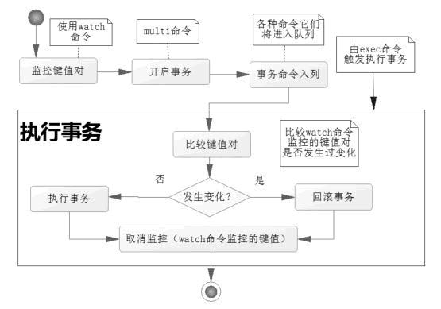

# 1. 什么是 Redis 的事务

**Redis** 的事务本质是一组命令的集合，类似于 **MySQL** 的事务描述。事务支持一次执行多个命令，一个事务中所有命令都会被序列化。

事务执行的过程中，会串行化执行队列中的命令，其他客户端请求不会插入到事务执行命令序列中。

总结下来：**Redis** 的事务就是**一次性、顺序性、排他性的执行一个队列中的一系列命令**。


# 2. Redis 事务相关的命令和使用

- **`MULTI`**：
  - 开启事务，**Redis** 会将后续的命令逐个放入队列中，然后使用 **`EXEC`** 命令来**原子化**执行这个**命令序列**。
- **`EXEC`**：
  - 执行事务对应的操作序列。
- **`DISCARD`**：
  - 取消事务，放弃执行事务对应的操作序列中的所有任务。
- **`WATCH`**：
  - 监视一个或多个 **`key`**，如果在事务执行前，这个 **`key`**（或者多个 **`key`**） 被其它命令修改的化，则事务中断，不会执行事务中的任何命令。
- **`UNWATCH`**：
  - 取消 **`WATCH`** 对所有 **`key`** 的监视。


## 2.1 Redis 标准的事务执行过程

分别给 **`k1`** 和 **`k2`** 赋值 **`v1`** 和 **`v2`**，在事务过程中修改 **`k1`** 和 **`k2`** 的值为 **`l1`** 和 **`l2`**，

执行之后查看 **`k1`** 和 **`k2`** 的值：

```shell
127.0.0.1:6379> set k1 v1
OK
127.0.0.1:6379> set k2 v2
OK
127.0.0.1:6379> MULTI
OK
127.0.0.1:6379> set k1 l1
QUEUED
127.0.0.1:6379> set k2 l2
QUEUED
127.0.0.1:6379> EXEC
1) OK
2) OK
127.0.0.1:6379> get k1
"l1"
127.0.0.1:6379> get k2
"l2"
```


## 2.2 Redis 事务的取消

```shell
127.0.0.1:6379> MULTI
OK
127.0.0.1:6379> set k1 l3
QUEUED
127.0.0.1:6379> set k2 l4
QUEUED
127.0.0.1:6379> DISCARD
OK
```


## 2.3 Redis 事务出现错误的处理

一共有两种错误，分别是：

1. **语法错误（编译期错误）**
2. **Redis 类型错误（运行时错误）**


### 2.3.1 语法错误

在我们开启事务之后，我们修改 **`k1`** 的值为 **`l1`**， **`k2`** 值为 **`l2`**，但是故意让操作 **`k2`** 的语法错误，最终导致事务提交失败，并且 **`k1`** 虽然事务过程中改变了值，但是也会回到原来的值。

```shell
127.0.0.1:6379> set k1 v1
OK
127.0.0.1:6379> set k2 v2
OK
127.0.0.1:6379> MULTI
OK
127.0.0.1:6379> set k1 l1
QUEUED
127.0.0.1:6379> sets k2 l2
(error) ERR unknown command `sets`, with args beginning with: `k2`, `22`, 
127.0.0.1:6379> exec
(error) EXECABORT Transaction discarded because of previous errors.
127.0.0.1:6379> get k1
"v1"
127.0.0.1:6379> get k2
"v2"
```


### 2.3.2 类型错误

在我们开启事务之后，我们仍旧使用上面的案例，但是这次是用了不同数据类型的修改指令，会报错，然后事务依旧会是之前的状态。

```shell
127.0.0.1:6379> set k1 v1
OK
127.0.0.1:6379> set k1 v2
OK
127.0.0.1:6379> MULTI
OK
127.0.0.1:6379> set k1 l1
QUEUED
127.0.0.1:6379> rpush k2 l2
QUEUED
127.0.0.1:6379> EXEC
1) OK
2) (error) WRONGTYPE Operation against a key holding the wrong kind of value
127.0.0.1:6379> get k1
"11"
127.0.0.1:6379> get k2
"v2"
```


## 2.4 CAS 实现乐观锁

**`WATCH`** 命令可以为 **Redis** 事务提供 check-and-set 行为。

**CAS？乐观锁？**这俩东西一般都是绑定出现的，那么在 Redis 中是怎么一回事呢？

我们使用官方的例子来解释：

被 **`WATCH`** 的 **key（一个或一组）**会被**监视**，并发可以发觉 **`key`** 是否被改动过了。如果有至少一个被键是的键在 **`EXEC`** 执行之前被修改，那么整个事务都会被取消，**`EXEC`** 命令通过返回 **`nil-reply`** 来表示事务已经失败。

举个例子， 假设我们需要原子性地为某个值进行增 1 操作（假设 **`INCR`**（自增） 不存在）。

首先我们这样做：

```shell
val = GET mykey
val = val + 1
SET mykey $val
```

这个做法在单个客户端的时候其实没什么问题，但是如果存在并发环境下，多个客户端同时并发对一个键进行这样的操作的化，可能就会产生竞争。

比如 **A 客户端** 和 **B 客户端** 都读取到了 **`mykey`** 原来的值，例如 1，此时 **`mykey`** 会被两个客户端都修改为 2，但是正确的情况应该是他俩操作后 **`mykey`** 的值变为 3，出现了类似 **MySQL** 数据库更新丢失的情况。

所有有了 **`WATCH`** 之后，我们就可以轻松的解决这类问题了：

 ```shell
 WATCH mykey
 val = GET mykey
 val = val + 1
 MULTI
 SET mykey $val
 EXEC
 ```

使用 **`WATCH`** 来监视 **`mykey`** ，如果在 **`WATCH`** 执行之后，**`EXEC`** 执行之前，有其它客户端修改了 **`mykey`** 的值，那么当前客户端的事务就会失败。程序此时需要做的就是不断重试去检查这个操作，直到没有发生碰撞为止。

这种锁被称为乐观锁，它是一种机制，十分强大。因为绝大多数情况下，不同的客户端会访问不同的键，碰撞的情况一般都很少，所以通常不需要进行重试，也就是说**并发环境下，发生并行的可能性还是很小**的。

### 2.4.1 WATCH 是如何实现监视的呢？

既然 **Redis** 使用 **`WATCH`** 命令来决定事务是否继续执行还是回滚，那么就需要在 **`MULTI`** 之前使用 **`WATCH`** 来监控某些键值对，如何使用 **`MULTI`** 命令来开启事务，执行对数据结构操作的各种命令，此时这些命令进入队列。

当使用 **`EXEC`** 命令执行事务的时候，首先会比对 **`WATCH`** 所监控的键值对：

- 如果没发生改变，它会执行事务队列中的命令，执行完毕提交事务；
- 如果发生改变，将不会执行事务中的任何命令，同时事务回滚。

无论事务是否回滚了，Redis 都会取消执行事务前的 **`WATCH`** 命令。



也就是，**`WATCH`** 命令会在执行是多加判断逻辑，判断键值版本是否变动了。


### 2.4.2 WATCH 命令实现监视示例

下列示例的过程就是，**`k1`** 和 **`k2`**  的值分别对应 **`v1`** **`v2`**  我们 **`WATCH`** 此时的 **`k1`**，在事务开始之前修改**`k1`** 的值为 **`l1`** ，然后将事务放入队列（**`MULTI`**）并执行 **`EXEC`** ，执行完毕之后我们重写获取 **`k1`** 和 **`k2`** 的值发现事务执行失败了。

```shell
127.0.0.1:6379> set k1 v1
OK
127.0.0.1:6379> set k2 v2
OK
127.0.0.1:6379> WATCH k1
OK
127.0.0.1:6379> set k1 l1
OK
127.0.0.1:6379> MULTI
OK
127.0.0.1:6379> set k1 l2
QUEUED
127.0.0.1:6379> set k2 l3
QUEUED
127.0.0.1:6379> EXEC
(nil)
127.0.0.1:6379> get k1
"l1"
127.0.0.1:6379> get k2
"v2"
```


### 2.4.3 UNWATCH 取消监视

```shell
127.0.0.1:6379> set k1 v1
OK
127.0.0.1:6379> set k2 v2
OK
127.0.0.1:6379> WATCH k1
OK
127.0.0.1:6379> set k1 l1
OK
127.0.0.1:6379> UNWATCH
OK
127.0.0.1:6379> MULTI
OK
127.0.0.1:6379> set k1 l2
QUEUED
127.0.0.1:6379> set k2 l3
QUEUED
127.0.0.1:6379> exec
1) OK
2) OK
127.0.0.1:6379> get k1
"l2"
127.0.0.1:6379> get k2
"l3"
```


## 3. Redis 事务执行步骤

通过我们上面的种种解释，我们不难发现 Redis 事务执行就三个阶段：

1. **开启**：以 **`MULIT`** 命令开始一个事务；
2. **入队**：将事务的多个命令放入事务等待队列，所以这些命令并不会立即就执行；
3. **执行**：**`EXEC`** 命令触发事务执行

当一个客户端切换到事务状态后，Redis 服务器会根据这个客户端发来的不同命令执行不同的操作：

- 如果客户端发送的命令为 **`EXEC|DISCARD|MULTI|WATCH`** 四个中的其中一个，那么服务器立即执行这个命令。
- 如果客户端发送的命令不是这几个命令中的其中一个，那么服务器并不会去立即执行，而是将这个命令放入一个事务队列中，然后向客户端返回 **`QUEUED`** 回复。


# 4. 为什么 Redis 不支持回滚？

我们之前使用关系型数据库，如 **MySQL** 之类的数据库，那么固有对事务的印象就是失败会回滚，但是 **Redis** 中为什么==**不支持回滚**==？

以下是这种做法的优点：

1. **Redis** 的命会因为语法错误或者类型错误而失败，但是这些命令的问题并不能在入队时发现，也就是说，从实用性的角度来看，失败的命令是由编程出错误造成的，而这些错误应该在开发过程中被发现，而不是出现在生产环境中。
2. 因为不需要支持回滚，所以 **Redis** 的内部可以保持简单并且快速。

但是又有一种观点认为 **Redis** 处理事务的做法会产生 **bug**，但是，我们注意上面我们说的话，可以理解为一个规范，这些失败的命令都不能出现在生产环境中，而且**回滚并不能解决编程错误带来的问题**。

就比如你本来想通过 **IN~CR** 命令把键的值都加上一，却不小心加上了2，或者对错误的类型执行了 **`INCR`** 方法，回滚是没办法处理这些情况的。


# 5. 如何理解 Redis 中事务的 ACID？

一般来说，事务都具有 **ACID** 四个性质，我们来梳理一下 **Redis** 中的 **ACID**：

- **原子性（atomicity）**；
  - 我们之前也说过 **Redis** 是不支持传统的回滚的，但是官方文档认为时遵从原子性的：**Redis 的事务是原子性的，所有命令要么执行，要么并不执行，而不是完全成功**。
  
- **一致性（consistency）**：
  - **Redis** 事务可以保证命令执行失败就回滚（不是传统回滚的意思），数据能恢复到事务执行前的样子，保证了原子性，除非 **Redis** 意外终结进程。
  
- **隔离性（isolation）**：
  - **Redis** 事务时严格遵守隔离性的， 原因是 **6.0** 版本之前，**Redis** 是单进程单线程模式，可以保证命令执行过程中不会被其它客户端命令打断，但是 **Redis** 不像其它结构化数据库有隔离级别的设计。
  
- **持久性（durability）**：
  - ==**Redis 事务是不保证持久性的**==，所以它的一致性，理论上来说也不是标准的一致性，因为 **Redis** 持久化策略中不管是 **RDB** 还是 **AOF** 都是异步执行，不保证持久性是处于性能考虑。
  
    


