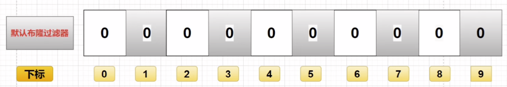
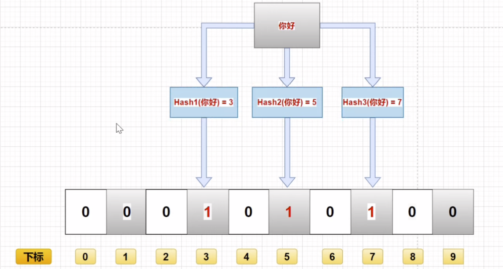
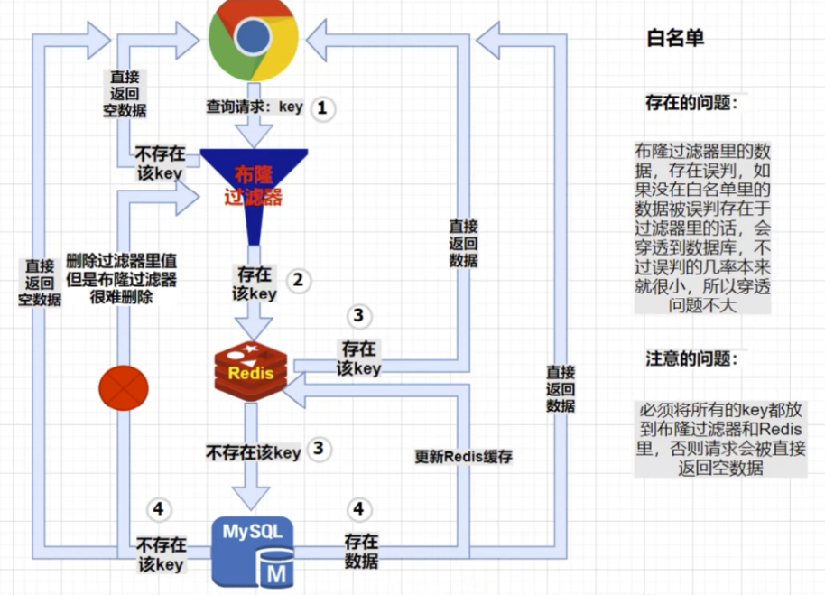
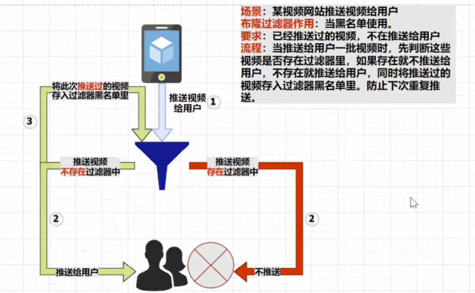
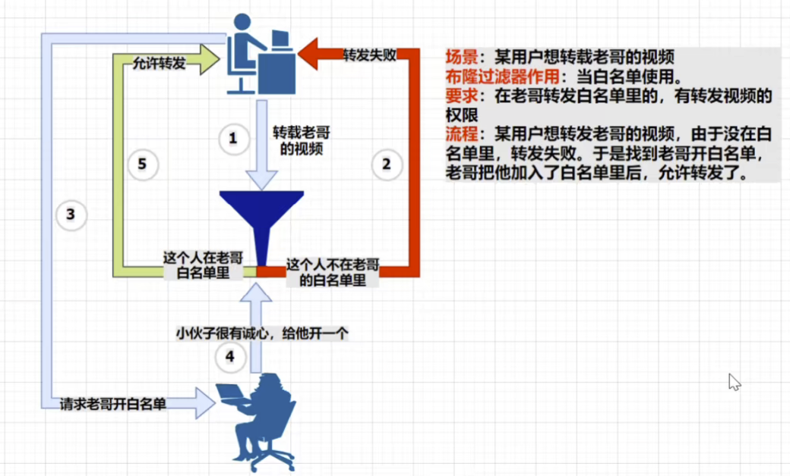

# 缓存雪崩

我们假设一个没钱的小公司，双十一的例子来说一说，假设在双十一这天，持续24小时的购物狂欢，必然会有大量的用户也就是大量的请求打入我们的服务器，为了提高响应速度，肯定是将某些热点数据放入到缓存中了，假设在这种情况下，用户每分每秒都有超过十万次的点击，持续二十四小时，如果我的所有热点数据的缓存时间设置的是三小时的话，三小时后大量的缓存同时失效，但是同时又有超过十万次的请求打入后台，那么缓存失效，请求就会全部转发到数据库，数据库承受不了这么大的并发，即使是集群，那也得很强大的集群才有可能抗住这次缓存失效带来的后果，这就是所谓的缓存雪崩，就像真正的雪崩一样一瞬间大量的雪滚落。

## 解决方案

我们了解了缓存雪崩的具体过程，那么我们来思考一下解决方案。

假设我是故障处理人员，我会这么想，既然缓存雪崩是大面积的key在同一时间失效引起的，如果是没进行集群部署的话，那么我是不是直接将缓存过期时间随机，保证其不要在同一时间大面积失效就行了。

如果做了分布式集群，那么我们可以将缓存平均的存放到不同的节点的缓存中。

当然我们还可以想到最暴力的就是直接给缓存设置永不失效。

咱还可以使用定时任务，比如三小时失效时间，我们在失效前定时更新缓存，但是也会有瑕疵，万一缓存更新途中有大量请求到来，也没招。

限流策略（加锁，队列方式），本地缓存。

# 缓存穿透

我们再来说一个例子，假设我是一个博客网站，目前网站就只有5篇文章，而且这5篇文章全部都放入缓存中。下面来看看这种情况，有无聊的人，截取了我们获取文章的api，并且不断的发送查找第6篇文章的请求，那么我们这虚无的第六篇文章数据库和缓存中都没有，这种情况就是缓存穿透了！导致我们每次都去缓存和数据库查询不存在数据，导致我们的数据库崩溃。

## 解决方案

首先嗷，我们出现这种情况，问题最根本就是出现在了请求缓存与数据库中都不存在的数据。所以，首先想到的就应该是参数的校验，但是不能避免一大堆奇怪的参数，防不胜防；

进一步想，虽然数据库没对应数据，那么我们是不是可以把数据库每次穿透查询的结果给他丢到缓存中，那么下一次它用同样的参数来进行那就穿透不了了，但是万一这个攻击者他用的非法数据将缓存空间占满了，那也会造成缓存的崩溃。

那么再进一步，是不是我们可以去尝试直接将他的IP地址列入黑名单呢？可以这么做，就怕他换不同的ip地址。

那么以上的方法其实都有很大的漏洞，不能比较稳定的防止缓存穿透问题。

所以我们可以沿用至1970年诞生的一种叫做**布隆过滤器**的东西来比较稳定的防止缓存穿透问题。

# 缓存击穿

我们可以这样理解，缓存雪崩就是超大面积的缓存击穿，所以就不多解释了。

## 解决方案

因为缓存击穿是针对单个热点的key，所以我们上来就可以想到，我设置缓存永不过期呗，但是这样是不是一棒子打死了。所以我们寻找别的办法，既然缓存突然失效，许多请求打到数据库上，但是这是针对单个热点key，也就是说是针对某个api而不是一群api，那么我们可以再保证数据一致性的代码逻辑这一个地方尝试上锁，上互斥锁，这样出现缓存击穿情况的话，那么我们的请求肯定有一个是强到锁了，其它请求线程可以让他休眠几秒，这样可能无数个请求最终就化作一个请求去查询数据库，然后等查询完毕放入缓存之后，将锁放开，这时其它线程进入临界区再次判断去缓存中拿去数据，这时缓存中也有数据了，那么问题就解决了。而不是说同时请求数据库，但是这针对单体应用。

如果是分布式的话，就得上分布式锁了。

# 布隆过滤器

它其实就是一个很长的二进制向量，一个二进制数组

**存入过程：**

- 我们分析一下学习视频中的这个图片，我们假设要缓存一个你好这个字符串，那么这个字符串假设经历三次哈希之后，得到了三个哈希值，那么他会将这三个哈希值映射到布隆过滤器的这个二进制数组中去，然后如图就是在数组的3、5、7下标位置进行存储。

**查询过程：**

- 比如说我们继续查这个你好，在经历多次哈希之后，查找到 3、5、7下标位置都为 1 ，所以代表这个数据存在。

**删除过程：**

- 删除过程是最麻烦，而且误差最大的，万一两个要过滤的数据他们的位图一样，那么我只删除前一个，那没问题，但是删除了前一个之后，我查询后一个，那就会出现在布隆数组中查询不到的情况，但实际它是存在的，只是因为另外一个哈希值相等的数据删除的时候把代表他俩存在的位都置0了。

**我们可以看出，这种位图存储，如果是检测出他不存在，那就一定是不存在，但是如果是检测出他存在，那么也不一定存在。**

### 使用

引用一下IT老哥的图。

#### 白名单：

看了白名单模式，我们得到的信息就是我们得一开始就将key全部存入redis和布隆过滤器里，如果出现漏传，那么就可能会出现 a，b，c三个key只传了a，b，但是 c 也是合法的请求，但由于只加载了 a、b，所以合法请求会被拦截处理掉。

#### 黑名单

那肯定和白名单反过来，我自己理解的就是，如果发生一次缓存穿透，就将这次缓存穿透的非法参数存入布隆过滤器，有点乐观，发生了我再记录，再拦截。

​	

#### 使用场景

### 优点

空间效率和查询时间都远远超过一般的算法，布隆过滤器存储空间和插入 / 查询时间都是常数O(k)，因为他的插入只是找到数组对应下标出置一即可，和常规的数组插入不一样。

最重要的是，我们发现即使是敏感信息存入过滤器，也是010101，极大的增加了数据的保密性。

而且占用内存更小。

### 缺点

我们不难想到，位图的位数也是有限的，如果有一天位图满了是不是误判率就上来了，虽然不太可能发生，但是数据量大起来的情况下，误判的风险也会随之增加。

而且我们上面也分析了，布隆过滤器的删除是一个很大的问题。

我又联想到一种极端情况：用户添加一条数据，然后删除，但是过滤器还存在，然后用这条数据去攻击，那过滤器也相当于失效了