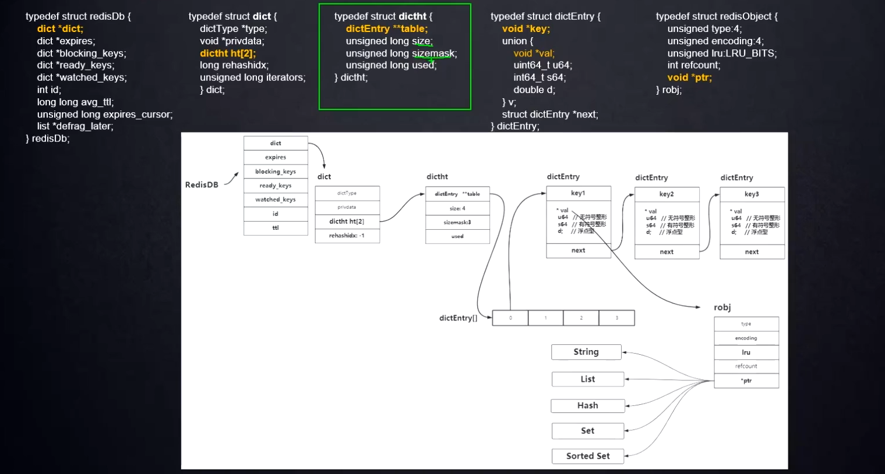
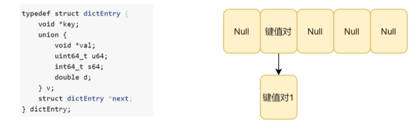
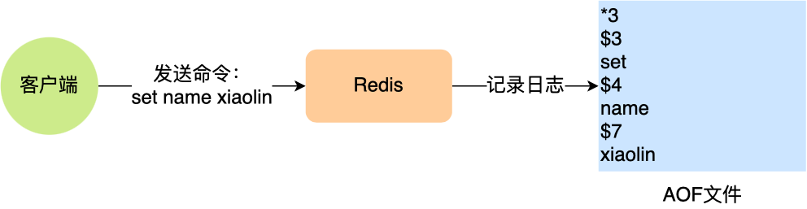
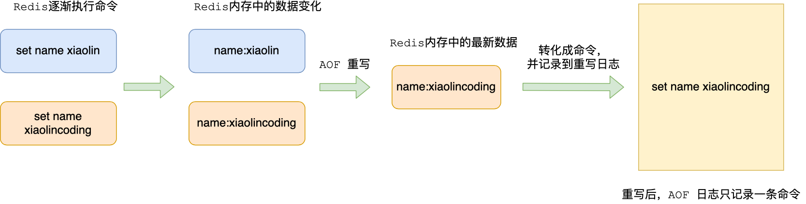
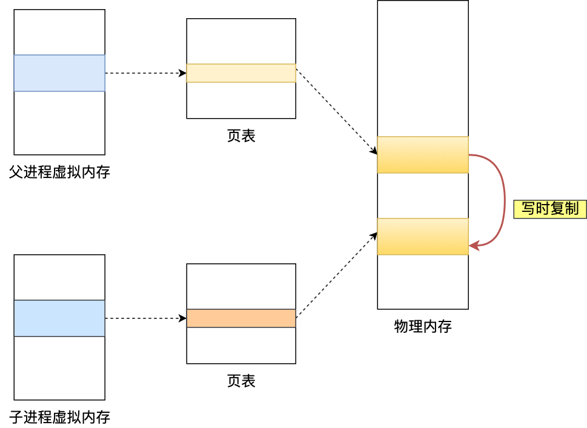
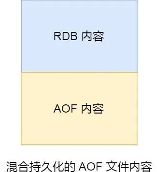

# 什么是Redis？

他是一个支持多种数据结构的非关系型内存开源的C语言编写的数据库，支持网络，常被用来做缓存中间件以及分布式锁的实现。

1. 首先他是一个**非关系型数据库**，可以根据**键以 O(1) 的时间复杂度插入或者取出关联值**。
2. Redis 是一个**内存数据库**，所以数据是存在内存中的。
3. 键值对中的键有不同的数据类型，可以是**字符串，整型，浮点型**等，且**键是唯一的**。
4. **值**的类型就多了，有 **`string、hash、list、set、zset`**等。
5. Redis 内置了赋值，磁盘持久化，智齿 LUA 脚本，事务，SSL，客户端代理等功能。
6. 通过 Redis 哨兵和自动分区提供高可用。


# 说一说 RedisDB 的基本数据结构（不是基本数据类型）？

我们来看一张图：



- **redisDb结构体**：
  - redis 的默认初始是十六个数据库，每个数据库的数据结构体就是 redisDb，里面比较重要的就是：dict指针（字典），所有的数据都是靠这个字典来的。
- **dict结构体**：
  - 与我们每种类型相关的结构体。
- **dictht结构体**：
  - 字典**hashtable**，后三个字段对应，O(1)复杂度获取**hashtable**中的数据个数，长度标记，用了多少空间（已经拥有了多少元素）。
  - 内部包含了指向正真存储数据的 **dictEntry** 链表的头节点。
- **dictEntry结构体**：
  - 代表我们的每一个元素。
  - 正真存储数据的地方。
  - key字段：存入的键值对的键。
  - value字段：存入的键值对的值（重要内容），**指向 redisObject 结构体**。
- **redisObject结构体**：
  - type：string、hash、set、list这些类型都是通过它来指向的，是对外的。
  - encoding：编码方式。
  - LRU：内存淘汰策略需要了解。
  - refcount：内存管理计数器，用来判断一个内存数据是否存活。
  - ==**ptr：指向我们真实的数据的存储，指向数据最终编码的对象。**==


# Redis的值基本数据类型？

在这里我们说的是值的数据类型，键的话目前就支持字符串。


## 字符串

### 为什么 Redis 不去采用 C 语言的字符串直接使用呢？

我们来说一下缺点：

1. 没有较好的扩容机制。
2. 特殊字符无法处理。
3. **O(n) 复杂度获取长度，也就是从头到尾遍历到\0结束，才知道长度**。

### 数据结构体

左边是 redis 3.0 之前，右边是之后：


- 左边：
  - **`len(已用空间长度) + free(剩余空闲空间) = 整个字符串申请的内存空间。`**
  - **buf[] 就是字符串存取的正真地点。**
- 右边：
  - len，字符串已使用长度。
  - alloc，给这个字符串（sds）分配的长度。
  - flags，标记当前字符串采用的是哪种 sds 结构体的（看下图）。

Redis为了保证不同长度的字符串都有可以对应的结构体去存储，**它把不同长度的字符串可能需要的存储空间提取出来不同的 sds 结构体来对应接收存储。**


### 总结

Redis的字符串类型本质上就是C语言的字符数组，但是额外增加了一点别的标识属性的结构体。

1. 字符串长度获取时间复杂度从 O(n) 降为了 O(1)，因为有标记字段。
2. 减少了字符串扩容引起的数据搬运次数，提前分配合适的空间。
3. 可以存储更加复杂的二进制数据。

### 实战场景

- 缓存：我个人使用最多的，把常用的信息，字符串，图片等信息变成字符串的形式序列化后放入 redis 中，比如 token。
- 计数器：redis在6.0前是单线程的，而且一般都不用高版本，所以我们可以用它来做计数器。
- session：我们可以用 redis 来实现分布式会话，大家都来这个地方读取 session，比直接存到数据库好多了。


## List

### List实现？

底层是双向链表和压缩链表实现的。


**Redis什么时候选择链表来实现 list 呢？**

- 当一个列表键包含了数量比较多的元素的时候。
- 列表中包含的元素都是比较长的字符串的时候。

**什么时候选用压缩列表来实现 list 呢？**

- 当一个list包含元素数量不是很多，或者list中包含元素都比较短，比如说短字符串的时候。
- 又或者是保存着比较多的固定的值，比如说月份。

### 实战场景

- 我们可以使用它来制作类似消息队列的功能。
- 微博的TimeLine：有人发布微博，就用 lpush 命令将其加入时间轴，展示新的列表信息。


## 哈希表

### 哈希表的实现？

 哈希表呢是一种存储数据的结构。

我们都了解，**哈希表中键值都是一一对应的关系**，并且一般情况下都是可以通过哈希表中的键在 O(1) 的时间复杂度的情况下获得对应的值。

但是由于c语言它并没有内置哈希表，所以 Redis 它自己写了一套属于自己的哈希表。

哈希表的最基本单元：



要设计哈希表不可避免的就是要解决哈希冲突问题，Redis 中的哈希表处理哈希冲突的方式选择的是拉链法。


我们来说明一下这个哈希表掩码，这个哈希表掩码，假如现在最大桶数为3，我们要访问非法的第四个桶，理论上来说是会抛出溢出异常的，所以就出现了哈希表掩码，**假如此时是00000011，发起查询第四个桶的请求，那么必须与这个 sizemask 做与运算。00000011 & 00000100，那么高位就被截断，所以就不会访问到越界元素。**

哈希表的大小，可以和 Java 中的 Hashmap 看齐，基本都是二的帧数次幂，这里图中只是随便画的。

给外界直接访问的结构体：


### 实战场景

- 缓存：相比string更节省空间，而且更直观，可以维护缓存信息，如用户信息，视频信息等


## 集合

可以参照 **Java** 中 **HashMap** 和 **HashSet** 的关系，**Redis** 中的 **Set** 也是对哈希表的封装。

### 普通集合

就是对 **Redis** 的哈希表的封装。

### 整数集合


**怎么查整数是否在集合中呢？**

- 连续空间，那就是二分法查找。

**整数集合的修改操作怎么做呢？**

- 对于修改来说，整数集合保持其有一段空间是有序的，由于是连续内存空间，所以对修改数据需要重新申请一段连续的内存空间。

### 实战场景

- **点赞，收藏等**，可以放到set中实现。


## 有序集合

有序集合是跳表作为底层数据结构的有序的集合。

### 什么是跳表？

先来看单链表：


再来看看跳表：


虽然是多级索引，但是相同的节点不管处于几级索引，它都是同一个节点。

**那么这个节点到底是怎么来确定的呢？**

- 替代方法：
  - 在原始数据中随机二分之N元素为一级索引，四分之N元素为二级索引。
- 具体方式：
  - 每插入一个新元素，有二分之一概率将该元素为无索引，四分之一概率为一级索引，八分之一为二级索引......依此类推。

跳表的节点结构体以及跳表结构体定义：


### 实战场景

- 利用 Redis 实现最热数据 TopK。
  - 按之前 **map结构** 实现：键存储最热数据标题，只存储当前标题热度。
  - 针对该TopK，选取热度为TopK的返回值，时间复杂度为 O(nlogn)。
  - 但是如果我们此时这个 **map结构** 本身是按照标题热度值组织的有序机构，就将其复杂度将为 **O(k)** 这个 **K = TopK** 的 **K**。


# Redis持久化？RDB和AOF都是啥？干啥用的？

## RDB

简单来说，就是 **redis 提供了一种机制**，他会**将当前 redis 内存中的数据生成一个快照（RDB文件），保存再硬盘之中，如果发生类似于断电，宕机等事故，redis 可以通过 RDB 文件进行数据的读取，并且将数据重新载入到内存当中**。**==RDB文件是二进制显示的==**，没有可读性，AOF文件在了解其结构的情况下可以手动修改或者补全。

也被我们称为全量备份。

- RDB文件的示意图：


- 各种基础数据类型数据在 RDB 中的结构：


### 触发条件

我们一般都会在设计时给某个功能一个自动和手动模式，Redis 的 RDB 也不例外：

- **手动触发**：
  - **`save 命令`**，主线程指向 **`rdbSave 函数`**，**服务器进程阻塞**（不能处理其它请求）。
  - **`bgsave 命令`**，本质上与 **`save 命令`**差不多，区别在于 **redis** 会 **fork** 一个子进程去指向 **`rdbSave 函数`**，这样主线程还是可以执行新的请求的。
- **自动触发：**
  - 配置文件中写入 **`save m n`**，代表在 m 秒内发生 n 次变化的时候，会自动执行 **`bgSave 命令`**。

### 问题

**我们一般都给 redis 很大的内存空间，这意味着，空间使用越多，进行一次 RDB 全量复制的时间会变长，而实际情况是这段全量复制一般都是被 fork 出来的子进程执行的，所以此时主线程还在不断的收到数据写操作的请求，这样会带来 RDB 和内存的数据不一致问题，我们如何保证数据不一致问题呢？**

- RDB 的核心思路就是写时复制，使用写时复制可以保证在全量复制的过程中主线程不被打断还能持续接收请求，处理业务。
- 并且在这个时间里主线程发生的写操作，都会被记录成一个副本放在一个新的内存区域，待快照操作结束后才会同步到原来的内存区域。


**那么我们进行快照全量复制这段时间，发生服务崩溃又怎么办呢？**

- 其实处理起来很简单，**断定全量复制是否完成的依据是将数据全部写入到磁盘**。
- 如果在某次快照全量复制过程中发生服务崩溃的情况，那么**将会以上一次完整的全量复制 RDB 文件来作为内存恢复的参考**。
- Redis 服务会在磁盘上创建一个临时文件进行数据操作，待操作成功后才会用这个临时文件替换掉上一次的备份。

**快照如果间隔时间大的话会出现什么问题？**

- 假如我们先在 **T0 时刻做了一次快照**，然后又在 **T0+t 时刻做了一次快照**，在这期间，有数据块被更改了。如果在 **t 这段时间内（数据块修改阶段），机器宕机了，那么，只能按照 T0 时刻的快照进行恢复**。此时，在 **t 这段时间内修改的数据块的修改值因为没有快照记录，就无法恢复了**。
- 我们可以通过 Redis 4.0 之后的采取 AOF 和 RDB 的混合模式来解决。

**那么我们可以每秒做一次快照吗？**

- 对于快照来说，连拍肯定好，但是，每次 fork 子进程都是要消耗系统资源的，而且如果平凡将数据全量复制，会造成磁盘压力过大，可能上一次还没写完，下一次就开始了。


## AOF

与 MySQL 等数据库采用的写前日志逻辑，通过写前日志和两段提交实现数据和逻辑一致性，**AOF**日志采用写后日志，即**先写内存，后写日志**。

**aof** 呢也是一种持久化的方式，它与 **RDB** 不同的地方在于，他是存储着对 **redis** 中各个数据库修改的所有操作（指令）。

如果发生了事故，**redis** 可以通过重新执行最近一次的 aof 文件中的指令，依此来恢复数据。


如果没有这种策略，我们如果记录全部对 A 这个 key 的操作，那么随着时间的推移，这个文件会越来越大，指令也会越来越多，但是我们只需要最新对数据 A 的操作，这样是不是多余指令冗余了，所以我们要有重写策略将冗余数据清除。


### 问题

**为什么使用写后日志呢？**

- 为了高性能。

- **AOF 记录的是操作的执行指令**，如果是写前日志，AOF 日志中可能就会有错误的执行指令，不然我们得另外加一个检查语法的机制。
- 而如果是写后日志，指令在 redis 中执行过了，成功了才可以放入 AOF ，所以保证了正确性的同时又保证了高性能。

- 但是**如果写命令在 redis 中执行完成并且写入到 AOF 文件之前服务器宕机了，会丢失数据**。
- 主线程**写磁盘压力大，导致写慢，阻塞后续操作**。

**AOF重写会阻塞吗？**

- AOF的重写过程是由后台进程 **`bgrewriteaof`** 来完成的。而这个后台进程又是由主进程 fork 而来，fork 的过程会导致阻塞。

**AOF日志何时会重写？**

- 有两个配置项控制AOF重写的触发：

  - **`auto-aof-rewrite-min-size`**：表示运行AOF重写时文件的最小大小，默认为64MB。

  - **`auto-aof-rewrite-percentage`**：这个值的计算方式是，当前aof文件大小和上一次重写后aof文件大小的差值，再除以上一次重写后aof文件大小。也就是当前aof文件比上一次重写后aof文件的增量大小，和上一次重写后aof文件大小的比值。

>  该答案著作权归https://pdai.tech所有。 链接：https://www.pdai.tech/md/db/nosql-redis/db-redis-x-rdb-aof.html


### 操作总结

- 主线程 fork 出子进程重写 AOF 日志文件。
- 子进程重写完成之后，主线程追加 AOF 日志缓冲。
- 替换日志文件。


## RDB和AOF混合共用

这是在 redis 4.0 版本之后提出的方法。

简单来说，内存快照以一定的频率执行，在两次快照之间，使用 AOF 日志记录这期间的所有命令操作。

这样做的好处就是，我们不用频繁的执行 RDB 的全量复制，这就首先解决了频繁 fork 子进程的问题，减少了对主线程的影响。而且！而且哈！AOF 日志就只用记录两次全量复制之间的执行指令，这样也不会造成 AOF 文件过大的问题了！我们在成功完成一次全量复制之后就可以清空我们的 AOF 日志和缓冲区，岂不美哉。


这个方法既能享受到 RDB 文件快速恢复的好处，又能享受到 AOF 只记录操作命令的简单优势, 实际环境中用的很多。

# 数据一致性问题？

**Cache Aside Pattern**

1. 命中：程序先从缓存中读取数据，如果命中，则直接返回。
2. 失效：程序先从缓存中读取数据，如果没有命中，则从数据库中读取，成功之后将数据放到缓存中。
3. 更新：程序先更新数据库，再删除缓存。

**我们主要来看的是更新这一块，目前我们可以想到的有四种方案：**

1. 先更新缓存，再更新数据库。
2. 先更新数据库，再更新缓存。
3. 先删除缓存，再更新数据库。
4. 先更新数据库，再删除缓存。

## 先更新缓存，再更新数据库

这个方法是行不通的，为什么呢？假设我们缓存更新成功，但是数据库更新时数据库宕机，或者网络连接中断了，还是会出现数据不一致的问题，并且很难排查。

## 先更新数据库，再更新缓存

这个方法还是行不通，理由和**先更新缓存，再更新数据库**的一样，并且还会出现并发问题：


图中左边是线程的创建先后顺序，右边是并发问题，我们知道数据库更新一般都不用担心，但是，图中线程执行的流程向我们展示了运用这种方案会出现新缓存被就缓存覆盖的情况。

## 先删除缓存，再更新数据库

也会出问题，为啥呢，我们看个图：


线程A更新缓存，线程B查询缓存，但是线程A删除缓存之后，更新数据库之前又有线程B来把旧的数据读取并且再次放入缓存中了，此时虽然线程A完成了数据库更新，但是缓存里的内容还是旧数据。

## 先更新数据库，再删除缓存（Cache Aside Partten）

使用这种方法理论上来说是解决了问题：


但是，特殊条件下，例如缓存刚好失效的情况下，会出现下面这种情况：


线程A提前更新完毕数据库并且删除了缓存，此时线程B最后才执行将旧数据写入缓存的操作，这又会导致不一致。但是发生更新数据库操作所需执行时间小于查询数据库操作所需的执行时间这种概率几乎是不存在的，理论上任何对数据库的**DQL**都比**DML**要快。

**我们怎么去解决呢？**

- 根据业务给缓存设立合适的有效时间。
- 采用异步延时删除策略。


## 延迟双删

先删除缓存，再更新数据库，然后休眠一秒再删除缓存，理论上来讲，我们可以避免休眠一秒中别的线程的所有对缓存的更新操作而造成了数据不一致问题，但是我们使用延迟双删还是会有风险。而且我们异步删除虽然说解耦了，但是还是对业务有一定的侵入性。

但是如果通过订阅 mysql 的 binlog 的话，也不好，因为我们存入 redis 的数据或许是需要特殊处理的数据。


## 总结

想要真正保证数据强一致性或者最终一致性问题，最好的办法就是加锁。对于不敏感的数据可以使用延迟双删的策略。

# 缓存的淘汰策略？

我们来说说定时删除+惰性删除+缓存淘汰策略中的缓存淘汰策略吧：

我们可以分为以下几个维度来讨论：

首先就是，我到底要不要淘汰缓存，不淘汰（no-eviction redis3.0之后的默认策略）？那就返回错误，淘汰，就进行下一步判断；我们如果淘汰，那么是根据什么淘汰呢？淘汰的kv范围是怎么样的呢？我们可以分为设置了过期时间的和没有设置过期时间的kv两大类？好了确定了淘汰范围，我们就可以开始设计淘汰算法了：LRU（Redis3.0之前默认的淘汰策略）、LFU（Redis4.0之后），随即删除，TTL。

当 Redis 的内存（maxmemory参数配置）已满时，它会根据淘汰策略（maxmemory-policy参数配置）进行相应操作。

- valotile-*：从已经过期的数据集中淘汰 key。

- allkeys-*：从所有key中淘汰key。

## 不删除策略

- no-eviction，不删除策略，Redis默认策略。达到最大内存限制时，若需要更多内存，直接返回错误信息。

## 最近最少使用策略（LRU）

- allkeys-lru，所有 key 通用，优先删除最近最少使用的 key。

- volatile-lru，只限于设置了过期时间的部分，优先删除最近最少使用的有过期时间的 key。

## 随机策略（random）

- allkeys-random，所有 key 通用，随机删除一部分 key。

- volatile-random，只限于设置过期时间的部分，水机删除已经设置了过期时间的部分。

## 剩余时间最短策略（TTL）

- volatile-ttl，只限于设置过期时间的部分，优先删除剩余过期时间短的 key。

## 最不经常使用策略（LFU）

- volatile-lfu，只限于设置了过期时间的部分，优先删除我们设置了过期时间但是最不经常使用的 key。

- allkeys-lfu，优先删除我们最不经常使用的 key。


# Redis 的定时删除策略呢？

**Redis** 是基于键值对的内存数据库，我们可以设置 **Redis** 缓存的 **key 的过期时间**，**Redis** 的过期删除策略和淘汰策略不一样，删除策略是指如何去处理**过期的 key**。

过期时间字典会保存所有设置了过期时间的 **key的过期时间数据**，它的具体结构是：

- **expires 的 key**：指向 Redis 存数据的 key 空间的某个键的指针。
- **expires 的 value**：该键所对应的过期时间的毫秒精度的时间戳。

## 定时删除

我们在设置 **key** 的过期时间的同时，**Redis** 会对这个 **key** 创建一个定时器，当该 **key** 达到过期时间，立即从 **redis** 中删除这个 **key**。

## 惰性删除

放任我们的过期 **key** 不管，也就是说，某个键即使过期了，我们如果不查询它，那么我们默认为它不过期，只有在主动查询某个 **key**，并且那个 **key** 过期了，我们才会进行对该 **key** 的删除。

## 定期删除

这个很好理解，每过一段时间我们就批量删除那些过期了的 **key**，也就是说时间不到，即使有些 **key** 过期了，也不会被删除。

# 多路复用讲一下？

我直接画图吧：


# Redis可以用来干嘛？

- 排行榜

- 计数器

- 消息队列

- 分布式锁

- 缓存热点数据

- 共同关注共同好友


# 说说LRU和LFU？

LRU：最近最久未使用，我们可以将其想象成一个有序链表，这个有序是根据链表上存储的内容的某些字段来进行衡量的， 比如我们拿redis中的kv来说，我们可以给每个kv上一个时间戳，每次使用这个kv的时候，更新时间戳，然后将其从链表表尾提到表头，这样的话我们表尾的就是最近最久未使用的，可以淘汰的kv。

LFU：最近最不常使用，我们的实现原理也可以沿袭LRU来，只不过将时间戳改为记录该kv的使用频次即可。

# 那么LRU和LFU在Redis中是怎么样的呢？

我们也都看到了，标准的LFU和LRU算法，得维护一个链表，链表长度取决于kv的数量。

Redis 实现的是一种**近似 LRU 算法**，目的是为了更好的节约内存，它的**实现方式是在 Redis 的对象结构体中添加一个额外的字段，用于记录此数据的最后一次访问时间**。

当 Redis 进行内存淘汰时，会使用**随机采样的方式来淘汰数据**，它是**随机取 5 个值（此值可配置）**，然后**淘汰最久没有使用的那个**。

**在 LRU 算法中**，Redis 对象头的 24 bits 的 lru 字段是用来记录 key 的访问时间戳，因此在 LRU 模式下，Redis可以根据对象头中的 lru 字段记录的值，来比较最后一次 key 的访问时间长，从而淘汰最久未被使用的 key。

**在 LFU 算法中**，Redis对象头的 24 bits 的 lru 字段被分成两段来存储，高 16bit 存储 ldt(Last Decrement Time)，用来记录 key 的访问时间戳；低 8bit 存储 logc(Logistic Counter)，用来记录 key 的访问频次。


# Redis的持久化？（该题内容摘抄自小林coding）

Redis4.0之后是采取了AOF和RDB混合的方式来进行持久化操作的。

## Redis 如何实现数据不丢失？

Redis 的读写操作都是在内存中，所以 Redis 性能才会高，但是当 Redis 重启后，内存中的数据就会丢失，那为了保证内存中的数据不会丢失，Redis 实现了数据持久化的机制，这个机制会把数据存储到磁盘，这样在 Redis 重启就能够从磁盘中恢复原有的数据。

我们要知道，我们的redis的读写存储操作都是在内存中的，而内存有什么问题，那就是进程终止之后，进程所指的虚拟内存所对应的物理内存的内容可以被回收，而且内存本身是不支持持久化的，我们Redis为了实现数据不丢失的问题，就必然得实现持久化机制，Redis会通过一系列解决方案将内存中的数据按照一定格式存入磁盘中，这就是Redis的持久化，我们接下来就来详细说说：

截至目前，Redis提供了三种持久化方式：

- **AOF 日志**：每执行一条写操作命令，就把该命令以追加的方式写入到一个文件里；
- **RDB 快照**：将某一时刻的内存数据，以二进制的方式写入磁盘；
- **混合持久化方式**：Redis 4.0 新增的方式，集成了 AOF 和 RBD 的优点；

## AOF 日志是如何实现的？

Redis 在执行完一条写操作命令后，就会把该命令以追加的方式写入到一个文件里，这里我们也说了是以追加命的方式写入文件，所以AOF的可读性比较强。然后 Redis 重启时，会读取该文件记录的命令，然后逐一执行命令的方式来进行数据恢复。


我这里以「*set name xiaolin*」命令作为例子，Redis 执行了这条命令后，记录在 AOF 日志里的内容如下图：



我这里给大家解释下。

「*3」表示当前命令有三个部分，每部分都是以「刀乐符号+数字」开头，后面紧跟着具体的命令、键或值。然后，这里的「数字」表示这部分中的命令、键或值一共有多少字节。例如，「$3 set」表示这部分有 3 个字节，也就是「set」命令这个字符串的长度。

### 为什么先执行命令，再把数据写入日志呢？

Reids 是先执行写操作命令后，才将该命令记录到 AOF 日志里的，这么做其实有两个好处。

- **避免额外的检查开销**：因为如果先将写操作命令记录到 AOF 日志里，再执行该命令的话，如果当前的命令语法有问题，那么如果不进行命令语法检查，该错误的命令记录到 AOF 日志里后，Redis 在使用日志恢复数据时，就可能会出错。
- **不会阻塞当前写操作命令的执行**：因为当写操作命令执行成功后，才会将命令记录到 AOF 日志。

当然，这样做也会带来风险：

- **数据可能会丢失：** 执行写操作命令和记录日志是两个过程，那当 Redis 在还没来得及将命令写入到硬盘时，服务器发生宕机了，这个数据就会有丢失的风险。
- **可能阻塞其他操作：** 由于写操作命令执行成功后才记录到 AOF 日志，所以不会阻塞当前执行的读写命令的执行，但因为 AOF 日志也是在主线程中执行，所以当 Redis 把日志文件写入磁盘的时候，还是会阻塞后续的操作无法执行类似于：**写/读 -> aof记录 -> 写/读**。

### AOF 写回策略有几种？

先来看看，Redis 写入 AOF 日志的过程，如下图：


具体说说：

1. Redis 执行完写操作命令后，会将命令追加到 server.aof_buf 缓冲区；
2. 然后通过 write() 系统调用，将 aof_buf 缓冲区的数据写入到 AOF 文件（此时数据并没有写入到硬盘，注意这一步还没与硬盘进行交互）；
3. 具体写入 AOF 文件的过程是先拷贝到了内核缓冲区 page cache，等待内核将数据写入硬盘AOF文件；
4. 具体内核缓冲区的数据什么时候写入到硬盘，由内核决定。

Redis 提供了 3 种写回硬盘的策略，控制的就是上面说的第三步的过程。 在 Redis.conf 配置文件中的 appendfsync 配置项可以有以下 3 种参数可填：

- **Always**，这个单词的意思是「总是」，所以它的意思是每次写操作命令执行完后，同步将 AOF 日志数据写回硬盘；
- **Everysec**，这个单词的意思是「每秒」，所以它的意思是每次写操作命令执行完后，先将命令写入到 AOF 文件的内核缓冲区，然后每隔一秒将缓冲区里的内容写回到硬盘；
- **No**，意味着不由 Redis 控制写回硬盘的时机，转交给操作系统控制写回的时机，也就是每次写操作命令执行完后，先将命令写入到 AOF 文件的内核缓冲区，再由操作系统决定何时将缓冲区内容写回硬盘。

我也把这 3 个写回策略的优缺点总结成了一张表格：


### AOF 日志过大，会触发什么机制？

AOF 日志是一个文件，随着执行的写操作命令越来越多，文件的大小会越来越大。 如果当 AOF 日志文件过大就会带来性能问题，比如重启 Redis 后，需要读 AOF 文件的内容以恢复数据，如果文件过大，整个恢复的过程就会很慢。

所以，Redis 为了避免 AOF 文件越写越大，提供了 **AOF 重写机制**，当 AOF 文件的大小超过所设定的阈值后，Redis 就会启用 AOF 重写机制，来压缩 AOF 文件。

AOF 重写机制是在重写时，读取当前数据库中的所有键值对，然后将每一个键值对用一条命令记录到「新的 AOF 文件」，等到全部记录完后，就将新的 AOF 文件替换掉现有的 AOF 文件。

举个例子，在没有使用重写机制前，假设前后执行了「*set name xiaolin*」和「*set name xiaolincoding*」这两个命令的话，就会将这两个命令记录到 AOF 文件。



但是**在使用重写机制后，就会读取 name 最新的 value（键值对） ，然后用一条 「set name xiaolincoding」命令记录到新的 AOF 文件**，之前的第一个命令就没有必要记录了，因为它属于「历史」命令，没有作用了。这样一来，一个键值对在重写日志中只用一条命令就行了。

重写工作完成后，就会将新的 AOF 文件覆盖现有的 AOF 文件，这就相当于压缩了 AOF 文件，使得 AOF 文件体积变小了。

### 重写 AOF 日志的过程是怎样的？

Redis 的**重写 AOF 过程是由后台子进程 `bgrewriteaof` 来完成的**，这么做可以达到两个好处：

- **避免主进程阻塞**：子进程进行 AOF 重写期间，主进程可以继续处理命令请求，从而避免阻塞主进程；
- **写时复制**：子进程带有主进程的数据副本，这里使用子进程而不是线程，因为如果是使用线程，多线程之间会共享内存，那么在修改共享内存数据的时候，需要通过加锁来保证数据的安全，而这样就会降低性能。而使用子进程，创建子进程时，父子进程是共享内存数据的，不过这个共享的内存只能以只读的方式，而当父子进程任意一方修改了该共享内存，就会发生「写时复制」，于是父子进程就有了独立的数据副本，就不用加锁来保证数据安全。

触发重写机制后，主进程就会创建重写 AOF 的子进程，此时父子进程共享物理内存，重写子进程只会对这个内存进行只读，重写 AOF 子进程会读取数据库里的所有数据，并逐一把内存数据的键值对转换成一条命令，再将命令记录到重写日志（新的 AOF 文件）。

**但是重写过程中，主进程依然可以正常处理命令**，那问题来了，重写 AOF 日志过程中，如果主进程修改了已经存在 key-value，那么会发生写时复制，此时这个 key-value 数据在子进程的内存数据就跟主进程的内存数据不一致了，这时要怎么办呢？

为了解决这种数据不一致问题，Redis 设置了一个 **AOF 重写缓冲区**，这个缓冲区在创建 **`bgrewriteaof`** 子进程之后开始使用。

在重写 AOF 期间，当 Redis 执行完一个写命令之后，它会**同时将这个写命令写入到 「AOF 缓冲区」和 「AOF 重写缓冲区」**。


也就是说，在 **`bgrewriteaof`** 子进程执行 AOF 重写期间，主进程需要执行以下三个工作:

- 执行客户端发来的命令；
- 将执行后的写命令追加到 「AOF 缓冲区」；
- 将执行后的写命令追加到 「AOF 重写缓冲区」；

当子进程完成 AOF 重写工作（*扫描数据库中所有数据，逐一把内存数据的键值对转换成一条命令，再将命令记录到重写日志*）后，会向主进程发送一条信号，信号是进程间通讯的一种方式，且是异步的。

主进程收到该信号后，会调用一个信号处理函数，该函数主要做以下工作：

- 将 AOF 重写缓冲区中的所有内容追加到新的 AOF 的文件中，使得新旧两个 AOF 文件所保存的数据库状态一致；
- 新的 AOF 的文件进行改名，覆盖现有的 AOF 文件。

信号函数执行完后，主进程就可以继续像往常一样处理命令了。

## RDB 快照是如何实现的呢？

因为 AOF 日志记录的是操作命令，不是实际的数据，所以用 AOF 方法做故障恢复时，需要全量把日志都执行一遍，一旦 AOF 日志非常多，势必会造成 Redis 的恢复操作缓慢。

为了解决这个问题，Redis 增加了 RDB 快照。所谓的快照，就是记录某一个瞬间东西，比如当我们给风景拍照时，那一个瞬间的画面和信息就记录到了一张照片。

所以，RDB 快照就是记录某一个瞬间的内存数据，记录的是实际数据，而 AOF 文件记录的是命令操作的日志，而不是实际的数据。

因此在 Redis 恢复数据时， RDB 恢复数据的效率会比 AOF 高些，因为直接将 RDB 文件读入内存就可以，不需要像 AOF 那样还需要额外执行操作命令的步骤才能恢复数据。

### RDB 做快照时会阻塞线程吗？

Redis 提供了两个命令来生成 RDB 文件，分别是 save 和 bgsave，他们的区别就在于是否在「主线程」里执行：

- 执行了 save 命令，就会在主线程生成 RDB 文件，由于和执行操作命令在同一个线程，所以如果写入 RDB 文件的时间太长，**会阻塞主线程**；
- 执行了 bgsave 命令，会创建一个子进程来生成 RDB 文件，这样可以**避免主线程的阻塞**；

Redis 还可以通过配置文件的选项来实现每隔一段时间自动执行一次 bgsave 命令，默认会提供以下配置：

```c
save 900 1
save 300 10
save 60 10000
```

别看选项名叫 save，实际上执行的是 bgsave 命令，也就是会创建子进程来生成 RDB 快照文件。 只要满足上面条件的任意一个，就会执行 bgsave，它们的意思分别是：

- 900 秒之内，对数据库进行了至少 1 次修改；
- 300 秒之内，对数据库进行了至少 10 次修改；
- 60 秒之内，对数据库进行了至少 10000 次修改。

这里提一点，Redis 的快照是**全量快照**，也就是说每次执行快照，都是把内存中的「所有数据」都记录到磁盘中。所以执行快照是一个比较重的操作，如果频率太频繁，可能会对 Redis 性能产生影响。如果频率太低，服务器故障时，丢失的数据会更多。

### RDB 在执行快照的时候，数据能修改吗？

可以的，执行 bgsave 过程中，Redis 依然**可以继续处理操作命令**的，也就是数据是能被修改的，关键的技术就在于**写时复制技术（Copy-On-Write, COW）。**

执行 bgsave 命令的时候，会通过 fork() 创建子进程，此时子进程和父进程是共享同一片内存数据的，因为创建子进程的时候，会复制父进程的页表，但是页表指向的物理内存还是一个，此时如果主线程执行读操作，则主线程和 bgsave 子进程互相不影响。


如果主线程执行写操作，则被修改的数据会复制一份副本，然后 bgsave 子进程会把该副本数据写入 RDB 文件，在这个过程中，主线程仍然可以直接修改原来的数据。




## 为什么会有混合持久化？

RDB 优点是数据恢复速度快，但是快照的频率不好把握。频率太低，丢失的数据就会比较多，频率太高，就会影响性能。

AOF 优点是丢失数据少，但是数据恢复不快。

为了集成了两者的优点， Redis 4.0 提出了**混合使用 AOF 日志和内存快照**，也叫混合持久化，既保证了 Redis 重启速度，又降低数据丢失风险。

混合持久化工作在 **AOF 日志重写过程**，当开启了混合持久化时，在 AOF 重写日志时，fork 出来的重写子进程会先将与主线程共享的内存数据以 RDB 方式写入到 AOF 文件，然后主线程处理的操作命令会被记录在重写缓冲区里，重写缓冲区里的增量命令会以 AOF 方式写入到 AOF 文件，写入完成后通知主进程将新的含有 RDB 格式和 AOF 格式的 AOF 文件替换旧的的 AOF 文件。

也就是说，使用了混合持久化，AOF 文件的**前半部分是 RDB 格式的全量数据，后半部分是 AOF 格式的增量数据**。



这样的好处在于，重启 Redis 加载数据的时候，由于前半部分是 RDB 内容，这样**加载的时候速度会很快**。

加载完 RDB 的内容后，才会加载后半部分的 AOF 内容，这里的内容是 Redis 后台子进程重写 AOF 期间，主线程处理的操作命令，可以使得**数据更少的丢失**。

**混合持久化优点：**

- 混合持久化结合了 RDB 和 AOF 持久化的优点，开头为 RDB 的格式，使得 Redis 可以更快的启动，同时结合 AOF 的优点，有减低了大量数据丢失的风险。

**混合持久化缺点：**

- AOF 文件中添加了 RDB 格式的内容，使得 AOF 文件的可读性变得很差；
- 兼容性差，如果开启混合持久化，那么此混合持久化 AOF 文件，就不能用在 Redis 4.0 之前版本了。

