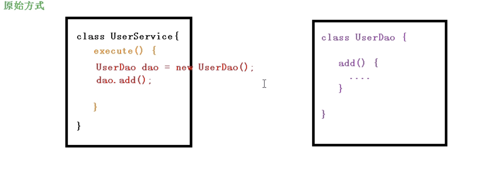
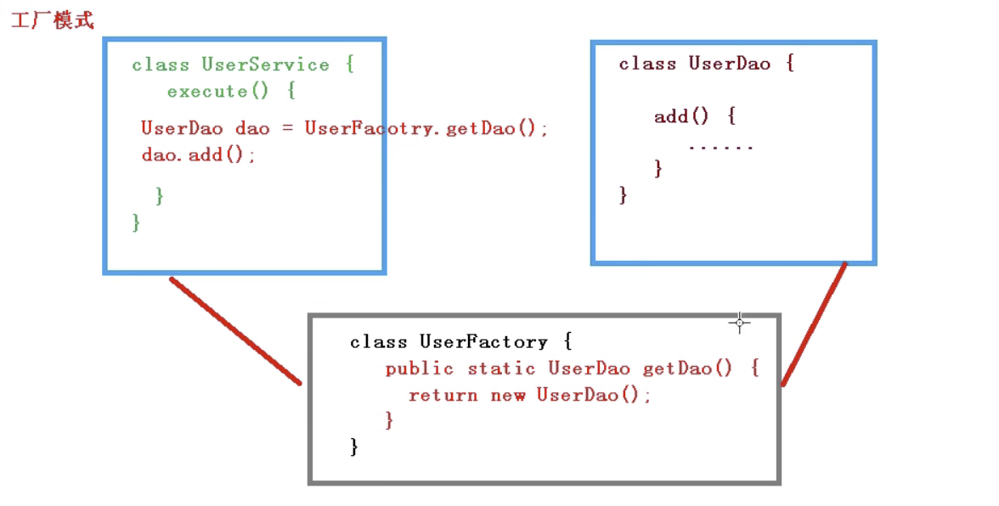
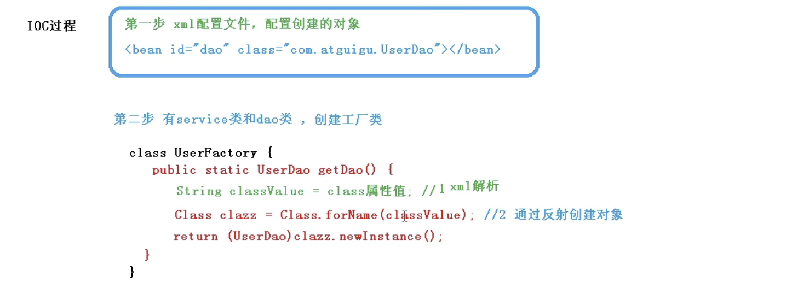

## IOC 概念和原理

> xml解析、工厂模式、反射等都是它最重要的底层

控制反转，把我们对象的创建以及对象之间调用的过程，都交给 Spirng 容器去管理。

有了 IOC 代码中的耦合度就降低了。

- **原始方式调用实例对象**：

这样看来，虽然说主动权在我们手里但是代码耦合度变高了，**`UserDao`** 变化 **`UserService`** 也要变。

- **通过工厂模式完成调用实例对象：**

我们用了工厂模式之后，**`UserDao`** 和 **`UserService`** 的耦合度进一步降低，工厂模式主要是为了把对象创建和对象的方法调用分开，实现解耦，所以对于 **`UserService`** 来说 **`UserDao`** 是黑盒，**`UserDao`** 的任何修改不会影响创建 dao 对象的过程。但是 **`UserService`** 和  **`UserDao`** 解耦了，但是 **`UserFactory`** 和 **`UserDao`** 依然高耦合而已。

我们到走到工厂模式，就是为了进一步解耦，而且在工厂模式下我们可以进一步解耦。

- IOC**通过反射加工厂模式调用实例对象提高灵活性：**

****

第三步呢就是调用啦，这样我们又进一步的降低了耦合性，也就是把所有需要改的地方全抽出来放到 **xml** 配置文件里，只改配置文件，不改其他的地方，这样出问题就只维护修改 **xml** 就行了，进一步降低耦合，个人感觉也就是多加了一层，从 **`service、dao、factory`** 多了一个 **xml**，这使得 **`factory`** 和 **`dao`** 的耦合性变低了，整体耦合下降。

## IOC 接口

IOC 思想基于 IOC 容器完成，IOC 容器最底层就是对象的工厂。

Spring 提供了 IOC 容器的两种实现方式

1. **`BeanFactory`**

   IOC 容器的最基本的实现，是 Spring 内部使用的接口，一般不提供给开发人员使用。

   加载配置文件的时候不会创建对象，在使用对象时才创建（懒汉式）。

2. **`ApplicationContext`**

   BeanFactory 接口的子接口，提供更多更强大的功能，一般由开发人员进行使用。

   加载配置文件的时候，就会将配置文件中的对象创建。