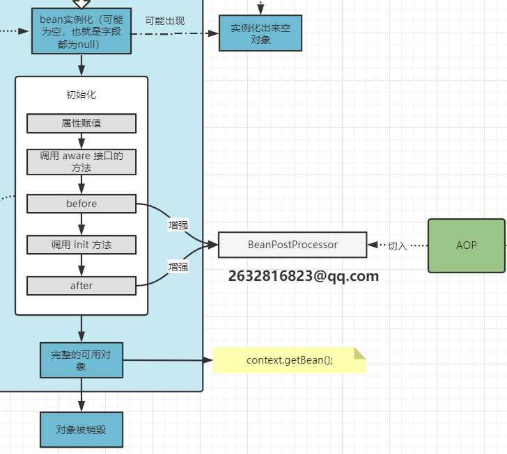
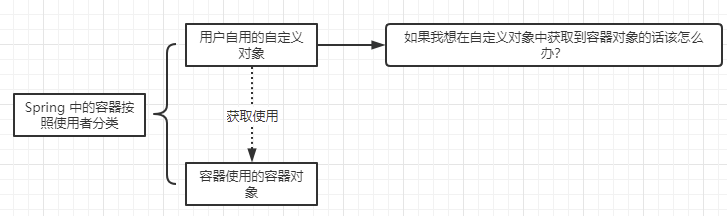
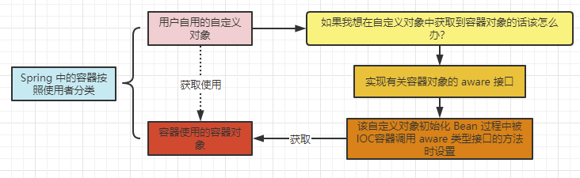
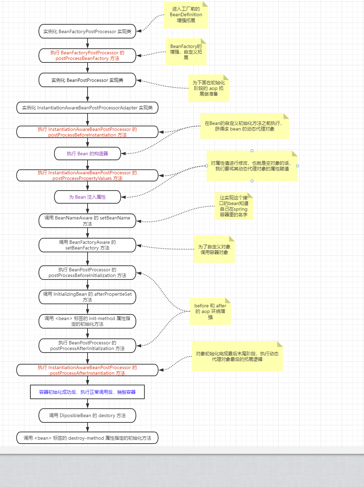

# Bean的生命周期

我们直接看源码注释：

```java
/* 
 * bean工厂的实现类需要遵循标准的 bean 生命周期，
 * <p>Bean factory implementations should support the standard bean lifecycle interfaces
 * as far as possible. The full set of initialization methods and their standard order is:
 * <ol>
 * <li>BeanNameAware's {@code setBeanName} 设置 bean 名称
 * <li>BeanClassLoaderAware's {@code setBeanClassLoader} 设置 bean 的类加载器
 * <li>BeanFactoryAware's {@code setBeanFactory} 设置 bean 工厂
 * <li>EnvironmentAware's {@code setEnvironment} 设置启动必备环境
 * <li>EmbeddedValueResolverAware's {@code setEmbeddedValueResolver}
 * <li>ResourceLoaderAware's {@code setResourceLoader}
 * (only applicable when running in an application context)
 * <li>ApplicationEventPublisherAware's {@code setApplicationEventPublisher}
 * (only applicable when running in an application context)
 * <li>MessageSourceAware's {@code setMessageSource}
 * (only applicable when running in an application context)
 * <li>ApplicationContextAware's {@code setApplicationContext}
 * (only applicable when running in an application context)
 * <li>ServletContextAware's {@code setServletContext}
 * (only applicable when running in a web application context)
 * <li>{@code postProcessBeforeInitialization} methods of BeanPostProcessors
 * <li>InitializingBean's {@code afterPropertiesSet}
 * <li>a custom init-method definition
 * <li>{@code postProcessAfterInitialization} methods of BeanPostProcessors
 * </ol>
 */
```

我们主要对比这个图来看：



- 属性赋值
  - 也就是设置对象的属性的值的过程。
- 调用 **aware** 接口的方法
  - 在 **spring容器** 里面按照使用者可以分为几类对象：用户的自定义对象、容器对象（整个Spring容器需要用到的对象）

## 属性赋值


## aware 接口方法理解

首先我们通过下面这张图来了解一下 Spring 中的容器按照不同使用者的分类情况：



那么这个虚线箭头该怎么去理解呢？我们怎么才能调用容器对象呢？

我们看下面这个例子：

```java
class User {
    
    private String name;
    
    private ApplicationContext applicationContext;
    
    private BeanFactory beanFactory;
    
    ... 
    // 对应的 get() and set() 方法 省略
}
```

通过上述代码的方式我们就可以在**用户自定义对象**中获取到**Spring容器自身使用的容器对象**。

但是产生了一个问题，我虽然一定能赋值，但是谁去**调用有关的 set 方法**呢？或者说我什么时候去调用它呢？不可能我自己调用吧，自己调用就太麻烦了。所以出现了 **`Aware`**，下面我们来看看源码，使用上面这个例子，我们去找找有关 **`ApplicationContext、BeanFactory`** 的 **`aware`** 接口：

```java
public interface BeanFactoryAware extends Aware {

	void setBeanFactory(BeanFactory beanFactory) throws BeansException;
}
```

```java
public interface ApplicationContextAware extends Aware {

	void setApplicationContext(ApplicationContext applicationContext) throws BeansException;
}
```

得知这俩接口后，我们去修改例子：

```java
class User implements BeanFactoryAware, ApplicationContextAware {
    
    private String name;
    
    private ApplicationContext applicationContext;
    
    private BeanFactory beanFactory;
    
    ... 
    // 对应的 get() and set() 方法 省略
}
```

实现 **`BeanFactoryAware、ApplicationContextAware`** 这俩接口后，**该 User 对象在 Bean 创建周期中就会在属性赋值之后的 aware 方法调用时期被被动调用设置**。==用户就不用显示调用了 （就是不用这样 `user.set(new ApplicationContext())` 这样调用了），由容器自动帮忙注入好了。==




## 扩展时期注意的问题

在真正初始化前进行一些而外自定义的扩展，这里是 **AOP插入时期**，动态代理，而且前面我们也分析过源码了，这里动态代理对象生成之前，当前 Bean 对象必须实例化：

```java
protected Object getEarlyBeanReference(String beanName, RootBeanDefinition mbd, Object bean) {
    // 这里的这个 bean 就是我们在 bean实例化 这一步完成的 bean
    Object exposedObject = bean;
    if (!mbd.isSynthetic() && hasInstantiationAwareBeanPostProcessors()) {
        // 然后进入这个逻辑对这个 bean 进行对这个 bean 增强器的遍历，其中就涉及到 aop
        for (BeanPostProcessor bp : getBeanPostProcessors()) {
            if (bp instanceof SmartInstantiationAwareBeanPostProcessor) {
                SmartInstantiationAwareBeanPostProcessor ibp = (SmartInstantiationAwareBeanPostProcessor) bp;
                exposedObject = ibp.getEarlyBeanReference(exposedObject, beanName);
            }
        }
    }
    // 之前创建好的空对象在经历一系列增强后再次返回
    return exposedObject;
}
```

# 详细描述

以下图片只是描述了 **Bean实例化** 之后的过程，**`BeanFactory`** 以及 **`BeanDefinition`** 的创建过程不包含在图中，可能会有纰漏：


