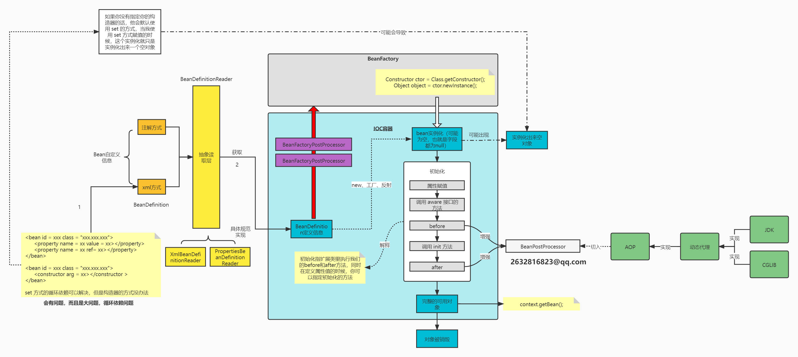
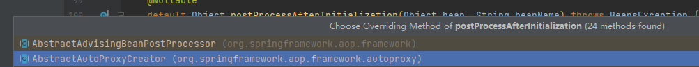
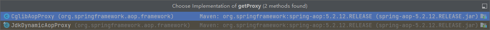
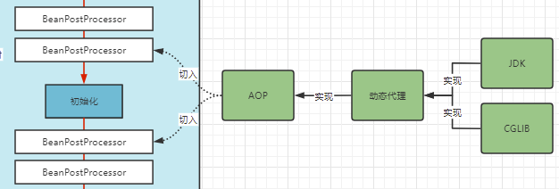
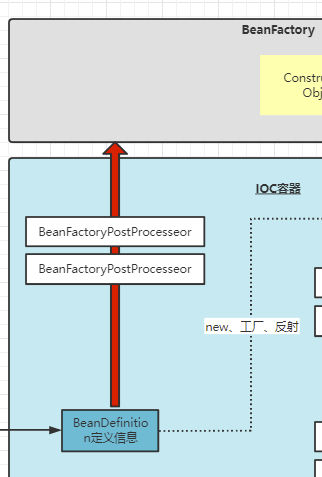
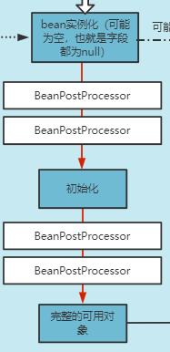

# IOC 容器（Bean对象的实例化流程）创建大致流程以及解析




## AOP为何是在这里切入

动态代理，**他是在 bean 初始化前后切入的**！！！我们去找一下证据：

首先进入 **`BeanPostProcessor`** 找到后置 **`postProcessAfterInitialization `**方法然后找到该方法的实现类：



在这个类中，可以找到 **`protected Object createProxy(Class<?> beanClass, @Nullable String beanName, @Nullable Object[] specificInterceptors, TargetSource targetSource)`** 创建当前代理类的方法。

```java
protected Object createProxy(Class<?> beanClass, @Nullable String beanName,
                             @Nullable Object[] specificInterceptors, TargetSource targetSource) {

    // 省略一些内容
	...	
        
    // 找到这里，继续向下找 getProxy 方法，这里传入的是动态代理类加载器
    return proxyFactory.getProxy(getProxyClassLoader());
}
```

```java
public Object getProxy(@Nullable ClassLoader classLoader) {
    // 点开 createAopProxy 方法
    return createAopProxy().getProxy(classLoader);
}
```

```java
// 点开 AopProxy 类
protected final synchronized AopProxy createAopProxy() {
    if (!this.active) {
        activate();
    }
    return getAopProxyFactory().createAopProxy(this);
}
```

```java
public interface AopProxy {
	
    // 观察该方法的实现
	Object getProxy();
    
	Object getProxy(@Nullable ClassLoader classLoader);
}

```



==**我们是不是一目了然，为啥图是这样画的是不是就很清晰了？**==



**BeanPostProcessor** 有抽象实现类 **AbstractAutoProxyCreator** 实现，而 **BeanPostProcessor** 作用在 **bean初始化前后**，所以 **AOP** 入口就在这里，而这个 **AOP** 的最终代理创建类是 **AopProxy** ，得到代理的方法 **getProxy()** 是有两种实现**（JDK、CGLIB）**。


+++++++++++++

### 需要代理的对象是否需要创建一个空的对象出来？

我们看这段代码:

```java
protected Object getEarlyBeanReference(String beanName, RootBeanDefinition mbd, Object bean) {
    // 这里的这个 bean 就是我们在 bean实例化 这一步完成的 bean
    Object exposedObject = bean;
    if (!mbd.isSynthetic() && hasInstantiationAwareBeanPostProcessors()) {
        // 然后进入这个逻辑对这个 bean 进行对这个 bean 增强器的遍历，其中就涉及到 aop
        for (BeanPostProcessor bp : getBeanPostProcessors()) {
            if (bp instanceof SmartInstantiationAwareBeanPostProcessor) {
                SmartInstantiationAwareBeanPostProcessor ibp = (SmartInstantiationAwareBeanPostProcessor) bp;
                exposedObject = ibp.getEarlyBeanReference(exposedObject, beanName);
            }
        }
    }
    // 之前创建好的空对象在经历一系列增强后再次返回
    return exposedObject;
}
```

看了上述源码，我们就可以知道，**需要代理的对象是一定会创建一个对象出来的（可以是空也可以不是空）**。

而且也可以看出**如果有 aop 的话，这对象一定要提前生成传入**。

+++++++++++++

## IOC过程中的增强器系统

所谓增强器也就是 **`xxxPostProcessor`**，目的就是为了提供流程中的拓展，修改某些元数据的相关信息。


+++++++++++++

### BeanFactoryPostProcessor

我们的 **BeanFactoryPostProcessor** 主要提供了对于获取到的  **BeanDefinition**  的增强处理主要存在于这个箭头所说的流程里：



在这里我们可以通过增强器来自定义处理 **BeanDefinition** 的信息。

具体怎么使用，自己写一个类然后实现 **`BeanFactoryPostProcessor`** 接口，重写其中 **`postProcessBeanFactory`** 方法即可；

```java

public class MyBeanFactoryPostProcessor implements BeanFactoryPostProcessor {
    public void postProcessBeanFactory(ConfigurableListableBeanFactory beanFactory) throws BeansException {
        
        // 获得此前所有要加载的 bean 的定义信息中的唯一标识 —— bean 的 name
        String[] BeanDefinitionNames = beanFactory.getBeanDefinitionNames();
        // 通过拿到的 bean 的 name 来唯一对某个 bean 的定义信息做修改
    }
}
```


+++++++++++++

### BeanPostProcessor

它主要是在 **bean** 通过 **beanFactory** 工厂实例化完成后提供的增强，



然后在**初始化 bean** 的过程前后，初始化前增强，初始化后增强，同样只用实现 **`BeanPostProcessor`** 接口重写其中的方法就好了。

```java
public interface BeanPostProcessor {

    // 初始化前增强
	@Nullable
	default Object postProcessBeforeInitialization(Object bean, String beanName) throws BeansException {
		return bean;
	}
	// 初始化后增强
	@Nullable
	default Object postProcessAfterInitialization(Object bean, String beanName) throws BeansException {
		return bean;
	}
}

```

**但是我对象都创建好了，我还能对这个对象修改吗？能修改！那就要牵扯出 AOP（面向切面编程了）。而 AOP 的入口在哪？AOP 的入口就在上面这张图这个环节。**


## 图中context.getBean()它拿到的是代理类对象还是工厂反射后创建的实例呢？

==答案肯定是**代理类**==，都存在于一级缓存。

而且这也是==**三级缓存存在的意义**==，三级缓存就是为了处理这个问题而诞生的。

```java

public class DefaultSingletonBeanRegistry extends SimpleAliasRegistry implements SingletonBeanRegistry {

	...
        
	/** Cache of singleton objects: bean name to bean instance. */
	private final Map<String, Object> singletonObjects = new ConcurrentHashMap<>(256); // 一级缓存

	/** Cache of singleton factories: bean name to ObjectFactory. */
	private final Map<String, ObjectFactory<?>> singletonFactories = new HashMap<>(16); // 三级缓存

	/** Cache of early singleton objects: bean name to bean instance. */
	private final Map<String, Object> earlySingletonObjects = new ConcurrentHashMap<>(16); // 二级缓存
    
    ...
}
```


## FactoryBean 和 BeanFactory 的区别？

需要自定义创建一个**特殊的Bean**的时候，就需要实现 **FactoryBean接口**，通过**这个工厂类来自定义需要创建的Bean**。


## 如果想在 IOC 容器创建的不同的阶段做不同的事情怎么办？

这里涉及到了监听器（事件发布、多播器），运用了观察者模式。

比如下课铃声响起（事件发布），有的同学开始睡觉，有的同学开始玩手机，有的同学开始复习（做不同的事情）。


# refresh方法源码解析

```JAVA
@Override
public void refresh() throws BeansException, IllegalStateException {
    synchronized (this.startupShutdownMonitor) {
        // 准备工作，IOC 容器创建前的准备工作，给一整个流程做准备工作
        prepareRefresh();

        // 这步比较关键，涉及 BeanFactory 的创建，我们也可以看到，IOC容器创建首先就是要创建 BeanFactory
        ConfigurableListableBeanFactory beanFactory = obtainFreshBeanFactory();


        // 这里继续做准备工作，那是为什么做准备工作呢？现在为 bean 工厂做准备工作，因为我可能要给这个工厂设定一些启动属性值或者删除一些属性值
        prepareBeanFactory(beanFactory);

        // 以上工作都做完之后，我们目前图中 bean工厂 有了， BeanDefinition 也读取进来了，接下来就要完成生产对象的事情辣
        try {

            // 子类覆盖方法做额外的处理，此处我们自己一般不做任何扩展工作，但是可以查看 web 中的代码，是有具体实现的
            postProcessBeanFactory(beanFactory);

            // 调用执行我们的 BeanFactoryPostProcessors（BeanFactory增强器） 了
            invokeBeanFactoryPostProcessors(beanFactory);

            // 注册 BeanPostProcessors aop
            // 注册 Bean的处理器，这里只是注册功能，正真调用实在 getBean 方法。
            registerBeanPostProcessors(beanFactory);

            // 初始化基本的国际化功能，与我们的 bhean 没关系
            initMessageSource();

            // 初始化事件多播器，与我们的 bean 没关系
            initApplicationEventMulticaster();


            // 留给子类来初始化其它的 Bean
            onRefresh();

		   // 注册监听器，监听多播器，与我们的 bean 没关系
            registerListeners();

            // 实例化剩下所有非懒加载的单例对象，执行完这部分，我们完成了大图中从工厂到初始化一直到得到完整对象
            finishBeanFactoryInitialization(beanFactory);

            // 完成末尾工作，清除缓存啦啥的
            finishRefresh();
        } catch (BeansException ex) {
            if (logger.isWarnEnabled()) {
                logger.warn("Exception encountered during context initialization - " +
                            "cancelling refresh attempt: " + ex);
            }

            // Destroy already created singletons to avoid dangling resources.
            destroyBeans();

            // Reset 'active' flag.
            cancelRefresh(ex);

            // Propagate exception to caller.
            throw ex;
        } finally {
            // Reset common introspection caches in Spring's core, since we
            // might not ever need metadata for singleton beans anymore...
            resetCommonCaches();
        }
    }
}
```

上面的源码我们得对照第一部分的图来看，在整个 **IOC容器** 的建立过程中，最先去创建的应该是 **`BeanFactory`**。我们在上面，代码详细注释一下，然后里面涉及的方法在下文二级标题一一解答用处。


## prepareRefresh() 方法

主要就是设置启动时间，容器是否关闭，是否活跃，还有一系列的存储 bean 的集合。

```java
protected void prepareRefresh() {
    // Switch to active.
    this.startupDate = System.currentTimeMillis();
    this.closed.set(false);
    this.active.set(true);

    if (logger.isDebugEnabled()) {
        if (logger.isTraceEnabled()) {
            logger.trace("Refreshing " + this);
        }
        else {
            logger.debug("Refreshing " + getDisplayName());
        }
    }

    // Initialize any placeholder property sources in the context environment.
    initPropertySources();

    // Validate that all properties marked as required are resolvable:
    // see ConfigurablePropertyResolver#setRequiredProperties
    getEnvironment().validateRequiredProperties();

    // Store pre-refresh ApplicationListeners...
    if (this.earlyApplicationListeners == null) {
        this.earlyApplicationListeners = new LinkedHashSet<>(this.applicationListeners);
    }
    else {
        // Reset local application listeners to pre-refresh state.
        this.applicationListeners.clear();
        this.applicationListeners.addAll(this.earlyApplicationListeners);
    }

    // Allow for the collection of early ApplicationEvents,
    // to be published once the multicaster is available...
    this.earlyApplicationEvents = new LinkedHashSet<>();
}
```


## obtainFreshBeanFactory() 方法

以下内容都是层级关系，

```java
protected ConfigurableListableBeanFactory obtainFreshBeanFactory() {
    // 进入该方法查看
    refreshBeanFactory();
    return getBeanFactory();
}
```

```java
@Override
protected final void refreshBeanFactory() throws BeansException {
    // 首先判断是否有工厂
    if (hasBeanFactory()) {

        // 有我摧毁它并且关闭它，双重保险
        destroyBeans();
        closeBeanFactory();
    } try {

        // 否则创建工厂，这个工厂的名字叫做 DefaultListableBeanFactory
        DefaultListableBeanFactory beanFactory = createBeanFactory();

        // 回到最大的那张图，工厂目前已经有了，那么我们接下来就是去读取我们的 bean 的配置了。
        beanFactory.setSerializationId(getId());
        customizeBeanFactory(beanFactory);

        // 加载 bean 的定义信息，beanFactory 中的 beanDefinitionNames 属性装载了所有你配置的 bean 的信息
        // 类比到图上就是加载 bean 的定义信息
        loadBeanDefinitions(beanFactory);
        this.beanFactory = beanFactory;
    } catch (IOException ex) {

        throw new ApplicationContextException("I/O error parsing bean definition source for " + getDisplayName(), ex);
    }
}
```


## prepareBeanFactory() 方法

为 bean工厂 做准备工作的赋值或者删除，设置工厂参数，完成最后的工厂初始化流程：

- 源码我们先不分析，全是细节，但是我们得至少知道个流程。

```java
protected void prepareBeanFactory(ConfigurableListableBeanFactory beanFactory) {
    // Tell the internal bean factory to use the context's class loader etc.
    beanFactory.setBeanClassLoader(getClassLoader());
    beanFactory.setBeanExpressionResolver(new StandardBeanExpressionResolver(beanFactory.getBeanClassLoader()));
    beanFactory.addPropertyEditorRegistrar(new ResourceEditorRegistrar(this, getEnvironment()));

    // Configure the bean factory with context callbacks.
    beanFactory.addBeanPostProcessor(new ApplicationContextAwareProcessor(this));
    beanFactory.ignoreDependencyInterface(EnvironmentAware.class);
    beanFactory.ignoreDependencyInterface(EmbeddedValueResolverAware.class);
    beanFactory.ignoreDependencyInterface(ResourceLoaderAware.class);
    beanFactory.ignoreDependencyInterface(ApplicationEventPublisherAware.class);
    beanFactory.ignoreDependencyInterface(MessageSourceAware.class);
    beanFactory.ignoreDependencyInterface(ApplicationContextAware.class);

    // BeanFactory interface not registered as resolvable type in a plain factory.
    // MessageSource registered (and found for autowiring) as a bean.
    beanFactory.registerResolvableDependency(BeanFactory.class, beanFactory);
    beanFactory.registerResolvableDependency(ResourceLoader.class, this);
    beanFactory.registerResolvableDependency(ApplicationEventPublisher.class, this);
    beanFactory.registerResolvableDependency(ApplicationContext.class, this);

    // Register early post-processor for detecting inner beans as ApplicationListeners.
    beanFactory.addBeanPostProcessor(new ApplicationListenerDetector(this));

    // Detect a LoadTimeWeaver and prepare for weaving, if found.
    if (beanFactory.containsBean(LOAD_TIME_WEAVER_BEAN_NAME)) {
        beanFactory.addBeanPostProcessor(new LoadTimeWeaverAwareProcessor(beanFactory));
        // Set a temporary ClassLoader for type matching.
        beanFactory.setTempClassLoader(new ContextTypeMatchClassLoader(beanFactory.getBeanClassLoader()));
    }

    // Register default environment beans.
    if (!beanFactory.containsLocalBean(ENVIRONMENT_BEAN_NAME)) {
        beanFactory.registerSingleton(ENVIRONMENT_BEAN_NAME, getEnvironment());
    }
    if (!beanFactory.containsLocalBean(SYSTEM_PROPERTIES_BEAN_NAME)) {
        beanFactory.registerSingleton(SYSTEM_PROPERTIES_BEAN_NAME, getEnvironment().getSystemProperties());
    }
    if (!beanFactory.containsLocalBean(SYSTEM_ENVIRONMENT_BEAN_NAME)) {
        beanFactory.registerSingleton(SYSTEM_ENVIRONMENT_BEAN_NAME, getEnvironment().getSystemEnvironment());
    }
}
```

