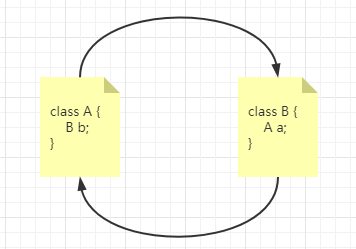
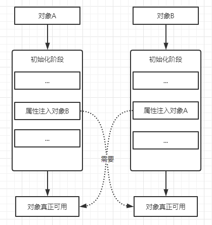
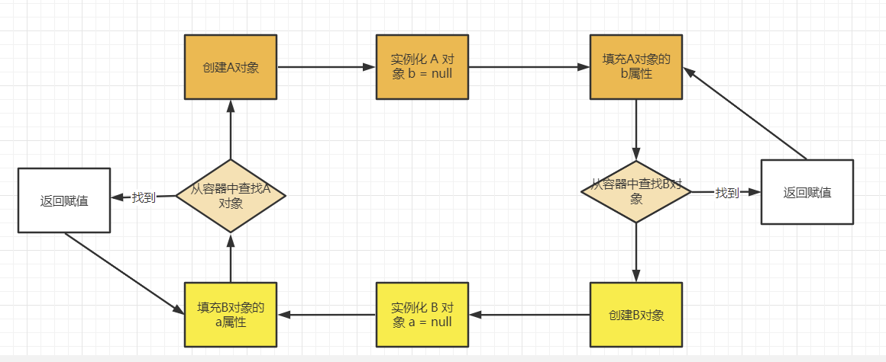
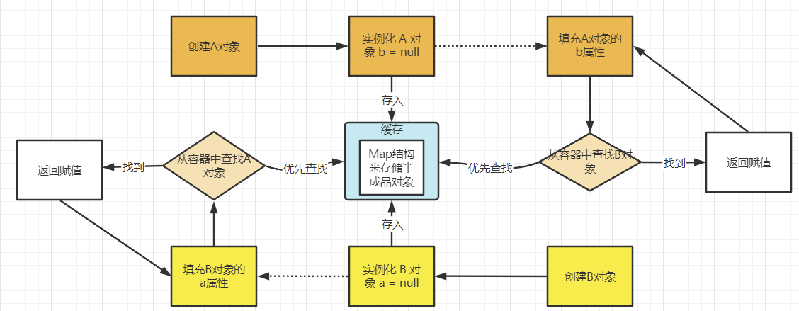
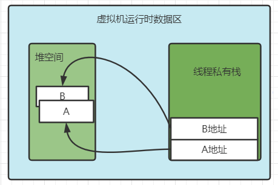
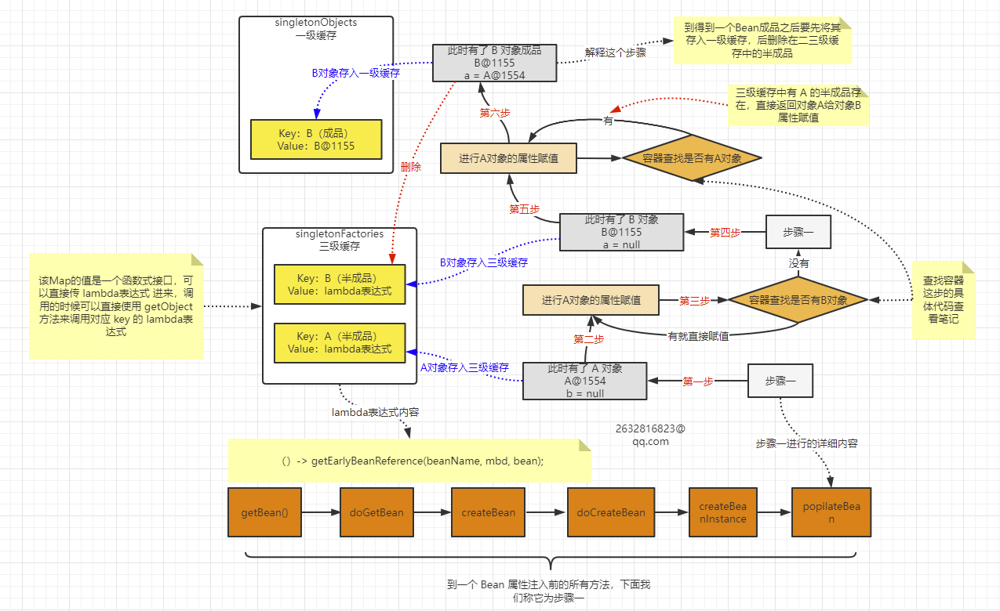
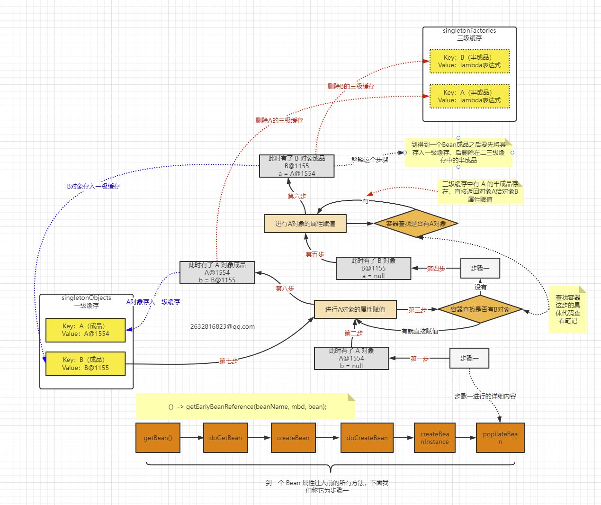
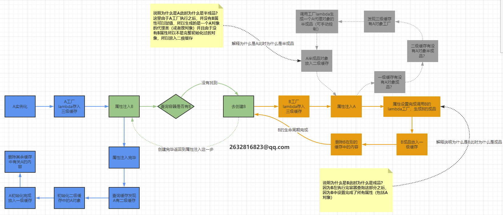

# Spring的循环依赖问题


## 循环依赖问题




当我进行对象的创建和属性值设置的时候，他俩是互相指向的，在 **Spring** 中对象 **Bean** 默认都是单例的，意味着整个 **IOC容器**  中只有一个对象，以此为前提来说明啥是循环依赖：

上面这图中，**A对象**创建的时候到了属性赋值这一步需要**B对象**作为属性，而**B对象**创建到了属性赋值这一步需要**A对象**创建，**Spring IOC** 容器默认单例模式，那么这俩对象就形成一个闭环，互相需要对方但是自己也没办法创建，所以就导致了循环依赖的问题：




## 我们如何打破这个循环依赖呢？

一般网上有两种说法：

1. **三级缓存**
2. **提前暴露对象，这个很好理解，就是在初始化期间，对象就暴露出来，方便同级调用**

我们在解决这个问题之前，需要了解这个问题发生位置这个最根本的点，那就是属性赋值阶段。

属性赋值有两种方式：

1. **构造器方式（循环依赖问题无法解决）**
2. ==**set方法方式（通过三级缓存来解决）**==

我们要阻断下面的这种闭环情况：



上面这个图中，**A对象和B对象都是==半成品==**，在**Spring中Bean的创建过程**来看，**半成品这个概念应该对应的是完成实例化，但是未初始化的对象**，在**这个阶段的对象往往是属性值可能会为==空==。**

我们再来细看这张图，**怎么打破闭环？我们可不可以在 A对象 实例化之后将其半成品先放入容器中？答案是肯定的！**

没有什么是加一层解决不了的！所以我们可以在这个**中间加一层缓存**！



这样是不是就解开这个闭环了？

但是==问题就是目前闭环靠加一层缓存解开了，但是我们在缓存中的对象是半成品，这个该怎么办呢==？因为我们存了半成品对象，实际在堆内存中对象的空间已经存在了：



我们知道了对象的具体地址，所以我们之后可以通过一系列手段去将解决循环依赖时缓存的半成品对象一步一步变成成品，**这一切的前提就是我们有这个半成品对象在堆空间中的地址**。

沿着上面的思路，问题又来了嗷！**==既然半成品对象放入缓存了，那么成品对象要不要也放入缓存呢？==**答案是肯定的。==那么能不能将成品和半成品放到同一个缓存中呢？==这个答案就是否定的了。

所以为了将成品和半成品完全区分开，我们就多加一层缓存，可以有多级缓存啦，那么目前就是：

- **一级缓存**：放成品对象。
- **二级缓存**：放半成品对象。

但是我们看 **Spring** 的源码：

```java
public class DefaultSingletonBeanRegistry extends SimpleAliasRegistry implements SingletonBeanRegistry {
    ...
    // 一级缓存，用于保存 BeanName 和 创建bean实例 之间的关系
    private final Map<String, Object> singletonObjects = new ConcurrentHashMap<>(256);

    // 三级缓存，用户保存 BeanName 和 创建bean的工厂 之间的关系
    private final Map<String, ObjectFactory<?>> singletonFactories = new HashMap<>(16);

    // 二级缓存，保存 BeanName 和 bean实例 之间的关系。
    // 它与 singletonFactories 的不同之处在于，当一个单例 bean 被放到这里之后，那么当 bean 还在创建过程中，
    // 就可以通过 getBean 的方式获取到，可以方便进行循环依赖的检测。
    private final Map<String, Object> earlySingletonObjects = new ConcurrentHashMap<>(16);
    ...
}
```

理论上照我们所想，==两级缓存就够了，为什么 **Spring** 使用了**三级缓存**呢？可能是 **AOP 切入引起**，但是为什么 **AOP** 切入要使用**三级缓存**呢？==

我们注意 **`singletonFactories`** 的值是一个函数式接口：

```java
@FunctionalInterface
public interface ObjectFactory<T> {

	T getObject() throws BeansException;
}
```

我们都知道，函数式接口可以直接传 lambda表达式 进来，**调用的时候可以直接使用 getObject 方法来调用对应 key 的 lambda表达式**。


## 如何通过三级缓存去解决循环依赖问题呢？

第三级缓存的利用流程图：



流程图话的很清晰了，大致流程源码里面就是这样走的，我们下面来看看 **查找容器中是否有该Bean的方法** 这个棱形里的方法源码。

该源码解释了 **IOC 容器如何在自身中查找是否有对应的 Bean 的过程**，下面我给出详细注释，咱们只看关键部分源码好吧：

```java
protected Object getSingleton(String beanName, boolean allowEarlyReference) {
    // 一级缓存是否有当前所需bean？
    Object singletonObject = this.singletonObjects.get(beanName);
    // 没有的话此时当前所需bean是不是在创建过程中？
    if (singletonObject == null && isSingletonCurrentlyInCreation(beanName)) {
        // 从二级缓存寻找
        singletonObject = this.earlySingletonObjects.get(beanName);
        // 二级缓存中找不到当前所需bean
        if (singletonObject == null && allowEarlyReference) {
            // 上锁
            synchronized (this.singletonObjects) {
                // Consistent creation of early reference within full singleton lock
   			   // 重新再找一遍，防止上锁前别的线程紧随其后创建了当前所需bean并且放入缓存了。
                singletonObject = this.singletonObjects.get(beanName);
                if (singletonObject == null) {
                    singletonObject = this.earlySingletonObjects.get(beanName);
                    if (singletonObject == null) {
                        // 再次判断一二级缓存没有当前所需bean，所以直接进行一个三级缓存的找。
                        ObjectFactory<?> singletonFactory = this.singletonFactories.get(beanName);
                        if (singletonFactory != null) {
                 		   // 找到了进行善后工作。
                            singletonObject = singletonFactory.getObject();
                            this.earlySingletonObjects.put(beanName, singletonObject);
                            this.singletonFactories.remove(beanName);
                        }
                    }
                }
            }
        }
    }
    return singletonObject;
}
```

在我们第一次利用完**三级缓存（singletonObject）**之后，此时对象的状态为：

- **A对象** 还剩 **b属性** 为空（**半成品**）。
- **B对象** 已经完成初始化设置（**成品**），并且此时已经将 **B对象** 的成品放入一级缓存中，其它两级缓存中有关 **B对象** 的内容被删除。

所以我们接下来要做的流程就是初始化 **A对象**，让其**变成成品**，我们来看看接下来的步骤是什么样的：



**A对象** 怎么变成品的呢？是因为我们在第一次 **A对象** 属性赋值的时候，发现需要 **B对象**，但是此时容器中不存在 **B对象** ，所以我们先去创建 **B对象 的 bean**，当步骤进行到 **B对象** 设置属性时，从**二级缓存（earlySingletonObjects）**中拿出 **A对象** 的半成品，所以我们 **B对象 的 bean** 就创建完成（**成品**），此时方法又跳回到 **A对象** 设置属性这一个方法，此时 **B对象** 也有了，所以赋值成功，所以 **A对象 的 bean** 也完成了创建。

两者走到上图这一步，两个对象的成品都被我们放在了**一级缓存（singletonFactories）**中，其它两级缓存中有关他们的内容都删除了。

我们来回顾一下三级缓存都是存什么东西：

1. 一级缓存（singletonObjects）：存成品bean
2. 二级缓存（earlySingletonObjects）：存半成品bean
3. 三级缓存（singletonFactories）：lambda表达式


## 过程流程补充大总结图

跟着这个大总结图，我们就可以看到他们的调用关系到底是怎么样的了，图中每个颜色代表同属一个流程，流程执行颜色顺序：

==**`蓝色 -> 绿色 -> 橙色 -> 灰色 -> 橙色 -> 绿色 -> 蓝色`**==




## 为什么要使用X的objectFacory对象而不是直接使用X对象？

利于拓展，程序员可以通过beanPostProcess接口操作objectFactory对象生成自己想要的对象，如果直接放一个对象那么就是写死的，而且牵扯到了aop。


## 是不是只能支持单例(scope=singleton)而不支持原型(scope=prototype)？

是的！因为单例是 spring 在启动时进行 bean加载 放入单例池中，在依赖的 bean 开始生命周期后，可以直接从三级缓存中取到它所依赖的bean的objectFactory对象从而结束循环依赖。而原型只有在用到时才会走生命周期流程，但是原型不存在一个已经实例化好的bean，所以会无限的创建->依赖->创建->依赖->...。
