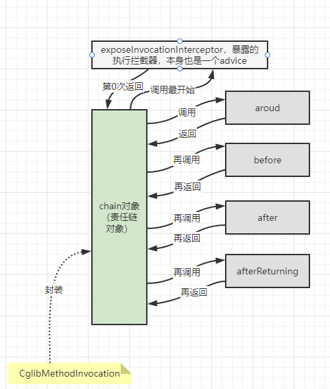

## 什么是AOP？

我来说一下我自己的理解，这个内容挺抽象的，大家可以去查询更加准确的定义：

**AOP** 大家都知道是面向切面编程，那么到底什么是面向切面编程呢？我们用一个例子来说，我们的**类的继承可以理解为一个纵向编程**，那么水平横向编程就是我们的 **AOP**，大家都知道，有一些代码是和业务逻辑无关的，就比如说参数校验，这个肯定和业务逻辑无关，但是在没有 **AOP** 的时候，你也得一个一个方法的去加，但是核心业务不是参数校验呀，那么这个时候就有人提出了面向切面编程的这种概念，将无关的代码水平抽取出来，专注于业务代码即可。

反映到 Spring 中，就可能是一个 Controller 只用写业务有关代码，参数传入的校验直接可以靠切面编程去拦截校验，那么虽然你的 Controller 里只有一句核心业务代码的调用语句，但是参数校验由你的代理对象去做了。

## Spring AOP 的好处

我觉得在于，方便，可扩展性高，可定制化高，极大的解耦，并且将我们开发人员的开发重心从多元（参数校验、日志打印）转变为单一（核心业务），不由我们来维护这个代理对象，所以我们只用专注于业务代码就好。

## Spring AOP 的一些核心概念（规范）

怎么配置？怎么切入？

假设一个场景：**如果我们想在某个方法上添加日志处理，那么我们想到的就是直接进行方法的修改，但是如果要修改的方法数量达到几百个怎么办？还是一个一个手动去添加吗？**

现在的要求是：如果我有100个方法，其中50个需要添加日志切面，那么我们怎么办？我们把大致的处理逻辑画出来看看：

我们发现，在方法前或者方法后需要加的处理逻辑都一样的话，分成两种通知模式其实不太人性化，所以我们修改一下图，加入环绕通知：

图中所有**灰色和蓝色的部分**，其实就是我们的**切面**，那么我们**Spring提供的切面中一共有这五种通知模式**，他们可以**互相嵌套**吗？当然是可以的，**嵌套使用最终都会全部执行与嵌套有关的所有通知**。

+++++++++++++++++++

### 那么我们如何保证嵌套完毕都可以全部正常运行通知呢？

**Spring 就此引入了设计模式中的 责任链模式**。

这个责任链模式规定了嵌套执行顺序，我们可以看到是执行完一个 **advice** 再回到链中去获取下一个 **advice**。

但是，我们又来了一个问题，我们下节说。

+++++++++++++++++++

### 为什么我们不直接在定义这些 **advice** 的时候就将调用关系给写好，而是得用责任链模式来完成调用的层级呢？

**责任链（Chain of Responsibility）模式的定义：**

- 为了避免**请求发送者**与**多个请求处理者**耦合在一起，于是将所有请求的处理者通过前一对象记住其下一个对象的引用而连成一条链。
- **当有请求发生时，可将请求沿着这条链传递，直到有对象处理它为止。**
- 在责任链模式中，客户只需要将请求发送到责任链上即可，无须关心请求的处理细节和请求的传递过程，请求会自动进行传递。
- **所以责任链将请求的发送者和请求的处理者解耦了**。

因为，首先，**这个责任链里的这些 advice 执行的顺序是根据我们一个动态拓扑排序类拍过序的，这样带来的好处就是很灵活，而且，我们定义的Spring提供的advice就与执行顺序解耦，不用关心下一步是谁执行。因为理论上来说，after就是在before之后，而这个拓扑排序帮我们维持了这个过程**。

不然，如果是人为自定义顺序，那么你得维护这个执行顺序的同时，**如果你自定义了一个别的 advice（除了原生的五个advice之外），那么原来的顺序就被打断了**，**你得在代码块中一个一个的去更改每个 advice 的调用关系，==以及指定谁先被调用（这个是最重要的，因为拓扑排序形成的责任链它肯定默认要么before要么around最先执行）==**。

- **在 xml 配置的情况下，这个责任链默认是跟着你 xml 中写的定义顺序，从上到下加载的，会经过拓扑排序。**
- **但是不是 xml 配置的情况下，你得手动进行 @Order 注解来定义顺序，然后经过拓扑排序，如果没手动进行顺序定义，那么将会直接拓扑排序默认 before 或者 around 开头。**

