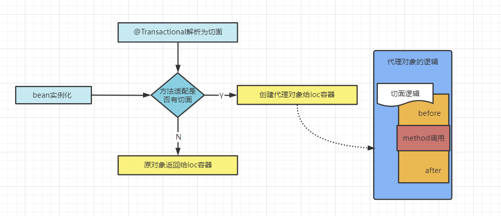
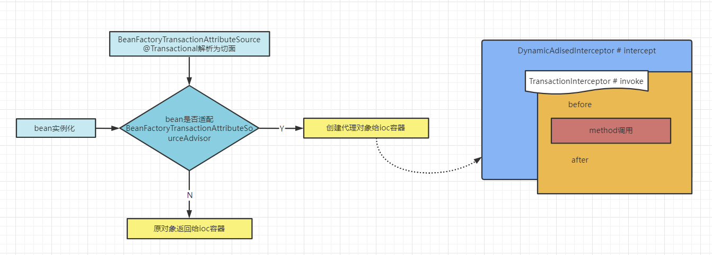

# spring 中事务的传播机制是啥？

**spring** 中多个事务方法互相调用时，我们的事务是如何在这些方法中传播的？

所以这里的事务，指的是 **spring 事务**，传播指的是，**套娃之后的事务影响怎么界定**？

假设 **方法A** 和 **方法B** 都是**事务方法**，**方法A** 执行过程中调用了 **方法B**， 那么 **方法B 有无事务**以及 **方法B 有无对事物的不同要求**都会对 **方法A 的事务具体执行**造成影响，同时我们的 **方法A** 的事务对 **方法B** 的事务执行也有影响。

以上出现的这种影响具体是什么，就由两个方法所定义的事务传播类型来决定。

参数都是修饰被调用者。

以下的前六种事务传播级别是从 EJB 中引入的，spring 与其共享相同的概念；而 nested 传播级别是 spring 特有的。

## 支持当前被调用事务的情况

- **required（spring默认的事务传播类型）**：
  - 如果**当前调用方**没有事务，那**被调用方**先创建一个事务；
  - 如果**当前调用方**有事务，那么**被调用方**就加入这个事务。
- **supports**：
  - 如果当前调用方存在事务，那就被调用方加入；
  - 如果没有，那被调用方就非事务执行方法。
- **mandatory**：
  - 如果当前调用方存在事务，那么被调用方就加入；
  - 如果没有，被调用方就抛出异常。

## 不支持当前被调用事务的情况

- **require_new**：
  - 被调用方创建一个新事务，如果当前调用方存在事务，则调用方挂起当前事务。
- **not_supports**：
  - 被调用方以非事务的方式执行当前代码；
  - 如果当前调用方存在事务，则先挂起调用方事务。
- **never**：
  - 被调用方不使用事务。
  - 如果当前调用方存在事务则抛出异常。

## 其它情况

- **nested**：
  - 如果当前被调用方存在事务，则被调用方嵌套进事务中执行；
  - 否则就和 **required** 一样，被调用方先自己新建一个事务。

这个传播级别是 **Spring** 特有的，以这个传播级别启动的事务内嵌于外部事务中（前提是存在外部事务），在嵌套之后，它就不是一个独立的事务了，它依赖于外部事务存在，外部事务提交，才能引起其内部事务的提交。

换句话来说，被嵌套的子事务它不能单独提交。

如果我们熟悉 JDBC 中的保存点（savepoint）概念的话，那么这个嵌套事务就很好理解，其实我们的嵌套的子事务就是保存点的一个应用，一个事务可以包括多个保存点，每一个嵌套子事务。

外部事物的回滚也会导致嵌套子事务的回滚。

# Spring事务的实现方式和原理以及隔离级别？

在使用 **spring** 框架的时候，我们可以有两种使用事务的方式，声明式事务和编程式事务。

事务这个概念其实是数据库层面的，我们的 **spring** 框架只是对数据库中的事务进行扩展，提供了一些程序员更加方便操作事务的方式。

比如我们最常用的声明式事务 **@Transactional** 注解，方法上加上它，那么这个方法中的 sql 都会被认为是一个事务。这比我们手动 JDBC 控制要方便。

在一个方法上加了 **@Transactional** 注解后，**spring** 会基于这个类来生成一个代理对象，会将这个代理对象作为此类的 **bean**，当在使用这个代理对象的方法时，如果这个方法上存在 **@Transacional** 注解，那么代理逻辑会把事务的自动提交设置为 false，然后再去执行原本的业务逻辑方法，如果执行业务逻辑方法没有出现异常，那么代理逻辑中就会将事务进行提交，如果执行业务逻辑方法出现了异常，那么则会将事务进行回滚。

当然我们还可以对异常出现之后回滚事务进一步的细粒度控制，可以利用 **@Transactional** 注解中的 **`rollbackFor`** 属性来进行配置，默认情况下会对运行时异常以及错误进行回滚。

隔离级别和数据库一样。

# Spring事务的执行大致框架？

