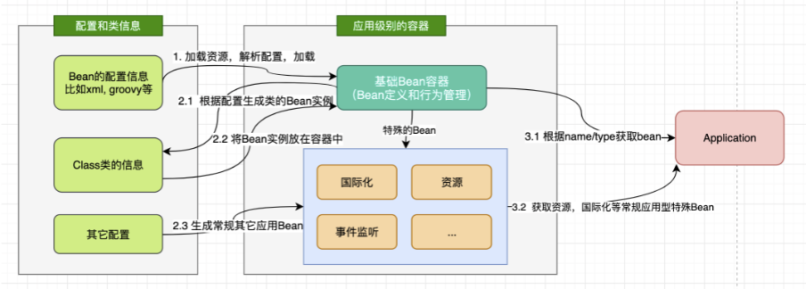
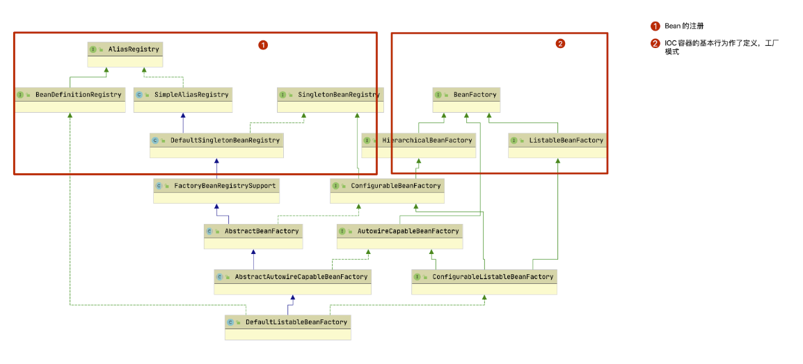
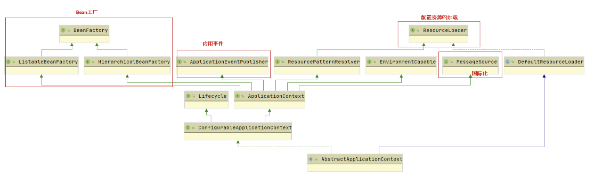
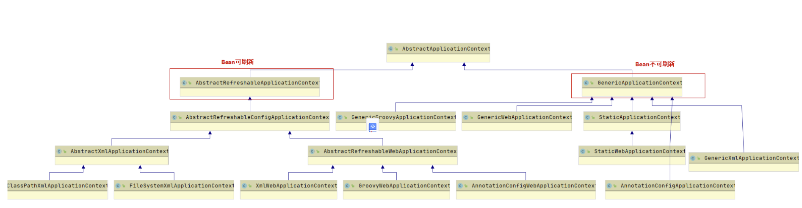
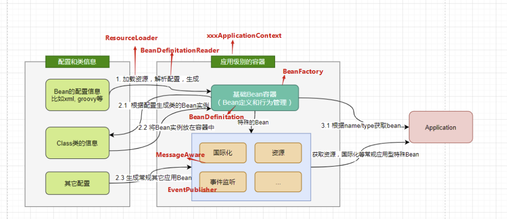

# Spring进阶 - IOC体系结构设计

我们在此之前，都了解过了什么是IOC，那么如果让我们自己来设计一个IOC容器的话，你会怎么想？**我们尝试站在一个设计者的角度去设计一下**：

首先我们的设计可能是现有一个存储bean的地方？那么使用什么东西最方便呢？肯定是一个Map，欸，这不就可以成为一个运行时的bean容器了吗？

什么？怕线程不安全？用ConcurrentHashMap！

容器有了，我们进一步想，如何将bean装入容器，我们肯定得有依据bean信息构建bean的工厂对吧？有了工厂，那么原材料怎么来？从不同地方得到的原材料怎么统一生成一个bean？xml？javaconfig？都可以，我们需要一个承载这些bean定义信息的类。

有了IOC容器，有了bean构建的一套流程，我们还得管理IOC容器中的不同的bean对吧？有一些特殊要求的bean和普通的bean我们没法混为一谈，所以得设计一个管理bean的方法......等等问题。



## SpringIOC的体系结构设计

我们自己想像出来的IOC容器设计与Spring开发者所想的有什么不同？我们一起来看一下。

### BeanFactory和BeanRegistry：IOC容器功能规范和Bean的注册

> Spring Bean的创建是典型的工厂模式，这一系列的Bean工厂，也即IOC容器为开发者管理对象间的依赖关系提供了很多便利和基础服务，在Spring中有许多的IOC容器的实现供用户选择和使用，这是IOC容器的基础；在顶层的结构设计主要围绕着BeanFactory和xxxRegistry进行：
>
> - **BeanFactory： 工厂模式定义了IOC容器的基本功能规范**
> - **BeanRegistry： 向IOC容器手工注册 BeanDefinition 对象的方法**




#### BeanFactory定义了IOC 容器基本功能规范？

在spring IOC中BeanFactory作为最顶层的一个接口类，规定了IOC容器的基本功能规范，具体功能实现通过它的三个子类来完成：

BeanFactory接口：

```java
public interface BeanFactory {    
      
    // 用于取消引用实例并将其与FactoryBean创建的bean区分开来。例如，如果命名的bean是FactoryBean，则获取将返回Factory，而不是Factory返回的实例。
    String FACTORY_BEAN_PREFIX = "&"; 
        
    // 根据bean的名字来获取对应bean  
    Object getBean(String name) throws BeansException;    
    // 根据bean的名字以及class来获取对应的bean
    Object getBean(String name, Class requiredType) throws BeansException;    	  // 以下是一些其它获得指定bean的方法
    Object getBean(String name, Object... args) throws BeansException;
    <T> T getBean(Class<T> requiredType) throws BeansException;
    <T> T getBean(Class<T> requiredType, Object... args) throws BeansException;

    // 返回指定bean的Provider（供应者）
    <T> ObjectProvider<T> getBeanProvider(Class<T> requiredType);
    <T> ObjectProvider<T> getBeanProvider(ResolvableType requiredType);

    // 检查工厂中是否包含给定name的bean，或者外部注册的bean
    boolean containsBean(String name);

    // 检查所给定name的bean的模式（单例/原型）
    boolean isSingleton(String name) throws NoSuchBeanDefinitionException;
    boolean isPrototype(String name) throws NoSuchBeanDefinitionException;

    // 判断所给name的类型与type是否匹配
    boolean isTypeMatch(String name, ResolvableType typeToMatch) throws NoSuchBeanDefinitionException;
    boolean isTypeMatch(String name, Class<?> typeToMatch) throws NoSuchBeanDefinitionException;

    // 获取给定name的bean的类型
    @Nullable
    Class<?> getType(String name) throws NoSuchBeanDefinitionException;

    // 返回给定name的bean的别名
    String[] getAliases(String name);
     
}
```


#### BeanFactory为何要定义这么多层次的接口？定义了哪些接口？

假如出现父子容器，我们是不是得控制它们的关系？这样的内容，我们一般是叫做对象的传递与转化过程中，对对象的数据访问所作限制。

spring为了区分内部操作过程中的上述情况，有了多层次的BeanFactory的子接口：

**ListableBeanFactory**：该接口定义了访问容器中 Bean 基本信息的若干方法，如查看Bean 的个数、获取某一类型 Bean 的配置名、查看容器中是否包括某一 Bean 等方法；

**HierarchicalBeanFactory**：父子级联 IoC 容器的接口，子容器可以通过接口方法访问父容器； 通过 HierarchicalBeanFactory 接口， Spring 的 IoC 容器可以建立父子层级关联的容器体系，子容器可以访问父容器中的 Bean，但父容器不能访问子容器的 Bean。Spring 使用父子容器实现了很多功能，比如在 Spring MVC 中，展现层 Bean 位于一个子容器中，而业务层和持久层的 Bean 位于父容器中。这样，展现层 Bean 就可以引用业务层和持久层的 Bean，而业务层和持久层的 Bean 则看不到展现层的 Bean。

**ConfigurableBeanFactory**：是一个重要的接口，增强了 IoC 容器的可定制性，它定义了设置类装载器、属性编辑器、容器初始化后置处理器等方法；

**ConfigurableListableBeanFactory**: ListableBeanFactory 和 ConfigurableBeanFactory的融合；

**AutowireCapableBeanFactory**：定义了将容器中的 Bean 按某种规则（如按名字匹配、按类型匹配等）进行自动装配的方法；


#### 有了规范，我们如何将Bean注入到BeanFactory中去呢？

我们都知道，spring配置文件中的每一个bean的配置项都是通过一个叫做 BeanDefinition对象来表示的，它描述了Bean的配置信息。

> Bean对象存在依赖嵌套等关系，所以设计者设计了BeanDefinition，它用来对Bean对象及关系定义；我们在理解时只需要抓住如下三个要点：
>
> - **BeanDefinition 定义了各种Bean对象及其相互的关系**
> - **BeanDefinitionReader 这是BeanDefinition的解析器**
> - **BeanDefinitionHolder 这是BeanDefination的包装类，用来存储BeanDefinition，name以及aliases等。**

- **BeanDefinition**

SpringIOC容器管理了我们定义的各种bean对象及其相互的关系，bean对象在Spring实现中是以BeanDefinition来存储的。

- **BeanDefinitionReader**

我们之前想过的部件，要把他们组合起来，中间的过程都十分的复杂， 比如我们bean的解析过程，它是一个十分复杂的过程，并且功能被细分为很多部分，比如我们想干预它的初始化过程，想做一些自定义的内容，那么是不是就得保证这个过程足够灵活。

BeanDefinitionReader主要就是对Spring配置文件的解析。

- **BeanDefinitionHolder** 

这是BeanDefination的包装类，用来存储BeanDefinition，name以及aliases等。


### ApplicationContext：IOC接口的设计和实现

> IoC容器的接口类是ApplicationContext，很显然它必然继承BeanFactory对Bean规范（最基本的ioc容器的实现）进行定义。而ApplicationContext表示的是应用的上下文，除了对Bean的管理外，还至少应该包含了
>
> - **访问资源**： 对不同方式的Bean配置（即资源）进行加载。(实现ResourcePatternResolver接口)
> - **国际化**: 支持信息源，可以实现国际化。（实现MessageSource接口）
> - **应用事件**: 支持应用事件。(实现ApplicationEventPublisher接口)

#### [¶](https://www.pdai.tech/md/spring/spring-x-framework-ioc-source-1.html#applicationcontext接口的设计)ApplicationContext接口的设计

我们先来看一下ApplicaitonContext的整体结构：



**HierarchicalBeanFactory 和 ListableBeanFactory**： ApplicationContext 继承了 HierarchicalBeanFactory 和 ListableBeanFactory 接口，在此基础上，还通过多个其他的接口扩展了 BeanFactory 的功能。

**ApplicationEventPublisher**：让**容器拥有发布应用上下文事件的功能，包括容器启动事件、关闭事件等**。实现了 ApplicationListener 事件监听接口的 Bean 可以接收到容器事件 ， 并对事件进行响应处理 。 在 ApplicationContext 抽象实现类AbstractApplicationContext 中，我们可以发现存在一个 **ApplicationEventMulticaster，它负责保存所有监听器，以便在容器产生上下文事件时通知这些事件监听者**。

**MessageSource**：为应用提供 i18n 国际化消息访问的功能；

**ResourcePatternResolver** ： 所有 ApplicationContext 实现类都实现了类似于PathMatchingResourcePatternResolver 的功能，可以通过带前缀的 Ant 风格的资源文件路径装载 Spring 的配置文件。

**LifeCycle**：该接口是 Spring 2.0 加入的，该接口提供了 start()和 stop()两个方法，主要用于控制异步处理过程。在具体使用时，该接口同时被 ApplicationContext 实现及具体 Bean 实现， ApplicationContext 会将 start/stop 的信息传递给容器中所有实现了该接口的 Bean，以达到管理和控制 JMX、任务调度等目的。


#### ApplicationContext接口的实现

我们的bean有很多不同的配置方式，例如：xml、javaconfig等，这么多不同的资源加载配置的方式，衍生除了众多的ApplicaitonContext的实现类。



我们从如下几个方面来进行理解：

**第一，我们从结构上看，根据是否需要Refresh容器的需求，衍生出了两个抽象类：**

- **GenericApplicationContext**： 是初始化的时候就创建容器，往后的**每次refresh都不会更改**。
- **AbstractRefreshableApplicationContext**： AbstractRefreshableApplicationContext及子类的**每次refresh都是先清除已有(如果不存在就创建)的容器**，然后再重新创建；AbstractRefreshableApplicationContext及子类无法做到GenericApplicationContext**混合搭配从不同源头获取bean的定义信息**

**第二，我们从bean的加载来源来看，衍生出了众多的ApplicaitonContext：**

- **FileSystemXmlApplicationContext**： 从文件系统下的一个或多个xml配置文件中加载上下文定义，也就是说系统盘符中加载xml配置文件。
- **ClassPathXmlApplicationContext**： 从类路径下的一个或多个xml配置文件中加载上下文定义，适用于xml配置的方式。
- **AnnotationConfigApplicationContext**： 从一个或多个基于java的配置类中加载上下文定义，适用于java注解的方式。
- **ConfigurableApplicationContext**： 扩展于 ApplicationContext，它新增加了两个主要的方法： refresh()和 close()，**让 ApplicationContext 具有启动、刷新和关闭应用上下文的能力**。在应用上下文关闭的情况下调用 refresh()即可启动应用上下文，在已经启动的状态下，调用 refresh()则清除缓存并重新装载配置信息，而调用close()则可关闭应用上下文。这些接口方法为容器的控制管理带来了便利，但是我们开发者不用去关心太多。

**第三，设计者在设计注解加载配置的AnnotationConfigApplicationContext时为社么时继承自GenericApplicationContext？**

因为基于注解的配置，是不太会在运行时修改的，这意味着不需要进行动态Bean配置和刷新容器，所以只需要GenericApplicationContext。

而基于xml这种配置文件，这种文件是容易修改的，需要动态性刷新Bean的支持，所以XML相关的配置必然继承AbstractRefreshableApplicationContext；

 且存在多种xml的加载方式（位置不同的设计），所以必然会设计出AbstractXmlApplicationContext，其中包含对XML配置解析成BeanDefination的过程。

那么细心的你从上图可以发现AnnotationWebConfigApplicationContext却是继承了AbstractRefreshableApplicationContext而不是GenericApplicationContext， 这是为什么呢？

因为用户可以通过ApplicationContextInitializer来设置contextInitializerClasses（context-param / init-param）， 在这种情况下用户倾向于刷新Bean的，所以设计者选择让AnnotationWebConfigApplicationContext继承了AbstractRefreshableApplicationContext。

### 综合

我们在进行了如上学习之后就可以得出下列结论，这么来看是不是就清楚多了。



## 参考文章

https://www.cnblogs.com/ITtangtang/p/3978349.html

[Spring进阶- Spring IOC实现原理详解之IOC体系结构设计 --- pdai.tech](https://www.pdai.tech/md/spring/spring-x-framework-ioc-source-1.html)