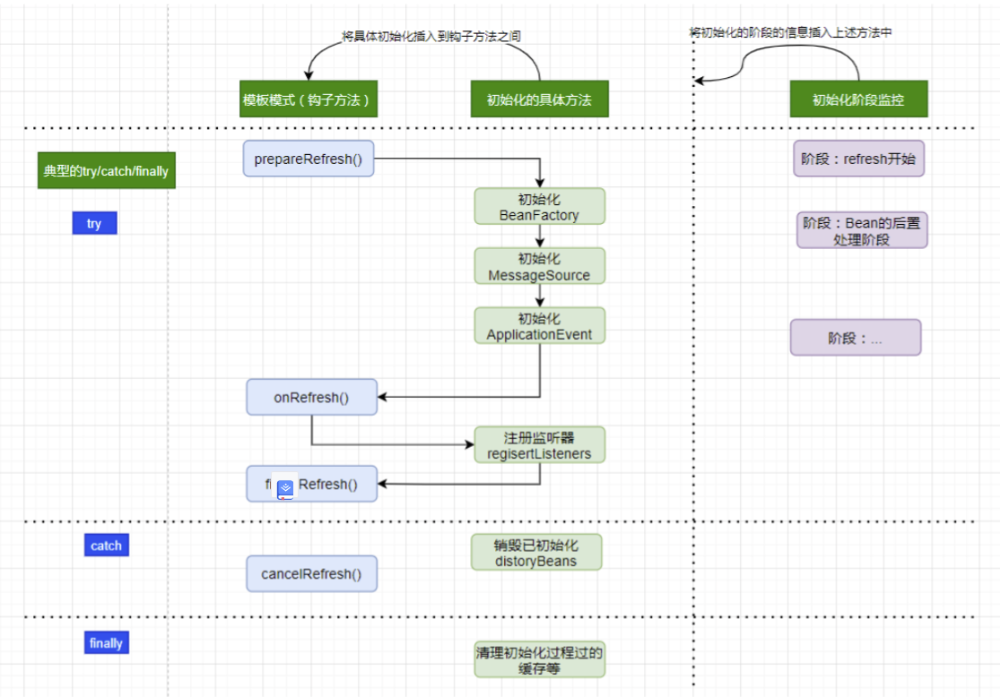

# Spring进阶 - Bean资源信息加载过程

我们通过昨天的学习，了解到了Spring IOC容器的设计要点和设计结构，接下来我们就可以看一下源码是怎么将配置文件中的资源加载解析并且生成BeanDefination并且注册到IoC容器中的了。

## 如何从XML配置中读取Bean并且放到IOC容器中？

我们在这节主要是去分析Spring如何实现将配置文件中的bean资源读取到IOC容器中的过程。我们可以参考JVM加载字节码文件一样去猜想，Bean的这个加载过程，肯定离不开，加载、解析、初始化。

### 初始化的入口

我们通过xml作为配置文件来说明，我们可以使用 ClasspathXmlApplicationContext 来创建一个IOC容器，我们可以从这个上下文对象的构造方法开始来查看到底发生了什么：

```java
// create and configure beans
ApplicationContext context = new ClassPathXmlApplicationContext("aspects.xml", "daos.xml", "services.xml");

public ClassPathXmlApplicationContext(String... configLocations) throws BeansException {
    this(configLocations, true, (ApplicationContext)null);
}

public ClassPathXmlApplicationContext(String[] configLocations, boolean refresh, @Nullable ApplicationContext parent) throws BeansException {
    // 设置Bean资源加载器与环境
    super(parent);

    // 设置资源配置的路径
    this.setConfigLocations(configLocations);

    // 真正的容器初始化
    if (refresh) {
        this.refresh();
    }
}
```

### 设置Bean资源加载器

ClassPathXmlApplicationContext 调用父类容器 AbstractApplicationContext 的构造方法来设置好 Bean 的资源加载器与环境。

AbstractApplicationContext ：

```java
/**
* Create a new AbstractApplicationContext with no parent.
*/
public AbstractApplicationContext() {
    this.resourcePatternResolver = getResourcePatternResolver();
}

/**
* Create a new AbstractApplicationContext with the given parent context.
* @param parent the parent context
*/
public AbstractApplicationContext(@Nullable ApplicationContext parent) {
    // 默认构造函数初始化容器id, name, 状态以及资源解析器
    this();
    // 将父容器的Environment合并到当前容器
    setParent(parent);
}
```

通过setParent(parent)的方法将父容器ApplicationContext的环境合并到子类：

```java
@Override
public void setParent(@Nullable ApplicationContext parent) {
    this.parent = parent;
    if (parent != null) {
        // 将父类的环境设置到当前子类对象
        Environment parentEnvironment = parent.getEnvironment();
        if (parentEnvironment instanceof ConfigurableEnvironment) {
            getEnvironment().merge((ConfigurableEnvironment) parentEnvironment);
        }
    }
}

public ConfigurableEnvironment getEnvironment() {
    if (this.environment == null) {
        this.environment = createEnvironment();
    }
    return this.environment;
}
```

###  设置资源配置的路径

在设置容器的资源加载器之后，接下来FileSystemXmlApplicationContext执行setConfigLocations方法通过调用其父类AbstractRefreshableConfigApplicationContext的方法进行对Bean定义资源文件的定位

```java
public void setConfigLocations(@Nullable String... locations) {
    // 如果资源路径不为空
    if (locations != null) {
        Assert.noNullElements(locations, "Config locations must not be null");
        // 将资源路径保存到字符串数组中
        this.configLocations = new String[locations.length];
        // 逐个遍历解析
        for (int i = 0; i < locations.length; i++) {
            this.configLocations[i] = resolvePath(locations[i]).trim();
        }
    }
    else {
        this.configLocations = null;
    }
}

protected String resolvePath(String path) {
    // 解析给定路径，必要时用相应的环境属性值替换占位符，用来配置位置。
    return getEnvironment().resolveRequiredPlaceholders(path);
}
```

### 初始化的主体流程refresh()

我们Spring IOC容器中资源中对于Bean定义的信息载入是由`refresh()`方法来完成的。

`refresh()`方法他是一个模板方法，主要作用就是：在创建IOC容器前，如果容器存在，则需要关闭和销毁当前存在的容器然后再进行新容器的创建，类似于电脑重启。

```java
@Override
public void refresh() throws BeansException, IllegalStateException {
    synchronized (this.startupShutdownMonitor) {
        // Prepare this context for refreshing.
        prepareRefresh();

        // Tell the subclass to refresh the internal bean factory.
        ConfigurableListableBeanFactory beanFactory = obtainFreshBeanFactory();

        // Prepare the bean factory for use in this context.
        prepareBeanFactory(beanFactory);

        try {
            // Allows post-processing of the bean factory in context subclasses.
            postProcessBeanFactory(beanFactory);

            // Invoke factory processors registered as beans in the context.
            invokeBeanFactoryPostProcessors(beanFactory);

            // Register bean processors that intercept bean creation.
            registerBeanPostProcessors(beanFactory);

            // Initialize message source for this context.
            initMessageSource();

            // Initialize event multicaster for this context.
            initApplicationEventMulticaster();

            // Initialize other special beans in specific context subclasses.
            onRefresh();

            // Check for listener beans and register them.
            registerListeners();

            // Instantiate all remaining (non-lazy-init) singletons.
            finishBeanFactoryInitialization(beanFactory);

            // Last step: publish corresponding event.
            finishRefresh();
        }

        catch (BeansException ex) {
            if (logger.isWarnEnabled()) {
                logger.warn("Exception encountered during context initialization - " +
                            "cancelling refresh attempt: " + ex);
            }

            // Destroy already created singletons to avoid dangling resources.
            destroyBeans();

            // Reset 'active' flag.
            cancelRefresh(ex);

            // Propagate exception to caller.
            throw ex;
        }

        finally {
            // Reset common introspection caches in Spring's core, since we
            // might not ever need metadata for singleton beans anymore...
            resetCommonCaches();
        }
    }
}
```

这里的设计上是一个非常典型的资源类加载处理型的思路，阅读前要在头脑中需要形成如下图的**顶层思路**：

- **模板方法设计模式**，模板方法中使用典型的**钩子方法**用来做拓展和自定义。
- 将**具体的初始化加载方法**插入到钩子方法之间
- 将初始化的阶段封装，用来记录当前初始化到什么阶段；常见的设计是xxxPhase/xxxStage；
- 资源加载初始化有失败等处理，必然是**try/catch/finally**...



#### 初始化BeanFactory之obtainFreshBeanFactory

这个位置的注释是：告诉子类刷新内部bean工厂。

```java
protected ConfigurableListableBeanFactory obtainFreshBeanFactory() {
    refreshBeanFactory();
    return getBeanFactory();
}

/*
此实现执行此上下文的底层bean工厂的实际刷新，关闭前一个bean工厂(如果有的话)，并为上下文生命周期的下一阶段初始化一个新的bean工厂。
*/
@Override
protected final void refreshBeanFactory() throws BeansException {
    if (hasBeanFactory()) {
        destroyBeans();
        closeBeanFactory();
    }
    try {
        DefaultListableBeanFactory beanFactory = createBeanFactory();
        beanFactory.setSerializationId(getId());
        customizeBeanFactory(beanFactory);
        // 重点看这个
        loadBeanDefinitions(beanFactory);
        this.beanFactory = beanFactory;
    }
    catch (IOException ex) {
        throw new ApplicationContextException("I/O error parsing bean definition source for " + getDisplayName(), ex);
    }
}
```

#### 初始化BeanFactory之loadBeanDefinitions

AbstractRefreshableApplicationContext中只定义了抽象的loadBeanDefinitions方法，容器真正调用的是其子类AbstractXmlApplicationContext对该方法的实现，AbstractXmlApplicationContext的主要源码如下：

```java
@Override
protected void loadBeanDefinitions(DefaultListableBeanFactory beanFactory) throws BeansException, IOException {
    // Create a new XmlBeanDefinitionReader for the given BeanFactory.
    // 为 BeanFactory 创建一个 XmlBeanDefinitionReader 对象用来载入从 xml 中获取的BeanDefinition的信息
    // 通过回调设置到容器中去，容器使用该读取器读取Bean定义资源
    XmlBeanDefinitionReader beanDefinitionReader = new XmlBeanDefinitionReader(beanFactory);

    // Configure the bean definition reader with this context's
    // resource loading environment.
    // 配置上下文的环境，资源加载器、解析器
    beanDefinitionReader.setEnvironment(this.getEnvironment());
    beanDefinitionReader.setResourceLoader(this);
    beanDefinitionReader.setEntityResolver(new ResourceEntityResolver(this));

    // Allow a subclass to provide custom initialization of the reader,
    // then proceed with actually loading the bean definitions.
    // 允许子类自行初始化（比如校验机制），并提供真正的加载方法
    initBeanDefinitionReader(beanDefinitionReader);
    // 重点点开这个方法看看
    loadBeanDefinitions(beanDefinitionReader);
}

protected void loadBeanDefinitions(XmlBeanDefinitionReader reader) throws BeansException, IOException {
    // 加载XML配置方式里的Bean定义的资源
    Resource[] configResources = getConfigResources();
    if (configResources != null) {
        reader.loadBeanDefinitions(configResources);
    }
    // 加载构造函数里配置的Bean配置文件，即{"aspects.xml", "daos.xml", "services.xml"}
    String[] configLocations = getConfigLocations();
    if (configLocations != null) {
        // 下一节会详细分析这个方法
        reader.loadBeanDefinitions(configLocations);
    }
}

@Nullable
protected Resource[] getConfigResources() {
    return null;
}

@Nullable
protected String[] getConfigLocations() {
    // 我们在设置**资源配置的路径**那一节就可以看到此时 configLocations 已经加载过，不为null了
    return (this.configLocations != null ? this.configLocations : getDefaultConfigLocations());
}
```

XmlBeanDefinitionReader调用其父类AbstractBeanDefinitionReader的 reader.loadBeanDefinitions 方法读取Bean定义资源。

由于我们使用ClassPathXmlApplicationContext作为例子分析，因此getConfigResources的返回值为null，因此程序执行reader.loadBeanDefinitions(configLocations)分支。

#### AbstractBeanDefinitionReader读取Bean定义资源（承接上文loadBeanDefinitions中的方法）

```java
@Override
public int loadBeanDefinitions(String... locations) throws BeanDefinitionStoreException {
    Assert.notNull(locations, "Location array must not be null");
    int count = 0;
    for (String location : locations) {
        count += loadBeanDefinitions(location);
    }
    return count;
}

@Override
public int loadBeanDefinitions(String location) throws BeanDefinitionStoreException {
    return loadBeanDefinitions(location, null);
}

public int loadBeanDefinitions(String location, @Nullable Set<Resource> actualResources) throws BeanDefinitionStoreException {
    // 我们在AbstractXmlApplicationContext的loadBeanDefinitions方法中设置过所以存在
    ResourceLoader resourceLoader = getResourceLoader();
    if (resourceLoader == null) {
        throw new BeanDefinitionStoreException(
            "Cannot load bean definitions from location [" + location + "]: no ResourceLoader available");
    }

    // 模式匹配类型的解析器，这种方式是加载多个满足匹配条件的资源
    if (resourceLoader instanceof ResourcePatternResolver) {
        try {
            // 获取到要加载的资源
            Resource[] resources = ((ResourcePatternResolver) resourceLoader).getResources(location);
            int count = loadBeanDefinitions(resources); // 委派调用其子类XmlBeanDefinitionReader的方法，实现加载功能  
            if (actualResources != null) {
                Collections.addAll(actualResources, resources);
            }
            if (logger.isTraceEnabled()) {
                logger.trace("Loaded " + count + " bean definitions from location pattern [" + location + "]");
            }
            return count;
        }
        catch (IOException ex) {
            throw new BeanDefinitionStoreException(
                "Could not resolve bean definition resource pattern [" + location + "]", ex);
        }
    }
    else {
        // 只能通过绝对路径URL加载单个资源.
        Resource resource = resourceLoader.getResource(location);
        int count = loadBeanDefinitions(resource);
        if (actualResources != null) {
            actualResources.add(resource);
        }
        if (logger.isTraceEnabled()) {
            logger.trace("Loaded " + count + " bean definitions from location [" + location + "]");
        }
        return count;
    }
}
```

从对AbstractBeanDefinitionReader的loadBeanDefinitions方法源码分析可以看出该方法做了以下两件事：

- 第一，调用资源加载器的获取资源方法resourceLoader.getResource(location)，获取到要加载的资源。
- 第二，真正执行加载功能是其子类XmlBeanDefinitionReader的loadBeanDefinitions方法。

####  XmlBeanDefinitionReader加载Bean定义资源

我们继续看子类XmlBeanDefinitionReader的loadBeanDefinitions(Resource …)方法看到代表**bean文件的资源**被定义以后的载入过程。

```java
/**
* 本质上是加载XML配置的Bean。
* @param inputSource the SAX InputSource to read from
* @param resource the resource descriptor for the XML file
*/
protected int doLoadBeanDefinitions(InputSource inputSource, Resource resource)
        throws BeanDefinitionStoreException {

    try {
        Document doc = doLoadDocument(inputSource, resource); // 将Bean定义资源转换成Document对象
        int count = registerBeanDefinitions(doc, resource);
        if (logger.isDebugEnabled()) {
            logger.debug("Loaded " + count + " bean definitions from " + resource);
        }
        return count;
    }
    catch (BeanDefinitionStoreException ex) {
        throw ex;
    }
    catch (SAXParseException ex) {
        throw new XmlBeanDefinitionStoreException(resource.getDescription(),
                "Line " + ex.getLineNumber() + " in XML document from " + resource + " is invalid", ex);
    }
    catch (SAXException ex) {
        throw new XmlBeanDefinitionStoreException(resource.getDescription(),
                "XML document from " + resource + " is invalid", ex);
    }
    catch (ParserConfigurationException ex) {
        throw new BeanDefinitionStoreException(resource.getDescription(),
                "Parser configuration exception parsing XML from " + resource, ex);
    }
    catch (IOException ex) {
        throw new BeanDefinitionStoreException(resource.getDescription(),
                "IOException parsing XML document from " + resource, ex);
    }
    catch (Throwable ex) {
        throw new BeanDefinitionStoreException(resource.getDescription(),
                "Unexpected exception parsing XML document from " + resource, ex);
    }
}

// 使用配置的DocumentLoader将XML定义的文件转换为Document对象.
protected Document doLoadDocument(InputSource inputSource, Resource resource) throws Exception {
    return this.documentLoader.loadDocument(inputSource, getEntityResolver(), this.errorHandler,
            getValidationModeForResource(resource), isNamespaceAware());
}
```

通过源码分析，载入Bean定义资源文件的最后一步是将Bean定义资源转换为Document对象，该过程由documentLoader实现。

#### DocumentLoader将Bean定义资源转换为Document对象

DocumentLoader将Bean定义资源转换成Document对象的源码如下：

```java
// 使用标准的JAXP将载入的Bean定义资源转换成document对象
@Override
public Document loadDocument(InputSource inputSource, EntityResolver entityResolver,
        ErrorHandler errorHandler, int validationMode, boolean namespaceAware) throws Exception {

    // 创建文件解析器工厂
    DocumentBuilderFactory factory = createDocumentBuilderFactory(validationMode, namespaceAware);
    if (logger.isTraceEnabled()) {
        logger.trace("Using JAXP provider [" + factory.getClass().getName() + "]");
    }
    // 创建文档解析器
    DocumentBuilder builder = createDocumentBuilder(factory, entityResolver, errorHandler);
    return builder.parse(inputSource); // 解析
}

protected DocumentBuilderFactory createDocumentBuilderFactory(int validationMode, boolean namespaceAware)
        throws ParserConfigurationException {

    DocumentBuilderFactory factory = DocumentBuilderFactory.newInstance();
    factory.setNamespaceAware(namespaceAware);

    // 设置解析XML的校验模式
    if (validationMode != XmlValidationModeDetector.VALIDATION_NONE) {
        factory.setValidating(true);
        if (validationMode == XmlValidationModeDetector.VALIDATION_XSD) {
            // Enforce namespace aware for XSD...
            factory.setNamespaceAware(true);
            try {
                factory.setAttribute(SCHEMA_LANGUAGE_ATTRIBUTE, XSD_SCHEMA_LANGUAGE);
            }
            catch (IllegalArgumentException ex) {
                ParserConfigurationException pcex = new ParserConfigurationException(
                        "Unable to validate using XSD: Your JAXP provider [" + factory +
                        "] does not support XML Schema. Are you running on Java 1.4 with Apache Crimson? " +
                        "Upgrade to Apache Xerces (or Java 1.5) for full XSD support.");
                pcex.initCause(ex);
                throw pcex;
            }
        }
    }

    return factory;
}
```

该解析过程调用JavaEE标准的JAXP标准进行处理。

**至此Spring IoC容器根据定位的Bean定义资源文件，将其加载读入并转换成为Document对象过程完成。**


