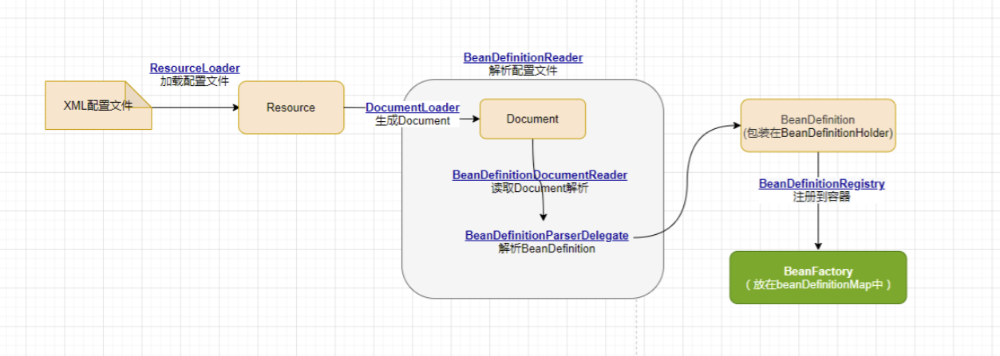

# Spring进阶 - Bean注册初始化过程

接下来我们要继续分析Spring IoC容器将载入的Bean定义资源文件转换为Document对象之后，是如何将其解析为Spring IoC管理的Bean对象并将其注册到容器中的。

##  XmlBeanDefinitionReader解析载入的Bean定义资源文件

XmlBeanDefinitionReader类中的doLoadBeanDefinitions方法是从特定XML文件中实际载入Bean定义资源的方法，该方法在载入Bean定义资源之后将其转换为Document对象，接下来调用registerBeanDefinitions启动Spring IoC容器对**Bean定义的解析过程**，registerBeanDefinitions方法源码如下：

```java
// 按照Spring的Bean语义要求将Bean定义资源解析并转换为容器内部数据结构 
public int registerBeanDefinitions(Document doc, Resource resource) throws BeanDefinitionStoreException {
    BeanDefinitionDocumentReader documentReader = createBeanDefinitionDocumentReader();
    int countBefore = getRegistry().getBeanDefinitionCount();
    // 解析过程入口，这里使用了委派模式，具体的解析实现过程由实现类DefaultBeanDefinitionDocumentReader完成  
    documentReader.registerBeanDefinitions(doc, createReaderContext(resource));
    return getRegistry().getBeanDefinitionCount() - countBefore;  // 返回此次解析了多少个对象
}

// 创建BeanDefinitionDocumentReader对象，用来解析Document对象  
protected BeanDefinitionDocumentReader createBeanDefinitionDocumentReader() {
    return BeanUtils.instantiateClass(this.documentReaderClass);
}

/**
* Create the {@link XmlReaderContext} to pass over to the document reader.委派模式，委派它去实现具体解析过程
*/
public XmlReaderContext createReaderContext(Resource resource) {
    return new XmlReaderContext(resource, this.problemReporter, this.eventListener,
            this.sourceExtractor, this, getNamespaceHandlerResolver());
}
```

Bean定义资源的载入解析分为以下两个过程：

- 通过调用XML解析器将Bean定义资源文件转换得到Document对象，但是这些Document对象并没有按照Spring的Bean规则进行解析。这一步是载入的过程，我们还得在完成这个通用XML解析之后按照Spring的Bean规则对我们的Document对象进行解析。

按照Spring的Bean规则对Document对象解析的过程是在接口BeanDefinitionDocumentReader的实现类DefaultBeanDefinitionDocumentReader中实现的。


## DefaultBeanDefinitionDocumentReader对Bean定义的Document对象解析

BeanDefinitionDocumentReader接口通过registerBeanDefinitions方法调用其实现类DefaultBeanDefinitionDocumentReader对Document对象进行解析，解析的代码如下：

```java
@Override
public void registerBeanDefinitions(Document doc, XmlReaderContext readerContext) {
    this.readerContext = readerContext;
    doRegisterBeanDefinitions(doc.getDocumentElement());
}

// 注册<beans/>配置的Beans
@SuppressWarnings("deprecation")  // for Environment.acceptsProfiles(String...)
protected void doRegisterBeanDefinitions(Element root) {
    // Any nested <beans> elements will cause recursion in this method. In
    // order to propagate and preserve <beans> default-* attributes correctly,
    // keep track of the current (parent) delegate, which may be null. Create
    // the new (child) delegate with a reference to the parent for fallback purposes,
    // then ultimately reset this.delegate back to its original (parent) reference.
    // this behavior emulates a stack of delegates without actually necessitating one.
    BeanDefinitionParserDelegate parent = this.delegate;
    this.delegate = createDelegate(getReaderContext(), root, parent);
 
    if (this.delegate.isDefaultNamespace(root)) {
        String profileSpec = root.getAttribute(PROFILE_ATTRIBUTE);
        if (StringUtils.hasText(profileSpec)) {
            // 分词器将我们的配置转换为一个spring bean该有的样子并且用String[]保存起来
            String[] specifiedProfiles = StringUtils.tokenizeToStringArray(
                    profileSpec, BeanDefinitionParserDelegate.MULTI_VALUE_ATTRIBUTE_DELIMITERS);
            // We cannot use Profiles.of(...) since profile expressions are not supported
            // in XML config. See SPR-12458 for details.
            if (!getReaderContext().getEnvironment().acceptsProfiles(specifiedProfiles)) {
                if (logger.isDebugEnabled()) {
                    logger.debug("Skipped XML bean definition file due to specified profiles [" + profileSpec +
                            "] not matching: " + getReaderContext().getResource());
                }
                return;
            }
        }
    }

    preProcessXml(root);
    parseBeanDefinitions(root, this.delegate); // 从Document的根元素开始进行Bean定义的Document对象  
    postProcessXml(root);

    this.delegate = parent;
}
```

## BeanDefinitionParserDelegate解析Bean定义资源文件生成BeanDefinition

```java
/**
* Parse the elements at the root level in the document:
* "import", "alias", "bean".
* @param root the DOM root element of the document
*/
protected void parseBeanDefinitions(Element root, BeanDefinitionParserDelegate delegate) {
    if (delegate.isDefaultNamespace(root)) {
        NodeList nl = root.getChildNodes();
        for (int i = 0; i < nl.getLength(); i++) {
            Node node = nl.item(i);
            if (node instanceof Element) {
                Element ele = (Element) node;
                if (delegate.isDefaultNamespace(ele)) {
                    parseDefaultElement(ele, delegate);
                }
                else {
                    delegate.parseCustomElement(ele);
                }
            }
        }
    }
    else {
        delegate.parseCustomElement(root);
    }
}

private void parseDefaultElement(Element ele, BeanDefinitionParserDelegate delegate) {
      
    // 如果元素节点是<Import>导入元素，进行导入解析
    if (delegate.nodeNameEquals(ele, IMPORT_ELEMENT)) {
        importBeanDefinitionResource(ele);
    }
    // 如果元素节点是<Alias>别名元素，进行别名解析 
    else if (delegate.nodeNameEquals(ele, ALIAS_ELEMENT)) {
        processAliasRegistration(ele);
    }
    // 如果元素节点<Bean>元素, 按照Spring的Bean规则解析元素  
    else if (delegate.nodeNameEquals(ele, BEAN_ELEMENT)) {
        // 我们主要就是用<Bean>标签，所以我们来查看一下这个方法
        processBeanDefinition(ele, delegate);
    }
    // 如果元素节点<Beans>元素，即它是嵌套类型的
    else if (delegate.nodeNameEquals(ele, NESTED_BEANS_ELEMENT)) {
        // 递归解析
        doRegisterBeanDefinitions(ele);
    }
}   
```

解析Bean生成BeanDefinitionHolder的方法

```java
/**
* Process the given bean element, parsing the bean definition
* and registering it with the registry.
*/
protected void processBeanDefinition(Element ele, BeanDefinitionParserDelegate delegate) {
    BeanDefinitionHolder bdHolder = delegate.parseBeanDefinitionElement(ele);
    if (bdHolder != null) {
        bdHolder = delegate.decorateBeanDefinitionIfRequired(ele, bdHolder);
        try {
            // 注册最终的装饰实例，下面一节讲这个方法
            BeanDefinitionReaderUtils.registerBeanDefinition(bdHolder, getReaderContext().getRegistry());
        }
        catch (BeanDefinitionStoreException ex) {
            getReaderContext().error("Failed to register bean definition with name '" +
                    bdHolder.getBeanName() + "'", ele, ex);
        }
        // Send registration event. 发送注册事件
        getReaderContext().fireComponentRegistered(new BeanComponentDefinition(bdHolder));
    }
}  
```

（这里就不展开了，无非就是解析XML各种元素，来生成BeanDefinition）

## 解析过后的BeanDefinition在IoC容器中的注册

Document对象的解析后得到封装BeanDefinition的BeanDefinitionHold对象，然后调用BeanDefinitionReaderUtils的registerBeanDefinition方法向IoC容器注册解析的Bean，BeanDefinitionReaderUtils的注册的源码如下：

到这里的流程过程大概是这样：我们调用的parseBeanDefinitions这个方法里面循环（for）来解析每一个bean定义信息，判断属于哪种解析形式（<Bean><Beans>等等），并且调用对应的解析器，调用到解析器之后我们就可以在对应的解析器里找到我们的注册功能，解析完毕后由注册功能注册到IOC容器中。

```java
// 通过BeanDefinitionRegistry将BeanDefinitionHolder注册到BeanFactory
public static void registerBeanDefinition(
        BeanDefinitionHolder definitionHolder, BeanDefinitionRegistry registry)
        throws BeanDefinitionStoreException {

    // Register bean definition under primary name.
    // 根据name注册bean
    String beanName = definitionHolder.getBeanName();
    registry.registerBeanDefinition(beanName, definitionHolder.getBeanDefinition());

    // Register aliases for bean name, if any.
    // 根据别名注册bean
    String[] aliases = definitionHolder.getAliases();
    if (aliases != null) {
        for (String alias : aliases) {
            registry.registerAlias(beanName, alias);
        }
    }
}    
```

当调用BeanDefinitionReaderUtils向IoC容器注册解析的BeanDefinition时，真正完成注册功能的是DefaultListableBeanFactory。

## DefaultListableBeanFactory向IoC容器注册解析后的BeanDefinition

IOC容器本质上就是一个beanDefinitionMap， 注册即将BeanDefinition put到map中

```java
/** Map of bean definition objects, keyed by bean name. */
private final Map<String, BeanDefinition> beanDefinitionMap = new ConcurrentHashMap<>(256);

/** Map from bean name to merged BeanDefinitionHolder. */
private final Map<String, BeanDefinitionHolder> mergedBeanDefinitionHolders = new ConcurrentHashMap<>(256);

/** List of bean definition names, in registration order. */
// 按注册顺序排列的按bean名称注册的列表
private volatile List<String> beanDefinitionNames = new ArrayList<>(256);

@Override
public void registerBeanDefinition(String beanName, BeanDefinition beanDefinition)
        throws BeanDefinitionStoreException {

    Assert.hasText(beanName, "Bean name must not be empty");
    Assert.notNull(beanDefinition, "BeanDefinition must not be null");

    if (beanDefinition instanceof AbstractBeanDefinition) {
        try {
            // 调用确认模板方法来验证此bean定义
            ((AbstractBeanDefinition) beanDefinition).validate();
        }
        catch (BeanDefinitionValidationException ex) {
            throw new BeanDefinitionStoreException(beanDefinition.getResourceDescription(), beanName,
                    "Validation of bean definition failed", ex);
        }
    }

    BeanDefinition existingDefinition = this.beanDefinitionMap.get(beanName);
    // 如果当前bean已经注册过
    if (existingDefinition != null) {
        // 检查是否可以覆盖当前已经存在的bean
        if (!isAllowBeanDefinitionOverriding()) {
            throw new BeanDefinitionOverrideException(beanName, beanDefinition, existingDefinition);
        }
        else if (existingDefinition.getRole() < beanDefinition.getRole()) {
            // e.g. was ROLE_APPLICATION, now overriding with ROLE_SUPPORT or ROLE_INFRASTRUCTURE
            if (logger.isInfoEnabled()) {
                logger.info("Overriding user-defined bean definition for bean '" + beanName +
                        "' with a framework-generated bean definition: replacing [" +
                        existingDefinition + "] with [" + beanDefinition + "]");
            }
        }
        else if (!beanDefinition.equals(existingDefinition)) {
            if (logger.isDebugEnabled()) {
                logger.debug("Overriding bean definition for bean '" + beanName +
                        "' with a different definition: replacing [" + existingDefinition +
                        "] with [" + beanDefinition + "]");
            }
        }
        else {
            if (logger.isTraceEnabled()) {
                logger.trace("Overriding bean definition for bean '" + beanName +
                        "' with an equivalent definition: replacing [" + existingDefinition +
                        "] with [" + beanDefinition + "]");
            }
        }
        // 覆盖
        this.beanDefinitionMap.put(beanName, beanDefinition);
    }
    else {
        if (hasBeanCreationStarted()) {
            // Cannot modify startup-time collection elements anymore (for stable iteration)
            synchronized (this.beanDefinitionMap) {
                this.beanDefinitionMap.put(beanName, beanDefinition);
                List<String> updatedDefinitions = new ArrayList<>(this.beanDefinitionNames.size() + 1);
                updatedDefinitions.addAll(this.beanDefinitionNames);
                updatedDefinitions.add(beanName);
                this.beanDefinitionNames = updatedDefinitions;
                removeManualSingletonName(beanName);
            }
        }
        else {
            // Still in startup registration phase
            this.beanDefinitionMap.put(beanName, beanDefinition);
            this.beanDefinitionNames.add(beanName);
            removeManualSingletonName(beanName);
        }
        
        //重置所有已经注册过的BeanDefinition的缓存  
        this.frozenBeanDefinitionNames = null;
    }

    if (existingDefinition != null || containsSingleton(beanName)) {
        resetBeanDefinition(beanName);
    }
    
    else if (isConfigurationFrozen()) {
        clearByTypeCache();
    }
}
```

至此，Bean定义资源文件中配置的Bean被解析过后，已经注册到IoC容器中，被容器管理起来，真正完成了IoC容器初始化所做的全部工作。现  在IoC容器中已经建立了整个Bean的配置信息，这些BeanDefinition信息已经可以使用，并且可以被检索，IoC容器的作用就是对这些注册的Bean定义信息进行处理和维护。这些的注册的Bean定义信息是IoC容器控制反转的基础，正是有了这些注册的数据，容器才可以进行依赖注入。

## 总结

现在通过上面的代码，总结一下IOC容器初始化的基本步骤：



> - 初始化的入口在容器实现中的 refresh()调用来完成
> - 对 bean 定义载入 IOC 容器使用的方法是 loadBeanDefinition,其中的大致过程如下：
>   - 通过 `ResourceLoader` 来完成资源文件位置的定位，`DefaultResourceLoader` 是默认的实现，同时上下文本身就给出了 `ResourceLoader` 的实现，可以从类路径，文件系统, URL 等方式来定为资源位置。如果是 `XmlBeanFactory` 作为 IOC 容器，那么需要为它指定 bean 定义的资源，也就是说 bean 定义文件是通过抽象成 `Resource` 来被 IOC 容器处理的。
>   - 通过 `BeanDefinitionReader` 来完成定义信息的解析和 `Bean` 信息的注册, 往往使用的是`XmlBeanDefinitionReader` 来解析 `bean` 的 `xml` 定义文件，实际的处理过程是委托给 `BeanDefinitionParserDelegate` 来完成的，从而得到 `bean` 的定义信息，这些信息在 Spring 中使用 `BeanDefinition` 对象来表示，这个名字可以让我们想到 `loadBeanDefinition`,`RegisterBeanDefinition` 这些相关的方法 - 他们都是为处理 `BeanDefinitin` 服务的。
>   - 容器解析得到 `BeanDefinition` 以后，需要把它在 IOC 容器中注册，这由 IOC 实现 `BeanDefinitionRegistry` 接口来实现。注册过程就是在 IOC 容器内部维护的一个 `HashMap` 来保存得到的 `BeanDefinition` 的过程。这个 `HashMap` 是 IOC 容器持有 bean 信息的场所，以后对 bean 的操作都是围绕这个 `HashMap` 来实现的.
> - 然后我们就可以通过 `BeanFactory` 和 `ApplicationContext` 来享受到 Spring IOC 的服务了。在使用 IOC 容器的时候，我们注意到除了少量粘合代码，绝大多数以正确 IoC 风格编写的应用程序代码完全不用关心如何到达工厂，因为容器将把这些对象与容器管理的其他对象钩在一起。基本的策略是把工厂放到已知的地方，最好是放在对预期使用的上下文有意义的地方，以及代码将实际需要访问工厂的地方。 Spring 本身提供了对声明式载入 web 应用程序用法的应用程序上下文，并将其存储在 `ServletContext` 中的框架实现。


## 主要参考文章

https://www.pdai.tech/md/spring/spring-x-framework-ioc-source-2.html

https://blog.csdn.net/qq_36212439/article/details/82749963

https://juejin.cn/post/6973884466171215908

https://juejin.cn/post/6844903838743265294

https://blog.csdn.net/hjing123/article/details/104867343

https://www.cnblogs.com/wl20200316/p/12522993.html