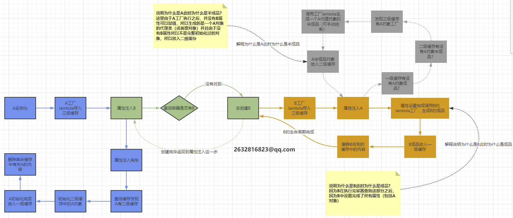

## 前言


来看看这张图，我们前两天，学习了Bean的配置是怎样从各种配置文件中读取出来并且注册到BeanFactory里面。此时容器中存放的是Bean的定义即BeanDefinition放到beanDefinitionMap中，本质上是一个ConcurrentHashMap<String, Object>；并且BeanDefinition接口中包含了这个类的Class信息以及是否是单例等。那么如何从BeanDefinition中实例化Bean对象呢？我们接下来就来看看，一个Bean初始化之后的实例化过程，在Spring中到底是什么样子？

我们主要来看看以下俩个问题：

- getBean方法流程
- bean的生命周期

## BeanFactory中的getBean方法

通过之前的学习，我们了解到了BeanFactory这个东西他定义了整个Bean容器的规范，其中包含了多个获得Bean的方法：

```java
// 根据bean的名字和Class类型等来得到bean实例    
Object getBean(String name) throws BeansException;    
Object getBean(String name, Class requiredType) throws BeansException;    
Object getBean(String name, Object... args) throws BeansException;
<T> T getBean(Class<T> requiredType) throws BeansException;
<T> T getBean(Class<T> requiredType, Object... args) throws BeansException;
```

 BeanDefinition的结构也体现了它存储了Bean的类名以及是否是单例，构造方法，类成员变量等各种Bean的定义信息：

**这样我们初步有了实现Object getBean(String name)这个方法的思路：**

- 从beanDefinitionMap容器通过beanName获得对应Bean的BeanDefinition（Bean的配置信息）
- 从对应Bean的BeanDefinition中获得beanClassName
- 通过Java反射机制初始化对应beanClassName的实例对象 ，其中：

- - 构造函数从BeanDefinition的constructorArgumentValues属性的getConstructorArgumentValues()方法获取
  - 属性值从BeanDefinition的propertyValues属性的getPropertyValues()方法获取

- 返回beanName的实例instance

此外由于BeanDefinition还有是否为单例bean的信息，如果是无参构造函数的实例还可以放在一个Map缓存中，这样下次获取这个单例的实例时只需要从缓存中获取，如果获取不到再通过上述步骤获取。

到此我们的简单的实现bean实例化的思路就出来了，但是spring还要考虑很多内容，我们慢慢的来看。

## Spring中getBean的主体思路

BeanFactory实现getBean方法在AbstractBeanFactory中，整个getBean方法重载都是通过调用doGetBean方法进行真正的bean实例化的：

```java
public Object getBean(String name) throws BeansException {
  return doGetBean(name, null, null, false);
}

public <T> T getBean(String name, Class<T> requiredType) throws BeansException {
  return doGetBean(name, requiredType, null, false);
}

public Object getBean(String name, Object... args) throws BeansException {
  return doGetBean(name, null, args, false);
}

public <T> T getBean(String name, @Nullable Class<T> requiredType, @Nullable Object... args)
    throws BeansException {
  return doGetBean(name, requiredType, args, false);
}
```

我们来看下doGetBean方法(这个方法很长，我们主要看它的整体思路和设计要点）：

```java
protected <T> T doGetBean(
			String name
            , @Nullable Class<T> requiredType // Bean的具体Class类型
            , @Nullable Object[] args // 初始化成员变量，初始化参数
            , boolean typeCheckOnly) // 参数typeCheckOnly：bean实例是否包含一个类型检查
			throws BeansException {

  // 解析bean的真正name，如果bean是工厂类，name前缀会加&，需要去掉
  String beanName = transformedBeanName(name);
  Object beanInstance;

  // Eagerly check singleton cache for manually registered singletons.
  // 首先先从单例缓存中尝试获取当前bean
  Object sharedInstance = getSingleton(beanName);
  if (sharedInstance != null && args == null) {
    // 无参单例从缓存中获取
    beanInstance = getObjectForBeanInstance(sharedInstance, name, beanName, null);
  }

  else {
    // 如果bean实例还在创建中，则直接抛出异常
    if (isPrototypeCurrentlyInCreation(beanName)) {
      throw new BeanCurrentlyInCreationException(beanName);
    }

    // 如果 beanDefinition 存在于父bean工厂中，委派给父Bean工厂获取
    BeanFactory parentBeanFactory = getParentBeanFactory();
    if (parentBeanFactory != null && !containsBeanDefinition(beanName)) {
      // Not found -> check parent.
      String nameToLookup = originalBeanName(name);
      // 接下来的ifelse就是判断调用哪个重载的doGetBean方法
      if (parentBeanFactory instanceof AbstractBeanFactory) {
        return ((AbstractBeanFactory) parentBeanFactory).doGetBean(
            nameToLookup, requiredType, args, typeCheckOnly);
      }
      else if (args != null) {
        // Delegation to parent with explicit args.
        return (T) parentBeanFactory.getBean(nameToLookup, args);
      }
      else if (requiredType != null) {
        // No args -> delegate to standard getBean method.
        return parentBeanFactory.getBean(nameToLookup, requiredType);
      }
      else {
        return (T) parentBeanFactory.getBean(nameToLookup);
      }
    }

    if (!typeCheckOnly) {
      // 将当前bean实例放入alreadyCreated集合里，标识这个bean准备创建了
      markBeanAsCreated(beanName);
    }

    StartupStep beanCreation = this.applicationStartup.start("spring.beans.instantiate")
        .tag("beanName", name);
    try {
      if (requiredType != null) {
        beanCreation.tag("beanType", requiredType::toString);
      }
      RootBeanDefinition mbd = getMergedLocalBeanDefinition(beanName);
      checkMergedBeanDefinition(mbd, beanName, args);

      // 确保它的依赖对象也被初始化了
      String[] dependsOn = mbd.getDependsOn();
      if (dependsOn != null) {
        for (String dep : dependsOn) {
          if (isDependent(beanName, dep)) {
            throw new BeanCreationException(mbd.getResourceDescription(), beanName,
                "Circular depends-on relationship between '" + beanName + "' and '" + dep + "'");
          }
          registerDependentBean(dep, beanName);
          try {
            getBean(dep); // 初始化它依赖的Bean
          }
          catch (NoSuchBeanDefinitionException ex) {
            throw new BeanCreationException(mbd.getResourceDescription(), beanName,
                "'" + beanName + "' depends on missing bean '" + dep + "'", ex);
          }
        }
      }

      // 创建Bean实例：单例
      if (mbd.isSingleton()) {
        sharedInstance = getSingleton(beanName, () -> {
          try {
            // 真正创建bean的方法
            return createBean(beanName, mbd, args);
          }
          catch (BeansException ex) {
            // Explicitly remove instance from singleton cache: It might have been put there
            // eagerly by the creation process, to allow for circular reference resolution.
            // Also remove any beans that received a temporary reference to the bean.
            destroySingleton(beanName);
            throw ex;
          }
        });
        beanInstance = getObjectForBeanInstance(sharedInstance, name, beanName, mbd);
      }
      // 创建Bean实例：原型
      else if (mbd.isPrototype()) {
        // It's a prototype -> create a new instance.
        Object prototypeInstance = null;
        try {
          beforePrototypeCreation(beanName);
          prototypeInstance = createBean(beanName, mbd, args);
        }
        finally {
          afterPrototypeCreation(beanName);
        }
        beanInstance = getObjectForBeanInstance(prototypeInstance, name, beanName, mbd);
      }
      // 创建Bean实例：根据bean的scope创建
      else {
        String scopeName = mbd.getScope();
        if (!StringUtils.hasLength(scopeName)) {
          throw new IllegalStateException("No scope name defined for bean ´" + beanName + "'");
        }
        Scope scope = this.scopes.get(scopeName);
        if (scope == null) {
          throw new IllegalStateException("No Scope registered for scope name '" + scopeName + "'");
        }
        try {
          Object scopedInstance = scope.get(beanName, () -> {
            beforePrototypeCreation(beanName);
            try {
              return createBean(beanName, mbd, args);
            }
            finally {
              afterPrototypeCreation(beanName);
            }
          });
          beanInstance = getObjectForBeanInstance(scopedInstance, name, beanName, mbd);
        }
        catch (IllegalStateException ex) {
          throw new ScopeNotActiveException(beanName, scopeName, ex);
        }
      }
    }
    catch (BeansException ex) {
      beanCreation.tag("exception", ex.getClass().toString());
      beanCreation.tag("message", String.valueOf(ex.getMessage()));
      cleanupAfterBeanCreationFailure(beanName);
      throw ex;
    }
    finally {
      beanCreation.end();
    }
  }

  return adaptBeanInstance(name, beanInstance, requiredType);
}
```

**我们捋一下这个方法：**

- 首先我们进来之后需要解析bean的真实name，如果bean此时是工厂类的话，name前缀会加&，需要我们去掉。
- 无参构造的bean实例先从我们的缓存中去尝试获取。
- 如果缓存中没有，那么先判断该bean是否正在被实例化。
- 如果BeanDefinition存在于父Bean工厂之中，则委派给父Bean工厂获取。
- 标记当前Bean为正在创建的状态。
- 确保该Bean所依赖的其它Bean也被初始化过了。
- 真正开始创建：

- - 单例模式创建。
  - 原型模式创建。
  - 根据scope创建。

我们在这个方法中还可以看到Spring处理循环依赖的影子，下一节我们详细说说。

## Spring如何解决循环依赖

首先我们需要说明，Spring只是解决了单例模式下属性依赖的循环问题；Spring为了解决单例的循环依赖问题，使用了三级缓存。

### Spring单例模式下的三级缓存

```java
/** Cache of singleton objects: bean name --> bean instance */
private final Map<String, Object> singletonObjects = new ConcurrentHashMap<String, Object>(256);
 
/** Cache of early singleton objects: bean name --> bean instance */
private final Map<String, Object> earlySingletonObjects = new HashMap<String, Object>(16);

/** Cache of singleton factories: bean name --> ObjectFactory */
private final Map<String, ObjectFactory<?>> singletonFactories = new HashMap<String, ObjectFactory<?>>(16);
```

- **一级缓存**：存放已经实例化并且属性注入之后的完整可用的单例bean。
- **二级缓存**：存放已经实例化但是未进行属性注入的半成品单例bean。
- **三级缓存**：存放单例bean工厂的缓存。

以下是获取单例bean的方法：

```java
protected Object getSingleton(String beanName, boolean allowEarlyReference) {
    // 一级缓存是否有当前所需bean？
    Object singletonObject = this.singletonObjects.get(beanName);
    // 没有的话此时当前所需bean是不是在创建过程中？
    if (singletonObject == null && isSingletonCurrentlyInCreation(beanName)) {
        // 从二级缓存寻找
        singletonObject = this.earlySingletonObjects.get(beanName);
        // 二级缓存中找不到当前所需bean
        if (singletonObject == null && allowEarlyReference) {
            // 上锁
            synchronized (this.singletonObjects) {
                // Consistent creation of early reference within full singleton lock
   			   // 重新再找一遍，防止上锁前别的线程紧随其后创建了当前所需bean并且放入缓存了。
                singletonObject = this.singletonObjects.get(beanName);
                if (singletonObject == null) {
                    singletonObject = this.earlySingletonObjects.get(beanName);
                    if (singletonObject == null) {
                        // 再次判断一二级缓存没有当前所需bean，所以直接进行一个三级缓存的找。
                        ObjectFactory<?> singletonFactory = this.singletonFactories.get(beanName);
                        if (singletonFactory != null) {
                 		   // 找到了进行善后工作。
                            singletonObject = singletonFactory.getObject();
                            this.earlySingletonObjects.put(beanName, singletonObject);
                            this.singletonFactories.remove(beanName);
                        }
                    }
                }
            }
        }
    }
    return singletonObject;
}
```

- isSingletonCurrentlyInCreation()：判断当前单例bean是否正在建立中，也就是没有初始化完成(好比A的构造器依赖了B对象因此得先去建立B对象， 或则在A的populateBean过程当中依赖了B对象，得先去建立B对象，这时的A就是处于建立中的状态。)
- allowEarlyReference ：是否容许从singletonFactories中经过getObject拿到对象

分析getSingleton()的整个过程，Spring首先从一级缓存singletonObjects中获取。若是获取不到，而且对象正在建立中，就再从二级缓存earlySingletonObjects中获取。若是仍是获取不到且容许singletonFactories经过getObject()获取，就从三级缓存singletonFactory.getObject()(三级缓存)获取，若是获取到了则从三级缓存移动到了二级缓存。

### 解决循环依赖的流程图

请忽略图二中“步骤一”的最后一个方法：




这俩张图结合来看应该就有一个完整的过程了。

### Spring为何不能解决非单例属性之外的循环依赖？

通过以下几个问题，辅助我们进一步理解。

#### Spring为什么不能解决构造器的循环依赖？

构造器注入形成的循环依赖： 也就是beanB需要在beanA的构造函数中完成初始化，beanA也需要在beanB的构造函数中完成初始化，这种情况的结果就是两个bean都不能完成初始化，循环依赖难以解决。

Spring解决循环依赖主要是依赖三级缓存，但是的**在调用构造方法之前还未将其放入三级缓存之中**，因此后续的依赖调用构造方法的时候并不能从三级缓存中获取到依赖的Bean，因此不能解决。

#### Spring为什么不能解决prototype作用域循环依赖？

这种循环依赖同样无法解决，因为spring不会缓存‘prototype’作用域的bean，而spring中循环依赖的解决正是通过缓存来实现的。

#### Spring为什么不能解决多例的循环依赖？

多实例Bean是每次调用一次getBean都会执行一次构造方法并且给属性赋值，根本没有三级缓存，因此不能解决循环依赖。

#### 那么其它循环依赖如何解决？

一个好的类的设计，应该是没有循环依赖的。

那么实际开发中，如果不可避免的碰到如下情况造成循环依赖可以怎么来解决？

- **生成代理对象产生的循环依赖：**

这类循环依赖问题解决方法很多，主要有：

1. 1. 使用@Lazy注解，延迟加载
   2. 使用@DependsOn注解，指定加载先后关系
   3. 修改文件名称，改变循环依赖类的加载顺序

- **使用@DependsOn产生的循环依赖：**

这类循环依赖问题要找到@DependsOn注解循环依赖的地方，迫使它不循环依赖就可以解决问题。

- **多例循环依赖：**

这类循环依赖问题可以通过把bean改成单例的解决。

- **构造器循环依赖：**

这类循环依赖问题可以通过使用@Lazy注解解决。
