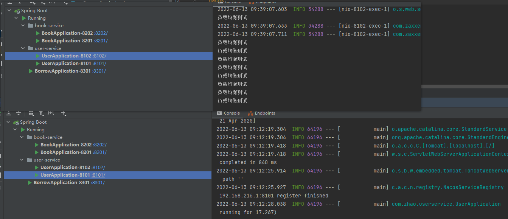
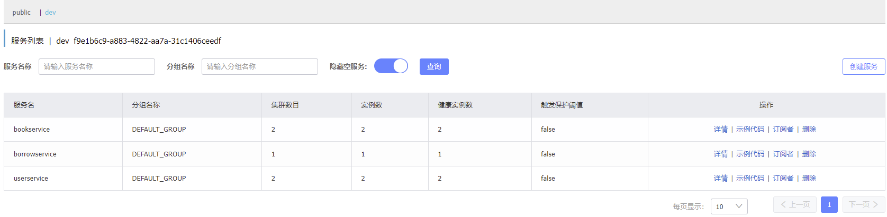

主要来自于青空の霞光学习的笔记，代码示例全部都成功 ---- [青空の霞光](https://www.bilibili.com/video/BV1AL4y1j7RY?p=9)


前面我们了解了微服务的一套解决方案，但是它是基于Netflix的解决方案，实际上我们发现，很多框架都已经停止维护了，来看看目前我们所认识到的SpringCloud各大组件的维护情况：

* **注册中心：**Eureka（属于*Netflix*，2.x版本不再开源，1.x版本仍在更新）
* **服务调用：**Ribbon（属于*Netflix*，停止更新，已经彻底被移除）、SpringCloud Loadbalancer（属于*SpringCloud*官方，目前的默认方案）
* **服务降级：**Hystrix（属于*Netflix*，停止更新，已经彻底被移除）
* **路由网关：**Zuul（属于*Netflix*，停止更新，已经彻底被移除）、Gateway（属于*SpringCloud*官方，推荐方案）
* **配置中心：**Config（属于*SpringCloud*官方）

可见，我们之前使用的整套解决方案中，超过半数的组件都已经处于不可用状态，并且部分组件都是SpringCloud官方出手提供框架进行解决，因此，寻找一套更好的解决方案势在必行，也就引出了我们本章的主角：**SpringCloud Alibaba**

阿里巴巴作为业界的互联网大厂，给出了一套全新的解决方案，官方网站（中文）：https://spring-cloud-alibaba-group.github.io/github-pages/2021/zh-cn/index.html

> Spring Cloud Alibaba 致力于提供微服务开发的一站式解决方案。此项目包含开发分布式应用服务的必需组件，方便开发者通过 Spring Cloud 编程模型轻松使用这些组件来开发分布式应用服务。
>
> 依托 Spring Cloud Alibaba，您只需要添加一些注解和少量配置，就可以将 Spring Cloud 应用接入阿里分布式应用解决方案，通过阿里中间件来迅速搭建分布式应用系统。

目前 Spring Cloud Alibaba 提供了如下功能:

1. **服务限流降级**：支持 WebServlet、WebFlux, OpenFeign、RestTemplate、Dubbo 限流降级功能的接入，可以在运行时通过控制台实时修改限流降级规则，还支持查看限流降级 Metrics 监控。
2. **服务注册与发现**：适配 Spring Cloud 服务注册与发现标准，默认集成了 Ribbon 的支持。
3. **分布式配置管理**：支持分布式系统中的外部化配置，配置更改时自动刷新。
4. **Rpc服务**：扩展 Spring Cloud 客户端 RestTemplate 和 OpenFeign，支持调用 Dubbo RPC 服务
5. **消息驱动能力**：基于 Spring Cloud Stream 为微服务应用构建消息驱动能力。
6. **分布式事务**：使用 @GlobalTransactional 注解， 高效并且对业务零侵入地解决分布式事务问题。
7. **阿里云对象存储**：阿里云提供的海量、安全、低成本、高可靠的云存储服务。支持在任何应用、任何时间、任何地点存储和访问任意类型的数据。
8. **分布式任务调度**：提供秒级、精准、高可靠、高可用的定时（基于 Cron 表达式）任务调度服务。同时提供分布式的任务执行模型，如网格任务。网格任务支持海量子任务均匀分配到所有 Worker（schedulerx-client）上执行。
9. **阿里云短信服务**：覆盖全球的短信服务，友好、高效、智能的互联化通讯能力，帮助企业迅速搭建客户触达通道。

可以看到，SpringCloudAlibaba实际上是对我们的SpringCloud组件增强功能，是SpringCloud的增强框架，可以兼容SpringCloud原生组件和SpringCloudAlibaba的组件。

开始学习之前，把我们之前打包好的拆分项目解压，我们将基于它进行讲解。

***


## Nacos 更加全能的注册中心

Nacos（**Na**ming **Co**nfiguration **S**ervice）是一款阿里巴巴开源的服务注册与发现、配置管理的组件，相当于是Eureka+Config的组合形态。

### 安装与部署

Nacos服务器是独立安装部署的，因此我们需要下载最新的Nacos服务端程序，下载地址：https://github.com/alibaba/nacos


可以看到目前最新的版本是`1.4.3`版本（2022年2月27日发布的），我们直接下载`zip`文件即可。

接着我们将文件进行解压，得到以下内容：


我们直接将其拖入到项目文件夹下，便于我们一会在IDEA内部启动，接着添加运行配置：


其中`-m standalone`表示单节点模式，Mac和Linux下记得将解释器设定为`/bin/bash`，由于Nacos在Mac/Linux默认是后台启动模式，我们修改一下它的bash文件，让它变成前台启动，这样IDEA关闭了Nacos就自动关闭了，否则开发环境下很容易忘记关：

```bash
# 注释掉 nohup $JAVA ${JAVA_OPT} nacos.nacos >> ${BASE_DIR}/logs/start.out 2>&1 &
# 替换成下面的
$JAVA ${JAVA_OPT} nacos.nacos
```

接着我们点击启动：


windos下，我们将启动模式从集群换为单机即可启动，或者直接找到**`nacos/bin路径 运行 .\startup.cmd -m standalone`**


OK，启动成功，可以看到它的管理页面地址也是给我们贴出来了： http://localhost:8848/nacos，访问这个地址：


默认的用户名和管理员密码都是`nacos`，直接登陆即可，可以看到进入管理页面之后功能也是相当丰富：


至此，Nacos的安装与部署完成。

### 服务注册与发现

现在我们要实现基于Nacos的服务注册与发现，那么就需要导入SpringCloudAlibaba相关的依赖，我们在父工程将依赖进行管理：

```xml
<dependencyManagement>
    <dependencies>
        <dependency>
            <groupId>org.mybatis.spring.boot</groupId>
            <artifactId>mybatis-spring-boot-starter</artifactId>
            <version>2.2.0</version>
        </dependency>
      
      	<!-- 这里引入最新的SpringCloud依赖 -->
        <dependency>
            <groupId>org.springframework.cloud</groupId>
            <artifactId>spring-cloud-dependencies</artifactId>
            <version>2021.0.1</version>
          	<type>pom</type>
            <scope>import</scope>
        </dependency>

     	  <!-- 这里引入最新的SpringCloudAlibaba依赖，2021.0.1.0版本支持SpringBoot2.6.X -->
        <dependency>
            <groupId>com.alibaba.cloud</groupId>
            <artifactId>spring-cloud-alibaba-dependencies</artifactId>
            <version>2021.0.1.0</version>
            <type>pom</type>
            <scope>import</scope>
        </dependency>
    </dependencies>
</dependencyManagement>
```

接着我们就可以在子项目中添加服务发现依赖了，比如我们以图书服务为例：

```xml
<dependency>
    <groupId>com.alibaba.cloud</groupId>
    <artifactId>spring-cloud-starter-alibaba-nacos-discovery</artifactId>
</dependency>
```

和注册到Eureka一样，我们也需要在配置文件中配置Nacos注册中心的地址：

```yaml
server:
  port: 8201
spring:
  datasource:
    driver-class-name: com.mysql.cj.jdbc.Driver
    url: jdbc:mysql://localhost:3306/cloudstudy?useUnicode=true&characterEncoding=utf8&zeroDateTimeBehavior=convertToNull&useSSL=false&autoReconnect=true&serverTimezone=Asia/Shanghai
    username: root
    password: mysql123456
  # 应用名称 bookservice
  application:
    name: bookservice
  cloud:
    nacos:
      discovery:
        # 配置Nacos注册中心地址
        server-addr: localhost:8848

```

按照同样的方法，我们接着将另外两个服务也注册到Nacos中：


接着我们使用OpenFeign，实现服务发现远程调用以及负载均衡，在BorrowService中导入依赖：

```xml
<dependency>
    <groupId>org.springframework.cloud</groupId>
    <artifactId>spring-cloud-starter-openfeign</artifactId>
</dependency>
<!-- 这里需要单独导入LoadBalancer依赖 -->
<dependency>
    <groupId>org.springframework.cloud</groupId>
    <artifactId>spring-cloud-starter-loadbalancer</artifactId>
</dependency>
```

编写接口：

```java
@FeignClient("userservice")
public interface UserClient {
    
    @RequestMapping("/user/{uid}")
    User getUserById(@PathVariable("uid") int uid);
}
```

```java
@FeignClient("bookservice")
public interface BookClient {

    @RequestMapping("/book/{bid}")
    Book getBookById(@PathVariable("bid") int bid);
}
```

```java
@Service
public class BorrowServiceImpl implements BorrowService {

    @Resource
    BorrowMapper mapper;

    @Resource
    BookClient bookClient;

    @Resource
    UserClient userClient;

    @Override
    public UserBorrowDetail getUserBorrowDetailByUid(int uid) {

        List<Borrow> borrow = mapper.getBorrowsByUid(uid);
        //那么问题来了，现在拿到借阅关联信息了，怎么调用其他服务获取信息呢？

        User user = userClient.findUserById(uid);

        List<Book> bookList = borrow
                .stream()
                .map(borrowTemp -> bookClient.findBookById(borrowTemp.getBid()))
                .collect(Collectors.toList());

        return new UserBorrowDetail(user, bookList);
    }
}
```

```java
@EnableFeignClients
@SpringBootApplication
public class BorrowApplication {
    public static void main(String[] args) {
        SpringApplication.run(BorrowApplication.class, args);
    }
}
```

接着我们进行测试：


测试正常，可以自动发现服务，接着我们来多配置几个实例，图书服务和用户服务的端口配置。

然后我们在图书服务和用户服务中添加一句打印方便之后查看：

```java
@RequestMapping("/user/{uid}")
public User findUserById(@PathVariable("uid") int uid){
    System.out.println("调用用户服务");
    return service.getUserById(uid);
}
```

现在将全部服务启动：


可以看到Nacos中的实例数量已经显示为`2`：


接着我们调用借阅服务，看看能否负载均衡远程调用：


OK，负载均衡远程调用没有问题，这样我们就实现了基于Nacos的服务的注册与发现，实际上大致流程与Eureka一致。

值得注意的是，Nacos区分了临时实例和非临时实例：


那么临时和非临时有什么区别呢？

* **临时实例**：和Eureka一样，采用心跳机制向Nacos发送请求保持在线状态，一旦心跳停止，代表实例下线，不保留实例信息。
* **非临时实例**：由Nacos主动进行联系，如果连接失败，那么不会移除实例信息，而是将健康状态设定为false，相当于会对某个实例状态持续地进行监控。

我们可以通过配置文件进行修改临时实例：

```yaml
spring:
  application:
    name: borrow-service
  cloud:
    nacos:
      discovery:
        server-addr: localhost:8848
        # 将ephemeral修改为false，表示非临时实例
        ephemeral: false
```

### 集群分区

实际上集群分区概念在之前的Eureka中也有出现，比如：

```yaml
eureka:
  client:
		fetch-registry: false
    register-with-eureka: false
    service-url:
      defaultZone: http://localhost:8888/eureka
      # 这个defaultZone是个啥玩意，为什么要用这个名称？为什么要要用这样的形式来声明注册中心？
```

在一个分布式应用中，相同服务的实例可能会在不同的机器、位置上启动，比如我们的用户管理服务，可能在成都有1台服务器部署、重庆有一台服务器部署，而这时，我们在成都的服务器上启动了借阅服务，那么如果我们的借阅服务现在要调用用户服务，就应该优先选择同一个区域的用户服务进行调用，这样会使得响应速度更快。


因此，我们可以对部署在不同机房的服务进行分区，可以看到实例的分区是默认：


我们可以直接在配置文件中进行修改：

我们将01端口的服务都设为广州集群，02端口服务都设置为北京集群，borrow服务设置为北京集群。

```yaml
spring:
  application:
    name: borrow-service
  cloud:
    nacos:
      discovery:
        server-addr: localhost:8848
        # 修改为北京地区的集群
        cluster-name: Beijing
```

当然由于我们这里使用的是不同的启动配置，直接在启动配置中添加环境变量`spring.cloud.nacos.discovery.cluster-name`也行，这里我们将用户服务和图书服务两个区域都分配一个，借阅服务就配置为成都地区：


修改完成之后，我们来尝试重新启动一下（Nacos也要重启），观察Nacos中集群分布情况：


可以看到现在有两个集群，并且都有一个实例正在运行。我们接着去调用借阅服务，按照区域优先，它应该首先掉用北京地区的，但是发现并没有按照区域进行优先调用，而依然使用的是轮询模式的负载均衡调用。

我们必须要提供Nacos的负载均衡实现才能开启区域优先调用机制，只需要在**borrow-service**配制文件中进行修改即可：

```yaml
spring:
  application:
    name: borrow-service
  cloud:
    nacos:
      discovery:
        server-addr: localhost:8848
        cluster-name: Beijing
    # 将loadbalancer的nacos支持开启，集成Nacos负载均衡
    loadbalancer:
      nacos:
        enabled: true
```

现在我们重启借阅服务，会发现优先调用的是同区域的用户和图书服务：

现在我们可以将北京地区的服务下线：


可以看到，在下线之后，由于本区域内没有可用服务了，借阅服务将会调用广州区域的用户服务。


除了根据区域优先调用之外，同一个区域内的实例也可以单独设置权重，Nacos会优先选择权重更大的实例进行调用，我们可以直接在管理页面中进行配置：


或是在配置文件中进行配置：

```yml
spring:
  application:
    name: borrowservice
  cloud:
    nacos:
      discovery:
        server-addr: localhost:8848
        cluster-name: Beijing
        # 权重大小，越大越优先调用，默认为1
        weight: 0.5
```

通过配置权重，某些性能不太好的机器就能够更少地被使用，而更多的使用那些网络良好性能更高的主机上的实例。

### 配置中心

前面我们学习了SpringCloud Config，我们可以通过配置服务来加载远程配置，这样我们就可以在远端集中管理配置文件。

实际上我们可以在`bootstrap.yml`中配置远程配置文件获取，然后再进入到配置文件加载环节，而Nacos也支持这样的操作，使用方式也比较类似，比如我们现在想要将借阅服务的配置文件放到Nacos进行管理，那么这个时候就需要在Nacos中创建配置文件：


将借阅服务的配置文件全部（当然正常情况下是不会全部CV的，只会复制那些需要经常修改的部分，这里为了省事就直接全部CV了）复制过来，注意**Data ID**的格式跟我们之前一样，`应用名称-环境.yml`，如果只编写应用名称，那么代表此配置文件无论在什么环境下都会使用，然后每个配置文件都可以进行分组，也算是一种分类方式：


完成之后点击发布即可：


然后在项目中导入依赖，这里我们只配置了用户服务的，所以我们先在用户服务模块中添加依赖：

```xml
<dependency>
    <groupId>org.springframework.cloud</groupId>
    <artifactId>spring-cloud-starter-bootstrap</artifactId>
</dependency>
<dependency>
    <groupId>com.alibaba.cloud</groupId>
    <artifactId>spring-cloud-starter-alibaba-nacos-config</artifactId>
</dependency>
```

接着我们在借阅服务中添加`bootstrap.yml`文件：

```yaml
spring:
  application:
    # 服务名称和配置中心的userservice-dev文件保持一致
    name: userservice
  profiles:
    # 环境也是和配置文件保持一致
    active: dev
  cloud:
    nacos:
      config:
        # 配置文件后缀名
        file-extension: yml
        # 配置中心服务器地址，也就是Nacos地址
        server-addr: localhost:8848
```

现在我们启动服务试试看：


可以看到成功读取配置文件并启动了，实际上使用上来说跟之前的Config是基本一致的。

Nacos还支持配置文件的热更新，比如我们在配置文件中添加了一个属性，而这个时候可能需要实时修改，并在后端实时更新，那么这种该怎么实现呢？

我们修改一下配置文件，然后重启服务器：


可以看到已经可以正常读取了：

那么如何才能实现配置热更新呢？我们可以像下面这样：

```java
@RestController
@RefreshScope   // 添加此注解就能实现自动刷新了
public class TestController {

    @Value("${test.txt}")
    String txt;

    @RequestMapping("/test")
    public String test(){
        return txt;
    }
}
```

重启服务器，再次重复上述实验，成功。

### 命名空间

我们还可以将配置文件或是服务实例划分到不同的命名空间中，其实就是区分开发、生产环境或是引用归属之类的：


我们尝试创建一个新的命名空间：


可以看到在新的命名空间下，没有任何配置文件和服务：


我们在不同的命名空间下，实例和配置都是相互之间隔离的，我们也可以在配置文件中指定当前的命名空间。

我们来测试一下，如果我们把用户服务和图书服务放入dev环境下，看一下我们的借阅服务会不会被隔离而导致不可用。


果不其然，找不到服务了，那么我们将借阅服务也放入一样的命名空间中试一下：




测试成功，足以体现隔离性。

### 实现高可用

由于Nacos暂不支持Arm架构芯片的Mac集群搭建，本小节用Linxu云主机（Nacos比较吃内存，2个Nacos服务器集群，至少2G内存）环境演示。

通过前面的学习，我们已经了解了如何使用Nacos以及Nacos的功能等，最后我们来看看，如果像之前Eureka一样，搭建Nacos集群，实现高可用。

官方方案：https://nacos.io/zh-cn/docs/cluster-mode-quick-start.html


>http://ip1:port/openAPI 直连ip模式，机器挂则需要修改ip才可以使用。
>
>http://SLB:port/openAPI 挂载SLB模式(内网SLB，不可暴露到公网，以免带来安全风险)，直连SLB即可，下面挂server真实ip，可读性不好。
>
>http://nacos.com:port/openAPI 域名 + SLB模式(内网SLB，不可暴露到公网，以免带来安全风险)，可读性好，而且换ip方便，推荐模式

我们来看看它的架构设计，它推荐我们在所有的Nacos服务端之前建立一个负载均衡，我们通过访问负载均衡服务器来间接访问到各个Nacos服务器。实际上就，是比如有三个Nacos服务器做集群，但是每个服务不可能把每个Nacos都去访问一次进行注册，实际上只需要在任意一台Nacos服务器上注册即可，Nacos服务器之间会自动同步信息，但是如果我们随便指定一台Nacos服务器进行注册，如果这台Nacos服务器挂了，但是其他Nacos服务器没挂，这样就没办法完成注册了，但是实际上整个集群还是可用的状态。

所以这里就需要在所有Nacos服务器之前搭建一个SLB（服务器负载均衡），这样就可以避免上面的问题了。但是我们知道，如果要实现外界对服务访问的负载均衡，我们就得用比如之前说到的Gateway来实现，而这里实际上我们可以用一个更加方便的工具：Nginx，来实现（之前我们没讲过，但是使用起来很简单，放心后面会带着大家使用）

关于SLB最上方还有一个DNS（我们在`计算机网络`这门课程中学习过），这个是因为SLB是裸IP，如果SLB服务器修改了地址，那么所有微服务注册的地址也得改，所以这里是通过加域名，通过域名来访问，让DNS去解析真实IP，这样就算改变IP，只需要修改域名解析记录即可，域名地址是不会变化的。

最后就是Nacos的数据存储模式，在单节点的情况下，Nacos实际上是将数据存放在自带的一个嵌入式数据库中：


而这种模式只适用于单节点，在多节点集群模式下，肯定是不能各存各的，所以，Nacos提供了MySQL统一存储支持，我们只需要让所有的Nacos服务器连接MySQL进行数据存储即可，官方也提供好了SQL文件。

现在就可以开始了，第一步，我们直接导入数据库即可，文件在conf目录中：


我们来将其导入到数据库，可以看到生成了很多的表：


然后我们来创建两个Nacos服务器，做一个迷你的集群，这里使用`scp`命令将nacos服务端上传到Linux服务器（注意需要提前安装好JRE 8或更高版本的环境）：


解压之后，我们对其配置文件进行修改，首先是`application.properties`配置文件，修改以下内容，包括MySQL服务器的信息：

```properties
### Default web server port:
server.port=8801

#*************** Config Module Related Configurations ***************#
### If use MySQL as datasource:
spring.datasource.platform=mysql

### Count of DB:
db.num=1

### Connect URL of DB:
db.url.0=jdbc:mysql://cloudstudy.mysql.cn-chengdu.rds.aliyuncs.com:3306/nacos?characterEncoding=utf8&connectTimeout=1000&socketTimeout=3000&autoReconnect=true&useUnicode=true&useSSL=false&serverTimezone=UTC
db.user.0=nacos
db.password.0=nacos
```

然后修改集群配置，这里需要重命名一下：


端口记得使用内网IP地址：


最后我们修改一下Nacos的内存分配以及前台启动，直接修改`startup.sh`文件（内存有限，玩不起高的）：


保存之后，将nacos复制一份，并将端口修改为8802，接着启动这两个Nacos服务器。


然后我们打开管理面板，可以看到两个节点都已经启动了：


这样，我们第二步就完成了，接着我们需要添加一个SLB，这里我们用Nginx做反向代理：

> *Nginx* (engine x) 是一个高性能的[HTTP](https://baike.baidu.com/item/HTTP)和[反向代理](https://baike.baidu.com/item/反向代理/7793488)web服务器，同时也提供了IMAP/POP3/SMTP服务。它相当于在内网与外网之间形成一个网关，所有的请求都可以由Nginx服务器转交给内网的其他服务器。

这里我们直接安装：

```sh
 sudo apt install nginx
```

可以看到直接请求80端口之后得到，表示安装成功：


现在我们需要让其代理我们刚刚启动的两个Nacos服务器，我们需要对其进行一些配置。配置文件位于`/etc/nginx/nginx.conf`，添加以下内容：

```conf
#添加我们在上游刚刚创建好的两个nacos服务器
upstream nacos-server {
        server 10.0.0.12:8801;
        server 10.0.0.12:8802;
}

server {
        listen   80;
        server_name  1.14.121.107;

        location /nacos {
                proxy_pass http://nacos-server;
        }
}
```

重启Nginx服务器，成功连接：


然后我们将所有的服务全部修改为云服务器上Nacos的地址，启动试试看。


这样，我们就搭建好了Nacos集群。