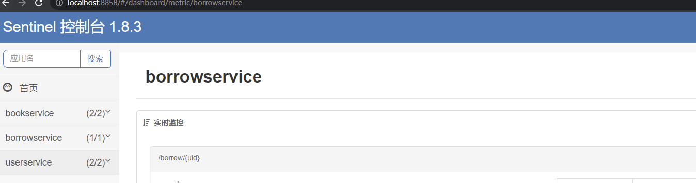
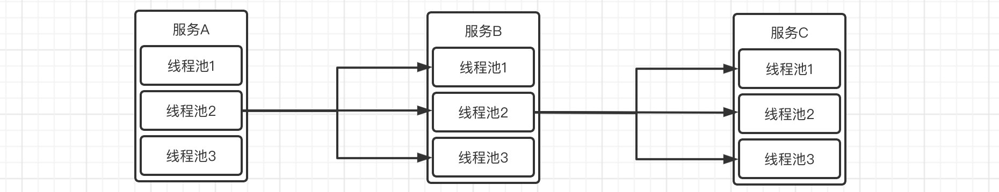

主要来自于青空の霞光学习的笔记，代码示例全部都成功 ---- [青空の霞光](https://www.bilibili.com/video/BV1AL4y1j7RY?p=9)

## Sentinel 流量防卫兵

**注意：**这一章有点小绕，思路理清。

经过之前的学习，我们了解了微服务存在的雪崩问题，也就是说一个微服务出现问题，有可能导致整个链路直接不可用，这种时候我们就需要进行及时的熔断和降级，这些策略，我们之前通过使用Hystrix来实现。

SpringCloud Alibaba也有自己的微服务容错组件，但是它相比Hystrix更加的强大。

我们来回顾一下什么是服务降级和服务熔断：

- 服务降级

  - > 服务降级指的是当服务器压力剧增的情况下，根据当前业务情况及流量对一些服务和页面有策略的降级，以此释放服务器资源以保证核心任务的正常运行。

- 服务熔断

  - > 微服务之间的数据交互是通过远程调用来完成的。服务A调用服务，服务B调用服务c，某一时间链路上对服务 C的调用响应时间过长或者服务C不可用，随着时间的增长，对服务C的调用也越来越多，然后服务C崩溃了，但是链路调用还在，对服务B的调用也在持续增多，然后服务B崩溃，随之A也崩溃，导致雪崩效应

    > 服务熔断是应对雪崩效应的一种微服务链路保护机制。例如在高压电路中，如果某个地方的电压过高，熔断器就会熔断，对电路进行保护。同样，在微服务架构中，熔断机制也是起着类似的作用。当调用链路的某个微服务不可用或者响应时间太长时，会进行服务熔断，不再有该节点微服务的调用，快速返回错误的响应信息。当检测到该节点微服务调用响应正常后，恢复调用链路。
    >
    > ————————————————

    > 版权声明：本文为CSDN博主「@Sup」的原创文章，遵循CC 4.0 BY-SA版权协议，转载请附上原文出处链接及本声明。
    > 原文链接：https://blog.csdn.net/qq_39144436/article/details/123781009

> 随着微服务的流行，服务和服务之间的稳定性变得越来越重要。Sentinel 以流量为切入点，从流量控制、熔断降级、系统负载保护等多个维度保护服务的稳定性。

Sentinel 具有以下特征:

- **丰富的应用场景**：Sentinel 承接了阿里巴巴近 10 年的双十一大促流量的核心场景，例如秒杀（即突发流量控制在系统容量可以承受的范围）、消息削峰填谷、集群流量控制、实时熔断下游不可用应用等。
- **完备的实时监控**：Sentinel 同时提供实时的监控功能。您可以在控制台中看到接入应用的单台机器秒级数据，甚至 500 台以下规模的集群的汇总运行情况。
- **广泛的开源生态**：Sentinel 提供开箱即用的与其它开源框架/库的整合模块，例如与 Spring Cloud、Apache Dubbo、gRPC、Quarkus 的整合。您只需要引入相应的依赖并进行简单的配置即可快速地接入 Sentinel。同时 Sentinel 提供 Java/Go/C++ 等多语言的原生实现。
- **完善的 SPI 扩展机制**：Sentinel 提供简单易用、完善的 SPI 扩展接口。您可以通过实现扩展接口来快速地定制逻辑。例如定制规则管理、适配动态数据源等。

### 安装与部署

和Nacos一样，它是独立安装和部署的，下载地址：https://github.com/alibaba/Sentinel/releases


注意下载下来之后是一个`jar`文件（其实就是个SpringBoot项目），我们需要在IDEA中添加一些运行配置：


接着就可以直接启动啦，当然默认端口占用8080，如果需要修改，可以添加环境变量：


启动之后，就可以访问到Sentinel的监控页面了，用户名和密码都是`sentinel`，地址：http://localhost:8858/#/dashboard


这样就成功开启监控页面了，接着我们需要让我们的所有服务连接到Sentinel控制台，导入客户端依赖：

```xml
<!-- sentinel 客户端 -->
<dependency>
    <groupId>com.alibaba.cloud</groupId>
    <artifactId>spring-cloud-starter-alibaba-sentinel</artifactId>
</dependency>
```

然后在配置文件中添加Sentinel相关信息（实际上Sentinel是本地在进行管理，但是我们可以连接到监控页面，这样就可以图形化操作了）：

```yaml
spring:
  application:
    name: userservice
  cloud:
    nacos:
      discovery:
        server-addr: localhost:8848
    sentinel:
      transport:
      	# 添加监控页面地址即可
        dashboard: localhost:8858
```

现在启动我们的服务，然后访问一次服务，这样Sentinel中就会存在信息了（懒加载机制，不会一上来就加载）：


现在我们就可以在Sentinel控制台中对我们的服务运行情况进行实时监控了，可以看到监控的内容非常的多，包括时间点、QPS(每秒查询率)、响应时间等数据。

按照上面的方式，我们将所有的服务全部连接到Sentinel管理面板中，注意我们的用户服务和图书服务有不同的集群，我们全部调用一遍将其连接到Sentinel中：



### 流量控制

前面我们完成了对Sentinel的搭建与连接，接着我们来看看Sentinel的第一个功能，流量控制。

我们的机器不可能无限制的接受和处理客户端的请求，如果不加以限制，当发生高并发情况时，系统资源将很快被耗尽。为了避免这种情况，我们就可以添加流量控制（也可以说是限流）当一段时间内的流量到达一定的阈值的时候，新的请求将不再进行处理，这样不仅可以合理地应对高并发请求，同时也能在一定程度上保护服务器不受到外界的恶意攻击。

那么要实现限流，正常情况下，我们该采取什么样的策略呢？

* 方案一：**快速拒绝**，既然不再接受新的请求，那么我们可以直接返回一个拒绝信息，告诉用户访问频率过高。
* 方案二：**预热**，依然基于方案一，但是由于某些情况下高并发请求是在某一时刻突然到来，我们可以缓慢地将阈值提高到指定阈值，形成一个缓冲保护。
* 方案三：**排队等待**，不接受新的请求，但是也不直接拒绝，而是进队列先等一下，如果规定时间内能够执行，那么就执行，要是超时就算了。

针对于是否超过流量阈值的判断，这里我们提4种算法：

1. **漏桶算法**

   顾名思义，就像一个桶开了一个小孔，水流进桶中的速度肯定是远大于水流出桶的速度的，这也是最简单的一种限流思路：

   

   我们知道，桶是有容量的，所以当桶的容量已满时，就装不下水了，这时就只有丢弃请求了。

   利用这种思想，我们就可以写出一个简单的限流算法。

2. **令牌桶算法**

   只能说有点像信号量机制。现在有一个令牌桶，这个桶是专门存放令牌的，每隔一段时间就向桶中丢入一个令牌（速度由我们指定）当新的请求到达时，将从桶中删除令牌，接着请求就可以通过并给到服务，但是如果桶中的令牌数量不足，那么不会删除令牌，而是让此数据包等待。

   

   可以试想一下，当流量下降时，令牌桶中的令牌会逐渐积累，这样如果突然出现高并发，那么就能在短时间内拿到大量的令牌。

3. **固定时间窗口算法**

   我们可以对某一个时间段内的请求进行统计和计数，比如在`14:15`到`14:16`这一分钟内，请求量不能超过`100`，也就是一分钟之内不能超过`100`次请求，那么就可以像下面这样进行划分：

   

   虽然这种模式看似比较合理，但是试想一下这种情况：

   * 14:15:59的时候来了100个请求
   * 14:16:01的时候又来了100个请求

   出现上面这种情况，符合固定时间窗口算法的规则，所以这200个请求都能正常接受，但是，如果你反应比较快，应该发现了，我们其实希望的是60秒内只有100个请求，但是这种情况却是在3秒内出现了200个请求，很明显已经违背了我们的初衷。

   因此，当遇到临界点时，固定时间窗口算法存在安全隐患。

4. **滑动时间窗口算法**

   相对于固定窗口算法，滑动时间窗口算法更加灵活，它会动态移动窗口，重新进行计算：

   

   虽然这样能够避免固定时间窗口的临界问题，但是这样显然是比固定窗口更加耗时的。

好了，了解完了我们的限流策略和判定方法之后，我们在Sentinel中进行实际测试一下，打开管理页面的簇点链路模块：


这里演示对我们的借阅接口进行限流，点击`流控`，会看到让我们添加流控规则：

* 阈值类型：QPS就是每秒钟的请求数量，并发线程数是按服务当前使用的线程数据进行统计的。
* 流控模式：当达到阈值时，流控的对象，这里暂时只用直接。
* 流控效果：就是我们上面所说的三种方案。

这里我们选择`QPS`、阈值设定为`1`，流控模式选择`直接`、流控效果选择`快速失败`，可以看到，当我们快速地进行请求时，会直接返回失败信息：


这里各位最好自行尝试一下其他的流控效果，熟悉和加深印象。

最后我们来看看这些流控模式有什么区别：

* 直接：只针对于当前接口。
* 关联：当其他接口超过阈值时，会导致当前接口被限流。
* 链路：更细粒度的限流，能精确到具体的方法。

我们首先来看看关联，比如现在我们对自带的`/error`接口进行限流：


注意限流是作用于关联资源的，一旦发现关联资源超过阈值，那么就会对当前的资源进行限流，我们现在来测试一下，这里使用PostMan的Runner连续对关联资源发起请求：


开启Postman，然后我们会发现借阅服务已经凉凉：


当我们关闭掉Postman的任务后，恢复正常。

最后我们来讲解一下链路模式，它能够更加精准的进行流量控制，链路流控模式指的是，当从指定接口过来的资源请求达到限流条件时，开启限流，这里得先讲解一下`@SentinelResource`的使用。

我们可以对某一个方法进行限流控制，无论是谁在何处调用了它，这里需要使用到`@SentinelResource`，一旦方法被标注，那么就会进行监控，比如我们这里创建两个请求映射，都来调用Service的被监控方法：

```java
@RestController
public class BorrowController {

    @Resource
    BorrowService service;

    @RequestMapping("/borrow/{uid}")
    UserBorrowDetail findUserBorrows(@PathVariable("uid") int uid){
        return service.getUserBorrowDetailByUid(uid);
    }

    @RequestMapping("/borrow2/{uid}")
    UserBorrowDetail findUserBorrows2(@PathVariable("uid") int uid){
        return service.getUserBorrowDetailByUid(uid);
    }
}
```

```java
@Service
public class BorrowServiceImpl implements BorrowService{

    @Resource
    BorrowMapper mapper;

    @Resource
    UserClient userClient;

    @Resource
    BookClient bookClient;

    @Override
    @SentinelResource("getBorrow")   //监控此方法，无论被谁执行都在监控范围内，这里给的value是自定义名称，这个注解可以加在任何方法上，包括Controller中的请求映射方法，跟HystrixCommand贼像
    public UserBorrowDetail getUserBorrowDetailByUid(int uid) {
        List<Borrow> borrow = mapper.getBorrowsByUid(uid);
        User user = userClient.getUserById(uid);
        List<Book> bookList = borrow
                .stream()
                .map(b -> bookClient.getBookById(b.getBid()))
                .collect(Collectors.toList());
        return new UserBorrowDetail(user, bookList);
    }
}
```

接着添加配置：

```yaml
spring:
  application:
    name: borrowservice
  cloud:
    sentinel:
      transport:
        dashboard: localhost:8858
      # 关闭Context收敛，这样被监控方法可以进行不同链路的单独控制
      web-context-unify: false
```

然后我们在Sentinel控制台中添加流控规则，注意是针对此方法，可以看到已经自动识别到borrow接口下调用了这个方法：


最后我们在浏览器中对这两个接口都进行测试，会发现，无论请求哪个接口，只要调用了Service中的`getUserBorrowDetailByUid`这个方法，都会被限流。注意限流的形式是后台直接抛出异常，至于怎么处理我们后面再说。

那么这个链路选项实际上就是决定只限流从哪个方向来的调用，比如我们只对`borrow2`这个接口对`getUserBorrowDetailByUid`方法的调用进行限流，那么我们就可以为其指定链路：


然后我们会发现，限流效果只对我们配置的链路接口有效，而其他链路是不会被限流的。

除了直接对接口进行限流规则控制之外，我们也可以根据当前系统的资源使用情况，决定是否进行限流：


系统规则支持以下的模式：

- **Load 自适应**（仅对 Linux/Unix-like 机器生效）：系统的 load1 作为启发指标，进行自适应系统保护。当系统 load1 超过设定的启发值，且系统当前的并发线程数超过估算的系统容量时才会触发系统保护（BBR 阶段）。系统容量由系统的 `maxQps * minRt` 估算得出。设定参考值一般是 `CPU cores * 2.5`。
- **CPU usage**（1.5.0+ 版本）：当系统 CPU 使用率超过阈值即触发系统保护（取值范围 0.0-1.0），比较灵敏。
- **平均 RT**：当单台机器上所有入口流量的平均 RT 达到阈值即触发系统保护，单位是毫秒。
- **并发线程数**：当单台机器上所有入口流量的并发线程数达到阈值即触发系统保护。
- **入口 QPS**：当单台机器上所有入口流量的 QPS 达到阈值即触发系统保护。

这里就不进行演示了。

### 限流和异常处理

现在我们已经了解了如何进行限流操作，那么限流状态下的返回结果该怎么修改呢，我们看到被限流之后返回的是Sentinel默认的数据，现在我们希望自定义改如何操作？

这里我们先创建好被限流状态下需要返回的内容，定义一个请求映射：

```java
@RequestMapping("/blocked")
JSONObject blocked(){
    JSONObject object = new JSONObject();
    object.put("code", 403);
    object.put("success", false);
    object.put("massage", "您的请求频率过快，请稍后再试！");
    return object;
}
```

接着我们在配置文件中将此页面设定为限流页面：

```yaml
spring:
  cloud:
    sentinel:
      transport:
        dashboard: localhost:8858
      # 将刚刚编写的请求映射设定为限流页面
      block-page: /blocked
```

这样，当被限流时，就会被重定向到指定页面：


那么，对于方法级别的限流呢？经过前面的学习我们知道，当某个方法被限流时，会直接在后台抛出异常，那么这种情况我们该怎么处理呢，比如我们之前在Hystrix中可以直接添加一个替代方案，这样当出现异常时会直接执行我们的替代方法并返回，Sentinel也可以。

比如我们还是在`getUserBorrowDetailByUid`方法上进行配置：

```java
@Override
@SentinelResource(value = "getBorrow", blockHandler = "blocked")   //指定blockHandler，也就是被限流之后的替代解决方案，这样就不会使用默认的抛出异常的形式了
public UserBorrowDetail getUserBorrowDetailByUid(int uid) {
    List<Borrow> borrow = mapper.getBorrowsByUid(uid);
    User user = userClient.getUserById(uid);
    List<Book> bookList = borrow
            .stream()
            .map(b -> bookClient.getBookById(b.getBid()))
            .collect(Collectors.toList());
    return new UserBorrowDetail(user, bookList);
}

//替代方案，注意参数和返回值需要保持一致，并且参数最后还需要额外添加一个BlockException
public UserBorrowDetail blocked(int uid, BlockException e) {
    return new UserBorrowDetail(null, Collections.emptyList());
}
```

可以看到，一旦被限流将执行替代方案，最后返回的结果就是：


注意`blockHandler`只能处理限流情况下抛出的异常，包括下面即将要介绍的热点参数限流也是同理，如果是方法本身抛出的其他类型异常，不在管控范围内，但是可以通过其他参数进行处理：

```java
@RequestMapping("/test")
@SentinelResource(value = "test",
        fallback = "except",    //fallback指定出现异常时的替代方案
        exceptionsToIgnore = IOException.class)  //忽略那些异常，也就是说这些异常出现时不使用替代方案
String test(){
    throw new RuntimeException("HelloWorld！");
}

//替代方法必须和原方法返回值和参数一致，最后可以添加一个Throwable作为参数接受异常
String except(Throwable t){
    return t.getMessage();
}
```

这样，其他的异常也可以有替代方案了：


特别注意这种方式会在没有配置`blockHandler`的情况下，将Sentinel机制内（也就是限流的异常）的异常也一并处理了，如果配置了`blockHandler`，那么在出现限流时，依然只会执行`blockHandler`指定的替代方案（因为限流是在方法执行之前进行的）

### 热点参数限流

我们还可以对某一热点数据进行精准限流，比如在某一时刻，不同参数被携带访问的频率是不一样的：

* http://localhost:8301/test?a=10  访问100次
* http://localhost:8301/test?b=10  访问0次
* http://localhost:8301/test?c=10  访问3次

由于携带参数`a`的请求比较多，我们就可以只对携带参数`a`的请求进行限流。

这里我们创建一个新的测试请求映射：

```java
@RequestMapping("/test")
@SentinelResource("test")   //注意这里需要添加@SentinelResource才可以，用户资源名称就使用这里定义的资源名称
String findUserBorrows2(@RequestParam(value = "a", required = false) int a,
                        @RequestParam(value = "b", required = false) int b,
                        @RequestParam(value = "c",required = false) int c) {
    return "请求成功！a = "+a+", b = "+b+", c = "+c;
}
```

启动之后，我们在Sentinel里面进行热点配置：


然后开始访问我们的测试接口，可以看到在携带参数a时，当访问频率超过设定值，就会直接被限流，这里是直接在后台抛出异常：


而我们使用其他参数或是不带`a`参数，那么就不会出现这种问题了：


除了直接对某个参数精准限流外，我们还可以对参数携带的指定值单独设定阈值，比如我们现在不仅希望对参数`a`限流，而且还希望当参数`a`的值为10时，QPS达到5再进行限流，那么就可以设定例外：


这样，当请求携带参数`a`，且参数`a`的值为10时，阈值将按照我们指定的特例进行计算。

### 服务熔断和降级

还记得我们前所说的服务降级吗，也就是说我们需要在整个微服务调用链路出现问题的时候，及时对服务进行降级，以防止问题进一步恶化。


那么，各位是否有思考过，如果在某一时刻，服务B出现故障（可能就卡在那里了），而这时服务A依然有大量的请求，在调用服务B，那么，由于服务A没办法再短时间内完成处理，新来的请求就会导致线程数不断地增加，这样，CPU的资源很快就会被耗尽。

那么要防止这种情况，就只能进行隔离了，这里我们提两种隔离方案：

1. **线程池隔离**

   线程池隔离实际上就是对每个服务的远程调用单独开放线程池，比如服务A要调用服务B，那么只基于固定数量的线程池，这样即使在短时间内出现大量请求，由于没有线程可以分配，所以就不会导致资源耗尽了。

   

2. **信号量隔离**

   信号量隔离是使用`Semaphore`类实现的（如果不了解，可以观看本系列 并发编程篇 视频教程），思想基本上与上面是相同的，也是限定指定的线程数量能够同时进行服务调用，但是它相对于线程池隔离，开销会更小一些，使用效果同样优秀，也支持超时等。

   Sentinel也正是采用的这种方案实现隔离的。

好了，说回我们的熔断和降级，当下游服务因为某种原因变得不可用或响应过慢时，上游服务为了保证自己整体服务的可用性，不再继续调用目标服务而是快速返回或是执行自己的替代方案，这便是服务降级。


整个过程分为三个状态：

* 关闭：熔断器不工作，所有请求全部该干嘛干嘛。
* 打开：熔断器工作，所有请求一律降级处理。
* 半开：尝试进行一下下正常流程，要是还不行继续保持打开状态，否则关闭。

那么我们来看看Sentinel中如何进行熔断和降级操作，打开管理页面，我们可以自由新增熔断规则：


其中，熔断策略有三种模式：

1. **慢调用比例：**如果出现那种半天都处理不完的调用，有可能就是服务出现故障，导致卡顿，这个选项是按照最大响应时间（RT）进行判定，如果一次请求的处理时间超过了指定的RT，那么就被判定为`慢调用`，在一个统计时长内，如果请求数目大于最小请求数目，并且被判定为`慢调用`的请求比例已经超过阈值，将触发熔断。经过熔断时长之后，将会进入到半开状态进行试探（这里和Hystrix一致）

   然后修改一下接口的执行，我们模拟一下慢调用：

   ```java
   @RequestMapping("/borrow2/{uid}")
   UserBorrowDetail findUserBorrows2(@PathVariable("uid") int uid) throws InterruptedException {
       Thread.sleep(1000);
       return null;
   }
   ```

   重启，然后我们创建一个新的熔断规则：

   

   可以看到，超时直接触发了熔断，进入到阻止页面：

   

2. **异常比例：**这个与慢调用比例类似，不过这里判断的是出现异常的次数，与上面一样，我们也来进行一些小测试：

   ```java
   @RequestMapping("/borrow2/{uid}")
   UserBorrowDetail findUserBorrows2(@PathVariable("uid") int uid) {
       throw new RuntimeException();
   }
   ```

   启动服务器，接着添加我们的熔断规则：

   

   现在我们进行访问，会发现后台疯狂报错，然后就熔断了：

   

   

3. **异常数：**这个和上面的唯一区别就是，只要达到指定的异常数量，就熔断，这里我们修改一下熔断规则：

   

   现在我们再次不断访问此接口，可以发现，效果跟之前其实是差不多的，只是判断的策略稍微不同罢了：

   

那么熔断规则如何设定我们了解了，那么，如何自定义服务降级呢？之前在使用Hystrix的时候，如果出现异常，可以执行我们的替代方案，Sentinel也是可以的。

同样的，我们只需要在`@SentinelResource`中配置`blockHandler`参数（那这里跟前面那个方法限流的配置不是一毛一样吗？没错，因为如果添加了`@SentinelResource`注解，那么这里会进行方法级别细粒度的限制，和之前方法级别限流一样，会在降级之后直接抛出异常，如果不添加则返回默认的限流页面，`blockHandler`的目的就是处理这种Sentinel机制上的异常，所以这里其实和之前的限流配置是一个道理，因此下面熔断配置也应该对`value`自定义名称的资源进行配置，才能作用到此方法上）：

```java
@RequestMapping("/borrow2/{uid}")
@SentinelResource(value = "findUserBorrows2", blockHandler = "test")
UserBorrowDetail findUserBorrows2(@PathVariable("uid") int uid) {
    throw new RuntimeException();
}

UserBorrowDetail test(int uid, BlockException e){
    return new UserBorrowDetail(new User(), Collections.emptyList());
}
```

接着我们对进行熔断配置，注意是对我们添加的`@SentinelResource`中指定名称的`findUserBorrows2`进行配置：


OK，可以看到熔断之后，服务降级之后的效果：


最后我们来看一下如何让Feign的也支持Sentinel，前面我们使用Hystrix的时候，就可以直接对Feign的每个接口调用单独进行服务降级，而使用Sentinel，也是可以的，首先我们需要在配置文件中开启支持：

```yml
feign:
  sentinel:
    enabled: true
```

之后的步骤其实和之前是一模一样的，首先创建实现类：

```java
@Component
public class UserClientFallback implements UserClient{
    @Override
    public User getUserById(int uid) {
        User user = new User();
        user.setName("我是替代方案");
        return user;
    }
}
```

然后直接启动就可以了，中途的时候我们吧用户服务全部下掉，可以看到正常使用替代方案：


这样Feign的配置就OK了，那么传统的RestTemplate呢？我们可以使用`@SentinelRestTemplate`注解实现：

```java
  @Bean
  @LoadBalanced
  @SentinelRestTemplate(blockHandler = "handleException", blockHandlerClass = ExceptionUtil.class,
      fallback = "fallback", fallbackClass = ExceptionUtil.class) //这里同样可以设定fallback等参数
  public RestTemplate restTemplate() {
    return new RestTemplate();
  }
```

这里就不多做赘述了。

***

