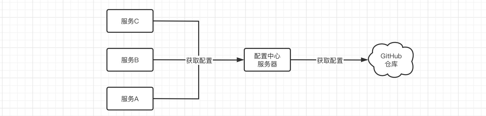
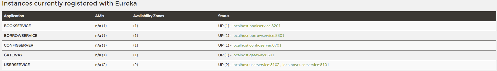
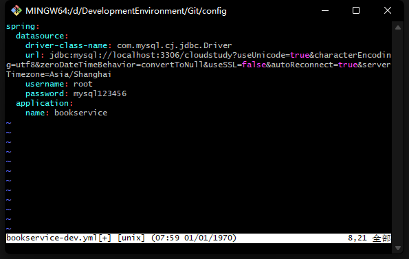
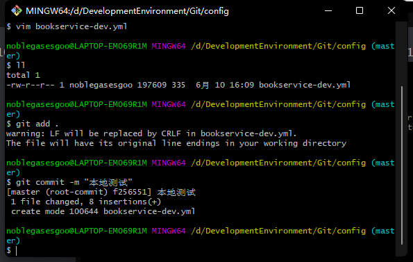
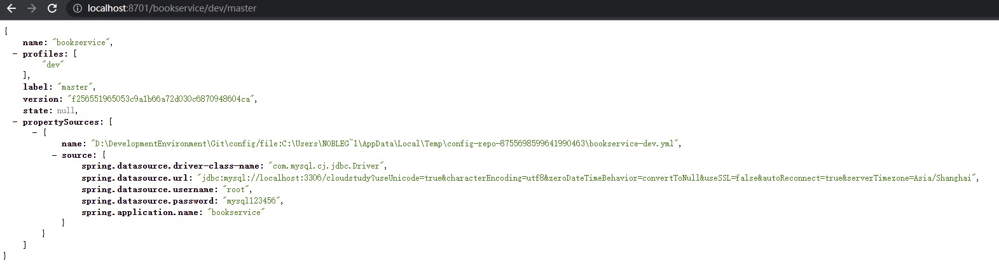
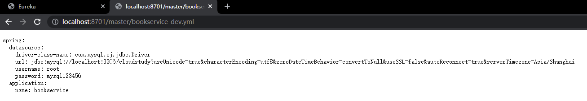
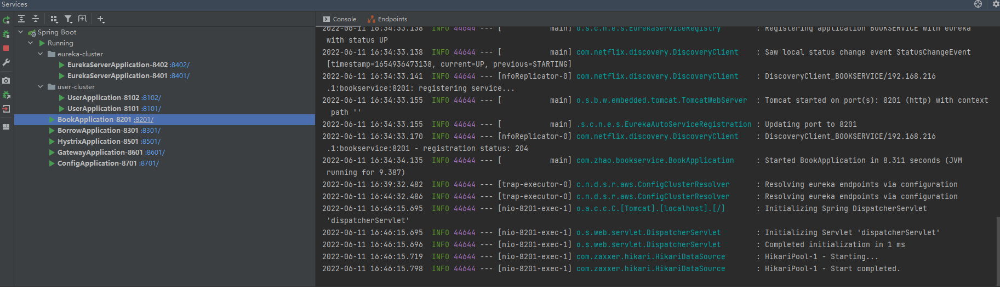
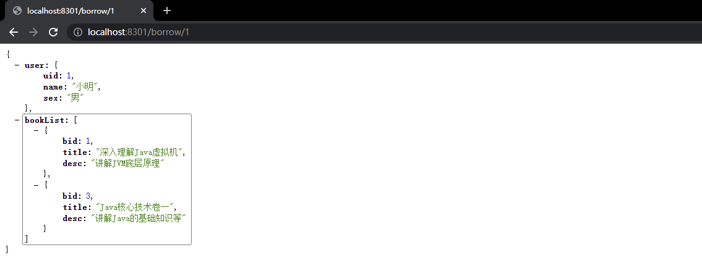

> 主要来自于青空の霞光学习的笔记，代码示例全部都成功 ---- [青空の霞光](https://www.bilibili.com/video/BV1AL4y1j7RY?p=9)

## Config 配置中心

**官方文档：**https://docs.spring.io/spring-cloud-config/docs/current/reference/html/

经过前面的学习，我们对于一个分布式应用的技术选型和搭建已经了解得比较多了，但是各位有没有发现一个问题，如果我们的微服务项目需要部署很多个实例，那么配置文件我们岂不是得一个一个去改，可能十几个实例还好，要是有几十个上百个呢？那我们一个一个去配置，岂不直接猝死在工位上。

所以，我们需要一种更加高级的集中化地配置文件管理工具，集中地对配置文件进行配置。

> Spring Cloud Config 为分布式系统中的外部配置提供服务器端和客户端支持。使用 Config Server，您可以集中管理所有环境中应用程序的外部配置。



实际上Spring Cloud Config就是一个配置中心，所有的服务都可以从配置中心取出配置，而配置中心又可以从GitHub远程仓库中获取云端的配置文件，这样我们只需要修改GitHub中的配置即可对所有的服务进行配置管理了。

### 部署配置中心

这里我们接着创建一个新的项目，并导入依赖：

```xml
<dependencies>
    <dependency>
        <groupId>org.springframework.cloud</groupId>
        <artifactId>spring-cloud-config-server</artifactId>
    </dependency>
  	<dependency>
        <groupId>org.springframework.cloud</groupId>
        <artifactId>spring-cloud-starter-netflix-e ureka-client</artifactId>
    </dependency>
</dependencies>
```

老规矩，启动类：

```java
@SpringBootApplication
@EnableConfigServer
public class ConfigApplication {
    public static void main(String[] args) {
        SpringApplication.run(ConfigApplication.class, args);
    }
}
```

接着就是配置文件：

```yaml
server:
  port: 8700
spring:
  application:
    name: configserver
eureka:
  client:
    service-url:
      defaultZone: http://localhost:8401/eureka, http://localhost:8402/eureka
```

先启动一次看看，能不能成功：



这里我们以本地仓库为例，首先在项目目录下创建一个本地Git仓库，打开终端，在桌面上创建一个新的本地仓库：

然后我们在文件夹中随便创建一些配置文件，注意名称最好是{服务名称}-{环境}.yml：





然后我们在配置文件中，添加本地仓库的一些信息（远程仓库同理），详细使用教程：https://docs.spring.io/spring-cloud-config/docs/current/reference/html/#_git_backend

```yaml
spring:
  application:
    name: configserver
  cloud:
    config:
      server:
        git:
          # 这里填写的是本地仓库地址，远程仓库直接填写远程仓库地址 http://git...
          uri: xxxx
          # 默认分支设定为你自己本地或是远程分支的名称
          default-label: master
```

然后启动我们的配置服务器，通过以下格式进行访问：

* http://localhost:8701/{服务名称}/{环境}/{Git分支}
* http://localhost:8701/{Git分支}/{服务名称}-{环境}.yml

比如我们要访问图书服务的生产环境代码，可以使用 http://localhost:8701/bookservice/dev/master 链接，它会显示详细信息：



也可以使用 http://localhost:8701/master/bookservice-dev.yml链接，它仅显示配置文件原文：



当然，除了使用Git来保存之外，还支持一些其他的方式，详细情况请查阅官网。

### 客户端配置

服务端配置完成之后，我们接着来配置一下客户端，那么现在我们的服务既然需要从服务器读取配置文件，那么就需要进行一些配置，我们删除原来的`application.yml`文件（也可以保留，最后无论是远端配置还是本地配置都会被加载），改用`bootstrap.yml`（在application.yml之前加载，可以实现配置文件远程获取）：

```xml
<dependency>
    <groupId>org.springframework.cloud</groupId>
    <artifactId>spring-cloud-starter-config</artifactId>
</dependency>

<dependency>
    <groupId>org.springframework.cloud</groupId>
    <artifactId>spring-cloud-starter-bootstrap</artifactId>
</dependency>
```

```yaml
spring:
  cloud:
    config:
      # 名称，其实就是文件名称
      name: bookservice
      # 配置服务器的地址
      uri: http://localhost:8701
      # 环境
      profile: dev
      # 分支
      label: master
```

配置完成之后，启动图书服务：



可以看到已经从远端获取到了配置，并进行启动。

