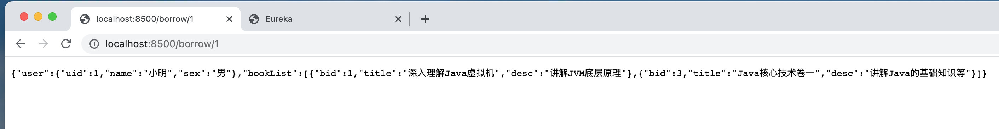

> 主要来自于青空の霞光学习的笔记，代码示例全部都成功 ---- [青空の霞光](https://www.bilibili.com/video/BV1AL4y1j7RY?p=9)

## Gateway 路由网关

官网地址：https://docs.spring.io/spring-cloud-gateway/docs/current/reference/html/

说到路由，想必各位一定最先想到的就是家里的路由器了，那么我们家里的路由器充当的是一个什么角色呢？

我们知道，如果我们需要连接互联网，那么就需要将手机或是电脑连接到家里的路由器才可以，而路由器则连接光猫，光猫再通过光纤连接到互联网，也就是说，互联网方向发送过来的数据，需要经过路由器才能到达我们的设备。而路由器充当的就是数据包中转站，所有的局域网设备都无法直接与互联网连接，而是需要经过路由器进行中转，我们一般说路由器下的网络是内网，而互联网那一端是外网。


我们的局域网设备，无法被互联网上的其他设备直接访问，肯定是能够保证到安全性的。并互联网发送过来的数据，需要经过路由器进行解析，识别到底是哪一个设备的数据包，然后再发送给对应的设备。

而我们的微服务也是这样，一般情况下，可能并不是所有的微服务都需要直接暴露给外部调用，这时我们就可以使用路由机制，添加一层防护，让所有的请求全部通过路由来转发到各个微服务，并且转发给多个相同微服务实例也可以实现负载均衡。


在之前，路由的实现一般使用Zuul，但是已经停更，而现在新出现了由SpringCloud官方开发的Gateway路由，它相比Zuul不仅性能上得到了一定的提升，并且是官方推出，契合性也会更好，所以我们这里就主要讲解Gateway。

### 部署网关

现在我们来创建一个新的项目，作为我们的网关，这里需要添加两个依赖：

```xml
<dependencies>
    <dependency>
        <groupId>org.springframework.cloud</groupId>
        <artifactId>spring-cloud-starter-gateway</artifactId>
    </dependency>
    <dependency>
        <groupId>org.springframework.cloud</groupId>
        <artifactId>spring-cloud-starter-netflix-eureka-client</artifactId>
    </dependency>
</dependencies>
```

第一个依赖就是网关的依赖，而第二个则跟其他微服务一样，需要注册到Eureka才能生效，注意别添加Web依赖，使用的是WebFlux框架。

然后我们来完善一下配置文件：

```yaml
server:
  port: 8601
eureka:
  client:
    service-url: 
      defaultZone: http://localhost:8401/eureka, http://localhost:8402/eureka
spring:
  application:
    name: gateway
```

现在就可以启动了：


但是现在还没有配置任何的路由功能，我们接着将路由功能进行配置：

```yaml
  cloud:
    gateway:
    	# 配置路由，注意这里是个列表，每一项都包含了很多信息
      routes:
        - id: borrow-service   # 路由名称
          uri: lb://borrowservice  # 路由的地址，lb表示使用负载均衡到微服务，也可以使用http正常转发
          predicates: # 路由规则，断言什么请求会被路由
            - Path=/borrow/**  # 只要是访问的这个路径，一律都被路由到上面指定的服务
```

路由规则的详细列表（断言工厂列表）在这里：https://docs.spring.io/spring-cloud-gateway/docs/current/reference/html/#gateway-request-predicates-factories，可以指定多种类型，包括指定时间段、Cookie携带情况、Header携带情况、访问的域名地址、访问的方法、路径、参数、访问者IP等。也可以使用配置类进行配置，但是还是推荐直接配置文件，省事。

接着启动网关，搭载Arm架构芯片的Mac电脑可能会遇到这个问题：


这是因为没有找到适用于此架构的动态链接库，不影响使用，无视即可，希望以后的版本能修复吧。

可以看到，我们现在可以直接通过路由来访问我们的服务了：



注意此时依然可以通过原有的服务地址进行访问：


这样我们就可以将不需要外网直接访问的微服务全部放到内网环境下，而只依靠网关来对外进行交涉。

### 路由过滤器

路由过滤器支持以某种方式修改传入的 HTTP 请求或传出的 HTTP 响应，路由过滤器的范围是某一个路由，跟之前的断言一样，Spring Cloud Gateway 也包含许多内置的路由过滤器工厂，详细列表：https://docs.spring.io/spring-cloud-gateway/docs/current/reference/html/#gatewayfilter-factories

比如我们现在希望在请求到达时，在请求头中添加一些信息再转发给我们的服务，那么这个时候就可以使用路由过滤器来完成，我们只需要对配置文件进行修改：

```yaml
spring:
  application:
    name: gateway
  cloud:
    gateway:
      routes:
      - id: borrow-service
        uri: lb://borrowservice
        predicates:
        - Path=/borrow/**
      # 继续添加新的路由配置，这里就以书籍管理服务为例
      # 注意-要对齐routes:
      - id: book-service
        uri: lb://bookservice
        predicates:
        - Path=/book/**
        filters:   # 添加过滤器
        - AddRequestHeader=Test, HelloWorld!
        # AddRequestHeader 就是添加请求头信息，其他工厂请查阅官网
```

接着我们在BookController中获取并输出一下，看看是不是成功添加了：

```java
@RestController
public class BookController {

    @Resource
    BookService service;

    @RequestMapping("/book/{bid}")
    Book findBookById(@PathVariable("bid") int bid,
                      HttpServletRequest request){
        System.out.println(request.getHeader("Test"));
        return service.getBookById(bid);
    }
}
```

现在我们通过Gateway访问我们的图书管理服务：


可以看到这里成功获取到由网关添加的请求头信息了。

除了针对于某一个路由配置过滤器之外，我们也可以自定义全局过滤器，它能够作用于全局。但是我们需要通过代码的方式进行编写，比如我们要实现拦截没有携带指定请求参数的请求：

```java
@Component   //需要注册为Bean
public class TestFilter implements GlobalFilter {
    @Override
    public Mono<Void> filter(ServerWebExchange exchange, GatewayFilterChain chain) {   //只需要实现此方法
        return null;
    }
}
```

接着我们编写判断：

```java
@Override
public Mono<Void> filter(ServerWebExchange exchange, GatewayFilterChain chain) {
    //先获取ServerHttpRequest对象，注意不是HttpServletRequest
    ServerHttpRequest request = exchange.getRequest();
    //打印一下所有的请求参数
    System.out.println(request.getQueryParams());
    //判断是否包含test参数，且参数值为1
    List<String> value = request.getQueryParams().get("test");
    if(value != null && value.contains("1")) {
        //将ServerWebExchange向过滤链的下一级传递（跟JavaWeb中介绍的过滤器其实是差不多的）
        return chain.filter(exchange);
    }else {
        //直接在这里不再向下传递，然后返回响应
        return exchange.getResponse().setComplete();
    }
}
```

可以看到结果：


成功实现规则判断和拦截操作。

当然，过滤器肯定是可以存在很多个的，所以我们可以手动指定过滤器之间的顺序：

```java
@Component
public class TestFilter implements GlobalFilter, Ordered {   //实现Ordered接口
  
    @Override
    public int getOrder() {
        return 0;
    }
```

注意Order的值越小优先级越高，并且无论是在配置文件中编写的单个路由过滤器还是全局路由过滤器，都会受到Order值影响（单个路由的过滤器Order值按从上往下的顺序从1开始递增），最终是按照Order值决定哪个过滤器优先执行，当Order值一样时 全局路由过滤器执行 `优于` 单独的路由过滤器执行。