> 本篇部分青空の霞光学习的笔记，代码示例全部都成功 ---- [青空の霞光](https://www.bilibili.com/video/BV1AL4y1j7RY?p=9)，本人都尝试过所有内容，但是没来得及记笔记，就使用霞光大大的笔记了。

## Eureka 注册中心

官方文档：https://docs.spring.io/spring-cloud-netflix/docs/current/reference/html/

**小贴士：**各位小伙伴在学习的过程中觉得有什么疑惑的可以直接查阅官方文档，我们会在每一个技术开始之前贴上官方文档的地址，方便各位进行查阅，同时在我们的课程中并不一定会完完整整地讲完整个框架的内容，有关详细的功能和使用方法文档中也是写的非常清楚的，感兴趣的可以深入学习哦。

### 微服务项目结构

现在我们重新设计一下之前的图书管理系统项目，将原有的大型（也许 项目进行拆分，注意项目拆分一定要尽可能保证单一职责，相同的业务不要在多个微服务中重复出现，如果出现需要借助其他业务完成的服务，那么可以使用服务之间相互调用的形式来实现（之后会介绍）：

* 登录验证服务：用于处理用户注册、登录、密码重置等，反正就是一切与账户相关的内容，包括用户信息获取等。
* 图书管理服务：用于进行图书添加、删除、更新等操作，图书管理相关的服务，包括图书的存储等和信息获取。
* 图书借阅服务：交互性比较强的服务，需要和登陆验证服务和图书管理服务进行交互。

那么既然要将单体应用拆分为多个小型服务，我们就需要重新设计一下整个项目目录结构，这里我们就创建多个子项目，每一个子项目都是一个服务，这样由父项目统一管理依赖，就无需每个子项目都去单独管理依赖了，也更方便一点。

我们首先创建一个普通的SpringBoot项目：

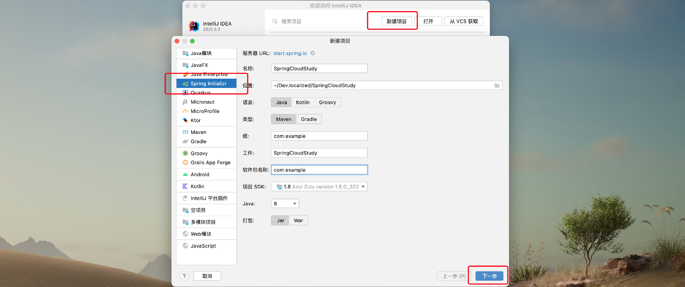

然后不需要勾选任何依赖，直接创建即可，项目创建完成并初始化后，我们删除父工程的无用文件，只保留必要文件，像下面这样：

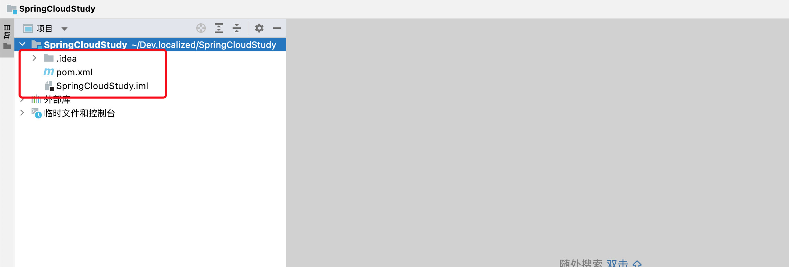

接着我们就可以按照我们划分的服务，进行子工程创建了，创建一个新的Maven项目，注意父项目要指定为我们一开始创建的的项目，子项目命名随意：

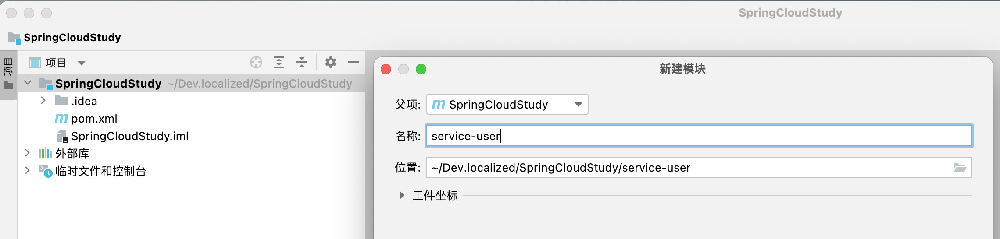

子项目创建好之后，接着我们在子项目中创建SpringBoot的启动主类：

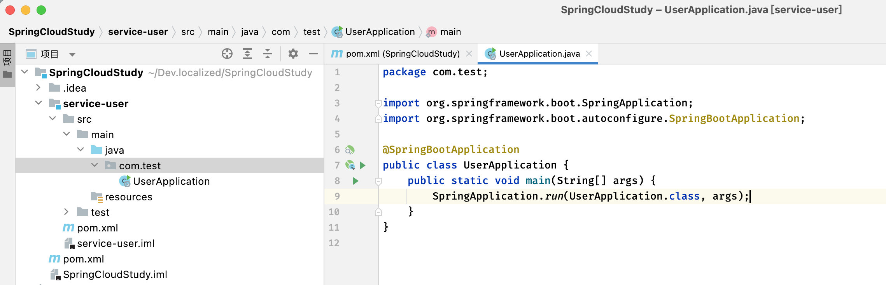

接着我们点击运行，即可启动子项目了，实际上这个子项目就一个最简单的SpringBoot web项目，注意启动之后最下方有弹窗，我们点击"使用 服务"，这样我们就可以实时查看当前整个大项目中有哪些微服务了：

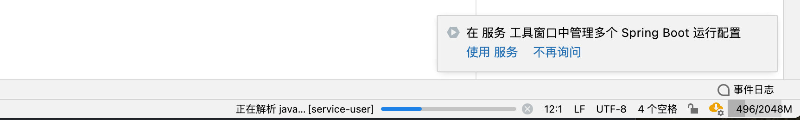

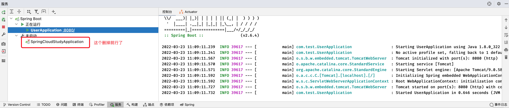

接着我们以同样的方法，创建其他的子项目，注意我们最好将其他子项目的端口设置得不一样，不然会导致端口占用，我们分别为它们创建`application.yml`文件：

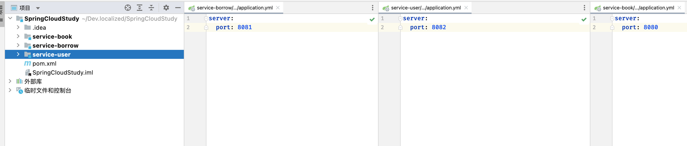

接着我们来尝试启动一下这三个服务，正常情况下都是可以直接启动的：

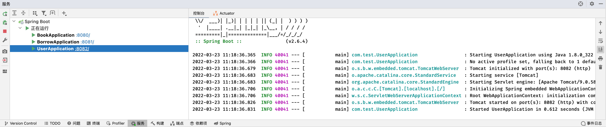

可以看到它们分别运行在不同的端口上，这样，就方便不同的程序员编写不同的服务了，提交当前项目代码时的冲突率也会降低。

接着我们来创建一下数据库，这里还是老样子，创建三个表即可，当然实际上每个微服务单独使用一个数据库服务器也是可以的，因为按照单一职责服务只会操作自己对应的表，这里UP主比较穷，就只用一个数据库演示了：

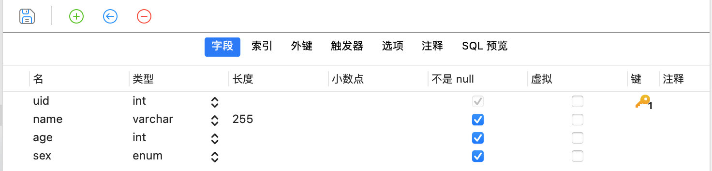

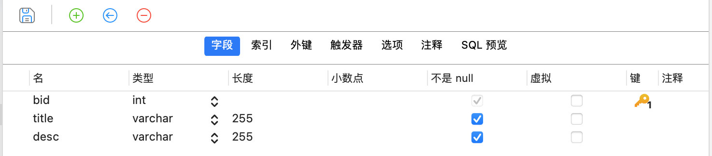

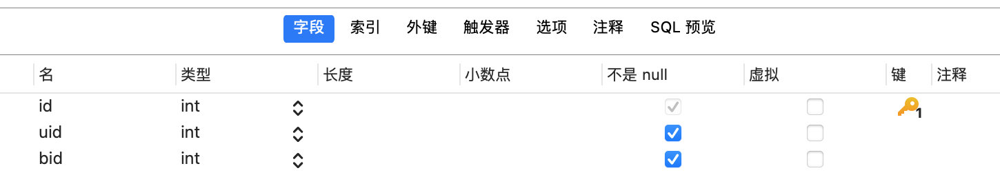

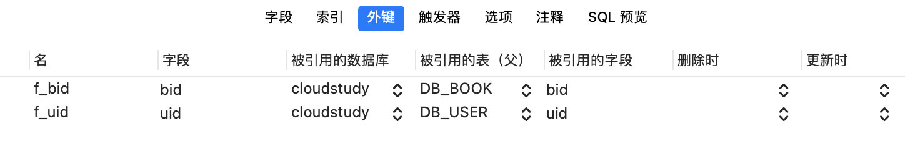

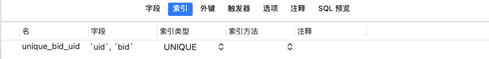

创建好之后，结果如下，一共三张表，各位可以自行添加一些数据到里面，这就不贴出来了：

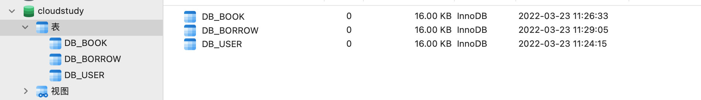

如果各位嫌麻烦的话可以下载`.sql`文件自行导入。

接着我们来稍微写一点业务，比如用户信息查询业务，我们先把数据库相关的依赖进行导入，这里依然使用Mybatis框架，首先在父项目中添加MySQL驱动和Lombok依赖：

```xml
<dependency>
    <groupId>mysql</groupId>
    <artifactId>mysql-connector-java</artifactId>
</dependency>

<dependency>
     <groupId>org.projectlombok</groupId>
     <artifactId>lombok</artifactId>
</dependency>
```

由于不是所有的子项目都需要用到Mybatis，我们在父项目中只进行版本管理即可：

```xml
<dependencyManagement>
    <dependencies>
        <dependency>
            <groupId>org.mybatis.spring.boot</groupId>
            <artifactId>mybatis-spring-boot-starter</artifactId>
            <version>2.2.0</version>
        </dependency>
    </dependencies>
</dependencyManagement>
```

接着我们就可以在用户服务子项目中添加此依赖了：

```xml
<dependencies>
    <dependency>
        <groupId>org.mybatis.spring.boot</groupId>
        <artifactId>mybatis-spring-boot-starter</artifactId>
    </dependency>
</dependencies>
```

接着添加数据源信息（UP用到是阿里云的MySQL云数据库，各位注意修改一下数据库地址）：

```yaml
spring:
  datasource:
    driver-class-name: com.mysql.cj.jdbc.Driver
    url: jdbc:mysql://cloudstudy.mysql.cn-chengdu.rds.aliyuncs.com:3306/cloudstudy
    username: test
    password: 123456
```

接着我们来写用户查询相关的业务：

```java
@Data
public class User {
    int uid;
    String name;
    String sex;
}
```

```java
@Mapper
public interface UserMapper {
    @Select("select * from DB_USER where uid = #{uid}")
    User getUserById(int uid);
}
```

```java
public interface UserService {
    User getUserById(int uid);
}
```

```java
@Service
public class UserServiceImpl implements UserService {

    @Resource
    UserMapper mapper;

    @Override
    public User getUserById(int uid) {
        return mapper.getUserById(uid);
    }
}
```

```java
@RestController
public class UserController {

    @Resource
    UserService service;

    //这里以RESTFul风格为例
    @RequestMapping("/user/{uid}")
    public User findUserById(@PathVariable("uid") int uid){
        return service.getUserById(uid);
    }
}
```

现在我们访问即可拿到数据：

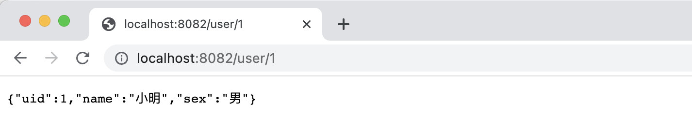

同样的方式，我们完成一下图书查询业务，注意现在是在图书管理微服务中编写（别忘了导入Mybatis依赖以及配置数据源）：

```java
@Data
public class Book {
    int bid;
    String title;
    String desc;
}
```

```java
@Mapper
public interface BookMapper {

    @Select("select * from DB_BOOK where bid = #{bid}")
    Book getBookById(int bid);
}
```

```java
public interface BookService {
    Book getBookById(int bid);
}
```

```java
@Service
public class BookServiceImpl implements BookService {

    @Resource
    BookMapper mapper;

    @Override
    public Book getBookById(int bid) {
        return mapper.getBookById(bid);
    }
}
```

```java
@RestController
public class BookController {

    @Resource
    BookService service;

    @RequestMapping("/book/{bid}")
    Book findBookById(@PathVariable("bid") int bid){
        return service.getBookById(bid);
    }
}
```

同样进行一下测试：

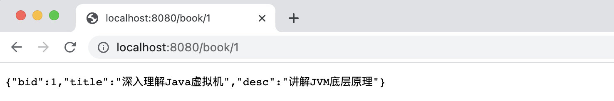

这样，我们一个完整项目的就拆分成了多个微服务，不同微服务之间是独立进行开发和部署的。

### 服务间调用

前面我们完成了用户信息查询和图书信息查询，现在我们来接着完成借阅服务。

借阅服务是一个关联性比较强的服务，它不仅仅需要查询借阅信息，同时可能还需要获取借阅信息下的详细信息，比如具体那个用户借阅了哪本书，并且用户和书籍的详情也需要同时出现，那么这种情况下，我们就需要去访问除了借阅表以外的用户表和图书表。

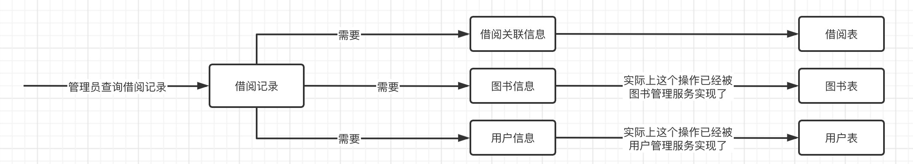

但是这显然是违反我们之前所说的单一职责的，相同的业务功能不应该重复出现，但是现在由需要在此服务中查询用户的信息和图书信息，那怎么办呢？我们可以让一个服务去调用另一个服务来获取信息。

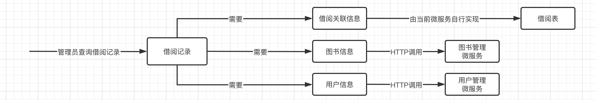

这样，图书管理微服务和用户管理微服务相对于借阅记录，就形成了一个生产者和消费者的关系，前者是生产者，后者便是消费者。

现在我们先将借阅关联信息查询完善了：

```java
@Data
public class Borrow {
    int id;
    int uid;
    int bid;
}
```

```java
@Mapper
public interface BorrowMapper {
    @Select("select * from DB_BORROW where uid = #{uid}")
    List<Borrow> getBorrowsByUid(int uid);

    @Select("select * from DB_BORROW where bid = #{bid}")
    List<Borrow> getBorrowsByBid(int bid);

    @Select("select * from DB_BORROW where bid = #{bid} and uid = #{uid}")
    Borrow getBorrow(int uid, int bid);
}
```

现在有一个需求，需要查询用户的借阅详细信息，也就是说需要查询某个用户具体借了那些书，并且需要此用户的信息和所有已借阅的书籍信息一起返回，那么我们先来设计一下返回实体：

```java
@Data
@AllArgsConstructor
public class UserBorrowDetail {
    User user;
    List<Book> bookList;
}
```

但是有一个问题，我们发现User和Book实体实际上是在另外两个微服务中定义的，相当于当前项目并没有定义这些实体类，那么怎么解决呢？

因此，我们可以将所有服务需要用到的实体类单独放入另一个一个项目中，然后让这些项目引用集中存放实体类的那个项目，这样就可以保证每个微服务的实体类信息都可以共用了：

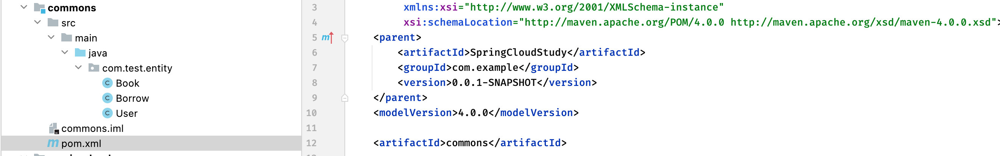

然后只需要在对应的类中引用此项目作为依赖即可：

```xml
<dependency>
    <groupId>com.example</groupId>
    <artifactId>commons</artifactId>
    <version>0.0.1-SNAPSHOT</version>
</dependency>
```

之后新的公共实体类都可以在`commons`项目中进行定义了，现在我们接着来完成刚刚的需求，先定义接口：

```java
public interface BorrowService {

    UserBorrowDetail getUserBorrowDetailByUid(int uid);
}
```

```java
@Service
public class BorrowServiceImpl implements BorrowService{

    @Resource
    BorrowMapper mapper;

    @Override
    public UserBorrowDetail getUserBorrowDetailByUid(int uid) {
        List<Borrow> borrow = mapper.getBorrowsByUid(uid);
        //那么问题来了，现在拿到借阅关联信息了，怎么调用其他服务获取信息呢？
    }
}
```

需要进行服务远程调用我们需要用到`RestTemplate`来进行：

```java
@Service
public class BorrowServiceImpl implements BorrowService{

    @Resource
    BorrowMapper mapper;

    @Override
    public UserBorrowDetail getUserBorrowDetailByUid(int uid) {
        List<Borrow> borrow = mapper.getBorrowsByUid(uid);
        //RestTemplate支持多种方式的远程调用
        RestTemplate template = new RestTemplate();
        //这里通过调用getForObject来请求其他服务，并将结果自动进行封装
        //获取User信息
        User user = template.getForObject("http://localhost:8082/user/"+uid, User.class);
        //获取每一本书的详细信息
        List<Book> bookList = borrow
                .stream()
                .map(b -> template.getForObject("http://localhost:8080/book/"+b.getBid(), Book.class))
                .collect(Collectors.toList());
        return new UserBorrowDetail(user, bookList);
    }
}
```

现在我们再最后完善一下Controller：

```java
@RestController
public class BorrowController {、
   
    @Resource
    BorrowService service;

    @RequestMapping("/borrow/{uid}")
    UserBorrowDetail findUserBorrows(@PathVariable("uid") int uid){
        return service.getUserBorrowDetailByUid(uid);
    }
}
```

在数据库中添加一点借阅信息，测试看看能不能正常获取（注意一定要保证三个服务都处于开启状态，否则远程调用会失败）：

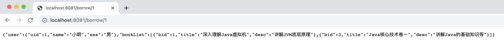

可以看到，结果正常，没有问题，远程调用成功。

这样，一个简易的图书管理系统的分布式项目就搭建完成了，**这里记得把整个项目压缩打包备份一下**，下一章学习SpringCloud Alibaba也需要进行配置。

### 服务注册与发现

前面我们了解了如何对单体应用进行拆分，并且也学习了如何进行服务之间的相互调用，但是存在一个问题，就是虽然服务拆分完成，但是没有一个比较合理的管理机制，如果单纯只是这样编写，在部署和维护起来，肯定是很麻烦的。可以想象一下，如果某一天这些微服务的端口或是地址大规模地发生改变，我们就不得不将服务之间的调用路径大规模的同步进行修改，这是多么可怕的事情。我们需要削弱这种服务之间的强关联性，因此我们需要一个集中管理微服务的平台，这时就要借助我们这一部分的主角了。

Eureka能够自动注册并发现微服务，然后对服务的状态、信息进行集中管理，这样当我们需要获取其他服务的信息时，我们只需要向Eureka进行查询就可以了。


像这样的话，服务之间的强关联性就会被进一步削弱。

那么现在我们就来搭建一个Eureka服务器，只需要创建一个新的Maven项目即可，然后我们需要在父工程中添加一下SpringCloud的依赖，这里选用`2021.0.1`版本（Spring Cloud 最新的版本命名方式变更了，现在是 ***YEAR.x*** 这种命名方式，具体可以在官网查看：https://spring.io/projects/spring-cloud#learn）：

```xml
<dependency>
    <groupId>org.springframework.cloud</groupId>
    <artifactId>spring-cloud-dependencies</artifactId>
    <version>2021.0.1</version>
    <type>pom</type>
    <scope>import</scope>
</dependency>
```

接着我们为新创建的项目添加依赖：

```xml
<dependencies>
    <dependency>
        <groupId>org.springframework.cloud</groupId>
        <artifactId>spring-cloud-starter-netflix-eureka-server</artifactId>
    </dependency>
</dependencies>
```

下载内容有点多，首次导入请耐心等待一下。

接着我们来创建主类，还是一样的操作：

```java
@EnableEurekaServer
@SpringBootApplication
public class EurekaServerApplication {

    public static void main(String[] args) {
        SpringApplication.run(EurekaServerApplication.class, args);
    }
}
```

别着急启动！！！接着我们需要修改一下配置文件：

```yaml
server:
  port: 8401
eureka:
	# 开启之前需要修改一下客户端设置（虽然是服务端
  client:
  	# 由于我们是作为服务端角色，所以不需要获取服务端，改为false，默认为true
		fetch-registry: false
		# 暂时不需要将自己也注册到Eureka
    register-with-eureka: false
    # 将eureka服务端指向自己
    service-url:
      defaultZone: http://localhost:8401/eureka
```

好了，现在差不多可以启动了，启动完成后，直接输入地址+端口即可访问Eureka的管理后台：

4

可以看到目前还没有任何的服务注册到Eureka，我们接着来配置一下我们的三个微服务，首先还是需要导入Eureka依赖（注意别导错了，名称里面有个starter的才是）：

```xml
<dependency>
    <groupId>org.springframework.cloud</groupId>
    <artifactId>spring-cloud-starter-netflix-eureka-client</artifactId>
</dependency>
```

然后修改配置文件：

```yaml
eureka:
  client:
  	# 跟上面一样，需要指向Eureka服务端地址，这样才能进行注册
    service-url:
      defaultZone: http://localhost:8401/eureka
```

OK，无需在启动类添加注解，直接启动就可以了，然后打开Eureka的服务管理页面，可以看到我们刚刚开启的服务：

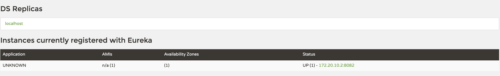

可以看到`8082`端口上的服务器，已经成功注册到Eureka了，但是这个服务名称怎么会显示为UNKNOWN，我们需要修改一下：

```yaml
spring:
  application:
    name: userservice
```

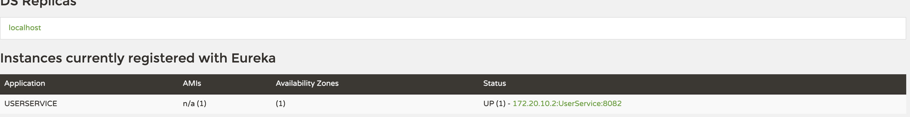

当我们的服务启动之后，会每隔一段时间跟Eureka发送一次心跳包，这样Eureka就能够感知到我们的服务是否处于正常运行状态。

现在我们用同样的方法，将另外两个微服务也注册进来：

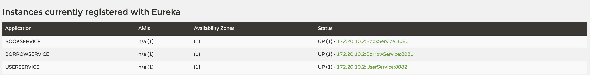

那么，现在我们怎么实现服务发现呢？

也就是说，我们之前如果需要对其他微服务进行远程调用，那么就必须要知道其他服务的地址：

```java
User user = template.getForObject("http://localhost:8082/user/"+uid, User.class);
```

而现在有了Eureka之后，我们可以直接向其进行查询，得到对应的微服务地址，这里直接将服务名称替换即可：

```java
@Service
public class BorrowServiceImpl implements BorrowService {

    @Resource
    BorrowMapper mapper;

    @Resource
    RestTemplate template;

    @Override
    public UserBorrowDetail getUserBorrowDetailByUid(int uid) {
        List<Borrow> borrow = mapper.getBorrowsByUid(uid);

        //这里不用再写IP，直接写服务名称userservice
        User user = template.getForObject("http://userservice/user/"+uid, User.class);
        //这里不用再写IP，直接写服务名称bookservice
        List<Book> bookList = borrow
                .stream()
                .map(b -> template.getForObject("http://bookservice/book/"+b.getBid(), Book.class))
                .collect(Collectors.toList());
        return new UserBorrowDetail(user, bookList);
    }
}
```

接着我们手动将RestTemplate声明为一个Bean，然后添加`@LoadBalanced`注解，这样Eureka就会对服务的调用进行自动发现，并提供负载均衡：

```java
@Configuration
public class BeanConfig {
    @Bean
    @LoadBalanced
    RestTemplate template(){
        return new RestTemplate();
    }
}
```

现在我们就可以正常调用了：

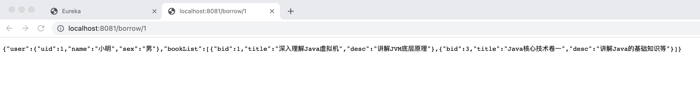

不对啊，不是说有负载均衡的能力吗，怎么个负载均衡呢？

我们先来看看，同一个服务器实际上是可以注册很多个的，但是它们的端口不同，比如我们这里创建多个用户查询服务，我们现在将原有的端口配置修改一下，由IDEA中设定启动参数来决定，这样就可以多创建几个不同端口的启动项了：

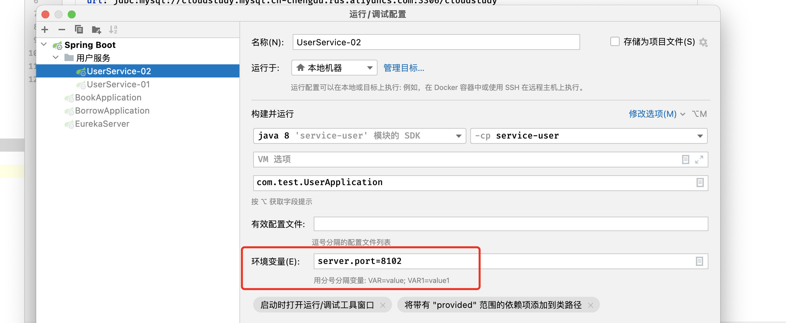

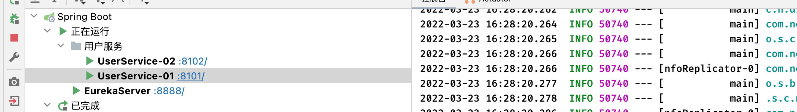

可以看到，在Eureka中，同一个服务出现了两个实例：

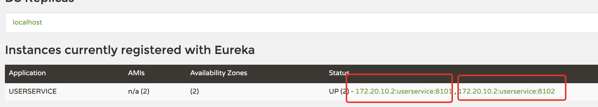

现在我们稍微修改一下用户查询，然后进行远程调用，看看请求是不是均匀地分配到这两个服务端：

```java
@RestController
public class UserController {

    @Resource
    UserService service;
    
    @RequestMapping("/user/{uid}")
    public User findUserById(@PathVariable("uid") int uid){
        System.out.println("我被调用拉！");
        return service.getUserById(uid);
    }
}
```

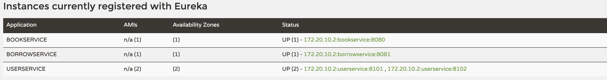

可以看到，两个实例都能够均匀地被分配请求：

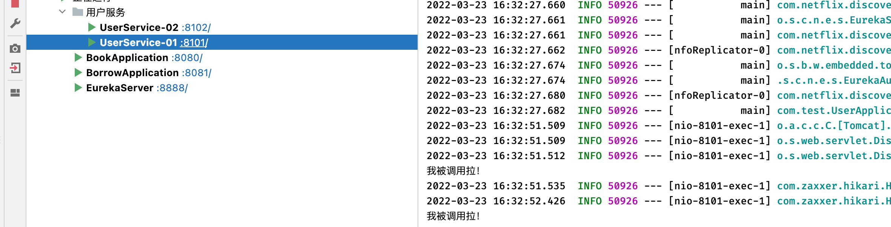

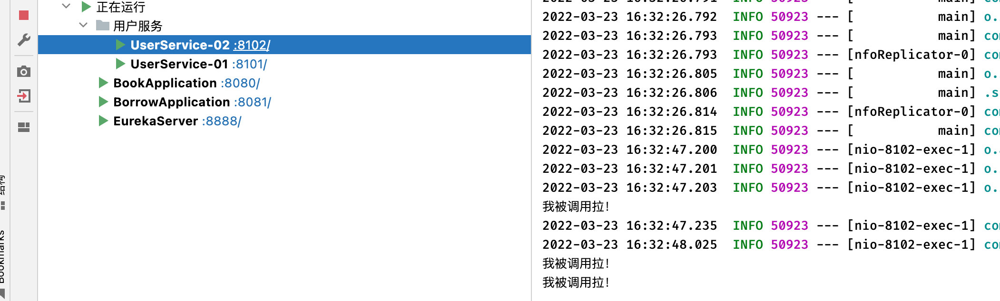

这样，服务自动发现以及简单的负载均衡就实现完成了，并且，如果某个微服务挂掉了，只要存在其他同样的微服务实例在运行，那么就不会导致整个微服务不可用，极大地保证了安全性。

### 注册中心高可用

各位可否想过这样的一个问题？虽然Eureka能够实现服务注册和发现，但是如果Eureka服务器崩溃了，岂不是所有需要用到服务发现的微服务就GG了？

为了避免，这种问题，我们也可以像上面那样，搭建Eureka集群，存在多个Eureka服务器，这样就算挂掉其中一个，其他的也还在正常运行，就不会使得服务注册与发现不可用。当然，要是物理黑客直接炸了整个机房，那还是算了吧。


我们来看看如何搭建Eureka集群，这里由于机器配置不高，就搭建两个Eureka服务器组成集群。

首先我们需要修改一下Eureka服务端的配置文件，这里我们创建两个配置文件，：

```yaml
server:
  port: 8801
spring:
  application:
    name: eurekaserver
eureka:
  instance:
  	# 由于不支持多个localhost的Eureka服务器，但是又只有本地测试环境，所以就只能自定义主机名称了
  	# 主机名称改为eureka01
    hostname: eureka01
  client:
    fetch-registry: false
    # 去掉register-with-eureka选项，让Eureka服务器自己注册到其他Eureka服务器，这样才能相互启用
    service-url:
    	# 注意这里填写其他Eureka服务器的地址，不用写自己的
      defaultZone: http://eureka01:8801/eureka
```

```yaml
server:
  port: 8802
spring:
  application:
    name: eurekaserver
eureka:
  instance:
    hostname: eureka02
  client:
    fetch-registry: false
    service-url:
      defaultZone: http://eureka01:8801/eureka
```

这里由于我们修改成自定义的地址，需要在hosts文件中将其解析到172.0.0.1才能回到localhost，Mac下文件路径为`/etc/hosts`，Windows下为`C:\Windows\system32\drivers\etc\hosts`：

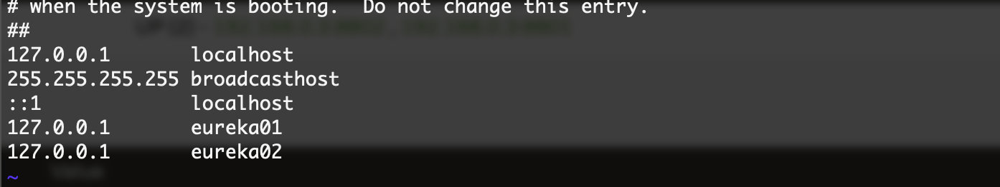

对创建的两个配置文件分别添加启动配置，直接使用`spring.profiles.active`指定启用的配置文件即可：

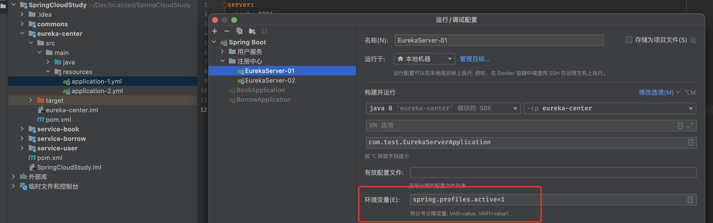

接着启动这两个注册中心，这两个Eureka管理页面都可以被访问，我们访问其中一个：

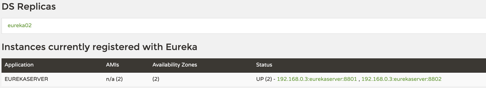

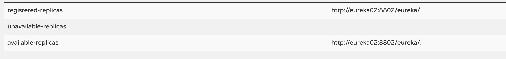

可以看到下方`replicas`中已经包含了另一个Eureka服务器的地址，并且是可用状态。

接着我们需要将我们的微服务配置也进行修改：

```yaml
eureka:
  client:
    service-url:
    	# 将两个Eureka的地址都加入，这样就算有一个Eureka挂掉，也能完成注册
      defaultZone: http://localhost:8801/eureka, http://localhost:8802/eureka
```

可以看到，服务全部成功注册，并且两个Eureka服务端都显示为已注册：

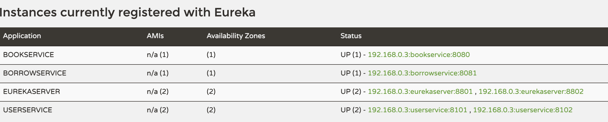

接着我们模拟一下，将其中一个Eureka服务器关闭掉，可以看到它会直接变成不可用状态：

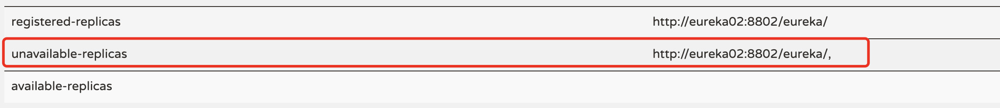

当然，如果这个时候我们重启刚刚关闭的Eureka服务器，会自动同步其他Eureka服务器的数据。