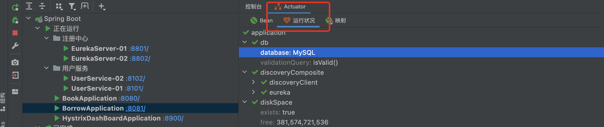

> 本篇来自于青空の霞光学习的笔记，代码示例全部都成功 ---- [青空の霞光](https://www.bilibili.com/video/BV1AL4y1j7RY?p=9)，本人都尝试过所有内容，但是没来得及记笔记，就使用霞光大大的笔记了。

## Hystrix 服务熔断

官方文档：https://cloud.spring.io/spring-cloud-static/spring-cloud-netflix/1.3.5.RELEASE/single/spring-cloud-netflix.html#_circuit_breaker_hystrix_clients

我们知道，微服务之间是可以进行相互调用的，那么如果出现了下面的情况会导致什么问题？


由于位于最底端的服务提供者E发生故障，那么此时会直接导致服务ABCD全线崩溃，就像雪崩了一样。


这种问题实际上是不可避免的，由于多种因素，比如网络卡顿、系统故障、硬件问题等，都存在一定可能，会导致这种极端的情况发生。因此，我们需要寻找一个应对这种极端情况的解决方案。

为了解决分布式系统的雪崩问题，SpringCloud提供了Hystrix熔断器组件，他就像我们家中的保险丝一样，当电流过载就会直接熔断，防止危险进一步发生，从而保证家庭用电安全。可以想象一下，如果整条链路上的服务已经全线崩溃，这时还在不断地有大量的请求到达，需要各个服务进行处理，肯定是会使得情况越来越糟糕的。

我们来详细看看它的工作机制。

### 服务降级

首先我们来看看服务降级，注意一定要区分开服务降级和服务熔断的区别，服务降级并不会直接返回错误，而是可以提供一个补救措施，正常响应给请求者。这样相当于服务依然可用，但是服务能力肯定是下降了的。

我们就基于借阅管理服务来进行讲解，我们不开启用户服务和图书服务，表示用户服务和图书服务已经挂掉了。

这里我们导入Hystrix的依赖（此项目已经停止维护，SpringCloud依赖中已经不自带了，所以说需要自己单独导入）：

```xml
   <dependency>
        <groupId>org.springframework.cloud</groupId>
        <artifactId>spring-cloud-starter-netflix-hystrix</artifactId>
     		<version>2.2.10.RELEASE</version>
    </dependency>
```

接着我们需要在启动类添加注解开启：

```java
@SpringBootApplication
@EnableHystrix   //启用Hystrix
public class BorrowApplication {
    public static void main(String[] args) {
        SpringApplication.run(BorrowApplication.class, args);
    }
}
```

那么现在，由于用户服务和图书服务不可用，所以查询借阅信息的请求肯定是没办法正常响应的，这时我们可以提供一个备选方案，也就是说当服务出现异常时，返回我们的备选方案：

```java
@RestController
public class BorrowController {

    @Resource
    BorrowService service;

    @HystrixCommand(fallbackMethod = "onError")    //使用@HystrixCommand来指定备选方案
    @RequestMapping("/borrow/{uid}")
    UserBorrowDetail findUserBorrows(@PathVariable("uid") int uid){
        return service.getUserBorrowDetailByUid(uid);
    }
		
  	//备选方案，这里直接返回空列表了
  	//注意参数和返回值要和上面的一致
    UserBorrowDetail onError(int uid){
        return new UserBorrowDetail(null, Collections.emptyList());
    }
}
```

可以看到，虽然我们的服务无法正常运行了，但是依然可以给浏览器正常返回响应数据：


服务降级是一种比较温柔的解决方案，虽然服务本身的不可用，但是能够保证正常响应数据。

### 服务熔断

熔断机制是应对雪崩效应的一种微服务链路保护机制，当检测出链路的某个微服务不可用或者响应时间太长时，会进行服务的降级，进而熔断该节点微服务的调用，快速返回”错误”的响应信息。当检测到该节点微服务响应正常后恢复调用链路。

实际上，熔断就是在降级的基础上进一步升级形成的，也就是说，在一段时间内多次调用失败，那么就直接升级为熔断。

我们可以添加两条输出语句：

```java
@RestController
public class BorrowController {

    @Resource
    BorrowService service;

    @HystrixCommand(fallbackMethod = "onError")
    @RequestMapping("/borrow/{uid}")
    UserBorrowDetail findUserBorrows(@PathVariable("uid") int uid){
        System.out.println("开始向其他服务获取信息");
        return service.getUserBorrowDetailByUid(uid);
    }

    UserBorrowDetail onError(int uid){
        System.out.println("服务错误，进入备选方法！");
        return new UserBorrowDetail(null, Collections.emptyList());
    }
}
```

接着，我们在浏览器中疯狂点击刷新按钮，对此服务疯狂发起请求，可以看到后台：


一开始的时候，会正常地去调用Controller对应的方法`findUserBorrows`，发现失败然后进入备选方法，但是我们发现在持续请求一段时间之后，没有再调用这个方法，而是直接调用备选方案，这便是升级到了熔断状态。

我们可以继续不断点击，继续不断地发起请求：


可以看到，过了一段时间之后，会尝试正常执行一次`findUserBorrows`，但是依然是失败状态，所以继续保持熔断状态。

所以得到结论，它能够对一段时间内出现的错误进行侦测，当侦测到出错次数过多时，熔断器会打开，所有的请求会直接响应失败，一段时间后，只执行一定数量的请求，如果还是出现错误，那么则继续保持打开状态，否则说明服务恢复正常运行，关闭熔断器。

我们可以测试一下，开启另外两个服务之后，继续点击：


可以看到，当另外两个服务正常运行之后，当再次尝试调用`findUserBorrows`之后会成功，于是熔断机制就关闭了，服务恢复运行。

总结一下：1


### OpenFeign实现降级

Hystrix也可以配合Feign进行降级，我们可以对应接口中定义的远程调用单独进行降级操作。

比如我们还是以用户服务挂掉为例，那么这个时候肯定是会远程调用失败的，也就是说我们的Controller中的方法在执行过程中会直接抛出异常，进而被Hystrix监控到并进行服务降级。

而实际上导致方法执行异常的根源就是远程调用失败，所以我们换个思路，既然用户服务调用失败，那么我就给这个远程调用添加一个替代方案，如果此远程调用失败，那么就直接上替代方案。那么怎么实现替代方案呢？我们知道Feign都是以接口的形式来声明远程调用，那么既然远程调用已经失效，我们就自行对其进行实现，创建一个实现类，对原有的接口方法进行替代方案实现：

```java
@Component   //注意，需要将其注册为Bean，Feign才能自动注入
public class UserFallbackClient implements UserClient{
    @Override
    public User getUserById(int uid) {   //这里我们自行对其进行实现，并返回我们的替代方案
        User user = new User();
        user.setName("我是替代方案");
        return user;
    }
}
```

实现完成后，我们只需要在原有的接口中指定失败替代实现即可：

```java
//fallback参数指定为我们刚刚编写的实现类
@FeignClient(value = "userservice", fallback = UserFallbackClient.class)
public interface UserClient {

    @RequestMapping("/user/{uid}")
    User getUserById(@PathVariable("uid") int uid);
}
```

现在去掉`BorrowController`的`@HystrixCommand`注解和备选方法：

```java
@RestController
public class BorrowController {

    @Resource
    BorrowService service;

    @RequestMapping("/borrow/{uid}")
    UserBorrowDetail findUserBorrows(@PathVariable("uid") int uid){
        return service.getUserBorrowDetailByUid(uid);
    }
}
```

最后我们在配置文件中开启熔断支持：

```yaml
feign:
  circuitbreaker:
    enabled: true
```

启动服务，调用接口试试看：


可以看到，现在已经采用我们的替代方案作为结果。

### 监控页面部署

除了对服务的降级和熔断处理，我们也可以对其进行实时监控，只需要安装监控页面即可，这里我们创建一个新的项目，导入依赖：

```xml
<dependency>
    <groupId>org.springframework.cloud</groupId>
    <artifactId>spring-cloud-starter-netflix-hystrix-dashboard</artifactId>
    <version>2.2.10.RELEASE</version>
</dependency>
```

接着添加配置文件：

```yaml
server:
  port: 8900
hystrix:
  dashboard:
    # 将localhost添加到白名单，默认是不允许的
    proxy-stream-allow-list: "localhost"
```

接着创建主类，注意需要添加`@EnableHystrixDashboard`注解开启管理页面：

```java
@SpringBootApplication
@EnableHystrixDashboard
public class HystrixDashBoardApplication {
    public static void main(String[] args) {
        SpringApplication.run(HystrixDashBoardApplication.class, args);
    }
}
```

启动Hystrix管理页面服务，然后我们需要在要进行监控的服务中添加Actuator依赖：

```xml
<dependency>
    <groupId>org.springframework.boot</groupId>
    <artifactId>spring-boot-starter-actuator</artifactId>
</dependency>
```

> Actuator是SpringBoot程序的监控系统，可以实现健康检查，记录信息等。在使用之前需要引入spring-boot-starter-actuator，并做简单的配置即可。

添加此依赖后，我们可以在IDEA中查看运行情况：



然后在待监控的module的配置文件中配置Actuator添加暴露：

```yaml
management:
  endpoints:
    web:
      exposure:
        include: '*'
```

接着我们打开刚刚启动的管理页面，地址为：http://localhost:8900/hystrix/


在中间填写要监控的服务：比如借阅服务：http://localhost:8301/actuator/hystrix.stream，注意后面要添加`/actuator/hystrix.stream`，然后点击Monitor Stream即可进入监控页面：


可以看到现在都是Loading状态，这是因为还没有开始统计，我们现在尝试调用几次我们的服务：


可以看到，在调用之后，监控页面出现了信息：


可以看到5次访问都是正常的，所以显示为绿色，接着我们来尝试将图书服务关闭，这样就会导致服务降级甚至熔断，然后再多次访问此服务看看监控会如何变化：


可以看到，错误率直接飙升到100%，并且一段时间内持续出现错误，中心的圆圈也变成了红色，我们继续进行访问：


在出现大量错误的情况下保持持续访问，可以看到此时已经将服务熔断，`Circuit`更改为Open状态，并且图中的圆圈也变得更大，表示压力在持续上升。